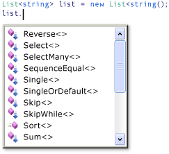

# Sintassi di query e sintassi di metodi in LINQ (C#)
La maggior parte delle query presenti nella documentazione di Language Integrated Query ([!INCLUDE[vbteclinq](../../../../csharp/includes/vbteclinq_md.md)]) sono scritte usando la sintassi di query dichiarativa di LINQ. Tuttavia, la sintassi di query deve essere convertita in chiamate al metodo per Common Language Runtime (CLR) di .NET quando il codice viene compilato. Queste chiamate al metodo richiamano gli operatori query standard, che hanno nomi come `Where`, `Select`, `GroupBy`, `Join`, `Max` e `Average`. È possibile chiamarli direttamente usando la sintassi di metodo anziché la sintassi di query.  
  
 La sintassi di query e la sintassi di metodo sono semanticamente identiche, ma molti utenti ritengono che la sintassi di query sia più semplice e più facile da leggere. Alcune query devono essere espresse come chiamate al metodo. Ad esempio, è necessario usare una chiamata al metodo per esprimere una query che recupera il numero di elementi che soddisfano una determinata condizione. È necessario usare una chiamata al metodo anche per una query che recupera l'elemento con il valore massimo in una sequenza di origine. Nella documentazione di riferimento per gli operatori query standard nello spazio dei nomi <xref:System.Linq> in genere viene usata la sintassi di metodo. Quindi, anche quando si inizia a scrivere query [!INCLUDE[vbteclinq](../../../../csharp/includes/vbteclinq_md.md)], è utile acquisire familiarità con l'uso della sintassi di metodo nelle query e nelle espressioni di query.  
  
## Metodi di estensione degli operatori query standard  
 Nell'esempio seguente viene illustrata un'*espressione di query* semplice e la query semanticamente equivalente scritta come *query basata su metodo*.  
  
 [!code-cs[csLINQGettingStarted#22](../../../../csharp/programming-guide/concepts/linq/codesnippet/CSharp/query-syntax-and-method-syntax-in-linq_1.cs)]  
  
 L'output dei due esempi è identico. Si noterà che il tipo della variabile di query è lo stesso in entrambi i formati: <xref:System.Collections.Generic.IEnumerable%601>.  
  
 Per capire meglio la query basata su metodo, esaminiamola più da vicino. Sul lato destro dell'espressione, si può notare che la clausola `where` viene ora espressa come metodo di istanza per l'oggetto `numbers` che, come si ricorderà, ha un tipo di `IEnumerable<int>`. Chi ha familiarità con l'interfaccia <xref:System.Collections.Generic.IEnumerable%601> sa che non ha un metodo `Where`. Tuttavia, se si richiama l'elenco di completamento IntelliSense nell'IDE di Visual Studio, si vedrà non solo un metodo `Where` ma molti altri metodi, ad esempio `Select`, `SelectMany`, `Join` e `Orderby`. Sono tutti operatori di query standard.  
  
   
  
 Sebbene possa sembrare che <xref:System.Collections.Generic.IEnumerable%601> sia stata ridefinita in modo da includere questi metodi aggiuntivi, di fatto non è così. Gli operatori di query standard vengono implementati come un nuovo tipo di metodo denominato *metodo di estensione*. I metodi di estensione "estendono" un tipo esistente. Possono essere chiamati come se fossero metodi di istanza per il tipo. Gli operatori di query standard estendono <xref:System.Collections.Generic.IEnumerable%601> e questo è il motivo per cui è possibile scrivere `numbers.Where(...)`.  
  
 Per iniziare a usare [!INCLUDE[vbteclinq](../../../../csharp/includes/vbteclinq_md.md)], tutto ciò che si deve sapere sui metodi di estensione è come inserirli nell'ambito dell'applicazione usando le direttive `using` corrette. Dal punto di vista dell'applicazione, un metodo di estensione e un metodo di istanza normale sono la stessa cosa.  
  
 Per altre informazioni sui metodi di estensione, vedere [Metodi di estensione](../../../../csharp/programming-guide/classes-and-structs/extension-methods.md). Per altre informazioni sugli operatori di query standard, vedere [Panoramica degli operatori di query standard (C#)](../../../../csharp/programming-guide/concepts/linq/standard-query-operators-overview.md). Alcuni provider [!INCLUDE[vbteclinq](../../../../csharp/includes/vbteclinq_md.md)], ad esempio [!INCLUDE[vbtecdlinq](../../../../csharp/includes/vbtecdlinq_md.md)] e [!INCLUDE[sqltecxlinq](../../../../csharp/programming-guide/concepts/linq/includes/sqltecxlinq_md.md)], implementano i propri operatori di query standard e i metodi di estensione aggiuntivi per altri tipi oltre a <xref:System.Collections.Generic.IEnumerable%601>.  
  
## Espressioni lambda  
 Nell'esempio precedente, si può notare che l'espressione condizionale (`num % 2 == 0`) viene passata come argomento inline al metodo `Where`: `Where(num => num % 2 == 0).` Questa espressione inline è definita espressione lambda. È un modo pratico per scrivere codice che altrimenti dovrebbe essere scritto in un formato più complesso come metodo anonimo, delegato generico o albero delle espressioni. In C# `=>` è l'operatore lambda, che viene letto come "goes to". L'elemento `num` a sinistra dell'operatore è la variabile di input che corrisponde a `num` nell'espressione di query. Il compilatore è in grado di dedurre il tipo di `num` poiché sa che `numbers` è un tipo <xref:System.Collections.Generic.IEnumerable%601> generico. Il corpo dell'espressione lambda è identico all'espressione nella sintassi di query o in qualsiasi altra espressione o istruzione di C# e può includere chiamate al metodo e altra logica complessa. Il valore restituito è semplicemente il risultato dell'espressione.  
  
 Per iniziare a usare [!INCLUDE[vbteclinq](../../../../csharp/includes/vbteclinq_md.md)], non è necessario fare ampio ricorso alle espressioni lambda. Tuttavia, alcune query possono essere espresse solo nella sintassi di metodo e alcune di esse richiedono le espressioni lambda. Dopo avere acquisito maggiore familiarità con le espressioni lambda, si noterà che sono uno strumento potente e flessibile della casella degli strumenti di [!INCLUDE[vbteclinq](../../../../csharp/includes/vbteclinq_md.md)]. Per altre informazioni, vedere [Espressioni lambda](../../../../csharp/programming-guide/statements-expressions-operators/lambda-expressions.md).  
  
## Componibilità delle query  
 Nell'esempio di codice precedente il metodo `OrderBy` viene richiamato usando l'operatore punto nella chiamata a `Where`. `Where` genera una sequenza filtrata e quindi `Orderby` agisce sulla sequenza ordinandola. Poiché le query restituiscono un oggetto `IEnumerable`, è necessario comporle nella sintassi di metodo concatenando le chiamate al metodo. Questa è l'operazione che il compilatore esegue in background quando si scrivono le query usando la sintassi di query. E poiché una variabile di query non archivia i risultati della query, è possibile modificarla o usarla come base per una nuova query in qualsiasi momento, anche dopo che è stata eseguita.  
  
## Vedere anche  
 [Nozioni di base su LINQ in C#](../../../../csharp/programming-guide/concepts/linq/getting-started-with-linq.md)
