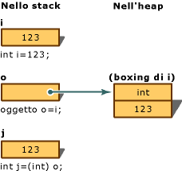

# <a name="boxing-and-unboxing-c-programming-guide"></a>Boxing e unboxing (Guida per programmatori C#)
Il boxing è il processo di conversione di un [tipo di valore](../../../csharp/language-reference/keywords/value-types.md) nel tipo `object` o in qualsiasi tipo di interfaccia implementato dal tipo valore. La conversione boxing di un tipo valore in CLR comporta il wrapping del valore in un elemento System.Object e l'archiviazione nell'heap gestito. Mediante la conversione unboxing, invece, il tipo valore viene estratto dall'oggetto. La conversione boxing è implicita; quella unboxing è esplicita. Il concetto di conversione boxing e unboxing è alla base della visione unificata del sistema dei tipi in C#, in base alla quale un valore di qualsiasi tipo può essere considerato come un oggetto.  
  
 Nell'esempio seguente viene eseguita la conversione *boxing* della variabile intera `i` e la sua assegnazione all'oggetto `o`.  
  
 [!code-cs[csProgGuideTypes#14](../../../csharp/programming-guide/nullable-types/codesnippet/CSharp/boxing-and-unboxing_1.cs)]  
  
 È quindi possibile eseguire l'unboxing dell'oggetto `o` e la sua assegnazione alla variabile intera `i`:  
  
 [!code-cs[csProgGuideTypes#15](../../../csharp/programming-guide/nullable-types/codesnippet/CSharp/boxing-and-unboxing_2.cs)]  
  
 Nell'esempio seguente viene illustrato l'utilizzo della conversione boxing in C#.  
  
 [!code-cs[csProgGuideTypes#47](../../../csharp/programming-guide/nullable-types/codesnippet/CSharp/boxing-and-unboxing_3.cs)]  
  
## <a name="performance"></a>Prestazioni  
 Rispetto alle semplici assegnazioni, le conversioni boxing e unboxing sono processi onerosi dal punto di vista del calcolo. La conversione boxing di un tipo valore comporta infatti l'allocazione e la costruzione di un nuovo oggetto. A un livello inferiore, anche il cast richiesto per la conversione unboxing è oneroso dal punto di vista del calcolo. Per altre informazioni, vedere [Prestazioni](https://msdn.microsoft.com/library/ms173196(VS.110).aspx).  
  
## <a name="boxing"></a>Boxing  
 La conversione boxing viene utilizzata per archiviare tipi valore nell'heap sottoposto a Garbage Collection. Il boxing è una conversione implicita di un [tipo di valore](../../../csharp/language-reference/keywords/value-types.md) al tipo `object` o a qualsiasi tipo di interfaccia implementato da questo tipo di valore. La conversione boxing di un tipo valore prevede l'allocazione di un'istanza dell'oggetto nell'heap e la copia del valore nel nuovo oggetto.  
  
 Si consideri la seguente dichiarazione di una variabile di tipo valore:  
  
 [!code-cs[csProgGuideTypes#17](../../../csharp/programming-guide/nullable-types/codesnippet/CSharp/boxing-and-unboxing_4.cs)]  
  
 L'istruzione seguente applica implicitamente l'operazione di conversione boxing alla variabile `i`:  
  
 [!code-cs[csProgGuideTypes#18](../../../csharp/programming-guide/nullable-types/codesnippet/CSharp/boxing-and-unboxing_5.cs)]  
  
 Il risultato di questa istruzione è la creazione, sullo stack, di un riferimento all'oggetto `o` che fa riferimento a un valore di tipo `int` nell'heap. Questo valore è una copia di quello di tipo valore assegnato alla variabile `i`. La differenza tra le due variabili `i` e `o` è illustrata nella figura seguente.  
  
   
Conversione boxing  
  
 È inoltre possibile, anche se non obbligatorio, eseguire la conversione boxing in modo esplicito, come nell'esempio seguente:  
  
 [!code-cs[csProgGuideTypes#19](../../../csharp/programming-guide/nullable-types/codesnippet/CSharp/boxing-and-unboxing_6.cs)]  
  
## <a name="description"></a>Descrizione  
 In questo esempio viene eseguita la conversione boxing della variabile intera `i` in un oggetto `o`. Il valore archiviato nella variabile `i` viene quindi modificato da `123` a `456`. Nell'esempio il tipo valore originale e l'oggetto sottoposto a conversione boxing utilizzano posizioni di memoria separate, pertanto possono archiviare valori diversi.  
  
## <a name="example"></a>Esempio  
 [!code-cs[csProgGuideTypes#16](../../../csharp/programming-guide/nullable-types/codesnippet/CSharp/boxing-and-unboxing_7.cs)]  
  
## <a name="unboxing"></a>Conversione unboxing  
 L'unboxing è una conversione esplicita dal tipo `object` a un [tipo di valore](../../../csharp/language-reference/keywords/value-types.md) o da un tipo di interfaccia a un tipo di valore che implementa l'interfaccia. Un'operazione unboxing prevede le operazioni seguenti:  
  
-   Controllo dell'istanza di oggetto per verificare che si tratti di un valore sottoposto a conversione boxing del tipo valore specificato.  
  
-   Copia del valore dall'istanza alla variabile di tipo valore.  
  
 Le istruzioni seguenti illustrano operazioni di conversione boxing e unboxing:  
  
 [!code-cs[csProgGuideTypes#21](../../../csharp/programming-guide/nullable-types/codesnippet/CSharp/boxing-and-unboxing_8.cs)]  
  
 Nella figura che segue viene illustrato il risultato delle istruzioni precedenti.  
  
   
Conversione unboxing  
  
 Per eseguire correttamente la conversione unboxing di tipi valore in fase di esecuzione, è necessario che l'elemento sottoposto a conversione unboxing faccia riferimento a un oggetto creato in precedenza tramite la conversione boxing di un'istanza di tale tipo valore. Il tentativo di eseguire la conversione unboxing di un valore `null` genera <xref:System.NullReferenceException>. Il tentativo di eseguire la conversione unboxing di un riferimento a un tipo valore incompatibile genera <xref:System.InvalidCastException>.  
  
## <a name="example"></a>Esempio  
 Nell'esempio riportato di seguito viene illustrato un caso di unboxing non valido, nonché l'elemento `InvalidCastException` risultante. Se si utilizza `try` e `catch`, quando si verifica l'errore viene visualizzato un messaggio di errore.  
  
 [!code-cs[csProgGuideTypes#20](../../../csharp/programming-guide/nullable-types/codesnippet/CSharp/boxing-and-unboxing_9.cs)]  
  
 Questo programma restituisce:  
  
 `Specified cast is not valid. Error: Incorrect unboxing.`  
  
 Se si modifica l'istruzione:  
  
```  
int j = (short) o;  
```  
  
 in:  
  
```  
int j = (int) o;  
```  
  
 la conversione verrà eseguita e si otterrà l'output:  
  
 `Unboxing OK.`  
  
## <a name="c-language-specification"></a>Specifiche del linguaggio C#  
 [!INCLUDE[CSharplangspec](~/includes/csharplangspec-md.md)]  
  
## <a name="related-sections"></a>Sezioni correlate  
 Per ulteriori informazioni:  
  
-   [Tipi di riferimento](../../../csharp/language-reference/keywords/reference-types.md)  
  
-   [Tipi di valore](../../../csharp/language-reference/keywords/value-types.md)  
  
## <a name="c-language-specification"></a>Specifiche del linguaggio C#  
 [!INCLUDE[CSharplangspec](~/includes/csharplangspec-md.md)]  
  
## <a name="see-also"></a>Vedere anche  
 [Guida per programmatori C#](../../../csharp/programming-guide/index.md)

