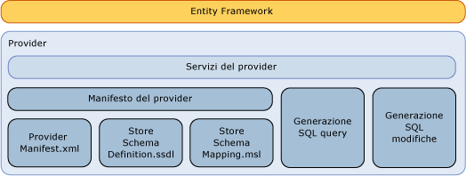

# Scrittura di un provider di dati Entity Framework
In questa sezione viene illustrato come scrivere un [!INCLUDE[adonet_ef](../../../../../includes/adonet-ef-md.md)] provider per supportare un'origine dati diversa da SQL Server. Il [!INCLUDE[adonet_ef](../../../../../includes/adonet-ef-md.md)] include un provider che supporta SQL Server.  
  
## Introduzione al modello di provider Entity Framework  
 [!INCLUDE[adonet_ef](../../../../../includes/adonet-ef-md.md)] è indipendente dal database ed è possibile scrivere un provider usando il modello di provider ADO.NET per connettersi a un set di origini dati differente.  
  
 Il provider di dati Entity Framework, compilato usando il modello di provider di dati ADO.NET, consente di eseguire le funzioni seguenti:  
  
-   Mapping dei tipi primitivi EDM (Entity Data Model) ai tipi di provider.  
  
-   Esposizione delle funzioni specifiche del provider.  
  
-   Generazione di comandi specifici del provider per un determinato DbQueryCommandTree per supportare le query [!INCLUDE[adonet_ef](../../../../../includes/adonet-ef-md.md)].  
  
-   Generazione di comandi di aggiornamento specifici del provider per un determinato DbModificationCommandTree per supportare gli aggiornamenti mediante [!INCLUDE[adonet_ef](../../../../../includes/adonet-ef-md.md)].  
  
-   Esposizione di file di mapping per la definizione dello schema di archiviazione per supportare la generazione di un modello basato su un database.  
  
-   Esposizione di metadati, ad esempio tabelle e visualizzazioni, mediante un modello concettuale.  
  
   
  
## Esempio  
 Vedere le [Provider di esempio Entity Framework](https://go.microsoft.com/fwlink/?LinkId=180616) per un esempio di un [!INCLUDE[adonet_ef](../../../../../includes/adonet-ef-md.md)] provider che supporta un'origine dati diversa da SQL Server.  
  
## In questa sezione  
 [Generazione SQL](../../../../../docs/framework/data/adonet/ef/sql-generation.md)  
  
 [Generazione di comandi SQL di modifica](../../../../../docs/framework/data/adonet/ef/modification-sql-generation.md)  
  
 [Specifica del manifesto del provider](../../../../../docs/framework/data/adonet/ef/provider-manifest-specification.md)  
  
## Vedere anche  
 [Uso di provider di dati](../../../../../docs/framework/data/adonet/ef/working-with-data-providers.md)
