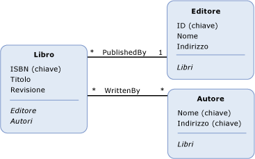

# Concetti chiave di Entity Data Model
Entity Data Model (EDM) usano tre concetti chiave per descrivere la struttura di dati: *tipo di entità*, *tipo di associazione*, e *proprietà*. Si tratta dei concetti più importanti nella descrizione della struttura di dati in qualsiasi implementazione di EDM.  
  
## Tipo di entità  
 Il [tipo di entità](../../../../docs/framework/data/adonet/entity-type.md) è il blocco predefinito fondamentale per descrivere la struttura di dati con Entity Data Model. In un modello concettuale, i tipi di entità vengono costruiti da [proprietà](../../../../docs/framework/data/adonet/property.md) e descrivere la struttura di concetti di livello superiore, ad esempio i clienti e ordini in un'applicazione aziendale. Esattamente come una definizione di classe in un programma informatico è un modello per le istanze della classe, un tipo di entità è un modello per le entità. Un'entità rappresenta un oggetto specifico (ad esempio un cliente o un ordine specifico). Ogni entità devono avere un univoco [chiave di entità](../../../../docs/framework/data/adonet/entity-key.md) all'interno di un [set di entità](../../../../docs/framework/data/adonet/entity-set.md).  Un set di entità è una raccolta di istanze di un tipo di entità specifico. Set di entità (e [set di associazioni](../../../../docs/framework/data/adonet/association-set.md)) sono raggruppati logicamente in un [contenitore di entità](../../../../docs/framework/data/adonet/entity-container.md).  
  
 L'ereditarietà è supportata con i tipi di entità, ovvero un tipo di entità può essere derivato da un altro. Per ulteriori informazioni, vedere [Entity Data Model: ereditarietà](../../../../docs/framework/data/adonet/entity-data-model-inheritance.md).  
  
## Tipo di associazione  
 Un [tipo di associazione](../../../../docs/framework/data/adonet/association-type.md) (detto anche associazione) è il blocco predefinito fondamentale per una descrizione delle relazioni in Entity Data Model. In un modello concettuale, un'associazione rappresenta una relazione tra due tipi di entità (ad esempio, Customer e Order). Ogni associazione dispone di due [estremità dell'associazione](../../../../docs/framework/data/adonet/association-end.md) che consente di specificare i tipi di entità coinvolti nell'associazione. Ogni entità finale dell'associazione specifica inoltre un [molteplicità di entità finale associazione](../../../../docs/framework/data/adonet/association-end-multiplicity.md) che indica il numero di entità che possono essere a tale entità finale dell'associazione. Una molteplicità di entità finale dell'associazione può disporre di un valore pari a uno (1), zero o uno (0..1) o molti (*). Le entità in un'entità finale di un'associazione è possibile accedere tramite [le proprietà di navigazione](../../../../docs/framework/data/adonet/navigation-property.md), o tramite chiavi esterne se sono esposte in un tipo di entità. Per ulteriori informazioni, vedere [proprietà di chiave esterna](../../../../docs/framework/data/adonet/foreign-key-property.md).  
  
 In un'applicazione, un'istanza di un'associazione rappresenta un'associazione specifica (ad esempio, un'associazione tra un'istanza relativa al cliente e istanze relative all'ordine). Le istanze dell'associazione sono raggruppate logicamente in un [set di associazioni](../../../../docs/framework/data/adonet/association-set.md). Set di associazioni (e [set di entità](../../../../docs/framework/data/adonet/entity-set.md)) sono raggruppati logicamente in un [contenitore di entità](../../../../docs/framework/data/adonet/entity-container.md).  
  
## Proprietà  
 [Tipi di entità](../../../../docs/framework/data/adonet/entity-type.md) contengono [proprietà](../../../../docs/framework/data/adonet/property.md) che definiscono la struttura e le caratteristiche. È, ad esempio, possibile che un tipo di entità Customer disponga di proprietà quali CustomerId, Name e Address.  
  
 Le proprietà in un modello concettuale sono analoghe alle proprietà definite su una classe in un programma informatico. Nello stesso modo in cui le proprietà su una classe definiscono la forma della classe e forniscono informazioni su oggetti, le proprietà in un modello concettuale definiscono la forma di un tipo di entità e forniscono informazioni su istanze del tipo di entità.  
  
 Una proprietà può contenere dati primitivi (ad esempio una stringa, un Integer o un valore booleano) o dati strutturati (ad esempio un tipo complesso). Per ulteriori informazioni, vedere [Entity Data Model: tipi di dati primitivi](../../../../docs/framework/data/adonet/entity-data-model-primitive-data-types.md).  
  
## Rappresentazioni di un modello concettuale  
 Oggetto *modello concettuale* è una rappresentazione specifica della struttura di alcuni dati come entità e relazioni. È possibile rappresentare un modello concettuale tramite un diagramma. Nel diagramma seguente viene rappresentato un modello concettuale con tre tipi di entità (`Book`, `Publisher` e `Author`) e due associazioni (`PublishedBy` e `WrittenBy`):  
  
   
  
 Questa rappresentazione, tuttavia, presenta alcuni difetti quando è necessario illustrare alcuni dettagli relativi al modello. Le informazioni sul tipo di proprietà e sul set di entità, ad esempio, non sono illustrate nel diagramma. La ricchezza di un modello concettuale può essere illustrata più chiaramente con un linguaggio DSL. Il [ADO.NET Entity Framework](../../../../docs/framework/data/adonet/ef/index.md) Usa un linguaggio DSL basato su XML detto *linguaggio conceptual schema definition language* ([CSDL](../../../../docs/framework/data/adonet/ef/language-reference/csdl-specification.md)) per definire i modelli concettuali. Di seguito è riportata la definizione CSDL del modello concettuale nel diagramma precedente:  
  
 [!code-xml[EDM_Example_Model#EDMExampleCSDL](../../../../samples/snippets/xml/VS_Snippets_Data/edm_example_model/xml/books.edmx#edmexamplecsdl)]  
  
## Vedere anche  
 [Entity Data Model](../../../../docs/framework/data/adonet/entity-data-model.md)
