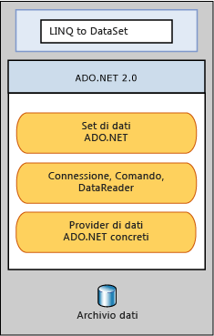

# LINQ to DataSet
Con [!INCLUDE[linq_dataset](../../../../includes/linq-dataset-md.md)] è più facile e veloce eseguire una query su dati memorizzati nella cache di un oggetto <xref:System.Data.DataSet>.  In particolare, [!INCLUDE[linq_dataset](../../../../includes/linq-dataset-md.md)] semplifica l'esecuzione una query consentendo agli sviluppatori di scrivere query dal linguaggio di programmazione stesso, anziché usando un linguaggio di query separato.  Questo aspetto è utile soprattutto per gli sviluppatori di [!INCLUDE[vsprvs](../../../../includes/vsprvs-md.md)], che possono trarre vantaggio dal controllo della sintassi in fase di compilazione, dalla tipizzazione statica e dal supporto IntelliSense resi disponibili da [!INCLUDE[vsprvs](../../../../includes/vsprvs-md.md)] nelle query.  
  
 [!INCLUDE[linq_dataset](../../../../includes/linq-dataset-md.md)] può inoltre essere usato per eseguire query su dati che sono stati consolidati da una o più origini dati.  In tal modo sono possibili molti scenari in cui è necessario rappresentare e gestire i dati con flessibilità, ad esempio per le query su dati aggregati localmente e la memorizzazione nella cache di livello intermedio nelle applicazioni Web.  In particolare, questo tipo di modifiche sono richieste nelle applicazioni generiche per la creazione di rapporti, di analisi e di Business Intelligence.  
  
 La funzionalità di [!INCLUDE[linq_dataset](../../../../includes/linq-dataset-md.md)] è esposta principalmente tramite i metodi di estensione delle classi <xref:System.Data.DataRowExtensions> e <xref:System.Data.DataTableExtensions>. [!INCLUDE[linq_dataset](../../../../includes/linq-dataset-md.md)] si basa e sfrutta l'architettura [!INCLUDE[ado_whidbey_long](../../../../includes/ado-whidbey-long-md.md)] esistente e non è stato progettato per sostituire [!INCLUDE[ado_whidbey_long](../../../../includes/ado-whidbey-long-md.md)] nel codice delle applicazioni.  Il codice ADO.NET 2.0 esistente continuerà a funzionare nelle applicazioni [!INCLUDE[linq_dataset](../../../../includes/linq-dataset-md.md)]. Nel diagramma seguente viene illustrata la relazione tra [!INCLUDE[linq_dataset](../../../../includes/linq-dataset-md.md)] e  [!INCLUDE[ado_whidbey_long](../../../../includes/ado-whidbey-long-md.md)] e l'archivio dati.  
  
   
  
## In questa sezione  
 [Guida introduttiva](../../../../docs/framework/data/adonet/getting-started-linq-to-dataset.md)  
  
 [Guida per programmatori](../../../../docs/framework/data/adonet/programming-guide-linq-to-dataset.md)  
  
## Riferimenti  
 <xref:System.Data.DataTableExtensions>  
  
 <xref:System.Data.DataRowExtensions>  
  
 <xref:System.Data.DataRowComparer>  
  
## Vedere anche  
 [LINQ \(Language\-Integrated Query\)](../Topic/LINQ%20\(Language-Integrated%20Query\).md)   
 [LINQ e ADO.NET](../../../../docs/framework/data/adonet/linq-and-ado-net.md)   
 [ADO.NET](../../../../docs/framework/data/adonet/index.md)