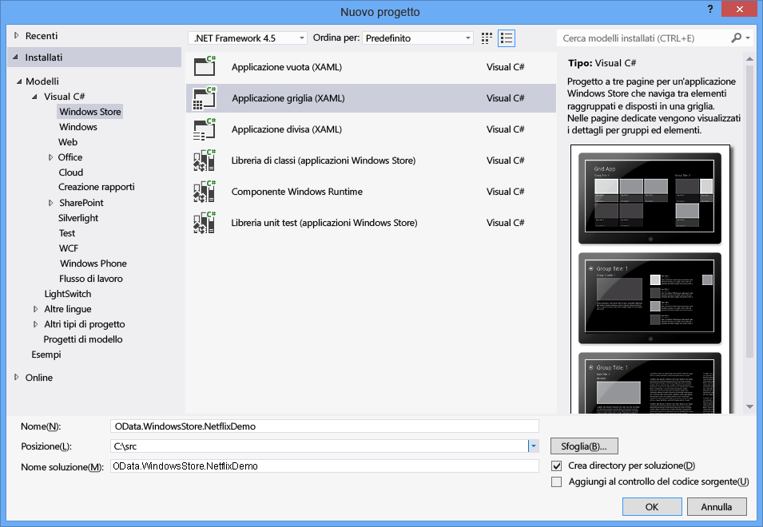
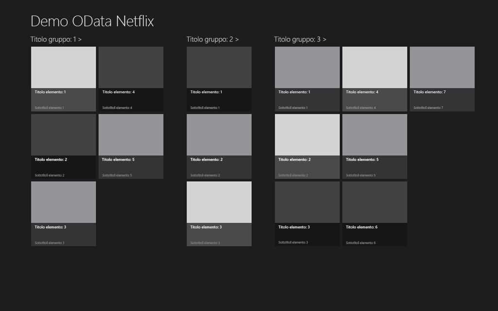
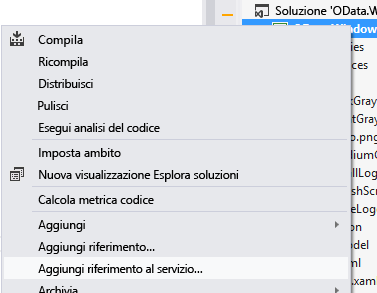
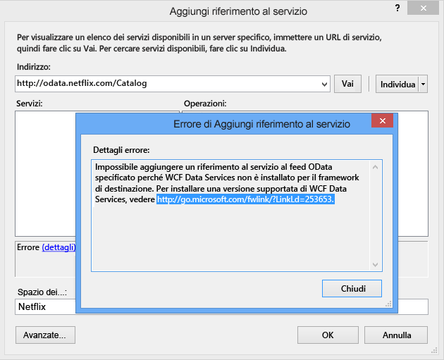

# <a name="writing-a-windows-store-app-that-consumes-an-odata-service"></a>Scrittura di un'app di Windows Store che utilizza un servizio OData
Windows 8 è stato introdotto un nuovo tipo di applicazione: l'applicazione Windows Store. Le app Windows Store hanno un aspetto nuovissimo, vengono eseguite su vari dispositivi e vengono rese disponibili in Windows Store. In questo argomento viene descritto come scrivere un'app Windows Store che usa un servizio OData, in particolare il servizio NetFlix Catalog OData. Per ulteriori informazioni sulle app di Windows Store, leggere [Introduzione alle app di Windows Store](http://msdn.microsoft.com/library/windows/apps/br211386.aspx).  
  
## <a name="prerequisites"></a>Prerequisiti  
  
1.  [Microsoft Windows 8](http://go.microsoft.com/fwlink/p/?LinkId=266654)  
  
2.  [Microsoft Visual Studio 2012](http://go.microsoft.com/fwlink/p/?LinkId=266655)  
  
3.  [WCF Data Services](http://msdn.microsoft.com/data/bb931106)  
  
#### <a name="creating-the-default-windows-store-grid-application"></a>Creazione della applicazione della griglia di Windows Store predefinita  
  
1.  Creare una nuova applicazione della griglia di Windows Store mediante C# e XAML. Denominare l'applicazione OData.WindowsStore.NetflixDemo:  
  
       
  
2.  Aprire il file Package.appxmanifest e immettere un nome descrittivo nella casella di testo Nome visualizzato. Questo specifica il nome dell'applicazione usato con la funzionalità di ricerca di Windows 8.  
  
       
  
3.  Immettere un nome descrittivo nel \<AppName > elemento nel file app. Xaml. Questo imposta il nome dell'applicazione visualizzato al primo avvio dell'applicazione:  
  
       
  
4.  Compilare e avviare l'applicazione. Viene visualizzata la schermata iniziale dell'applicazione. Nella schermata riportata di seguito viene visualizzata la schermata iniziale predefinita. L'immagine usata viene archiviata nella cartella Assets del progetto.  
  
       
  
     Successivamente verrà visualizzata l'applicazione.  
  
       
  
     L'applicazione predefinita definisce un set di classi in SampleDataSource.cs: SampleDataGroup e SampleDataItem, i quali entrambi derivano da SampleDataCommon, che a sua volta deriva da BindableBase. SampleDataGroup e SampleDataItem sono associati all'oggetto GridView predefinito. SampleDataSource.cs si trova nella cartella DataModel nel progetto NetflixDemo. Nell'applicazione viene visualizzata una raccolta raggruppata. Ogni gruppo contiene un numero qualsiasi di elementi, rappresentati rispettivamente da SampleDataGroup e da SampleDataItem. Nella schermata precedente è possibile visualizzare un gruppo denominato Titolo gruppo 1 e tutti gli elementi nel gruppo visualizzati insieme.  
  
     La pagina principale dell'applicazione è GroupedItemsPage.xaml. Contiene GridView che visualizza i dati di esempio creati dalla classe SampleDataSource.cs. L'oggetto GroupedItemsPage viene caricato da App.xaml.cs in una chiamata a rootFrame.Navigate:  
  
    ```csharp  
    if (!rootFrame.Navigate(typeof(GroupedItemsPage), "AllGroups"))  
    {  
        throw new Exception("Failed to create initial page");  
    }  
    ```  
  
     In questo modo viene creata un'istanza di GroupedItemsPage e viene chiamato il relativo metodo LoadState. LoadState determina la creazione dell'istanza di SampleDataSource statica, che crea una raccolta di oggetti SampleDataGroup. Ciascun oggetto SampleDataGroup contiene una raccolta di oggetti SampleDataItem. LoadState archivia la raccolta di oggetti SampleDataGroup in DefaultViewModel:  
  
    ```csharp  
    protected override void LoadState(Object navigationParameter, Dictionary<String, Object> pageState)  
    {  
        var sampleDataGroups = SampleDataSource.GetGroups((String)navigationParameter);  
        this.DefaultViewModel["Groups"] = sampleDataGroups;  
    }  
    ```  
  
     L'oggetto DefaultViewModel viene quindi associato a GridView. A questo oggetto fa riferimento il file GroupedItemsPage.xaml quando si configura l'associazione dati.  
  
    ```xaml
    <CollectionViewSource  
                x:Name="groupedItemsViewSource"  
                Source="{Binding Groups}"  
                IsSourceGrouped="true"  
                ItemsPath="TopItems"  
                d:Source="{Binding AllGroups, Source={d:DesignInstance Type=data:SampleDataSource, IsDesignTimeCreatable=True}}"/>  
    ```  
  
     L'oggetto CollectionViewSource viene usato come proxy per gestire le raccolte raggruppate. Quando si verifica l'associazione, scorre la raccolta di oggetti SampleDataGroup per popolare GridView.  L'attributo di ItemsPath indica a CollectionViewSource la proprietà di ogni oggetto SampleDataGroup da usare per trovare l'oggetto SampleDataItems che contiene. In questo caso ciascun oggetto SampleDataGroup contiene una raccolta TopItems di oggetti SampleDataItem.  
  
     Per l'applicazione Netflix, i film vengono raggruppati in base al genere. Pertanto nell'applicazione viene visualizzato un numero di generi e un elenco di film appartenenti a tale genere.  
  
#### <a name="add-a-service-reference-to-the-netflix-odata-service"></a>Aggiungere un riferimento al servizio Netflix OData  
  
1.  Prima di poter eseguire tutte le chiamate al servizio Netflix OData, è necessario aggiungere un riferimento al servizio. Fare clic con il pulsante destro del mouse sul progetto in Esplora soluzioni e scegliere Aggiungi riferimento al servizio.  
  
       
  
2.  Immettere l'URL per il servizio Netflix OData nella barra degli indirizzi e fare clic su Vai. Impostare lo spazio dei nomi di riferimento al servizio su Netflix e fare clic su OK.  
  
       
  
    > [!NOTE]
    >  Se non è ancora installato [WCF Data Services strumenti per App di Windows Store](http://go.microsoft.com/fwlink/p/?LinkId=266652), verrà visualizzato un messaggio simile a quello precedente. Sarà necessario scaricare e installare gli strumenti indicati nel collegamento per continuare.  
  
 L'aggiunta del riferimento al servizio genera classi fortemente tipizzate che verranno usate da WCF Data Services per analizzare l'oggetto OData restituito dal servizio Netflix OData. Le classi definite in SampleDataSource.cs possono essere associate a GridView. Pertanto è necessario trasferire i dati dalle classi di client OData generate nelle classi collegabili definite in SampleDataSource.cs.  A questo scopo, è necessario apportare alcune modifiche al modello di dati definito in SampleDataSource.cs.  
  
#### <a name="update-the-data-model-for-the-application"></a>Aggiornare il modello di dati per l'applicazione  
  
1.  Sostituire il codice esistente in SampleDataSource.cs con il codice di [questo concetto](https://gist.github.com/3419288). Il codice aggiornato aggiunge un metodo LoadMovies (alla classe SampleDataSource) che esegue una query sul servizio Netflix OData e popola un elenco di generi (allGroups) e in ogni genere un elenco di film. La classe SampleDataGroup viene usata per rappresentare un genere e la classe SampleDataItem viene usata per rappresentare un film.  
  
    ```csharp  
    public static async void LoadMovies()  
    {  
        IEnumerable<Title> titles = await ((DataServiceQuery<Title>)Context.Titles  
            .Expand("Genres,AudioFormats,AudioFormats/Language,Awards,Cast")  
            .Where(t => t.Rating == "PG")  
            .OrderByDescending(t => t.ReleaseYear)  
            .Take(300)).ExecuteAsync();  
  
        foreach (Title title in titles)  
        {  
            foreach (Genre netflixGenre in title.Genres)  
            {  
                SampleDataGroup genre = GetGroup(netflixGenre.Name);  
                if (genre == null)  
                {  
                    genre = new SampleDataGroup(netflixGenre.Name, netflixGenre.Name, String.Empty, title.BoxArt.LargeUrl, String.Empty);  
                    Instance.AllGroups.Add(genre);  
                }  
                var content = new StringBuilder();  
                // Write additional things to content here if you want them to display in the item detail.  
                genre.Items.Add(new SampleDataItem(title.Id, title.Name, String.Format("{0}rnrn{1} ({2})", title.Synopsis, title.Rating, title.ReleaseYear), title.BoxArt.HighDefinitionUrl ?? title.BoxArt.LargeUrl, "Description", content.ToString()));  
            }  
        }  
    }  
    ```  
  
     Il [modello asincrono basato su attività](http://go.microsoft.com/fwlink/p/?LinkId=266651) (TAP) viene usato per ottenere in modo asincrono 300 film (Take) recenti (OrderByDescending) con classificazione PG (Where) da Netflix. Il resto del codice compone SimpleDataItems e SimpleDataGroups dalle entità che sono state restituite nel feed OData.  
  
     La classe SampleDataSource implementa inoltre un metodo di ricerca semplice. In questo caso, esegue una ricerca in memoria semplice dei filmati caricati.  
  
    ```csharp  
    public static IEnumerable<SampleDataItem> Search(string searchString)  
    {  
            var regex = new Regex(searchString, RegexOptions.CultureInvariant | RegexOptions.IgnoreCase | RegexOptions.IgnorePatternWhitespace);  
            return Instance.AllGroups  
                .SelectMany(g => g.Items)  
                .Where(m => regex.IsMatch(m.Title) || regex.IsMatch(m.Subtitle))  
                    .Distinct(new SampleDataItemComparer());  
    }  
    ```  
  
     Inoltre, in SampleDataSource.cs viene definita una classe denominata ExtensionMethods. Ognuno di questi metodi di estensione usa il modello TAP per consentire a SampleDataSource di eseguire una query OData senza bloccare l'interfaccia utente. Ad esempio, il seguente codice usa il metodo Task.Factory.FromAsync per implementare TAP.  
  
    ```csharp  
    public static async Task<IEnumerable<T>> ExecuteAsync<T>(this DataServiceQuery<T> query)  
    {  
        return await Task.Factory.FromAsync<IEnumerable<T>>(query.BeginExecute(null, null), query.EndExecute);  
    }  
    ```  
  
     Come nell'applicazione predefinita, la pagina principale dell'applicazione è GroupedItemsPage. Questa volta, tuttavia, visualizza i film recuperati da Netflix raggruppati per genere.  Quando viene creata un'istanza di GroupedItemsPage, viene chiamato il relativo metodo LoadState. LoadState determina la creazione dell'istanza di SampleDataSource statica, eseguendo una chiamata al servizio Netflix OData come illustrato in precedenza. LoadState archivia la raccolta di genere (oggetti SampleDataGroup) in DefaultViewModel:  
  
    ```csharp  
    protected override void LoadState(Object navigationParameter, Dictionary<String, Object> pageState)  
    {  
  
        var sampleDataGroups = SampleDataSource.GetGroups((String)navigationParameter);  
        this.DefaultViewModel["Groups"] = sampleDataGroups;  
    }  
    ```  
  
     Come descritto in precedenza, l'oggetto DefaultViewModel viene quindi usato per associare i dati a GridView.  
  
#### <a name="add-a-search-contract-to-allow-the-application-to-participate-in-windows-search"></a>Aggiungere un contratto di ricerca per consentire all'applicazione di partecipare alla ricerca di Windows  
  
1.  Aggiungere un contratto di ricerca all'applicazione. Ciò consente all'applicazione di integrarsi con l'esperienza di ricerca di Windows 8. Denominare il contratto di ricerca SearchResultsPage.xaml  
  
       
  
2.  Modificare la riga 58 di SearchResultsPage.xaml.cs rimuovendo le virgolette incorporate in queryText.  
  
    ```csharp  
    // Communicate results through the view model  
    this.DefaultViewModel["QueryText"] = queryText;  
    this.DefaultViewModel["Filters"] = filterList;  
    this.DefaultViewModel["ShowFilters"] = filterList.Count > 1;  
    ```  
  
3.  Inserire le due righe di codice seguenti nella riga 81 in SearchResultsPage.xaml.cs per recuperare i risultati della ricerca.  
  
    ```csharp  
    // TODO: Respond to the change in active filter by setting this.DefaultViewModel["Results"]  
                    //       to a collection of items with bindable Image, Title, Subtitle, and Description properties  
                    var searchValue = (string)this.DefaultViewModel["QueryText"];  
                    this.DefaultViewModel["Results"] = new List<SampleDataItem>(SampleDataSource.Search(searchValue));  
    ```  
  
 Quando un utente richiama la ricerca di Windows, digita un termine di ricerca e tocca l'icona dell'applicazione Netflix Demo nella barra di ricerca, viene eseguito il metodo LoadState di SearchResultsPage. Il parametro di navigazione inviato a LoadState contiene il testo della query. Successivamente viene chiamato il metodo Filter_SelectionChanged che a sua volta chiama il metodo Search nella classe SampleDataSource. I risultati vengono restituiti e visualizzati nella pagina SearchResultsPage.xaml.  
  
```csharp  
/// <summary>  
        /// Invoked when a filter is selected using the ComboBox in snapped view state.  
        /// </summary>  
        /// <param name="sender">The ComboBox instance.</param>  
        /// <param name="e">Event data describing how the selected filter was changed.</param>  
        void Filter_SelectionChanged(object sender, SelectionChangedEventArgs e)  
        {  
            // Determine what filter was selected  
            var selectedFilter = e.AddedItems.FirstOrDefault() as Filter;  
            if (selectedFilter != null)  
            {  
                // Mirror the results into the corresponding Filter object to allow the  
                // RadioButton representation used when not snapped to reflect the change  
                selectedFilter.Active = true;  
  
                // TODO: Respond to the change in active filter by setting this.DefaultViewModel["Results"]  
                //       to a collection of items with bindable Image, Title, Subtitle, and Description properties  
                var searchValue = (string)this.DefaultViewModel["QueryText"];  
                this.DefaultViewModel["Results"] = new List<SampleDataItem>(SampleDataSource.Search(searchValue));  
  
                // Ensure results are found  
                object results;  
                ICollection resultsCollection;  
                if (this.DefaultViewModel.TryGetValue("Results", out results) &&  
                    (resultsCollection = results as ICollection) != null &&  
                    resultsCollection.Count != 0)  
                {  
                    VisualStateManager.GoToState(this, "ResultsFound", true);  
                    return;  
                }  
            }  
  
            // Display informational text when there are no search results.  
            VisualStateManager.GoToState(this, "NoResultsFound", true);  
        }  
```  
  
 Per ulteriori informazioni sull'integrazione della ricerca in un'applicazione, vedere [ricerca: integrare l'esperienza di ricerca di Windows 8](http://go.microsoft.com/fwlink/p/?LinkId=266650).  
  
## <a name="run-the-application"></a>Esecuzione dell'applicazione  
 Avviare l'applicazione premendo F5. Si noti che verranno richiesti alcuni secondi per caricare le immagini all'avvio dell'applicazione. Inoltre, il primo tentativo di ricerca potrebbe non restituire alcun risultato. In un'applicazione reale, è consigliabile risolvere entrambi questi problemi.  
  
 L'applicazione chiama il servizio Netflix OData, riceve i dati delle di classi OData generate e li trasferisce a classi di dati collegabili (SampleDataSource, SampleDataGroup e SampleDataItem). Usa queste classi collegabili per associare i dati a GridView. Se non si ha familiarità con il funzionamento dell'associazione dati XAML, vedere [come raggruppare elementi in un elenco o una griglia (app di Windows Store scritte in c# /Visual Basic/C++ e XAML)](http://msdn.microsoft.com/library/windows/apps/xaml/hh780627).
