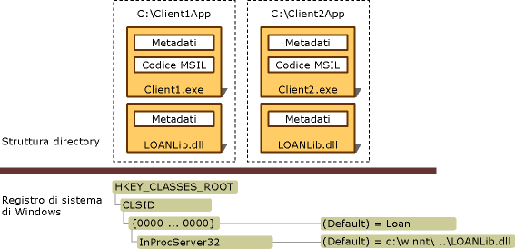

# Distribuzione di una applicazione di interoperabilità
Un'applicazione di interoperabilità in genere include un assembly client .NET, uno o più assembly di interoperabilità che rappresentano librerie dei tipi COM distinte e uno o più componenti COM registrati. Visual Studio e [!INCLUDE[winsdklong](../../../includes/winsdklong-md.md)] forniscono strumenti per importare e convertire una libreria dei tipi in un assembly di interoperabilità, come illustrato in [Importing a Type Library as an Assembly](../../../docs/framework/interop/importing-a-type-library-as-an-assembly.md) (Importazione di una libreria dei tipi come assembly). Un'applicazione di interoperabilità può essere distribuita in due modi:  
  
-   Usando tipi di interoperabilità incorporati: a partire da [!INCLUDE[net_v40_long](../../../includes/net-v40-long-md.md)], è possibile indicare al compilatore di incorporare nell'eseguibile informazioni sul tipo ottenute da un assembly di interoperabilità. Il compilatore incorpora solo le informazioni sui tipi usate dall'applicazione. Non è necessario distribuire l'assembly di interoperabilità con l'applicazione. Questa è la tecnica consigliata.  
  
-   Distribuendo assembly di interoperabilità: è possibile creare un riferimento standard a un assembly di interoperabilità. In questo caso, l'assembly di interoperabilità deve essere distribuito con l'applicazione. Se si ricorre a questa tecnica e non si usa un componente COM privato, fare sempre riferimento all'assembly di interoperabilità primario pubblicato dall'autore del componente COM che si intende incorporare nel codice gestito. Per altre informazioni sulla creazione e sull'uso di assembly di interoperabilità primari, vedere [Primary Interop Assemblies](http://msdn.microsoft.com/en-us/b977a8be-59a0-40a0-a806-b11ffba5c080) (Assembly di interoperabilità primari).  
  
 Se si usano i tipi di interoperabilità incorporati, la distribuzione è estremamente semplice. Non ci sono particolari operazioni da eseguire. Il resto di questo articolo descrive gli scenari di distribuzione degli assembly di interoperabilità con l'applicazione.  
  
## Distribuzione di assembly di interoperabilità  
 Gli assembly possono avere nomi sicuri. Un assembly con nome sicuro include la chiave pubblica dell'entità di pubblicazione, che fornisce un'identità univoca. Gli assembly prodotti dall'[utilità di importazione della libreria dei tipi (Tlbimp.exe)](../../../docs/framework/tools/tlbimp-exe-type-library-importer.md) possono essere firmati dall'entità di pubblicazione usando l'opzione **/keyfile**. È possibile installare gli assembly firmati nella Global Assembly Cache. Gli assembly non firmati devono essere installati nel computer dell'utente come assembly privati.  
  
### Assembly privati  
 Per installare un assembly da usare privatamente, sia l'eseguibile dell'applicazione che l'assembly di interoperabilità contenente i tipi COM importati devono essere installati nella stessa struttura di directory. La figura seguente illustra un assembly di interoperabilità non firmato che verrà usato privatamente da Client1.exe e Client2.exe, che si trovano in directory dell'applicazione separate. L'assembly di interoperabilità, denominato LOANLib.dll in questo esempio, viene installato due volte.  
  
   
Struttura delle directory e voci del Registro di sistema per una distribuzione privata  
  
 Tutti i componenti COM associati all'applicazione devono essere installati nel Registro di sistema di Windows. Se Client1.exe e Client2.exe della figura vengono installati in computer diversi, è necessario registrare i componenti COM in entrambi i computer.  
  
### Assembly condivisi  
 Gli assembli condivisi da più applicazioni devono essere installati in un repository centralizzato denominato Global Assembly Cache. I client .NET possono accedere alla stessa copia dell'assembly di interoperabilità, che viene firmato e installato nella Global Assembly Cache. Per altre informazioni sulla creazione e sull'uso di assembly di interoperabilità primari, vedere [Primary Interop Assemblies](http://msdn.microsoft.com/en-us/b977a8be-59a0-40a0-a806-b11ffba5c080) (Assembly di interoperabilità primari).  
  
## Vedere anche  
 [Esposizione di componenti COM a .NET Framework](../../../docs/framework/interop/exposing-com-components.md)  
 [Importazione di una libreria dei tipi come assembly](../../../docs/framework/interop/importing-a-type-library-as-an-assembly.md)  
 [Utilizzo di tipi COM nel codice gestito](http://msdn.microsoft.com/en-us/1a95a8ca-c8b8-4464-90b0-5ee1a1135b66)  
 [Compilazione di un progetto di interoperabilità](../../../docs/framework/interop/compiling-an-interop-project.md)
