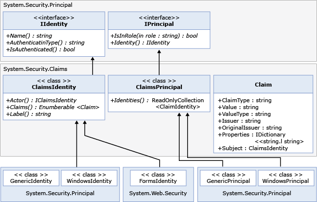

# Modello di programmazione attestazioni WIF
ASP.NET e Windows Communication Foundation \(WCF\), in genere, utilizzare le interfacce IIdentity e IPrincipal per lavorare con le informazioni sull'identità dell'utente.  In.NET 4.5, Foundation identità Windows \(WIF\) è stato integrato che attestazioni ora sono sempre presenti per qualsiasi identità, come illustrato nella figura riportata di seguito:  
  
   
  
 In.NET 4.5, System.Security.Claims contiene le nuove classi ClaimsPrincipal e ClaimsIdentity \(cfr. diagramma precedente\).  Tutte le identità in.NET ora deriva da ClaimsPrincipal.  Tutte le classi di identità incorporati, come FormsIdentity per ASP.NET e WindowsIdentity ora deriva da ClaimsIdentity.  Allo stesso modo, tutte le principali classi incorporate come GenericPrincipal e WindowsPrincipal derivano da ClaimsPrincipal.  
  
 Una richiesta di rimborso è rappresentato da <xref:System.Security.Claims.Claim> classe.  Questa classe dispone del seguente proprietà importanti:  
  
-   <xref:System.Security.Claims.Claim.Type%2A>rappresenta il tipo di attestazione e in genere è un URI.  Ad esempio, la richiesta di indirizzo di posta elettronica è rappresentata come `http://schemas.microsoft.com/ws/2008/06/identity/claims/email`.  
  
-   <xref:System.Security.Claims.Claim.Value%2A>contiene il valore del credito e rappresentato come stringa.  Ad esempio, l'indirizzo di posta elettronica può essere rappresentato come "prova@contoso.com".  
  
-   <xref:System.Security.Claims.Claim.ValueType%2A>rappresenta il tipo del valore del credito e in genere è un URI.  Ad esempio, il tipo di stringa è rappresentato come `http://www.w3.org/2001/XMLSchema#string`.  Il tipo di valore deve essere un nome completo in base allo schema XML.  Il valore deve essere nel formato `namespace#format` per attivare WIF per l'output di un valore QName valido.  Se lo spazio dei nomi non è uno spazio dei nomi ben definito, il XML generato non è probabilmente schema convalidato, poiché non vi sarà un file XSD pubblicato per tale spazio dei nomi.  Il tipo di valore predefinito è `http://www.w3.org/2001/XMLSchema#string`.  Vedere [http:\/\/www.w3.org\/2001\/XMLSchema](http://go.microsoft.com/fwlink/?LinkId=209155) per i tipi di valore noto che è possibile utilizzare in modo sicuro.  
  
-   <xref:System.Security.Claims.Claim.Issuer%2A>è l'identificatore del servizio token di protezione \(STS\) che ha emesso il reclamo.  Questo può essere rappresentato come URL del servizio STS o un nome che rappresenta il servizio STS, ad esempio `https://sts1.contoso.com/sts`.  
  
-   <xref:System.Security.Claims.Claim.OriginalIssuer%2A>è l'identificatore di STS originariamente il reclamo, indipendentemente dal numero STSs della catena.  Questo è rappresentato come <xref:System.Security.Claims.Claim.Issuer%2A>.  
  
-   <xref:System.Security.Claims.Claim.Subject%2A>è l'oggetto cui identità viene esaminato.  Esso contiene una <xref:System.Security.Claims.ClaimsIdentity>.  
  
-   <xref:System.Security.Claims.Claim.Properties%2A>è un dizionario che consente allo sviluppatore di fornire i dati specifici dell'applicazione di essere trasferiti in transito e le altre proprietà e può essere utilizzato per la convalida personalizzata.  
  
## Delega di identità  
 Un'importante proprietà della <xref:System.Security.Claims.ClaimsIdentity> è <xref:System.Security.Claims.ClaimsIdentity.Actor%2A>.  Questa proprietà consente la delega delle credenziali in un sistema a più livelli in cui un livello intermedio agisce come client di effettuare richieste a un servizio di back\-end.  
  
### L'accesso a crediti tramite CurrentPrincipal  
 Per accedere ai set di attestazioni in un'applicazione RP dell'utente corrente, utilizzare `Thread.CurrentPrincipal`.  
  
 Nell'esempio di codice riportato di seguito viene illustrato l'utilizzo di questo metodo per ottenere un System.Security.Claims.ClaimsIdentity:  
  
```  
ClaimsPrincipal claimsPrincipal = Thread.CurrentPrincipal as ClaimsPrincipal;  
  
```  
  
 Per ulteriori informazioni, vedere <xref:System.Security.Claims>.  
  
### Tipo di attestazione del ruolo  
 Parte della configurazione dell'applicazione RP consiste nel determinare il ruolo svolto attestazione deve essere il tipo.  Questo tipo di attestazione viene utilizzato da System.Security.Claims.ClaimsPrincipal.IsInRole\(System.String\).  Il tipo di attestazione predefinito è `http://schemas.microsoft.com/ws/2008/06/identity/claims/role`.  
  
### Attestazioni estratte da Windows Foundation identità da diversi tipi di Token  
 WIF supporta diverse combinazioni di meccanismi di autenticazione della finestra di.  Nella tabella seguente elenca le attestazioni che WIF estrae da diversi tipi di token.  
  
||||  
|-|-|-|  
|Tipo di token|Richiesta generato|Mappa del Token di accesso di Windows|  
|SAML 1.1|1.  Tutti i crediti da System.IdentityModel.SecurityTokenService.GetOutputClaimsIdentity\(System.Security.Claims.ClaimsPrincipal,System.IdentityModel.Protocols.WSTrust.RequestSecurityToken,System.IdentityModel.Scope\).<br />2.  Il `http://schemas.microsoft.com/ws/2008/06/identity/claims/confirmationkey` attestazione che contiene la serializzazione XML della chiave di conferma, se il token contiene un token di prova.<br />3.  Il `http://schemas.microsoft.com/ws/2008/06/identity/claims/samlissuername` richiesta dall'elemento dell'emittente.<br />4.  Crediti AuthenticationMethod e AuthenticationInstant se il token contiene un'istruzione di autenticazione.|Oltre ai crediti elencati in "SAML 1.1", ad eccezione dei crediti di tipo `http://schemas.xmlsoap.org/ws/2005/05/identity/claims/name`, l'autenticazione di Windows relative attestazioni verranno aggiunto e l'identità sarà rappresentato da WindowsClaimsIdentity.|  
|SAML 2.0|Uguale a "SAML 1.1".|Uguale a "SAML 1.1 associati all'Account di Windows".|  
|X509|1.  Crediti con X 500 distinguono in nome, nomepostaelettronica, NomeDNS, SimpleName, UpnName, UrlName, identificazione personale, RsaKey \(ciò può essere estratto utilizzando il metodo RSACryptoServiceProvider.ExportParameters dalla proprietà X509Certificate2.PublicKey.Key\), DsaKey \(ciò può essere estratto utilizzando il metodo DSACryptoServiceProvider.ExportParameters dalla proprietà X509Certificate2.PublicKey.Key\), le proprietà del numero di serie da X. 509 certificato.<br />2.  Attestazione basata su AuthenticationMethod con valore `http://schemas.microsoft.com/ws/2008/06/identity/authenticationmethod/x509`.  Richiesta di AuthenticationInstant con il valore del tempo quando il certificato è stato convalidato nel formato XmlSchema DateTime.|1.  Viene utilizzato il nome di dominio completo dell'account di Windows come il `http://schemas.xmlsoap.org/ws/2005/05/identity/claims/name` valore attestazione.  .<br />2.  Crediti dal certificato non è associato a Windows X. 509 e crediti dall'account di windows ottenute tramite il mapping del certificato per Windows.|  
|UPN|1.  Le attestazioni sono simili ai crediti della sezione di autenticazione di Windows.<br />2.  Attestazione basata su AuthenticationMethod con valore `http://schemas.microsoft.com/ws/2008/06/identity/authenticationmethod/password`.  L'attestazione basata su AuthenticationInstant con il valore del tempo quando la password è stata convalidata nel formato XmlSchema DateTime.||  
|Windows \(Kerberos o NTLM\)|1.  Crediti generati dal token di accesso, ad esempio: PrimarySID, DenyOnlyPrimarySID, PrimaryGroupSID, DenyOnlyPrimaryGroupSID, SIDGruppo, DenyOnlySID e il nome<br />2.  AuthenticationMethod con il valore di `http://schemas.microsoft.com/ws/2008/06/identity/authenticationmethod/windows`.  AuthenticationInstant con il valore del tempo quando token di accesso di Windows è stato creato nel formato XMLSchema DateTime.||  
|Coppia di chiavi RSA|1.  Il `http://schemas.xmlsoap.org/ws/2005/05/identity/claims/rsa` richiesta con il valore del RSAKeyValue.<br />2.  Attestazione basata su AuthenticationMethod con il valore di `http://schemas.microsoft.com/ws/2008/06/identity/authenticationmethod/signature`.  Attestazione basata su AuthenticationInstant con il valore del tempo quando la chiave RSA è stata autenticata \(vale a dire che è stata verificata la firma\) nel formato XMLSchema DateTime.||  
  
|||  
|-|-|  
|Tipo di autenticazione|URI emesso nella richiesta di rimborso "AuthenticationMethod"|  
|Password|`urn:oasis:names:tc:SAML:1.0:am:password`|  
|Kerberos|`urn:ietf:rfc:1510`|  
|SecureRemotePassword|`urn:ietf:rfc:2945`|  
|TLSClient|`urn:ietf:rfc:2246`|  
|X509|`urn:oasis:names:tc:SAML:1.0:am:X509-PKI`|  
|PGP|`urn:oasis:names:tc:SAML:1.0:am:PGP`|  
|Spki|`urn:oasis:names:tc:SAML:1.0:am:SPKI`|  
|XmlDSig|`urn:ietf:rfc:3075`|  
|Non specificato|`urn:oasis:names:tc:SAML:1.0:am:unspecified`|