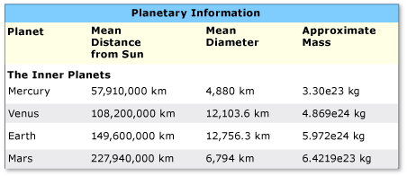
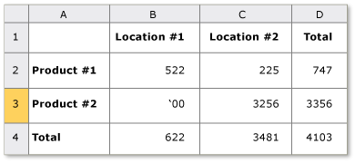

# Implementazione del pattern di controllo Table di automazione interfaccia utente
> [!NOTE]
>  Questa documentazione è destinata agli sviluppatori di .NET Framework che vogliono usare le classi gestite di [!INCLUDE[TLA2#tla_uiautomation](../../../includes/tla2sharptla-uiautomation-md.md)] definite nello spazio dei nomi <xref:System.Windows.Automation>. Per informazioni aggiornate sulle [!INCLUDE[TLA2#tla_uiautomation](../../../includes/tla2sharptla-uiautomation-md.md)], vedere [Windows Automation API: automazione dell'interfaccia utente](https://go.microsoft.com/fwlink/?LinkID=156746).  
  
 In questo argomento vengono presentate le linee guida e le convenzioni per l'implementazione di <xref:System.Windows.Automation.Provider.ITableProvider>, incluse le informazioni relative a proprietà, metodi ed eventi. Alla fine della panoramica sono elencati collegamenti a ulteriore materiale di riferimento.  
  
 Il <xref:System.Windows.Automation.TablePattern> pattern di controllo viene usato per supportare i controlli che fungono da contenitori per una raccolta di elementi figlio. Gli elementi figlio di questo elemento devono implementare <xref:System.Windows.Automation.Provider.ITableItemProvider> e devono essere organizzati in un sistema di coordinate logico bidimensionale che può essere attraversato da righe e colonne. Questo pattern di controllo è analogo a <xref:System.Windows.Automation.Provider.IGridProvider>, con la differenza che i controlli che implementano <xref:System.Windows.Automation.Provider.ITableProvider> deve esporre anche una relazione di intestazione di riga e/o di colonna per ogni elemento figlio. Per esempi di controlli che implementano questo pattern di controllo, vedere [Control Pattern Mapping for UI Automation Clients](../../../docs/framework/ui-automation/control-pattern-mapping-for-ui-automation-clients.md).  
  
   
## Linee guida e convenzioni di implementazione  
 Quando si implementa il pattern di controllo Table, tenere presenti le linee guida e le convenzioni seguenti:  
  
-   L'accesso al contenuto delle singole celle avviene tramite un sistema di coordinate logico bidimensionale o una matrice fornita dall'implementazione simultanea obbligatoria di <xref:System.Windows.Automation.Provider.IGridProvider>.  
  
-   Un'intestazione di riga o colonna può essere contenuta all'interno di un oggetto tabella oppure essere un oggetto intestazione distinto associato a un oggetto tabella.  
  
-   Le intestazioni di riga e colonna possono includere un'intestazione principale nonché intestazioni di supporto.  
  
> [!NOTE]
>  Questo concetto diventa evidente in un [!INCLUDE[TLA#tla_xl](../../../includes/tlasharptla-xl-md.md)] foglio di calcolo in cui un utente ha definito una colonna di "First name". Questa colonna contiene ora due intestazioni, ovvero l'intestazione "Nome" definita dall'utente e la designazione alfanumerica per tale colonna assegnata dall'applicazione.  
  
-   Visualizzare [che implementa il Pattern di controllo Grid di automazione interfaccia utente](../../../docs/framework/ui-automation/implementing-the-ui-automation-grid-control-pattern.md) per informazioni sulla funzionalità griglia correlata.  
  
   
Esempio di tabella con intestazioni di colonna complesse  
  
   
Esempio di tabella con la proprietà RowOrColumnMajor definita in modo ambiguo  
  
   
## Membri obbligatori per ITableProvider  
 Le proprietà e i metodi seguenti sono obbligatori per l'interfaccia ITableProvider.  
  
|Membri obbligatori|Tipo di membro|Note|  
|----------------------|-----------------|-----------|  
|<xref:System.Windows.Automation.Provider.ITableProvider.RowOrColumnMajor%2A>|Proprietà|nessuno|  
|<xref:System.Windows.Automation.Provider.ITableProvider.GetColumnHeaders%2A>|Metodo|nessuno|  
|<xref:System.Windows.Automation.Provider.ITableProvider.GetRowHeaders%2A>|Metodo|nessuno|  
  
 Questo pattern di controllo non è associato a eventi.  
  
   
## Eccezioni  
 Questo pattern di controllo non è associato a eccezioni.  
  
## Vedere anche  
 [Panoramica dei pattern di controllo per l'automazione interfaccia utente](../../../docs/framework/ui-automation/ui-automation-control-patterns-overview.md)  
 [Supportare pattern di controllo in un provider di automazione interfaccia utente](../../../docs/framework/ui-automation/support-control-patterns-in-a-ui-automation-provider.md)  
 [Pattern di controllo di automazione interfaccia utente per i client](../../../docs/framework/ui-automation/ui-automation-control-patterns-for-clients.md)  
 [Implementazione del pattern di controllo TableItem di automazione interfaccia utente](../../../docs/framework/ui-automation/implementing-the-ui-automation-tableitem-control-pattern.md)  
 [Implementazione del pattern di controllo Grid di automazione interfaccia utente](../../../docs/framework/ui-automation/implementing-the-ui-automation-grid-control-pattern.md)  
 [Panoramica dell'albero di automazione interfaccia utente](../../../docs/framework/ui-automation/ui-automation-tree-overview.md)  
 [Usare la memorizzazione nella cache in automazione interfaccia utente](../../../docs/framework/ui-automation/use-caching-in-ui-automation.md)
