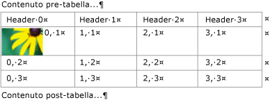
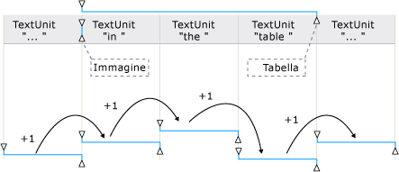
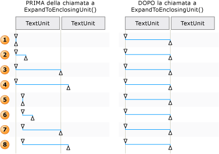

# Panoramica sugli oggetti incorporati e TextPattern
> [!NOTE]
>  Questa documentazione è destinata agli sviluppatori di .NET Framework che vogliono usare le classi gestite di [!INCLUDE[TLA2#tla_uiautomation](../../../includes/tla2sharptla-uiautomation-md.md)] definite nello spazio dei nomi <xref:System.Windows.Automation>. Per informazioni aggiornate su [!INCLUDE[TLA2#tla_uiautomation](../../../includes/tla2sharptla-uiautomation-md.md)], vedere l'argomento sull' [API Automazione interfaccia utente di Windows](http://go.microsoft.com/fwlink/?LinkID=156746).  
  
 In questa panoramica è descritto come l' [!INCLUDE[TLA#tla_uiautomation](../../../includes/tlasharptla-uiautomation-md.md)] espone oggetti incorporati, o elementi figlio, all'interno di un documento di testo o di un contenitore.  
  
 Nell' [!INCLUDE[TLA2#tla_uiautomation](../../../includes/tla2sharptla-uiautomation-md.md)] un oggetto incorporato corrisponde a qualsiasi elemento che disponga di limiti non testuali, ad esempio un'immagine, un collegamento ipertestuale, una tabella o un tipo di documento quale un foglio di calcolo di [!INCLUDE[TLA#tla_xl](../../../includes/tlasharptla-xl-md.md)] o un file di [!INCLUDE[TLA#tla_winmedia](../../../includes/tlasharptla-winmedia-md.md)] . Questa definizione è diversa dalla definizione standard, che prevede che un elemento venga creato in un'applicazione e incorporato o collegato in un'altra. Nel contesto dell' [!INCLUDE[TLA2#tla_uiautomation](../../../includes/tla2sharptla-uiautomation-md.md)]è irrilevante che l'oggetto possa essere modificato all'interno dell'applicazione originale.  
  
   
## Oggetti incorporati e albero di automazione interfaccia utente  
 Gli oggetti incorporati vengono considerati come singoli elementi all'interno della vista di controllo dell'albero di [!INCLUDE[TLA2#tla_uiautomation](../../../includes/tla2sharptla-uiautomation-md.md)] . Gli oggetti vengono esposti come elementi figlio del contenitore di testo, in modo che sia possibile accedervi tramite lo stesso modello degli altri controlli nell' [!INCLUDE[TLA2#tla_uiautomation](../../../includes/tla2sharptla-uiautomation-md.md)].  
  
   
Esempio di un contenitore di testo con oggetti incorporati tabella, immagine e collegamento ipertestuale  
  
   
Esempio di visualizzazione del contenuto di una parte del contenitore di testo precedente  
  
   
## Esporre oggetti incorporati tramite TextPattern e TextPatternRange  
 Usate in combinazione, le classi pattern di controllo <xref:System.Windows.Automation.TextPattern> e <xref:System.Windows.Automation.Text.TextPatternRange> espongono metodi e proprietà che facilitano lo spostamento e l'esecuzione di query di oggetti incorporati.  
  
 Il contenuto testuale (o testo interno) di un contenitore di testo o di un oggetto incorporato, ad esempio una cella di tabella o un collegamento ipertestuale, viene esposto come un flusso di testo continuo sia nella vista di controllo che nella visualizzazione del contenuto dell'albero di [!INCLUDE[TLA2#tla_uiautomation](../../../includes/tla2sharptla-uiautomation-md.md)] . I limiti dell'oggetto vengono ignorati. Se un client di automazione interfaccia utente sta recuperando il testo a scopo di esposizione, interpretazione o analisi, è necessario verificare l'eventuale presenza di casi speciali nell'intervallo di testo, ad esempio una tabella con contenuto testuale o altri oggetti incorporati. Questa operazione può essere eseguita chiamando <xref:System.Windows.Automation.Text.TextPatternRange.GetChildren%2A> per ottenere un <xref:System.Windows.Automation.AutomationElement> per ogni oggetto incorporato e chiamando quindi <xref:System.Windows.Automation.TextPattern.RangeFromChild%2A> per ottenere un intervallo di testo per ogni elemento. Questa operazione viene eseguita in modo ricorsivo fino a quando non è stato recuperato l'intero contenuto testuale.  
  
   
Esempio di un flusso di testo con oggetti incorporati e le estensioni degli intervalli corrispondenti  
  
 Quando è necessario scorrere il contenuto di un intervallo di testo, per garantire una corretta esecuzione del metodo <xref:System.Windows.Automation.Text.TextPatternRange.Move%2A> è prevista una serie di passaggi dietro le quinte.  
  
1.  L'intervallo di testo viene normalizzato, ovvero viene compresso in un intervallo degenerato all'endpoint <xref:System.Windows.Automation.Text.TextPatternRangeEndpoint.Start> . Ciò rende superfluo l'endpoint <xref:System.Windows.Automation.Text.TextPatternRangeEndpoint.End> . Questo passaggio è necessario rimuovere l'ambiguità nei casi in cui un intervallo di testo si estenda <xref:System.Windows.Automation.Text.TextUnit> limiti: ad esempio, "{l'U} RL [ http://www.microsoft.com ](http://www.microsoft.com) è incorporato nel testo" dove "{" e "}" rappresentano il testo endpoint dell'intervallo.  
  
2.  L'intervallo risultante viene spostato indietro in <xref:System.Windows.Automation.TextPattern.DocumentRange%2A> all'inizio del limite <xref:System.Windows.Automation.Text.TextUnit> richiesto.  
  
3.  L'intervallo viene spostato avanti o indietro in <xref:System.Windows.Automation.TextPattern.DocumentRange%2A> per il numero richiesto di limiti <xref:System.Windows.Automation.Text.TextUnit> .  
  
4.  L'intervallo viene quindi espanso dallo stato di intervallo degenerato spostando l'endpoint <xref:System.Windows.Automation.Text.TextPatternRangeEndpoint.End> di un limite <xref:System.Windows.Automation.Text.TextUnit> richiesto.  
  
   
Esempi di regolazione di un intervallo di testo per Move() ed ExpandToEnclosingUnit()  
  
   
## Scenari comuni  
 Nelle sezioni seguenti vengono illustrati esempi degli scenari più comuni che prevedono l'uso di oggetti incorporati.  
  
 Legenda per gli esempi illustrati:  
  
 { = <xref:System.Windows.Automation.Text.TextPatternRangeEndpoint.Start>  
  
 } = <xref:System.Windows.Automation.Text.TextPatternRangeEndpoint.End>  
  
   
### Hyperlink  
 **Esempio 1: intervallo di testo che contiene un collegamento ipertestuale con testo incorporato**  
  
 {L'URL [ http://www.microsoft.com ](http://www.microsoft.com) è incorporato nel testo}.  
  
|Metodo chiamato|Risultato|  
|-------------------|------------|  
|<xref:System.Windows.Automation.Text.TextPatternRange.GetText%2A>|Restituisce la stringa "l'URL http://www.microsoft.com è incorporato nel testo".|  
|<xref:System.Windows.Automation.Text.TextPatternRange.GetEnclosingElement%2A>|Restituisce l' <xref:System.Windows.Automation.AutomationElement> più interno che racchiude l'intervallo di testo, in questo caso, l' <xref:System.Windows.Automation.AutomationElement> che rappresenta il provider di testo stesso.|  
|<xref:System.Windows.Automation.Text.TextPatternRange.GetChildren%2A>|Restituisce un <xref:System.Windows.Automation.AutomationElement> che rappresenta il controllo collegamento ipertestuale.|  
|<xref:System.Windows.Automation.TextPattern.RangeFromChild%2A> dove <xref:System.Windows.Automation.AutomationElement> è l'oggetto restituito dal metodo `GetChildren` precedente.|Restituisce l'intervallo che rappresenta "http://www.microsoft.com".|  
  
 **Esempio 2: intervallo di testo che si estende parzialmente su un collegamento ipertestuale con testo incorporato**  
  
 L'URL `http://{[www]}` è incorporato nel testo.  
  
|Metodo chiamato|Risultato|  
|-------------------|------------|  
|<xref:System.Windows.Automation.Text.TextPatternRange.GetText%2A>|Restituisce la stringa "www".|  
|<xref:System.Windows.Automation.Text.TextPatternRange.GetEnclosingElement%2A>|Restituisce l' <xref:System.Windows.Automation.AutomationElement> più interno che racchiude l'intervallo di testo, in questo caso, il controllo collegamento ipertestuale.|  
|<xref:System.Windows.Automation.Text.TextPatternRange.GetChildren%2A>|Restituisce `null` poiché l'intervallo di testo non si estende sull'intera stringa dell'URL.|  
  
 **Esempio 3: intervallo di testo che si estende parzialmente sul contenuto di un contenitore di testo. Il contenitore di testo contiene un collegamento ipertestuale con testo incorporato che non fa parte dell'intervallo di testo.**  
  
 {L'URL} [ http://www.microsoft.com ](http://www.microsoft.com) è incorporato nel testo.  
  
|Metodo chiamato|Risultato|  
|-------------------|------------|  
|<xref:System.Windows.Automation.Text.TextPatternRange.GetText%2A>|Restituisce la stringa "L'URL".|  
|<xref:System.Windows.Automation.Text.TextPatternRange.GetEnclosingElement%2A>|Restituisce l' <xref:System.Windows.Automation.AutomationElement> più interno che racchiude l'intervallo di testo, in questo caso, l' <xref:System.Windows.Automation.AutomationElement> che rappresenta il provider di testo stesso.|  
|<xref:System.Windows.Automation.Text.TextPatternRange.Move%2A> con i parametri (TextUnit.Word, 1).|Sposta l'estensione dell'intervallo di intervallo di testo ad "http", poiché il testo del collegamento ipertestuale è costituito da parole singole. In questo caso, il collegamento ipertestuale non viene considerato come oggetto singolo.   L'URL {[http]} è incorporato nel testo.|  
  
   
### Image  
 **Esempio 1: intervallo di testo che contiene un'immagine incorporata**  
  
 {L'immagine  è incorporato nel testo}.  
  
|Metodo chiamato|Risultato|  
|-------------------|------------|  
|<xref:System.Windows.Automation.Text.TextPatternRange.GetText%2A>|Restituisce la stringa "L'immagine è incorporata nel testo". Non è possibile prevedere l'inclusione nel flusso di testo dell'eventuale testo alternativo associato all'immagine.|  
|<xref:System.Windows.Automation.Text.TextPatternRange.GetEnclosingElement%2A>|Restituisce l' <xref:System.Windows.Automation.AutomationElement> più interno che racchiude l'intervallo di testo, in questo caso, l' <xref:System.Windows.Automation.AutomationElement> che rappresenta il provider di testo stesso.|  
|<xref:System.Windows.Automation.Text.TextPatternRange.GetChildren%2A>|Restituisce un <xref:System.Windows.Automation.AutomationElement> che rappresenta il controllo immagine.|  
|<xref:System.Windows.Automation.TextPattern.RangeFromChild%2A> dove <xref:System.Windows.Automation.AutomationElement> è l'oggetto restituito dal metodo <xref:System.Windows.Automation.Text.TextPatternRange.GetChildren%2A> precedente.|Restituisce l'intervallo degenere che rappresenta "".|  
  
 **Esempio 2: intervallo di testo che si estende parzialmente sul contenuto di un contenitore di testo. Il contenitore di testo contiene un'immagine incorporata che non fa parte dell'intervallo di testo.**  
  
 {L'immagine}  è incorporato nel testo.  
  
|Metodo chiamato|Risultato|  
|-------------------|------------|  
|<xref:System.Windows.Automation.Text.TextPatternRange.GetText%2A>|Restituisce la stringa "L'immagine".|  
|<xref:System.Windows.Automation.Text.TextPatternRange.GetEnclosingElement%2A>|Restituisce l' <xref:System.Windows.Automation.AutomationElement> più interno che racchiude l'intervallo di testo, in questo caso, l' <xref:System.Windows.Automation.AutomationElement> che rappresenta il provider di testo stesso.|  
|<xref:System.Windows.Automation.Text.TextPatternRange.Move%2A> con i parametri (TextUnit.Word, 1).|Sposta l'estensione dell'intervallo di testo a "è". Poiché solo gli oggetti incorporati basati su testo sono considerati parte del flusso di testo, l'immagine in questo esempio non influisce su Move o sul valore restituito da questo metodo (1 in questo caso).|  
  
   
### Table  
  
### Tabella usata per gli esempi  
  
|Cella con immagine|Cella con testo|  
|---------------------|--------------------|  
||x|  
||Y|  
|   Immagine per Z|Z|  
  
 **Esempio 1: ottenere il contenitore di testo dal contenuto di una cella.**  
  
|Metodo chiamato|Risultato|  
|-------------------|------------|  
|<xref:System.Windows.Automation.GridPattern.GetItem%2A> con parametri (0,0)|Restituisce l' <xref:System.Windows.Automation.AutomationElement> che rappresenta il contenuto della cella della tabella; in questo caso, l'elemento è un controllo di testo.|  
|<xref:System.Windows.Automation.TextPattern.RangeFromChild%2A> dove <xref:System.Windows.Automation.AutomationElement> è l'oggetto restituito dal metodo `GetItem` precedente.|Restituisce l'intervallo che si estende sull'immagine .|  
|<xref:System.Windows.Automation.Text.TextPatternRange.GetEnclosingElement%2A> per l'oggetto restituito dal metodo `RangeFromChild` precedente.|Restituisce l' <xref:System.Windows.Automation.AutomationElement> che rappresenta la cella della tabella; in questo caso, l'elemento è un controllo di testo che supporta TableItemPattern.|  
|<xref:System.Windows.Automation.Text.TextPatternRange.GetEnclosingElement%2A> per l'oggetto restituito dal metodo `GetEnclosingElement` precedente.|Restituisce l' <xref:System.Windows.Automation.AutomationElement> che rappresenta la tabella.|  
|<xref:System.Windows.Automation.Text.TextPatternRange.GetEnclosingElement%2A> per l'oggetto restituito dal metodo `GetEnclosingElement` precedente.|Restituisce l' <xref:System.Windows.Automation.AutomationElement> che rappresenta il provider di testo stesso.|  
  
 **Esempio 2: ottenere il contenitore di testo di una cella.**  
  
|Metodo chiamato|Risultato|  
|-------------------|------------|  
|<xref:System.Windows.Automation.GridPattern.GetItem%2A> con parametri (1,1).|Restituisce l'<xref:System.Windows.Automation.AutomationElement> che rappresenta il contenuto della cella della tabella; in questo caso, l'elemento è un controllo di testo.|  
|<xref:System.Windows.Automation.TextPattern.RangeFromChild%2A> dove <xref:System.Windows.Automation.AutomationElement> è l'oggetto restituito dal metodo `GetItem` precedente.|Restituisce "Y".|  
  
## Vedere anche  
 <xref:System.Windows.Automation.TextPattern>  
 <xref:System.Windows.Automation.Text.TextPatternRange>  
 <xref:System.Windows.Automation.Provider.ITextProvider>  
 <xref:System.Windows.Automation.Provider.ITextRangeProvider>  
 [Accedere agli oggetti incorporati usando l'automazione interfaccia utente](../../../docs/framework/ui-automation/access-embedded-objects-using-ui-automation.md)  
 [Esporre il contenuto di una tabella usando l'automazione interfaccia utente](../../../docs/framework/ui-automation/expose-the-content-of-a-table-using-ui-automation.md)  
 [Scorrere il testo usando l'automazione interfaccia utente](../../../docs/framework/ui-automation/traverse-text-using-ui-automation.md)  
 [Esempio di selezione e ricerca di TextPattern](http://msdn.microsoft.com/library/0a3bca57-8b72-489d-a57c-da85b7a22c7f)
