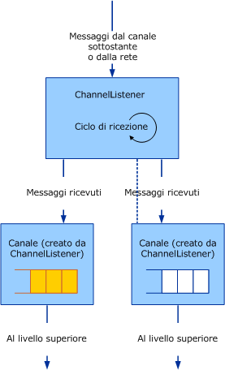

# <a name="service-channel-listeners-and-channels"></a>Servizio: Listener di canale e canali

Esistono tre categorie di oggetti canale: canali, listener di canale e channel factory. I canali sono l'interfaccia tra l'applicazione e lo stack dei canali. I listener del canale sono responsabili della creazione di canali sul lato che riceve (o in ascolto), in genere in risposta a un messaggio in arrivo nuovo o a una connessione. I channel factory sono responsabili della creazione di canali sul lato di invio per iniziare la comunicazione con un endpoint.

## <a name="channel-listeners-and-channels"></a>Listener di canale e canali

I listener del canale sono responsabili della creazione di canali e della ricezione di messaggi dal livello inferiore o dalla rete. I messaggi ricevuti sono recapitati al livello superiore utilizzando un canale creato dal listener del canale.

Nel diagramma seguente è illustrato il processo di ricezione dei messaggi e del loro recapito al livello superiore.



Listener di canale che riceve messaggi e li recapita al livello superiore tramite canali.

Il processo può essere rappresentato concettualmente come una coda all'interno di ogni canale, anche se l'implementazione non utilizza effettivamente una coda. Un listener del canale è responsabile della ricezione di messaggi dal livello inferiore o dalla rete e del loro inserimento nella coda. Il canale è responsabile del recupero dei messaggi dalla coda e della consegna dei messaggi al livello superiore quando questo richiede un messaggio, ad esempio chiamando `Receive` sul canale.

WCF fornisce gli helper di classe di base per questo processo. (Per un diagramma delle classi di supporto del canale descritti in questo articolo, vedere [Cenni preliminari sul modello di canale](channel-model-overview.md).)

- Il <xref:System.ServiceModel.Channels.CommunicationObject> classe implementa <xref:System.ServiceModel.ICommunicationObject> e applica la macchina a stati descritta nel passaggio 2 della [emergenti canali](developing-channels.md).

- Il <xref:System.ServiceModel.Channels.ChannelManagerBase> classe implementa <xref:System.ServiceModel.Channels.CommunicationObject> e fornisce una classe di base unificata per <xref:System.ServiceModel.Channels.ChannelFactoryBase> e <xref:System.ServiceModel.Channels.ChannelListenerBase>. La classe <xref:System.ServiceModel.Channels.ChannelManagerBase> opera unitamente alla classe <xref:System.ServiceModel.Channels.ChannelBase>, una classe di base che implementa l'interfaccia <xref:System.ServiceModel.Channels.IChannel>.

- Il <xref:System.ServiceModel.Channels.ChannelFactoryBase> classe implementa <xref:System.ServiceModel.Channels.ChannelManagerBase> e <xref:System.ServiceModel.Channels.IChannelFactory> e consolida il `CreateChannel` overload in un unico `OnCreateChannel` metodo astratto.

- Il <xref:System.ServiceModel.Channels.ChannelListenerBase> classe implementa <xref:System.ServiceModel.Channels.IChannelListener>. Si occupa della gestione dello stato di base.

La discussione seguente si basa il [trasporto: UDP](../../../../docs/framework/wcf/samples/transport-udp.md) esempio.

## <a name="creating-a-channel-listener"></a>Creazione di un listener del canale

Il `UdpChannelListener` che implementa il codice di esempio deriva dal <xref:System.ServiceModel.Channels.ChannelListenerBase> classe. Utilizza un solo socket UDP per ricevere datagrammi. Il metodo `OnOpen` riceve dati utilizzando il socket UDP in un ciclo asincrono. I dati vengono quindi convertiti in messaggi utilizzando il sistema di codifica messaggi:

```csharp
message = UdpConstants.MessageEncoder.ReadMessage(
  new ArraySegment<byte>(buffer, 0, count),
  bufferManager
);
```

Poiché lo stesso canale del datagramma rappresenta messaggi in arrivo da un certo numero di origini, `UdpChannelListener` è un listener singleton. Nella maggior parte di uno attivo <xref:System.ServiceModel.Channels.IChannel> associato a questo listener alla volta. Nell'esempio ne viene generato un altro solo se un canale restituito dal metodo <xref:System.ServiceModel.Channels.ChannelListenerBase%601.AcceptChannel%2A> viene successivamente eliminato. Quando viene ricevuto un messaggio, viene accodato in questo canale singleton.

### <a name="udpinputchannel"></a>UdpInputChannel

Il `UdpInputChannel` classe implementa <xref:System.ServiceModel.Channels.IInputChannel>. È composta da una coda di messaggi in arrivo popolata dal socket di `UdpChannelListener`. La coda di questi messaggi viene annullata dal metodo <xref:System.ServiceModel.Channels.IInputChannel.Receive%2A>.
