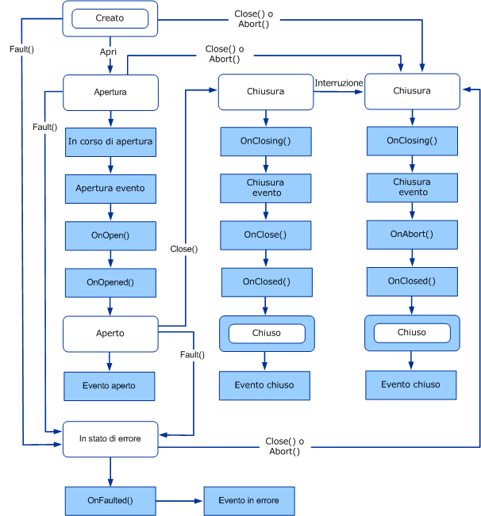
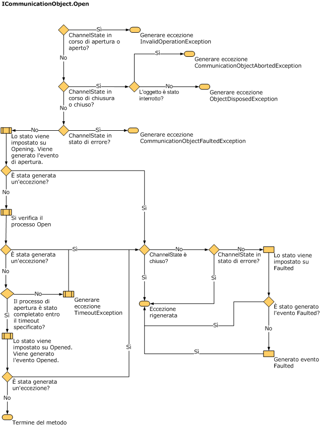
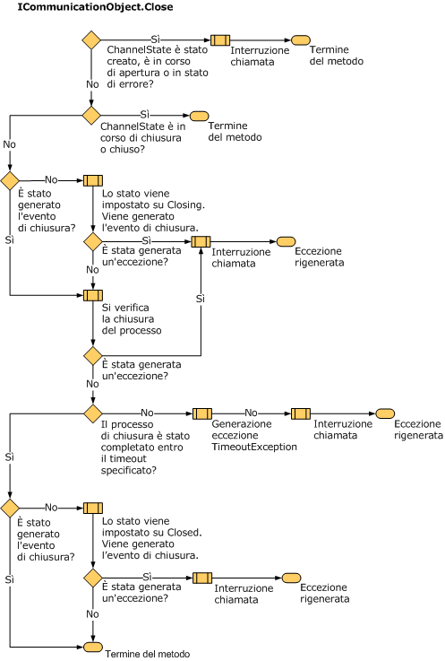
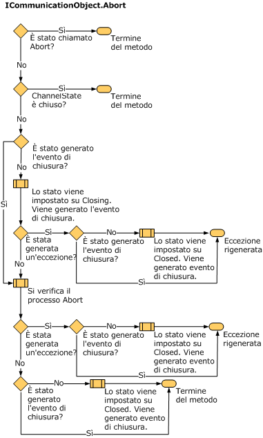

# Informazioni sui cambiamenti di stato
In questo argomento vengono descritti gli stati e le transizioni dei canali, i tipi utilizzati per strutturare gli stati dei canali e come implementarli.  
  
## Macchine a stati e canali  
 Gli oggetti che gestiscono comunicazioni, ad esempio i socket, di solito presentano una macchina a stati le cui transizioni di stato riguardano operazioni quali allocare risorse di rete, stabilire o accettare connessioni, chiudere connessioni e terminare la comunicazione. La macchina a stati del canale fornisce un modello uniforme degli stati di un oggetto di comunicazione che astrae l'implementazione sottostante di tale oggetto. L'interfaccia <xref:System.ServiceModel.ICommunicationObject> fornisce un set di stati, nonché di metodi ed eventi di transizione di stato. Tutti i canali, le factory e i listener di canale implementano la macchina a stati del canale.  
  
 Gli eventi Closed, Closing, Faulted, Opened e Opening segnalano a un osservatore esterno che è avvenuta una transizione di stato.  
  
 I metodi Abort, Close e Open, unitamente ai relativi equivalenti asincroni, causano le transizioni di stato.  
  
 La proprietà State restituisce lo stato corrente, così com'è definito da <xref:System.ServiceModel.CommunicationState>:  
  
## ICommunicationObject, CommunicationObject, stati e transizioni di stato  
 Un elemento <xref:System.ServiceModel.ICommunicationObject> inizia con lo stato Created nel quale è possibile configurare le relative proprietà. Una volta nello stato Opened, l'oggetto è utilizzabile per l'invio e la ricezione di messaggi ma le relative proprietà sono considerate immutabili. Una volta assunto lo stato Closing, l'oggetto non potrà più elaborare nuove richieste di invio e ricezione, ma è probabile che le richieste esistenti possano essere completate finché non verrà raggiunto il timeout Close.  Se si verifica un errore irreversibile, l'oggetto passa allo stato Faulted nel quale può essere controllato per verificare le informazioni relative all'errore e infine chiuso. Quando l'oggetto arriva allo stato Closed essenzialmente raggiunge la fine della macchina a stati. Una volta che l'oggetto è passato da uno stato al successivo, non torna più a uno stato precedente.  
  
 Nel diagramma seguente sono illustrati gli stati e le transizioni di stato di <xref:System.ServiceModel.ICommunicationObject>. Le transizioni di stato possono essere indotte chiamando uno dei tre metodi seguenti: Abort, Open o Close. È inoltre possibile fare in modo che si verifichino chiamando altri metodi specifici dell'implementazione. Il passaggio allo stato Faulted può avvenire per effetto di errori durante l'apertura o dopo avere aperto l'oggetto di comunicazione.  
  
 Tutti gli oggetti <xref:System.ServiceModel.ICommunicationObject> iniziano con lo stato Created. In questo stato un'applicazione può configurare l'oggetto impostandone le proprietà. Una volta che l'oggetto ha assunto uno stato diverso da Created, viene considerato immutabile.  
  
   
Figura 1. La macchina a stati di ICommunicationObject.  
  
 [!INCLUDE[indigo1](../../../../includes/indigo1-md.md)] fornisce una classe di base astratta denominata <xref:System.ServiceModel.Channels.CommunicationObject> che implementa <xref:System.ServiceModel.ICommunicationObject> e la macchina a stati del canale. Di seguito è illustrato un diagramma di stato modificato specifico di <xref:System.ServiceModel.Channels.CommunicationObject>. Oltre alla macchina a stati <xref:System.ServiceModel.ICommunicationObject>, è indicato l'intervallo in cui vengono richiamati metodi <xref:System.ServiceModel.Channels.CommunicationObject> aggiuntivi.  
  
   
Figura 2. Implementazione dell'oggetto CommunicationObject della macchina a stati ICommunicationObject con chiamate a eventi e metodi protetti.  
  
### Eventi ICommunicationObject  
 <xref:System.ServiceModel.Channels.CommunicationObject> espone i cinque eventi definiti da <xref:System.ServiceModel.ICommunicationObject>. Questi eventi sono progettati per codice che utilizza l'oggetto di comunicazione al quale notificare le transizioni di stato. Come illustrato nella Figura 2 riportata in precedenza, ogni evento viene generato una volta dopo le transizioni di stato dell'oggetto allo stato denominato dall'evento. Tutti e cinque gli eventi sono di tipo `EventHandler` definito come:  
  
 `public delegate void EventHandler(object sender, EventArgs e);`  
  
 Nell'implementazione di <xref:System.ServiceModel.Channels.CommunicationObject>, il mittente è <xref:System.ServiceModel.Channels.CommunicationObject> stesso o qualunque altro elemento passato come mittente al costruttore <xref:System.ServiceModel.Channels.CommunicationObject> (se è stato utilizzato l'overload di tale costruttore). Il parametro EventArgs, `e`è sempre `EventArgs.Empty`.  
  
### Richiamate a oggetti derivati  
 Oltre ai cinque eventi, <xref:System.ServiceModel.Channels.CommunicationObject> dichiara otto metodi virtuali protetti, progettati per consentire la richiamata di un oggetto derivato prima e dopo le transizioni di stato.  
  
 Per i metodi <xref:System.ServiceModel.Channels.CommunicationObject.Open%2A?displayProperty=nameWithType> e <xref:System.ServiceModel.Channels.CommunicationObject.Close%2A?displayProperty=nameWithType> sono disponibili tre richiamate di questo genere associate a ognuno di essi. Ad esempio, al metodo <xref:System.ServiceModel.Channels.CommunicationObject.Open%2A?displayProperty=nameWithType> corrispondono <xref:System.ServiceModel.Channels.CommunicationObject.OnOpening%2A?displayProperty=nameWithType>, <xref:System.ServiceModel.Channels.CommunicationObject.OnOpen%2A?displayProperty=nameWithType> e <xref:System.ServiceModel.Channels.CommunicationObject.OnOpened%2A?displayProperty=nameWithType>. Al metodo <xref:System.ServiceModel.Channels.CommunicationObject.Close%2A?displayProperty=nameWithType> si associano <xref:System.ServiceModel.Channels.CommunicationObject.OnClose%2A?displayProperty=nameWithType>, <xref:System.ServiceModel.Channels.CommunicationObject.OnClosing%2A?displayProperty=nameWithType> e <xref:System.ServiceModel.Channels.CommunicationObject.OnClosed%2A?displayProperty=nameWithType>.  
  
 Analogamente, il metodo <xref:System.ServiceModel.Channels.CommunicationObject.Abort%2A?displayProperty=nameWithType> ha come corrispondente <xref:System.ServiceModel.Channels.CommunicationObject.OnAbort%2A?displayProperty=nameWithType>.  
  
 Mentre per <xref:System.ServiceModel.Channels.CommunicationObject.OnOpen%2A?displayProperty=nameWithType>, <xref:System.ServiceModel.Channels.CommunicationObject.OnClose%2A?displayProperty=nameWithType>e <xref:System.ServiceModel.Channels.CommunicationObject.OnAbort%2A?displayProperty=nameWithType> non è disponibile un'implementazione predefinita, per le altre richiamate ne è disponibile una, necessaria per la correttezza della macchina a stati. Se si esegue l'override di questi metodi, assicurarsi di chiamare l'implementazione di base o di sostituirla correttamente.  
  
 <xref:System.ServiceModel.Channels.CommunicationObject.OnOpening%2A?displayProperty=nameWithType>, <xref:System.ServiceModel.Channels.CommunicationObject.OnClosing%2A?displayProperty=nameWithType> e <xref:System.ServiceModel.Channels.CommunicationObject.OnFaulted%2A?displayProperty=nameWithType> generano gli eventi <xref:System.ServiceModel.Channels.CommunicationObject.Opening?displayProperty=nameWithType>, <xref:System.ServiceModel.Channels.CommunicationObject.Closing?displayProperty=nameWithType> e <xref:System.ServiceModel.Channels.CommunicationObject.Faulted?displayProperty=nameWithType> corrispondenti. <xref:System.ServiceModel.Channels.CommunicationObject.OnOpened%2A?displayProperty=nameWithType> e <xref:System.ServiceModel.Channels.CommunicationObject.OnClosed%2A?displayProperty=nameWithType> impostano rispettivamente lo stato dell'oggetto su Opened e su Closed, quindi generano gli eventi <xref:System.ServiceModel.Channels.CommunicationObject.Opened?displayProperty=nameWithType> e <xref:System.ServiceModel.Channels.CommunicationObject.Closed?displayProperty=nameWithType> corrispondenti.  
  
### Metodi delle transizioni di stato  
 L'oggetto <xref:System.ServiceModel.Channels.CommunicationObject> fornisce le implementazioni di Abort, Close e Open oltre a un metodo Fault che causa la transizione dello stato a Faulted. Nella Figura 2 è illustrata la macchina a stati di <xref:System.ServiceModel.ICommunicationObject> unitamente a ogni transizione identificata dal metodo che la provoca (nell'implementazione del metodo che causa l'ultima transizione con etichetta si verificano transizioni senza etichetta).  
  
> [!NOTE]
>  Tutte le implementazioni <xref:System.ServiceModel.Channels.CommunicationObject> dello stato della comunicazione get/set sono sincronizzate in base al thread.  
  
 Costruttore  
  
 L'elemento <xref:System.ServiceModel.Channels.CommunicationObject> fornisce tre costruttori che lasciano tutti l'oggetto nello stato Created. I costruttori sono definiti come segue:  
  
 Il primo è un costruttore predefinito che delega all'overload del costruttore che utilizza un oggetto:  
  
 `protected CommunicationObject() : this(new object()) { … }`  
  
 Il costruttore che riprende un oggetto utilizza tale parametro come oggetto da bloccare durante la sincronizzazione dell'accesso allo stato dell'oggetto di comunicazione:  
  
 `protected CommunicationObject(object mutex) { … }`  
  
 Infine il terzo costruttore riprende un parametro aggiuntivo utilizzato come argomento del mittente quando vengono generati eventi <xref:System.ServiceModel.ICommunicationObject>.  
  
 `protected CommunicationObject(object mutex, object eventSender) { … }`  
  
 I due costruttori precedenti impostano il mittente in questo modo.  
  
 Metodo Open  
  
 Precondizione: lo stato è Created.  
  
 Postcondizione: lo stato è Opened o Faulted. Può generare un'eccezione.  
  
 Il metodo Open() tenterà di aprire l'oggetto di comunicazione e impostare lo stato su Opened. Se incontra un errore, imposterà lo stato su Faulted.  
  
 Il metodo prima controlla che lo stato corrente sia Created. Se lo stato corrente è Opening o Opened genera un'eccezione <xref:System.InvalidOperationException>. Se lo stato corrente è Closing o Closed, genera un'eccezione <xref:System.ServiceModel.CommunicationObjectAbortedException> se l'oggetto è stato terminato e, in caso contrario, l'eccezione <xref:System.ObjectDisposedException>. Se lo stato corrente è Faulted, genera un'eccezione <xref:System.ServiceModel.CommunicationObjectFaultedException>.  
  
 Imposta quindi lo stato su Opening e chiama OnOpening() (che genera l'evento Opening), OnOpen() e OnOpened(), nell'ordine specificato. OnOpened() imposta lo stato su Opened e genera l'evento Opened. Se uno di questi elementi genera un'eccezione, Open() chiama Fault() e consente all'eccezione di emergere. Nel diagramma seguente il processo Open è illustrato più dettagliatamente.  
  
   
Eseguire l'override del metodo OnOpen per implementare logica di apertura personalizzata, quale l'apertura di un oggetto di comunicazione interno.  
  
 Metodo Close  
  
 Precondizione: nessuna.  
  
 Postcondizione: lo stato è Closed. Può generare un'eccezione.  
  
 Il metodo Close() può essere chiamato a qualsiasi stato. Tenta di chiudere l'oggetto normalmente. Se viene rilevato un errore, l'oggetto viene terminato. Il metodo non esegue alcuna operazione se lo stato corrente è Closing o Closed. In caso contrario imposta lo stato su Closing. Se lo stato originale era Created, Opening o Faulted, chiama Abort() (vedere il diagramma seguente). Se lo stato originale era Opened, chiama OnClosing() (che genera l'evento Closing), OnClose() e OnClosed(), nell'ordine specificato. Se alcuni di questi elementi generano eccezioni, Close() chiama Abort() e consente all'eccezione di emergere. OnClosed() imposta lo stato su Closed e genera l'evento Closed. Nel diagramma seguente il processo Close è illustrato più dettagliatamente.  
  
   
Eseguire l'override del metodo OnClose per implementare logica di chiusura personalizzata, quale la chiusura di un oggetto di comunicazione interno. Tutta la logica di chiusura corretta che può bloccarsi a lungo (ad esempio, in attesa della risposta dell'altro lato) deve essere implementata in OnClose() perché utilizza un parametro di timeout e perché non viene chiamata come parte Abort().  
  
 Abort  
  
 Precondizione: nessuna.  
Postcondizione: lo stato è Closed. Può generare un'eccezione.  
  
 Il metodo Abort() non esegue alcuna operazione se lo stato corrente è Closed o se l'oggetto è stato terminato in precedenza, facendo ad esempio in modo che Abort() venisse eseguito su un altro thread. In caso contrario imposta lo stato su Closing e chiama OnClosing() (che genera l'evento Closing), OnAbort() e OnClosed(), nell'ordine specificato, senza chiamare OnClose perché l'oggetto sta per essere terminato, non chiuso. OnClosed() imposta lo stato su Closed e genera l'evento Closed. Se uno di questi elementi genera un'eccezione, l'eccezione viene generata nuovamente al chiamante di Abort. Le implementazioni di OnClosing(), OnClosed() e OnAbort() non si devono bloccare, ad esempio su input/output. Nel diagramma seguente il processo Abort è illustrato più dettagliatamente.  
  
   
Eseguire l'override del metodo OnAbort per implementare logica di terminazione personalizzata, quale la terminazione di un oggetto di comunicazione interno.  
  
 Fault  
  
 Il metodo Fault è specifico di <xref:System.ServiceModel.Channels.CommunicationObject> e non fa parte dell'interfaccia <xref:System.ServiceModel.ICommunicationObject>. È incluso in questa sede per motivi di completezza.  
  
 Precondizione: nessuna.  
  
 Postcondizione: lo stato è Faulted. Può generare un'eccezione.  
  
 Il metodo Fault() non esegue alcuna operazione se lo stato corrente è Faulted o Closed. In caso contrario imposta lo stato su Faulted e chiama OnFaulted() che genera l'evento Faulted. Se OnFaulted genera un'eccezione, l'eccezione viene generata nuovamente.  
  
### Metodi ThrowIfXxx  
 CommunicationObject dispone di tre metodi protetti che possono essere utilizzati per generare eccezioni se l'oggetto è in un stato specifico.  
  
 <xref:System.ServiceModel.Channels.CommunicationObject.ThrowIfDisposed%2A> genera un'eccezione se lo stato è Closing, Closed o Faulted.  
  
 <xref:System.ServiceModel.Channels.CommunicationObject.ThrowIfDisposedOrImmutable%2A> genera un'eccezione se lo stato non è Created.  
  
 <xref:System.ServiceModel.Channels.CommunicationObject.ThrowIfDisposedOrNotOpen%2A> genera un'eccezione se lo stato non è Opened.  
  
 Le eccezioni generate dipendono dallo stato. Nella tabella seguente sono illustrati i diversi stati e il tipo di eccezione corrispondente generata chiamando un elemento ThrowIfXxx che la genera per quello stato.  
  
|Stato|È stato chiamato Abort?|Eccezione|  
|-----------|----------------------------|---------------|  
|Creato|N/D|<xref:System.InvalidOperationException?displayProperty=nameWithType>|  
|Apertura|N/D|<xref:System.InvalidOperationException?displayProperty=nameWithType>|  
|Opened|N/D|<xref:System.InvalidOperationException?displayProperty=nameWithType>|  
|Closing|Sì|<xref:System.ServiceModel.CommunicationObjectAbortedException?displayProperty=nameWithType>|  
|Closing|No|<xref:System.ObjectDisposedException?displayProperty=nameWithType>|  
|Chiuso|Sì|<xref:System.ServiceModel.CommunicationObjectAbortedException?displayProperty=nameWithType> nel caso un oggetto sia stato chiuso da una chiamata precedente ed esplicita ad Abort. Se si chiama Close per l'oggetto, viene generata un'eccezione <xref:System.ObjectDisposedException?displayProperty=nameWithType>.|  
|Chiuso|No|<xref:System.ObjectDisposedException?displayProperty=nameWithType>|  
|Non riuscito|N/D|<xref:System.ServiceModel.CommunicationObjectFaultedException?displayProperty=nameWithType>|  
  
### Timeout  
 Molti dei metodi di cui si è parlato accettano parametri di timeout. Questi metodi sono Close, Open (alcuni overload e versioni asincrone), OnClose e OnOpen. Sono progettati in modo da consentire operazioni lunghe (ad esempio, bloccandosi su input/output e chiudendo normalmente una connessione), pertanto il parametro di timeout indica per quanto tempo possono essere eseguite tali operazioni prima di essere interrotte. Le implementazioni di alcuni di questi metodi devono utilizzare il valore di timeout fornito per assicurare il ritorno al chiamante entro il timeout. Le implementazioni di altri metodi che non utilizzano un timeout non sono progettate per operazioni lunghe e non devono bloccarsi su input/output.  
  
 Fanno eccezione gli overload di Open() e Close() che non accettano timeout, ma utilizzano un valore di timeout predefinito fornito dalla classe derivata. <xref:System.ServiceModel.Channels.CommunicationObject> espone due proprietà astratte protette, denominate <xref:System.ServiceModel.Channels.CommunicationObject.DefaultCloseTimeout%2A> e <xref:System.ServiceModel.Channels.CommunicationObject.DefaultOpenTimeout%2A>, definite come segue:  
  
 `protected abstract TimeSpan DefaultCloseTimeout { get; }`  
  
 `protected abstract TimeSpan DefaultOpenTimeout { get; }`  
  
 Una classe derivata implementa queste proprietà per fornire il timeout predefinito per gli overload di Open() e Close() che non accettano un valore di timeout. Le implementazioni di Open() e Close() delegano all'overload che accetta un timeout, passandogli il valore di timeout predefinito, ad esempio:  
  
 `public void Open()`  
  
 `{`  
  
 `this.Open(this.DefaultOpenTimeout);`  
  
 `}`  
  
#### IDefaultCommunicationTimeouts  
 Questa interfaccia dispone di quattro proprietà di sola lettura per fornire valori di timeout predefiniti per apertura, invio, ricezione e chiusura. Ogni implementazione è responsabile di ottenere i valori predefiniti in qualsiasi modo, purché adatto allo scopo. Per convenzione, <xref:System.ServiceModel.Channels.ChannelFactoryBase> e <xref:System.ServiceModel.Channels.ChannelListenerBase> impostano questi valori su 1 minuto come valore predefinito.
