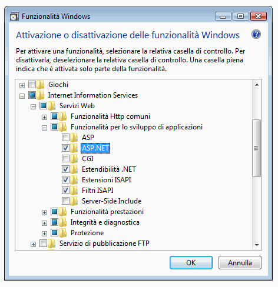

# Configurazione di Internet Information Services 7.0 per Windows Communication Foundation
Internet Information Services (IIS) 7.0 dispone di una progettazione modulare che consente di installare in modo selettivo i componenti necessari. Questa progettazione si basa sulla nuova tecnologia di componentizzazione basata su manifesti introdotta in [!INCLUDE[wv](../../../../includes/wv-md.md)]. Sono disponibili più di 40 componenti di [!INCLUDE[iisver](../../../../includes/iisver-md.md)] con funzionalità autonome, che possono essere installati in modo indipendente. I professionisti IT possono così personalizzare con facilità l'installazione in base alle esigenze. In questo argomento viene illustrato come configurare [!INCLUDE[iisver](../../../../includes/iisver-md.md)] per l'utilizzo con [!INCLUDE[indigo1](../../../../includes/indigo1-md.md)] e come determinare i componenti necessari.  
  
## Installazione minima: installazione di WAS  
 L'installazione minima dell'intero pacchetto di [!INCLUDE[iisver](../../../../includes/iisver-md.md)] prevede l'installazione del servizio Attivazione processo Windows (WAS, Windows Process Activation Service). Tale servizio è una funzionalità autonoma nonché la sola funzionalità di [!INCLUDE[iisver](../../../../includes/iisver-md.md)] disponibile per tutti i sistemi operativi [!INCLUDE[wv](../../../../includes/wv-md.md)] (Home Basic, Home Premium, Business, Ultimate ed Enterprise).  
  
 Dal Pannello di controllo, fare clic su **programmi** e quindi fare clic su **o disattivazione delle funzionalità Windows attivare** presente in **programmi e funzionalità**, il componente WAS è riportato di elenco come illustrato nella figura seguente.  
  
   
  
 Questa funzionalità presenta i sottocomponenti seguenti:  
  
-   Ambiente .NET  
  
-   API di configurazione  
  
-   Modello di processo  
  
 Se si seleziona il nodo principale di WAS, solo il **modello di processo** sottonodo è selezionata per impostazione predefinita. Si noti che con questa installazione verrà installato solo il servizio WAS poiché non è disponibile alcun supporto per un server Web.  
  
 Per rendere [!INCLUDE[indigo2](../../../../includes/indigo2-md.md)] o qualsiasi [!INCLUDE[vstecasp](../../../../includes/vstecasp-md.md)] applicazione funzioni correttamente, controllare il **ambiente .NET** casella di controllo. Questo significa che sono necessari tutti i componenti WAS per il corretto funzionamento di [!INCLUDE[indigo2](../../../../includes/indigo2-md.md)] e [!INCLUDE[vstecasp](../../../../includes/vstecasp-md.md)]. Questi verranno selezionati automaticamente una volta installati tali componenti.  
  
## IIS 7.0: installazione predefinita  
 Controllando il **Internet Information Services** funzionalità, alcuni dei nodi secondari vengono archiviate automaticamente come illustrato nella figura seguente.  
  
   
  
 Questa è l'installazione predefinita di [!INCLUDE[iisver](../../../../includes/iisver-md.md)]. Con essa è possibile utilizzare [!INCLUDE[iisver](../../../../includes/iisver-md.md)] per gestire contenuto statico (ad esempio pagine HTML e altro contenuto). Non è tuttavia possibile eseguire applicazioni [!INCLUDE[vstecasp](../../../../includes/vstecasp-md.md)] o CGI o ospitare servizi [!INCLUDE[indigo2](../../../../includes/indigo2-md.md)].  
  
## IIS 7.0: installazione con supporto ASP.NET  
 È necessario installare [!INCLUDE[vstecasp](../../../../includes/vstecasp-md.md)] perché [!INCLUDE[vstecasp](../../../../includes/vstecasp-md.md)] possa essere eseguito in IIS 7.0. Dopo aver controllato **ASP.NET**, la schermata dovrebbe essere simile alla figura seguente.  
  
   
  
 Si tratta dell'ambiente minimo per il funzionamento delle applicazioni [!INCLUDE[indigo2](../../../../includes/indigo2-md.md)] e [!INCLUDE[vstecasp](../../../../includes/vstecasp-md.md)] in [!INCLUDE[iisver](../../../../includes/iisver-md.md)].  
  
## IIS 7.0: installazione con componenti compatibilità gestione IIS 6.0  
 Quando si installa [!INCLUDE[iisver](../../../../includes/iisver-md.md)] in un sistema con Visual Studio 2005 o di un altro script di automazione o strumenti (ad esempio Adsutil.vbs) che consentono di configurare le applicazioni virtuali che utilizzano [!INCLUDE[iis601](../../../../includes/iis601-md.md)] Metabase API, accertarsi di aver letto la [!INCLUDE[iis601](../../../../includes/iis601-md.md)]  **Gli strumenti di scripting**. Verifica automaticamente gli altri nodi secondari del [!INCLUDE[iis601](../../../../includes/iis601-md.md)] **compatibilità di gestione**. Nell'illustrazione seguente viene mostrata la schermata visualizzata dopo l'esecuzione di questa operazione.  
  
   
  
 Con questa installazione si ottiene la disponibilità di tutto quanto necessario per utilizzare le funzionalità [!INCLUDE[iisver](../../../../includes/iisver-md.md)],[!INCLUDE[vstecasp](../../../../includes/vstecasp-md.md)] e [!INCLUDE[indigo2](../../../../includes/indigo2-md.md)] e i relativi esempi sul Web.  
  
## Limiti di richiesta.  
 In [!INCLUDE[wv](../../../../includes/wv-md.md)] con IIS 7 il valore predefinito delle impostazioni `maxUri` e `maxQueryStringSize` è stato modificato. Per impostazione predefinita, il filtro di richiesta in IIS 7.0 consente una lunghezza dell'URL di 4096 caratteri e una lunghezza della stringa di query di 2048 caratteri. Per modificare questi valori predefiniti, aggiungere il codice XML seguente al file App.config:  
  
 `<system.webServer>`  
  
 `<security>`  
  
 `<requestFiltering>`  
  
 `<requestLimits maxUrl="8192" maxQueryString="8192" />`  
  
 `</requestFiltering>`  
  
 `</security>`  
  
 `</system.webServer>`  
  
## Vedere anche  
 [Architettura di attivazione di WAS](../../../../docs/framework/wcf/feature-details/was-activation-architecture.md)  
 [Configurazione di WAS per l'uso con WCF](../../../../docs/framework/wcf/feature-details/configuring-the-wpa--service-for-use-with-wcf.md)  
 [Procedura: Installare e configurare componenti di attivazione WCF](../../../../docs/framework/wcf/feature-details/how-to-install-and-configure-wcf-activation-components.md)  
 [Windows Server AppFabric con funzionalità di Hosting](http://go.microsoft.com/fwlink/?LinkId=201276)
