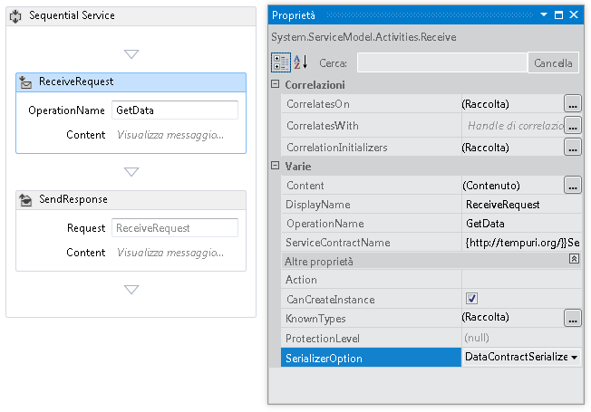
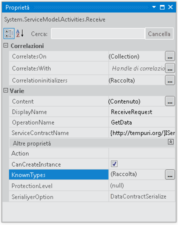

# <a name="configuring-serialization-in-a-workflow-service"></a>Configurazione della serializzazione in un servizio del flusso di lavoro
I servizi del flusso di lavoro sono servizi [!INCLUDE[indigo1](../../../../includes/indigo1-md.md)] che quindi dispongono della facoltà di utilizzare <xref:System.Runtime.Serialization.DataContractSerializer> (impostazione predefinita) o <xref:System.Xml.Serialization.XmlSerializer>. Durante la scrittura dei servizi non del flusso di lavoro, il tipo di serializzatore da utilizzare viene specificato nel contratto del servizio o dell'operazione. Quando si creano servizi di flusso di lavoro di [!INCLUDE[indigo2](../../../../includes/indigo2-md.md)], non si specificano questi contratti nel codice, piuttosto si generano durante il runtime dall'inferenza del contratto. Per ulteriori informazioni sull'inferenza del contratto, vedere [uso di contratti nel flusso di lavoro](../../../../docs/framework/wcf/feature-details/using-contracts-in-workflow.md).  Il serializzatore viene specificato tramite la proprietà <xref:System.ServiceModel.Activities.Receive.SerializerOption%2A> che può essere impostata come mostrato nella finestra di progettazione nell'illustrazione seguente.  
  
   
  
 Il serializzatore può essere impostato anche nel codice, come mostrato nell'esempio seguente.  
  
```  
Receive approveExpense = new Receive  
            {  
                OperationName = "ApproveExpense",  
                CanCreateInstance = true,  
                ServiceContractName = "FinanceService",  
                SerializerOption = SerializerOption.DataContractSerializer,  
                Content = ReceiveContent.Create(new OutArgument<Expense>(expense))  
            };  
```  
  
 È possibile specificare tipi noti anche sui servizi del flusso di lavoro. Per ulteriori informazioni sui tipi noti, vedere [tipi conosciuti di contratto dati](../../../../docs/framework/wcf/feature-details/data-contract-known-types.md). È possibile specificare i tipi noti nella finestra di progettazione o nel codice. Per specificare i tipi noti nella finestra di progettazione, fare clic sul pulsante con i puntini di sospensione accanto alla proprietà KnownTypes nella finestra delle proprietà per un'attività <xref:System.ServiceModel.Activities.Receive>, come mostrato nell'illustrazione seguente.  
  
   
  
 Viene visualizzato l'Editor della raccolta di tipi che consente di cercare e specificare i tipi noti.  
  
   
  
 Fare clic su di **aggiungere nuovo tipo** collegamento e utilizzare il menu a discesa per selezionare o cercare un tipo da aggiungere alla raccolta di tipi noti. Per specificare i tipi noti nel codice, utilizzare la proprietà <xref:System.ServiceModel.Activities.Receive.KnownTypes%2A>, come mostrato nell'esempio riportato di seguito.  
  
```  
Receive approveExpense = new Receive  
            {  
                OperationName = "ApproveExpense",  
                CanCreateInstance = true,  
                ServiceContractName = "FinanceService",  
                SerializerOption = SerializerOption.DataContractSerializer,  
                Content = ReceiveContent.Create(new OutArgument<Expense>(expense))  
            };  
            approveExpense.KnownTypes.Add(typeof(Travel));  
            approveExpense.KnownTypes.Add(typeof(Meal));  
```  
  
 Per vedere un esempio di codice completo che illustra come configurare la serializzazione di un servizio flusso di lavoro [formattazione di messaggi nei servizi flusso di lavoro](../../../../docs/framework/windows-workflow-foundation/samples/formatting-messages-in-workflow-services.md).
