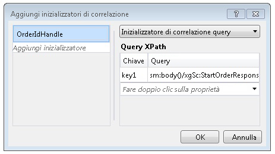

# Correlazione basata sul contenuto
Quando i servizi flusso di lavoro comunicano con client e altri servizi, sono spesso presenti alcuni dati nei messaggi scambiati che correlano in modo univoco un messaggio a una particolare istanza.  La correlazione basata sul contenuto usa questi dati nel messaggio, ad esempio un numero cliente o un ID dell'ordine, per indirizzare messaggi all'istanza del flusso di lavoro appropriata.  In questo argomento viene illustrato come usare la correlazione basata sul contenuto nei flussi di lavoro.  
  
## Utilizzo della correlazione basata sul contenuto  
 La correlazione basata sul contenuto viene usata se un servizio flusso di lavoro dispone di più metodi a cui viene eseguito l'accesso da parte di un solo client e una parte dei dati nei messaggi scambiati identifica l'istanza desiderata.  
  
> [!NOTE]
>  La correlazione basata sul contenuto risulta utile se non è possibile usare la correlazione del contesto in quanto l'associazione non rientra tra quelle di scambio del contesto supportate.  [!INCLUDE[crabout](../../../../includes/crabout-md.md)]lla correlazione del contesto, vedere [Scambio del contesto](../../../../docs/framework/wcf/feature-details/context-exchange-correlation.md).  
  
 Ogni attività di messaggistica usata in queste comunicazioni deve specificare il percorso dei dati nel messaggio che identificano in modo univoco l'istanza.  A tale scopo viene fornito un elemento <xref:System.ServiceModel.MessageQuerySet>, che usa un elemento <xref:System.ServiceModel.Activities.QueryCorrelationInitializer> o <xref:System.ServiceModel.Activities.Receive.CorrelatesOn%2A>, che esegue una query nel messaggio per una o più parti di dati che identificano in modo univoco l'istanza.  
  
> [!WARNING]
>  Per i dati usati per l'identificazione dell'istanza viene generato un hash in una chiave di correlazione.  È necessario verificare che i dati usati per la correlazione siano univoci. In caso contrario si potrebbero verificare conflitti nella chiave con hash e i messaggi potrebbero essere indirizzati in modo errato.  Una correlazione basata esclusivamente su un nome di cliente può ad esempio generare un conflitto, poiché possono esistere più clienti con lo stesso nome.  Non usare i due punti \(`:`\) come parte dei dati per correlare il messaggio, poiché vengono già usati per delimitare il valore e la chiave della query del messaggio per formattare la stringa per la quale verrà generato un hash.  
  
 Nell'esempio seguente, l'elemento <xref:System.ServiceModel.Activities.Receive>\/<xref:System.ServiceModel.Activities.SendReply> iniziale in un servizio flusso di lavoro restituisce un elemento`OrderId` che viene quindi passato nuovamente dal client sulla chiamata all'attività <xref:System.ServiceModel.Activities.Receive> seguente nel servizio flusso di lavoro.  
  
 [!code-csharp[CFX_ContentCorrelation#1](../../../../samples/snippets/csharp/VS_Snippets_CFX/cfx_contentcorrelation/cs/program.cs#1)]  
  
 Nell'esempio precedente viene mostrata una correlazione basata sul contenuto inizializzata da <xref:System.ServiceModel.Activities.SendReply>.  <xref:System.ServiceModel.MessageQuerySet> specifica che i dati usati per identificare i messaggi successivi a questo servizio sono di tipo `OrderId`.  
  
 [!code-csharp[CFX_ContentCorrelation#2](../../../../samples/snippets/csharp/VS_Snippets_CFX/cfx_contentcorrelation/cs/program.cs#2)]  
  
 L'attività <xref:System.ServiceModel.Activities.Receive> che successiva a <xref:System.ServiceModel.Activities.SendReply> nel flusso di lavoro segue la correlazione inizializzata da <xref:System.ServiceModel.Activities.SendReply>.  Entrambe le attività condividono lo stesso elemento <xref:System.ServiceModel.Activities.CorrelationHandle>, ma ognuna dispone di specifici elementi <xref:System.ServiceModel.MessageQuerySet> e <xref:System.ServiceModel.XPathMessageQuery> che indicano la posizione all'interno del messaggio in cui si trovano i dati di identificazione.  Nell'attività che inizializza la correlazione, questo elemento <xref:System.ServiceModel.MessageQuerySet> viene specificato nella proprietà <xref:System.ServiceModel.Activities.Receive.CorrelationInitializers%2A> e, per qualsiasi attività <xref:System.ServiceModel.Activities.Receive> successiva, mediante la proprietà <xref:System.ServiceModel.Activities.Receive.CorrelatesOn%2A>.  
  
 [!code-csharp[CFX_ContentCorrelation#3](../../../../samples/snippets/csharp/VS_Snippets_CFX/cfx_contentcorrelation/cs/program.cs#3)]  
  
 Una correlazione basata sul contenuto può essere inizializzata da qualsiasi attività di messaggistica \(<xref:System.ServiceModel.Activities.Send>, <xref:System.ServiceModel.Activities.Receive>, <xref:System.ServiceModel.Activities.SendReply>, <xref:System.ServiceModel.Activities.ReceiveReply>\) quando i dati vengono propagati come parte di un messaggio.  Se questa parte di dati non viene propagata come parte di un messaggio, è possibile inizializzarla in modo esplicito tramite l'attività <xref:System.ServiceModel.Activities.InitializeCorrelation>.  Se sono necessarie più parti di dati per identificare in modo univoco il messaggio, è possibile aggiungere più query a <xref:System.ServiceModel.MessageQuerySet>.  In questi esempi è stato fornito in modo esplicito un elemento <xref:System.ServiceModel.Activities.CorrelationHandle> a ogni attività che usa le proprietà `CorrelatesWith` o `CorrelationHandle`, ma se è necessaria una sola correlazione per l'intero flusso di lavoro intero, come in questo caso, in cui tutti gli elementi vengono correlati in `OrderId`, è sufficiente la gestione dell'handle di correlazione implicita fornita da <xref:System.ServiceModel.Activities.WorkflowServiceHost>.  
  
## Utilizzo dell'attività InitializeCorrelation  
 Nell'esempio precedente l'elemento `OrderId` è stato propagato al chiamante tramite l'attività <xref:System.ServiceModel.Activities.SendReply> e la correlazione è stata inizializzata in questo punto.  È possibile ottenere lo stesso comportamento usando l'attività <xref:System.ServiceModel.Activities.InitializeCorrelation>.  L'attività <xref:System.ServiceModel.Activities.InitializeCorrelation> usa l'elemento <xref:System.ServiceModel.Activities.CorrelationHandle> e un dizionario di elementi che rappresentano i dati usati per eseguire il mapping del messaggio all'istanza corretta.  Per usare l'attività <xref:System.ServiceModel.Activities.InitializeCorrelation> nell'esempio precedente, rimuovere <xref:System.ServiceModel.Activities.SendReply.CorrelationInitializers%2A> dall'attività <xref:System.ServiceModel.Activities.SendReply> e inizializzare la correlazione usando l'attività <xref:System.ServiceModel.Activities.InitializeCorrelation>.  
  
 [!code-csharp[CFX_ContentCorrelation#4](../../../../samples/snippets/csharp/VS_Snippets_CFX/cfx_contentcorrelation/cs/program.cs#4)]  
  
 L'attività <xref:System.ServiceModel.Activities.InitializeCorrelation> viene quindi usata nel flusso di lavoro, dopo il popolamento delle variabili contenenti i dati ma prima dell'attività <xref:System.ServiceModel.Activities.Receive> correlata all'elemento <xref:System.ServiceModel.Activities.CorrelationHandle> inizializzato.  
  
 [!code-csharp[CFX_ContentCorrelation#5](../../../../samples/snippets/csharp/VS_Snippets_CFX/cfx_contentcorrelation/cs/program.cs#5)]  
  
## Configurazione di query XPath mediante Progettazione flussi di lavoro  
 Negli esempi precedenti le attività e le query XPath usate nelle query del messaggio sono state specificate nel codice.  Progettazione flussi di lavoro in [!INCLUDE[vs_current_long](../../../../includes/vs-current-long-md.md)] fornisce inoltre la possibilità di generare query XPath dai tipi `DataContract` per la correlazione basata sul contenuto.  La prima query XPath nell'esempio precedente è stata configurata per <xref:System.ServiceModel.Activities.SendReply>.  
  
 [!code-csharp[CFX_ContentCorrelation#2](../../../../samples/snippets/csharp/VS_Snippets_CFX/cfx_contentcorrelation/cs/program.cs#2)]  
  
 Per configurare la query XPath per un'attività di messaggistica in Progettazione flussi di lavoro, selezionare l'attività all'interno dell'utilità.  Se l'attività è in fase di inizializzazione della correlazione, come nell'esempio precedente, fare clic sul pulsante con i puntini di sospensione per la proprietà **CorrelationInitializers** nella finestra **Proprietà**.  Viene visualizzata la finestra di dialogo **Aggiungi inizializzatori di correlazione**.  Da questa finestra di dialogo è possibile specificare il tipo di correlazione e selezionare il contenuto usato per la correlazione.  La variabile <xref:System.ServiceModel.Activities.CorrelationHandle> viene specificata nella casella **Aggiungi inizializzatore** e il tipo di correlazione e dati usati per la correlazione vengono selezionati nella sezione **Query XPath** della finestra di dialogo.  
  
   
  
 La seconda query XPath nell'esempio precedente è stata configurata nell'attività <xref:System.ServiceModel.Activities.Receive>.  
  
 [!code-csharp[CFX_ContentCorrelation#3](../../../../samples/snippets/csharp/VS_Snippets_CFX/cfx_contentcorrelation/cs/program.cs#3)]  
  
 Per configurare la query XPath per un'attività di messaggistica che non inizializza la correlazione, selezionare l'attività in Progettazione flussi di lavoro, quindi fare clic sul pulsante con i puntini di sospensione per la proprietà **CorrelatesOn** nella finestra **Proprietà**.  Viene visualizzata la finestra di dialogo **Definizione di CorrelatesOn**.  
  
   
  
 Da questa finestra di dialogo è possibile specificare <xref:System.ServiceModel.Activities.CorrelationHandle> e sceglie elementi nell'elenco **Query XPath** per compilare la query XPath.