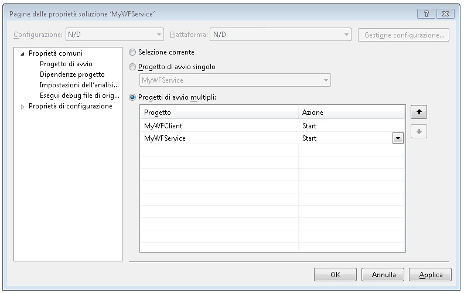

# Procedura: accesso a un servizio da un'applicazione flusso di lavoro
In questo argomento viene descritto come chiamare un servizio flusso di lavoro da un'applicazione console del flusso di lavoro. Dipende dal completamento del [procedura: creare un servizio flusso di lavoro con attività di messaggistica](../../../../docs/framework/wcf/feature-details/how-to-create-a-workflow-service-with-messaging-activities.md) argomento. Sebbene in questo argomento viene descritto come chiamare un servizio flusso di lavoro da un'applicazione flusso di lavoro, è possono utilizzare gli stessi metodi per chiamare qualsiasi servizio di Windows Communication Foundation (WCF) da un'applicazione flusso di lavoro.  
  
### Creare un progetto di applicazione console del flusso di lavoro  
  
1.  Avviare [!INCLUDE[vs_current_long](../../../../includes/vs-current-long-md.md)].  
  
2.  Caricare il progetto MyWFService è stato creato nel [procedura: creare un servizio flusso di lavoro con attività di messaggistica](../../../../docs/framework/wcf/feature-details/how-to-create-a-workflow-service-with-messaging-activities.md) argomento.  
  
3.  Fare clic destro la **MyWFService** soluzione nel **Esplora soluzioni** e selezionare **Aggiungi**, **nuovo progetto**. Selezionare **flusso di lavoro** nel **modelli installati** e **applicazione Console flusso di lavoro** dall'elenco dei tipi di progetto. Assegnare al progetto il nome MyWFClient e utilizzare il percorso predefinito, come illustrato nella figura seguente.  
  
       
  
     Fare clic su di **OK** per chiudere la **aggiungere finestra Nuovo progetto**.  
  
4.  Una volta creato il progetto, nella finestra di progettazione verrà aperto il file Workflow1.xaml. Fare clic su di **della casella degli strumenti** tab per aprire la casella degli strumenti se non è già aprire e fare clic sulla puntina da disegno per mantenere aperta la finestra Casella degli strumenti.  
  
5.  Premere CTRL+F5 per compilare e avviare il servizio. Come in precedenza, viene avviato il server di sviluppo ASP.NET e in Internet Explorer viene visualizzata la pagina della Guida relativa a WCF. Tenere presente l'URI di questa pagina, in quanto sarà necessario utilizzarlo nel passaggio successivo.  
  
       
  
6.  Fare clic destro la **MyWFClient** nel progetto il **Esplora soluzioni** e selezionare **Aggiungi riferimento al servizio**. Fare clic su di **Discover** pulsante per la ricerca di tutti i servizi nella soluzione corrente. Fare clic sul triangolo accanto a Service1.xamlx nell'elenco dei servizi. Fare clic sul triangolo accanto a Service1 per elencare i contratti implementati dal servizio Service1. Espandere il **Service1** nodo il **servizi** elenco. L'operazione Echo viene visualizzata nel **operazioni** elenco come illustrato nella figura seguente.  
  
       
  
     Mantenere lo spazio dei nomi predefinito e fare clic su **OK** per chiudere la **Aggiungi riferimento al servizio** finestra di dialogo. Verrà visualizzata la finestra di dialogo indicata di seguito.  
  
       
  
     Fare clic su **OK** per chiudere la finestra di dialogo. Premere quindi CTRL+MAIUSC+B per compilare la soluzione. Si noti che in casella degli strumenti è stata aggiunta una nuova sezione denominata **MyWFClient.ServiceReference1.Activities**. Espandere questa sezione e notare l'attività Eco aggiunta, come illustrato nella figura seguente.  
  
       
  
7.  Trascinare e rilasciare un <!--zz <xref:System.ServiceModel.Activities.Sequence>--> `System.ServiceModel.Activities.Sequence` attività nell'area di progettazione. Si trova sotto il **flusso di controllo** sezione della casella degli strumenti.  
  
8.  Con il <!--zz <xref:System.ServiceModel.Activities.Sequence>--> `System.ServiceModel.Activities.Sequence` fare clic su attività in stato attivo, il **variabili** collegamento e aggiungere una variabile di stringa denominata `inString`. Assegnare alla variabile un valore predefinito di `"Hello, world"` nonché una variabile di stringa denominata `outString` come illustrato nel diagramma seguente.  
  
       
  
9. Trascinare e rilasciare un **Echo** attività di <!--zz <xref:System.ServiceModel.Activities.Sequence>--> `System.ServiceModel.Activities.Sequence`. Associare nella finestra delle proprietà di `inMsg` argomento per il `inString` variabile e `outMsg` argomento per il `outString` variabile, come illustrato nella figura seguente. Viene passato il valore della variabile `inString` all'operazione e quindi il valore restituito si inserisce nella variabile `outString`.  
  
       
  
10. Trascinare e rilasciare un **WriteLine** attività sotto la **Echo** attività per visualizzare la stringa restituita dalla chiamata del servizio. Il **WriteLine** attività si trova nella **primitive** nodo nella casella degli strumenti. Associare il **testo** argomento del **WriteLine** attività per il `outString` variabile digitando `outString` nella casella di testo nel **WriteLine** attività. Il flusso di lavoro viene ora visualizzato come illustrato nella figura seguente.  
  
       
  
11. Pulsante destro del mouse sulla soluzione MyWFService e selezionare **Imposta progetti di avvio...** . Selezionare il **più progetti di avvio** pulsante di opzione e selezionare **avviare** per ogni progetto di **azione** colonna come illustrato nella figura seguente.  
  
       
  
12. Premere CTRL+F5 per avviare il servizio e il client. Il Server di sviluppo ASP.NET ospita il servizio, Internet Explorer visualizza la pagina della Guida WCF e l'applicazione del flusso di lavoro client viene avviata in una finestra della console e Visualizza la stringa restituita dal servizio ("Hello, world").  
  
## Vedere anche  
 [Servizi flusso di lavoro](../../../../docs/framework/wcf/feature-details/workflow-services.md)  
 [Procedura: Creare un servizio flusso di lavoro con attività di messaggistica](../../../../docs/framework/wcf/feature-details/how-to-create-a-workflow-service-with-messaging-activities.md)  
 [Utilizzo di un servizio WCF da un flusso di lavoro in un progetto Web](http://go.microsoft.com/fwlink/?LinkId=207725)
