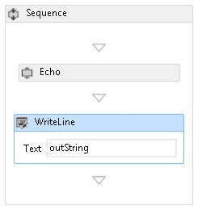

# Procedura: accesso a un servizio da un'applicazione flusso di lavoro
In questo argomento viene descritto come chiamare un servizio flusso di lavoro da un'applicazione console del flusso di lavoro. Dipende dal completamento dei [procedura: creare un servizio del flusso di lavoro con attività di messaggistica](../../../../docs/framework/wcf/feature-details/how-to-create-a-workflow-service-with-messaging-activities.md) argomento. Sebbene in questo argomento viene descritto come chiamare un servizio del flusso di lavoro da un'applicazione flusso di lavoro, gli stessi metodi sono utilizzabile per chiamare qualsiasi servizio Windows Communication Foundation (WCF) da un'applicazione flusso di lavoro.

### Creare un progetto di applicazione console del flusso di lavoro

1.  Avviare [!INCLUDE[vs_current_long](../../../../includes/vs-current-long-md.md)].

2.  Caricare il progetto MyWFService creato nel [procedura: creare un servizio del flusso di lavoro con attività di messaggistica](../../../../docs/framework/wcf/feature-details/how-to-create-a-workflow-service-with-messaging-activities.md) argomento.

3.  Fare clic il **MyWFService** soluzione nel **Esplora soluzioni** e selezionare **Add**, **nuovo progetto**. Selezionare **flusso di lavoro** nel **modelli installati** e **applicazione Console flusso di lavoro** dall'elenco dei tipi di progetto. Assegnare al progetto il nome MyWFClient e utilizzare il percorso predefinito, come illustrato nella figura seguente.

     

     Scegliere il **OK** per chiudere la **finestra Aggiungi nuovo progetto**.

4.  Una volta creato il progetto, nella finestra di progettazione verrà aperto il file Workflow1.xaml. Scegliere il **casella degli strumenti** pressione di tab per aprire la casella degli strumenti se non è già aprire e fare clic sulla puntina da disegno per mantenere aperta la finestra Casella degli strumenti.

5.  Premere **Ctrl**+**F5** per compilare e avviare il servizio. Come in precedenza, viene avviato il server di sviluppo ASP.NET e in Internet Explorer viene visualizzata la pagina della Guida relativa a WCF. Tenere presente l'URI di questa pagina, in quanto sarà necessario utilizzarlo nel passaggio successivo.

     

6.  Fare clic il **MyWFClient** del progetto nel **Esplora soluzioni** e selezionare **Add** > **riferimento al servizio**. Scegliere il **Discover** pulsante per la soluzione corrente per tutti i servizi di ricerca. Fare clic sul triangolo accanto a Service1.xamlx nell'elenco dei servizi. Fare clic sul triangolo accanto a Service1 per elencare i contratti implementati dal servizio Service1. Espandere la **Service1** nodo il **Services** elenco. L'operazione Echo viene visualizzato nei **operazioni** elenco come illustrato nella figura seguente.

     

     Mantenere lo spazio dei nomi predefinito e fare clic su **OK** per chiudere la **Aggiungi riferimento al servizio** finestra di dialogo. Verrà visualizzata la finestra di dialogo indicata di seguito.

     

     Fare clic su **OK** per chiudere la finestra di dialogo. Premere quindi CTRL+MAIUSC+B per compilare la soluzione. Si noti che nella casella degli strumenti è stata aggiunta una nuova sezione denominata **MyWFClient.ServiceReference1.Activities**. Espandere questa sezione e notare l'attività Eco aggiunta, come illustrato nella figura seguente.

     

7.  Trascinare e rilasciare un <!--zz <xref:System.ServiceModel.Activities.Sequence>--> `System.ServiceModel.Activities.Sequence` attività nell'area di progettazione. È sotto la **flusso di controllo** sezione della casella degli strumenti.

8.  Con il <!--zz <xref:System.ServiceModel.Activities.Sequence>--> `System.ServiceModel.Activities.Sequence` attività in stato attivo, fare clic sui **variabili** collegamento e aggiungere una variabile stringa denominata `inString`. Assegnare alla variabile un valore predefinito pari `"Hello, world"` oltre a una variabile stringa denominata `outString` come illustrato nel diagramma seguente.

     

9. Trascinare e rilasciare un' **Echo** attività le <!--zz <xref:System.ServiceModel.Activities.Sequence>--> `System.ServiceModel.Activities.Sequence`. Nella finestra Proprietà associare il `inMsg` argomento per il `inString` variabile e il `outMsg` argomento per il `outString` variabile, come illustrato nella figura seguente. Viene passato il valore della variabile `inString` all'operazione e quindi il valore restituito si inserisce nella variabile `outString`.

     

10. Trascinare e rilasciare un **WriteLine** attività sotto il **Echo** attività per visualizzare la stringa restituita dalla chiamata del servizio. Il **WriteLine** attività si trova nel **primitive** nodo nella casella degli strumenti. Associare il **testo** argomento delle **WriteLine** attività per il `outString` variabile digitando `outString` nella casella di testo il **WriteLine** attività. Il flusso di lavoro viene ora visualizzato come illustrato nella figura seguente.

     

11. Pulsante destro del mouse sulla soluzione MyWFService e scegliere **Imposta progetti di avvio...** . Selezionare il **progetti di avvio multipli** pulsante di opzione e selezionare **avviare** per ogni progetto nella **azione** colonna come illustrato nella figura seguente.

     

12. Premere CTRL+F5 per avviare il servizio e il client. Il Server di sviluppo ASP.NET ospita il servizio, Internet Explorer viene visualizzata la pagina della Guida WCF e l'applicazione workflow client viene avviato in una finestra della console e Visualizza la stringa restituita dal servizio ("Hello, world").

## Vedere anche

- [Servizi flusso di lavoro](../../../../docs/framework/wcf/feature-details/workflow-services.md)
- [Procedura: Creare un servizio flusso di lavoro con attività di messaggistica](../../../../docs/framework/wcf/feature-details/how-to-create-a-workflow-service-with-messaging-activities.md)
- [Utilizzo di un servizio WCF da un flusso di lavoro in un progetto Web](https://go.microsoft.com/fwlink/?LinkId=207725)