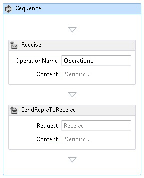
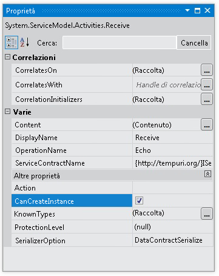
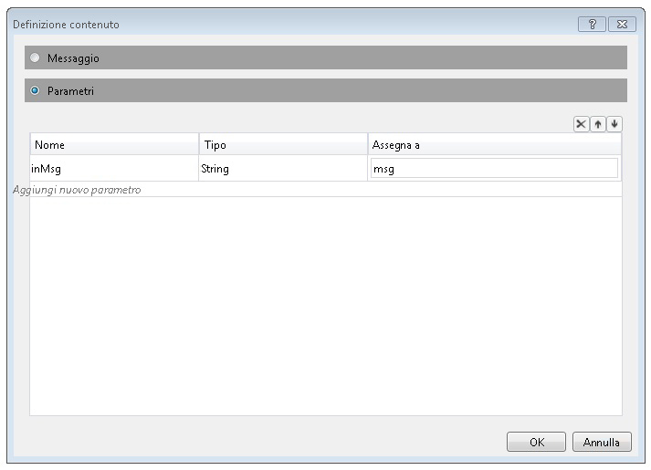
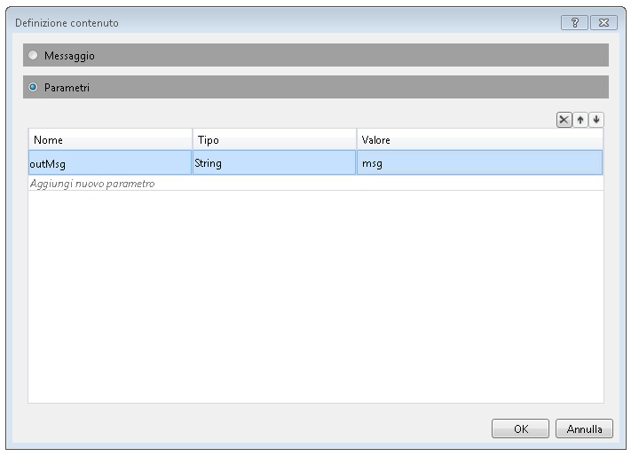
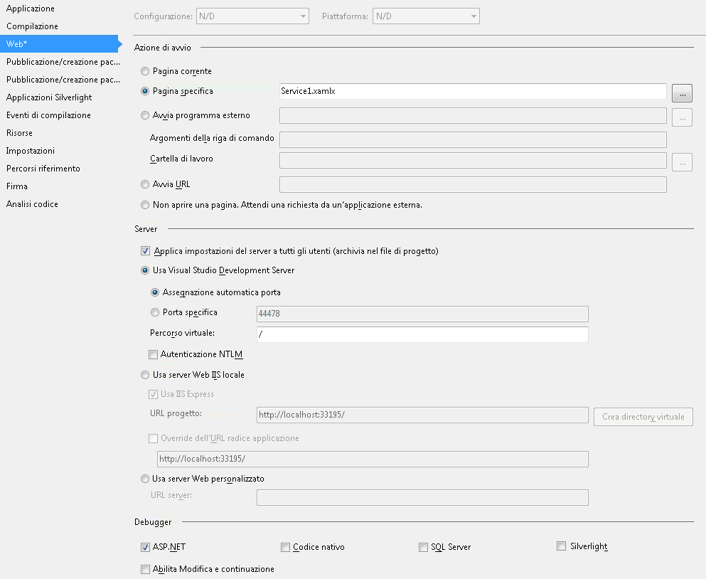

# Procedura: creare un servizio flusso di lavoro con attività di messaggistica
In questo argomento viene illustrato come creare un semplice servizio flusso di lavoro usando le attività di messaggistica. L'argomento è incentrato sui meccanismi di creazione di un servizio flusso di lavoro in cui il servizio è costituito esclusivamente da attività di messaggistica. In servizi reali i flussi di lavoro contengono molte altre attività. Il servizio implementa un'operazione denominata Echo che acquisisce una stringa e la restituisce al chiamante. Questo è il primo di una serie di due argomenti. L'argomento successivo [procedura: accedere a un servizio da un flusso di lavoro applicazione](../../../../docs/framework/wcf/feature-details/how-to-access-a-service-from-a-workflow-application.md) viene illustrato come creare un'applicazione flusso di lavoro che è possibile chiamare il servizio creato in questo argomento.  
  
### Per creare un progetto di servizio flusso di lavoro  
  
1.  Avviare [!INCLUDE[vs_current_long](../../../../includes/vs-current-long-md.md)].  
  
2.  Fare clic su di **File** dal menu **New**e quindi **progetto** per visualizzare il **finestra di dialogo Nuovo progetto**. Selezionare **flusso di lavoro** dall'elenco dei modelli installati e **applicazione del servizio del flusso di lavoro WCF** dall'elenco dei tipi di progetto. Denominare il progetto `MyWFService` e utilizzare il percorso predefinito, come illustrato nella figura seguente.  
  
     Fare clic su di **OK** per chiudere la **finestra di dialogo Nuovo progetto**.  
  
3.  Una volta creato il progetto, nella finestra di progettazione verrà aperto il file Service1.xamlx, come illustrato nella figura seguente.  
  
       
  
     Fare doppio clic su attività con etichettata **servizio sequenziale** e selezionare **eliminare**.  
  
### Per implementare il servizio flusso di lavoro  
  
1.  Selezionare il **della casella degli strumenti** scheda sul lato sinistro della schermata per visualizzare la casella e fare clic sulla puntina da disegno per mantenere aperta la finestra. Espandere il **messaggistica** sezione della casella degli strumenti per visualizzare le attività di messaggistica e i modelli di attività di messaggistica, come illustrato nella figura seguente.  
  
       
  
2.  Trascinare e rilasciare un **ReceiveAndSendReply** modello alla finestra di progettazione del flusso di lavoro. Crea un <!--zz <xref:System.ServiceModel.Activities.Sequence>--> `System.ServiceModel.Activities.Sequence` attività con un **ricezione** seguita da un <xref:System.ServiceModel.Activities.SendReply> attività, come illustrato nella figura seguente.  
  
       
  
     La proprietà <xref:System.ServiceModel.Activities.SendReply> dell'attività <xref:System.ServiceModel.Activities.SendReply.Request%2A> è impostata su `Receive`, il nome dell'attività <xref:System.ServiceModel.Activities.Receive> a cui risponde l'attività <xref:System.ServiceModel.Activities.SendReply>.  
  
3.  Nel <xref:System.ServiceModel.Activities.Receive> tipo di attività `Echo` nella casella di testo con etichettata **OperationName**. In questo modo viene definito il nome dell'operazione implementata dal servizio.  
  
       
  
4.  Con il <xref:System.ServiceModel.Activities.Receive> attività selezionata, aprire la finestra proprietà se non è già aperta, scegliendo la **vista** menu e selezionando **finestra proprietà**. Nel **finestra proprietà** scorrere verso il basso fino a visualizzare **CanCreateInstance** e selezionare la casella di controllo, come illustrato nella figura seguente. Questa impostazione consente all'host del servizio flusso di lavoro di creare, se necessario, una nuova istanza del servizio dopo la ricezione di un messaggio.  
  
       
  
5.  Selezionare il <!--zz <xref:System.ServiceModel.Activities.Sequence>--> `System.ServiceModel.Activities.Sequence` attività e fare clic su di **variabili** pulsante nell'angolo inferiore sinistro della finestra di progettazione. Verrà visualizzato l'editor delle variabili. Fare clic su di **Crea variabile** collegamento per aggiungere una variabile per archiviare la stringa inviata per l'operazione. Denominare la variabile `msg` e impostare il relativo **variabile** tipo stringa, come illustrato nella figura seguente.  
  
       
  
     Fare clic su di **variabili** pulsante per chiudere l'editor delle variabili.  
  
6.  Fare clic su di **definire...** collegare il **contenuto** casella di testo nel <xref:System.ServiceModel.Activities.Receive> attività per visualizzare il **definizione contenuto** finestra di dialogo. Selezionare il **parametri** pulsante di opzione, fare clic su di **aggiungere nuovo parametro** collegare, digitare `inMsg` nel **nome** casella di testo, seleziona **stringa**nel **tipo** elenco a discesa, casella di riepilogo e tipo `msg` nel **assegna a** casella di testo, come illustrato nella figura seguente.  
  
       
  
     In questo modo viene specificato che l'attività Receive riceve il parametro stringa e che i dati sono associati alla variabile `msg`. Fare clic su **OK** per chiudere la **definizione contenuto** finestra di dialogo.  
  
7.  Fare clic su di **definire...**  sul collegamento nella **contenuto** casella il <xref:System.ServiceModel.Activities.SendReply> attività per visualizzare il **definizione contenuto** finestra di dialogo. Selezionare il **parametri** pulsante di opzione, fare clic su di **aggiungere nuovo parametro** collegare, digitare `outMsg` nel **nome** casella di testo, seleziona **stringa**nel **tipo** elenco a discesa e `msg` nel **valore** casella di testo, come illustrato nella figura seguente.  
  
       
  
     In questo modo viene specificato che l'attività <xref:System.ServiceModel.Activities.SendReply> invia un messaggio o un tipo di contratto messaggio e che i dati sono associati alla variabile `msg`. Poiché si tratta di un'attività <xref:System.ServiceModel.Activities.SendReply>, i dati in `msg` vengono usati per popolare il messaggio inviato in risposta al client da parte dell'attività. Fare clic su **OK** per chiudere la **definizione contenuto** finestra di dialogo.  
  
8.  Salvare e compilare la soluzione scegliendo il **compilare** menu e selezionando **Compila soluzione**.  
  
## Configurare il progetto di servizio flusso di lavoro  
 Il servizio flusso di lavoro è completo. Contenuto della sezione viene illustrato come configurare la soluzione del servizio flusso di lavoro per agevolarne l'hosting e l'esecuzione. Questa soluzione usa il server di sviluppo ASP.NET per ospitare il servizio.  
  
#### Per impostare le opzioni di avvio del progetto  
  
1.  Nel **Esplora**, fare doppio clic su **MyWFService** e selezionare **proprietà** per visualizzare il **le proprietà del progetto** finestra di dialogo.  
  
2.  Selezionare il **Web** e selezionare **pagina specifica** in **azione di avvio** e tipo `Service1.xamlx` nella casella di testo, come illustrato nella figura seguente.  
  
       
  
     In questo modo, il servizio definito in Service1.xamlx viene ospitato nel server di sviluppo ASP.NET.  
  
3.  Premere CTRL+F5 per avviare il servizio. L'icona del server di sviluppo ASP.NET verrà visualizzata nel lato inferiore destro del desktop, come illustrato nella figura seguente.  
  
       
  
     In Internet Explorer verrà inoltre visualizzata la pagina della Guida del servizio WCF relativa al servizio.  
  
       
  
4.  Continuare con la [procedura: accedere a un servizio da un flusso di lavoro applicazione](../../../../docs/framework/wcf/feature-details/how-to-access-a-service-from-a-workflow-application.md) argomento per creare un client del flusso di lavoro che chiama il servizio.  
  
## Vedere anche  
 [Servizi flusso di lavoro](../../../../docs/framework/wcf/feature-details/workflow-services.md)  
 [Cenni preliminari sui servizi di hosting del flusso di lavoro](../../../../docs/framework/wcf/feature-details/hosting-workflow-services-overview.md)  
 [Attività di messaggistica](../../../../docs/framework/wcf/feature-details/messaging-activities.md)
