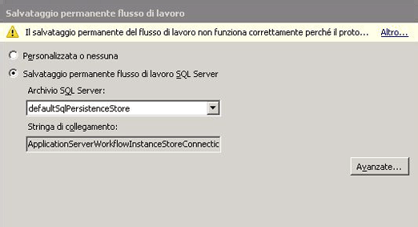
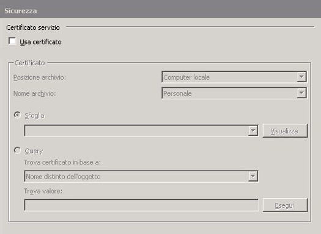
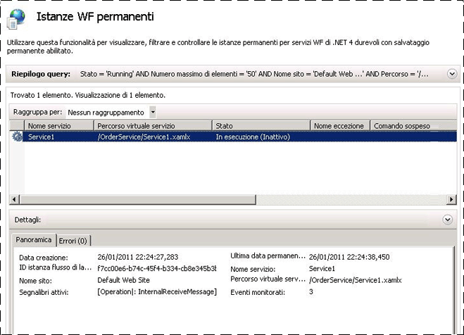

# Procedura: ospitare un servizio flusso di lavoro con Windows Server AppFabric
L'hosting di servizi di flusso di lavoro in AppFabric è simile all'hosting in IIS/WAS. L'unica differenza consiste nel fatto che tramite gli strumenti di AppFabric sono garantiti la distribuzione, il monitoraggio e la gestione dei servizi di flusso di lavoro. Questo argomento viene utilizzato il servizio del flusso di lavoro creato nel [la creazione di un servizio flusso di lavoro a esecuzione prolungata](../../../../docs/framework/wcf/feature-details/creating-a-long-running-workflow-service.md). in cui viene presentata la procedura dettagliata per la creazione di un servizio di flusso di lavoro. In questo argomento verrà invece illustrato come ospitare il servizio di flusso di lavoro mediante AppFabric. Per ulteriori informazioni su Windows Server AppFabric, vedere [documentazione di Windows Server App Fabric](http://go.microsoft.com/fwlink/?LinkID=193037&clcid=0x409). Prima di completare i passaggi seguenti, assicurarsi di aver installato Windows Server AppFabric.  Per eseguire questa operazione, aprire Internet Information Services (inetmgr.exe), fare clic sul nome del server nel **connessioni** consente di visualizzare, fare clic su siti e fare clic su **sito Web predefinito**. Il lato destro della schermata dovrebbe includere una sezione denominata **AppFabric**. Se tale sezione non viene visualizzata (controllare nella parte superiore del riquadro di destra), AppFabric non è installato. Per ulteriori informazioni sull'installazione di Windows Server AppFabric, vedere [installazione di Windows Server AppFabric](http://go.microsoft.com/fwlink/?LinkId=193136).  
  
### Creazione di un servizio di flusso di lavoro semplice  
  
1.  Aprire [!INCLUDE[vs_current_long](../../../../includes/vs-current-long-md.md)] e caricare la soluzione OrderProcessing creato nel [la creazione di un servizio flusso di lavoro a esecuzione prolungata](../../../../docs/framework/wcf/feature-details/creating-a-long-running-workflow-service.md) argomento.  
  
2.  Fare clic il **OrderService** del progetto e selezionare **proprietà** e selezionare il **Web** scheda.  
  
3.  Nel **azione di avvio** sezione della pagina delle proprietà selezionare **pagina specifica** e digitare Service1. xamlx nella casella di modifica.  
  
4.  Nel **server** sezione della pagina delle proprietà selezionare **Usa Server Web IIS locale** e digitare l'URL seguente: `http://localhost/OrderService`.  
  
5.  Fare clic su di **crea Directory virtuale** pulsante. In questo modo verrà creata una nuova directory virtuale e verrà configurato il progetto per copiare i file necessari nella directory virtuale quando il progetto viene compilato.  In alternativa, è possibile copiare manualmente il file con estensione xamlx, il file web.config e qualsiasi DLL necessaria per la directory virtuale.  
  
### Configurazione di un servizio di flusso di lavoro ospitato in Windows Server AppFabric  
  
1.  Aprire Gestione Internet Information Services (inetmgr.exe).  
  
2.  Passare alla directory virtuale OrderService nel **connessioni** riquadro.  
  
3.  Fare clic con il pulsante destro OrderService e selezionare **Gestisci servizi WCF e WF**, **Configura...** . Il **Configura WCF e WF per l'applicazione** viene visualizzata la finestra di dialogo.  
  
4.  Selezionare il **generale** scheda per visualizzare informazioni generali sull'applicazione, come illustrato nella schermata seguente.  
  
       
  
5.  Selezionare il **monitoraggio** scheda. In questo modo verranno visualizzate diverse impostazioni di monitoraggio come mostrato nella schermata seguente.  
  
       
  
     Per ulteriori informazioni sulla configurazione del servizio del flusso di lavoro monitoraggio in AppFabric vedere [configurazione del monitoraggio con AppFabric](http://go.microsoft.com/fwlink/?LinkId=193153).  
  
6.  Selezionare il **persistenza del flusso di lavoro** scheda. In questo modo è possibile configurare l'applicazione per utilizzare il provider di salvataggio permanente predefinito di AppFabric come mostrato nella schermata seguente.  
  
       
  
     Per ulteriori informazioni sulla configurazione della persistenza del flusso di lavoro in Windows Server AppFabric, vedere [configurazione di persistenza del flusso di lavoro in AppFabric](http://go.microsoft.com/fwlink/?LinkId=193148).  
  
7.  Selezionare il **gestione Host flusso di lavoro** scheda. In questo modo è possibile specificare il momento in cui le istanze del servizio di flusso di lavoro inattive devono essere scaricate e salvate in modo permanente come mostrato nella schermata seguente.  
  
       
  
     Per ulteriori informazioni sulla configurazione di gestione di host del flusso di lavoro, vedere [configurazione di gestione di Host del flusso di lavoro in AppFabric](http://go.microsoft.com/fwlink/?LinkId=193151).  
  
8.  Selezionare il **avvio automatico** scheda. In questo modo è possibile specificare impostazioni di avvio automatico per i servizi di flusso di lavoro nell'applicazione come mostrato nella schermata seguente.  
  
       
  
     Per ulteriori informazioni sulla configurazione di avvio automatico, vedere [configurazione di avvio automatico di con AppFabric](http://go.microsoft.com/fwlink/?LinkId=193150).  
  
9. Selezionare il **limitazione** scheda. In questo modo è possibile configurare impostazioni di limitazione per il servizio di flusso di lavoro come mostrato nella schermata seguente.  
  
       
  
     Per ulteriori informazioni sulla configurazione di limitazione delle richieste, vedere [configurare la limitazione delle richieste con AppFabric](http://go.microsoft.com/fwlink/?LinkId=193149).  
  
10. Selezionare il **sicurezza** scheda. In questo modo è possibile configurare impostazioni di sicurezza per l'applicazione come mostrato nella schermata seguente.  
  
       
  
     Per ulteriori informazioni sulla configurazione della protezione con Windows Server AppFabric, vedere [configurazione della protezione con AppFabric](http://go.microsoft.com/fwlink/?LinkId=193152).  
  
### Utilizzo di Windows Server AppFabric  
  
1.  Compilare la soluzione per copiare i file necessari nella directory virtuale.  
  
2.  Fare clic con il pulsante destro sul progetto OrderClient e selezionare **Debug**, **Avvia nuova istanza** per avviare l'applicazione client.  
  
3.  Verrà eseguito il client e in Visual Studio verrà visualizzato un **avviso di sicurezza connessione** la finestra di dialogo, fare clic sul **non connettere** pulsante. In questo modo non viene effettuata la connessione di Visual Studio al processo IIS per l'esecuzione del debug.  
  
4.  L'applicazione client consentirà di chiamare immediatamente il servizio di flusso di lavoro e successivamente si verificherà un periodo di attesa. Il servizio di flusso di lavoro diventerà inattivo e sarà salvato in modo permanente. Tale condizione può essere verificata avviando Internet Information Services (inetmgr.exe), passando a OrderService nel riquadro Connessioni e selezionandolo. Successivamente, fare clic sull'icona del dashboard di AppFabric nel riquadro di destra. In Istanze WF permanenti si osserverà la presenza di un'istanza del servizio di flusso di lavoro salvato in modo permanente come mostrato nella schermata seguente.  
  
       
  
     Il **cronologia istanze WF** Elenca le informazioni sul servizio di flusso di lavoro, ad esempio il numero di attivazioni del servizio del flusso di lavoro, il numero di completamenti dell'istanza del servizio del flusso di lavoro e il numero di istanze del flusso di lavoro con errori. In Istanze attive o inattive viene visualizzato un collegamento; facendo clic su di esso verranno visualizzate ulteriori informazioni sulle istanze del flusso di lavoro inattive come mostrato nella schermata seguente.  
  
       
  
     Per ulteriori informazioni su Windows Server AppFabric funzionalità e sul loro utilizzo, vedere [funzionalità di Hosting di Windows Server App Fabric](http://go.microsoft.com/fwlink/?LinkID=193143&clcid=0x409)  
  
## Vedere anche  
 [Creazione di un servizio flusso di lavoro a esecuzione prolungata](../../../../docs/framework/wcf/feature-details/creating-a-long-running-workflow-service.md)  
 [Windows Server AppFabric con funzionalità di Hosting](http://go.microsoft.com/fwlink/?LinkId=193143)  
 [Installazione di Windows Server AppFabric](http://go.microsoft.com/fwlink/?LinkId=193136)  
 [Documentazione di Windows Server AppFabric](http://go.microsoft.com/fwlink/?LinkID=193037&clcid=0x409)
