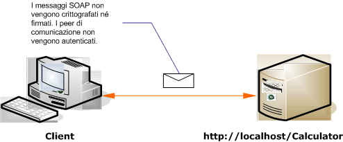

# <a name="internet-unsecured-client-and-service"></a>Client e servizio non protetti in Internet
Nella figura seguente viene illustrato un esempio di client Windows Communication Foundation (WCF) pubblica, protetta e servizio.  
  
   
  
|Caratteristica|Descrizione|  
|--------------------|-----------------|  
|Modalità di sicurezza|None|  
|Trasporto|HTTP|  
|Binding|<xref:System.ServiceModel.BasicHttpBinding> nel codice, o il [ \<basicHttpBinding >](../../../../docs/framework/configure-apps/file-schema/wcf/basichttpbinding.md) elemento nella configurazione.|  
|Interoperabilità|Con servizi e client di servizi Web esistenti|  
|Autenticazione|None|  
|Integrità|None|  
|Riservatezza|None|  
  
## <a name="service"></a>Servizio  
 Il codice e la configurazione seguenti devono essere eseguiti in modo indipendente. Eseguire una delle operazioni seguenti:  
  
-   Creare un servizio autonomo usando il codice senza alcuna configurazione.  
  
-   Creare un servizio usando la configurazione fornita, ma non definire alcun endpoint.  
  
### <a name="code"></a>Codice  
 Nel codice seguente viene illustrato come creare un endpoint senza protezione. Per impostazione predefinita, nell'elemento <xref:System.ServiceModel.BasicHttpBinding> la modalità di sicurezza è impostata su <xref:System.ServiceModel.BasicHttpSecurityMode.None>.  
  
 [!code-csharp[C_UnsecuredService#1](../../../../samples/snippets/csharp/VS_Snippets_CFX/c_unsecuredservice/cs/source.cs#1)]
 [!code-vb[C_UnsecuredService#1](../../../../samples/snippets/visualbasic/VS_Snippets_CFX/c_unsecuredservice/vb/source.vb#1)]  
  
### <a name="service-configuration"></a>Configurazione del servizio  
 Nel codice seguente viene impostato lo stesso endpoint utilizzando la configurazione.  
  
```xml  
<?xml version="1.0" encoding="utf-8"?>  
<configuration>  
  <system.serviceModel>  
    <behaviors />  
    <services>  
      <service behaviorConfiguration="" name="ServiceModel.Calculator">  
        <endpoint address="http://localhost/Calculator"   
                  binding="basicHttpBinding"  
                  bindingConfiguration="Basic_Unsecured"   
                  name="BasicHttp_ICalculator"  
                  contract="ServiceModel.ICalculator" />  
      </service>  
    </services>  
    <bindings>  
      <basicHttpBinding>  
        <binding name="Basic_Unsecured" />  
      </basicHttpBinding>  
    </bindings>  
    <client />  
  </system.serviceModel>  
</configuration>  
```  
  
## <a name="client"></a>Client  
 Il codice e la configurazione seguenti devono essere eseguiti in modo indipendente. Eseguire una delle operazioni seguenti:  
  
-   Creare un client autonomo usando il codice (e il codice client).  
  
-   Creare un client che non definisce alcun indirizzo di endpoint. Usare invece il costruttore client che accetta il nome della configurazione come argomento. Ad esempio:  
  
     [!code-csharp[C_SecurityScenarios#0](../../../../samples/snippets/csharp/VS_Snippets_CFX/c_securityscenarios/cs/source.cs#0)]
     [!code-vb[C_SecurityScenarios#0](../../../../samples/snippets/visualbasic/VS_Snippets_CFX/c_securityscenarios/vb/source.vb#0)]  
  
### <a name="code"></a>Codice  
 Nel codice seguente viene illustrato un client WCF di base che accede a un endpoint non protetto.  
  
 [!code-csharp[C_UnsecuredClient#1](../../../../samples/snippets/csharp/VS_Snippets_CFX/c_unsecuredclient/cs/source.cs#1)]
 [!code-vb[C_UnsecuredClient#1](../../../../samples/snippets/visualbasic/VS_Snippets_CFX/c_unsecuredclient/vb/source.vb#1)]  
  
### <a name="client-configuration"></a>Configurazione del client  
 Nel codice seguente viene configurato il client.  
  
```xml  
<?xml version="1.0" encoding="utf-8"?>  
<configuration>  
  <system.serviceModel>  
    <bindings>  
      <basicHttpBinding>  
        <binding name="BasicHttpBinding_ICalculator" >  
          <security mode="None">  
          </security>  
        </binding>  
      </basicHttpBinding>  
    </bindings>  
    <client>  
      <endpoint address="http://localhost/Calculator/Unsecured"  
          binding="basicHttpBinding"   
          bindingConfiguration="BasicHttpBinding_ICalculator"  
          contract="ICalculator"   
          name="BasicHttpBinding_ICalculator" />  
    </client>  
  </system.serviceModel>  
</configuration>  
```  
  
## <a name="see-also"></a>Vedere anche  
 [Scenari di sicurezza comuni](../../../../docs/framework/wcf/feature-details/common-security-scenarios.md)  
 [Panoramica della sicurezza](../../../../docs/framework/wcf/feature-details/security-overview.md)  
 [Modello di sicurezza per Windows Server AppFabric](http://go.microsoft.com/fwlink/?LinkID=201279&clcid=0x409)
