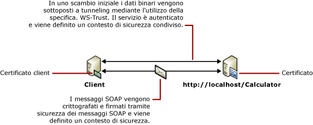

# <a name="message-security-with-a-certificate-client"></a>Protezione dei messaggi con un client di certificato
Nello scenario seguente sono illustrati un client e un servizio [!INCLUDE[indigo1](../../../../includes/indigo1-md.md)] protetti tramite la protezione a livello di messaggio. Sia il client che il servizio sono autenticati mediante certificati. [!INCLUDE[crdefault](../../../../includes/crdefault-md.md)][Protezione applicazione distribuita](../../../../docs/framework/wcf/feature-details/distributed-application-security.md).  
  
 Per un'applicazione di esempio, vedere [certificato di sicurezza messaggio](../../../../docs/framework/wcf/samples/message-security-certificate.md).  
  
   
  
|Caratteristica|Descrizione|  
|--------------------|-----------------|  
|Modalità di sicurezza|Messaggio|  
|Interoperabilità|Solo [!INCLUDE[indigo2](../../../../includes/indigo2-md.md)]|  
|Autenticazione (server)|Utilizzo del certificato del servizio|  
|Autenticazione (client)|Utilizzo del certificato client|  
|Integrità|Sì|  
|Riservatezza|Sì|  
|Trasporto|HTTP|  
|Binding|<xref:System.ServiceModel.WSHttpBinding>|  
  
## <a name="service"></a>Servizio  
 Il codice e la configurazione seguenti devono essere eseguiti in modo indipendente. Eseguire una delle operazioni seguenti:  
  
-   Creare un servizio autonomo usando il codice senza alcuna configurazione.  
  
-   Creare un servizio usando la configurazione fornita, ma non definire alcun endpoint.  
  
### <a name="code"></a>Codice  
 Nel codice seguente viene illustrato come creare un endpoint del servizio che utilizza la protezione dei messaggi per stabilire un contesto protetto.  
  
 [!code-csharp[C_SecurityScenarios#10](../../../../samples/snippets/csharp/VS_Snippets_CFX/c_securityscenarios/cs/source.cs#10)]
 [!code-vb[C_SecurityScenarios#10](../../../../samples/snippets/visualbasic/VS_Snippets_CFX/c_securityscenarios/vb/source.vb#10)]  
  
### <a name="configuration"></a>Configurazione  
 Invece del codice, è possibile usare la configurazione seguente:  
  
```xml  
<?xml version="1.0" encoding="utf-8"?>  
<configuration>  
  <system.serviceModel>  
    <behaviors>  
      <serviceBehaviors>  
        <behavior name="ServiceCredentialsBehavior">  
          <serviceCredentials>  
            <serviceCertificate findValue="Contoso.com"  
                                x509FindType="FindBySubjectName" />  
          </serviceCredentials>  
        </behavior>  
      </serviceBehaviors>  
    </behaviors>  
    <services>  
      <service behaviorConfiguration="ServiceCredentialsBehavior"   
               name="ServiceModel.Calculator">  
        <endpoint address="http://localhost/Calculator"   
                  binding="wsHttpBinding"  
                  bindingConfiguration="MessageAndCerficiateClient"   
                  name="SecuredByClientCertificate"  
                  contract="ServiceModel.ICalculator" />  
      </service>  
    </services>  
    <bindings>  
      <wsHttpBinding>  
        <binding name="WSHttpBinding_ICalculator">  
          <security mode="Message">  
            <message clientCredentialType="Certificate" />  
          </security>  
        </binding>  
      </wsHttpBinding>  
    </bindings>  
    <client />  
  </system.serviceModel>  
</configuration>  
```  
  
## <a name="client"></a>Client  
 Il codice e la configurazione seguenti devono essere eseguiti in modo indipendente. Eseguire una delle operazioni seguenti:  
  
-   Creare un client autonomo usando il codice (e il codice client).  
  
-   Creare un client che non definisce alcun indirizzo di endpoint. Usare invece il costruttore client che accetta il nome della configurazione come argomento. Ad esempio:  
  
     [!code-csharp[C_SecurityScenarios#0](../../../../samples/snippets/csharp/VS_Snippets_CFX/c_securityscenarios/cs/source.cs#0)]
     [!code-vb[C_SecurityScenarios#0](../../../../samples/snippets/visualbasic/VS_Snippets_CFX/c_securityscenarios/vb/source.vb#0)]  
  
### <a name="code"></a>Codice  
 Il codice seguente crea il client. L'associazione riguarda la protezione della modalità messaggio e il tipo di credenziale client è impostato su `Certificate`.  
  
 [!code-csharp[C_SecurityScenarios#17](../../../../samples/snippets/csharp/VS_Snippets_CFX/c_securityscenarios/cs/source.cs#17)]
 [!code-vb[C_SecurityScenarios#17](../../../../samples/snippets/visualbasic/VS_Snippets_CFX/c_securityscenarios/vb/source.vb#17)]  
  
### <a name="configuration"></a>Configurazione  
 Nella configurazione seguente il certificato client è specificato utilizzando un comportamento dell'endpoint. Per altre informazioni sui certificati, vedere [Utilizzo dei certificati](../../../../docs/framework/wcf/feature-details/working-with-certificates.md). Viene inoltre utilizzato un <`identity`> per specificare un sistema DNS (Domain Name) dell'identità del server previste. [!INCLUDE[crabout](../../../../includes/crabout-md.md)]identità, vedere [autenticazione e identità del servizio](../../../../docs/framework/wcf/feature-details/service-identity-and-authentication.md).  
  
```xml  
<?xml version="1.0" encoding="utf-8"?>  
<configuration>  
  <system.serviceModel>  
    <behaviors>  
      <endpointBehaviors>  
        <behavior name="endpointCredentialsBehavior">  
          <clientCredentials>  
            <clientCertificate findValue="Cohowinery.com"   
               storeLocation="LocalMachine"  
              x509FindType="FindBySubjectName" />  
          </clientCredentials>  
        </behavior>  
      </endpointBehaviors>  
    </behaviors>  
    <bindings>  
      <wsHttpBinding>  
        <binding name="WSHttpBinding_ICalculator" >  
          <security mode="Message">  
            <message clientCredentialType="Certificate" />  
          </security>  
        </binding>  
      </wsHttpBinding>  
    </bindings>  
    <client>  
      <endpoint address="http://machineName/Calculator"   
                behaviorConfiguration="endpointCredentialsBehavior"  
                binding="wsHttpBinding"  
                bindingConfiguration="WSHttpBinding_ICalculator"  
                contract="ICalculator"  
                name="WSHttpBinding_ICalculator">  
        <identity>  
          <dns value="Contoso.com" />  
        </identity>  
      </endpoint>  
    </client>  
  </system.serviceModel>  
</configuration>  
```  
  
## <a name="see-also"></a>Vedere anche  
 [Panoramica della sicurezza](../../../../docs/framework/wcf/feature-details/security-overview.md)  
 [Identità del servizio e autenticazione](../../../../docs/framework/wcf/feature-details/service-identity-and-authentication.md)  
 [Uso di certificati](../../../../docs/framework/wcf/feature-details/working-with-certificates.md)  
 [Modello di sicurezza per Windows Server AppFabric](http://go.microsoft.com/fwlink/?LinkID=201279&clcid=0x409)
