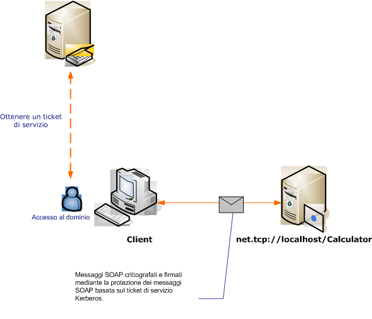

# <a name="message-security-with-a-windows-client-without-credential-negotiation"></a>Sicurezza dei messaggi con un client Windows senza negoziazione delle credenziali
Lo scenario seguente viene illustrato un client Windows Communication Foundation (WCF) e un servizio protetti dal protocollo Kerberos.  
  
 Il servizio e il client sono nello stesso dominio o sono entrambi in domini attendibili.  
  
> [!NOTE]
>  La differenza tra questo scenario e [sicurezza dei messaggi con un Client Windows](../../../../docs/framework/wcf/feature-details/message-security-with-a-windows-client.md) è che questo scenario non negozia la credenziale del servizio con il servizio prima di inviare il messaggio dell'applicazione. Inoltre, poiché ciò richiede il protocollo Kerberos, questo scenario richiede un dominio Windows.  
  
   
  
|Caratteristica|Descrizione|  
|--------------------|-----------------|  
|Modalità di sicurezza|Messaggio|  
|Interoperabilità|Sì, WS-Security con client compatibili con il profilo del token Kerberos|  
|Autenticazione (server)|Autenticazione reciproca del server e del client|  
|Autenticazione (client)|Autenticazione reciproca del server e del client|  
|Integrità|Sì|  
|Riservatezza|Sì|  
|Trasporto|HTTP|  
|Binding|<xref:System.ServiceModel.WSHttpBinding>|  
  
## <a name="service"></a>Servizio  
 Il codice e la configurazione seguenti devono essere eseguiti in modo indipendente. Eseguire una delle operazioni seguenti:  
  
-   Creare un servizio autonomo usando il codice senza alcuna configurazione.  
  
-   Creare un servizio usando la configurazione fornita, ma non definire alcun endpoint.  
  
### <a name="code"></a>Codice  
 Il codice seguente crea un endpoint del servizio che usa la sicurezza del messaggio. Il codice disabilita la negoziazione della credenziale del servizio e la definizione di un token del contesto di sicurezza (SCT, Security Context Token).  
  
> [!NOTE]
>  Per usare il tipo di credenziale di Windows senza negoziazione, l'account utente del servizio deve avere accesso al nome dell'entità servizio (SPN, Service Principal Name) registrato con il dominio di Active Directory. Questa operazione può essere eseguita in due modi diversi:  
  
1.  Usare l'account `NetworkService` o `LocalSystem` per eseguire il servizio. Poiché questi account hanno accesso al nome SPN viene stabilito quando il computer viene aggiunto al dominio di Active Directory del computer, WCF genera automaticamente l'elemento SPN corretto nell'endpoint del servizio nei metadati del servizio (Web Services Description Linguaggio o WSDL).  
  
2.  Usare un account di dominio Active Directory arbitrario per eseguire il servizio. In questo caso è necessario definire un SPN per questo account di dominio. A tale scopo è possibile usare l'utilità Setspn.exe. Dopo aver creato il nome SPN per l'account del servizio, è possibile configurare WCF per nome dell'entità di pubblicazione ai client del servizio tramite i relativi metadati (WSDL). Questa operazione viene eseguita impostando l'identità per l'endpoint esposto o tramite un file di configurazione dell'applicazione o tramite codice. Nell'esempio seguente l'identità viene pubblicata a livello di programmazione.  
  
 Per altre informazioni sui nomi SPN, il protocollo Kerberos e Active Directory, vedere [supplemento Kerberos tecnici per Windows](https://go.microsoft.com/fwlink/?LinkId=88330). Per altre informazioni sull'identità degli endpoint, vedere [modalità di autenticazione di SecurityBindingElement](../../../../docs/framework/wcf/feature-details/securitybindingelement-authentication-modes.md).  
  
 [!code-csharp[C_SecurityScenarios#12](../../../../samples/snippets/csharp/VS_Snippets_CFX/c_securityscenarios/cs/source.cs#12)]
 [!code-vb[C_SecurityScenarios#12](../../../../samples/snippets/visualbasic/VS_Snippets_CFX/c_securityscenarios/vb/source.vb#12)]  
  
### <a name="configuration"></a>Configurazione  
 Invece del codice, è possibile usare la configurazione seguente:  
  
```xml  
<?xml version="1.0" encoding="utf-8"?>  
<configuration>  
  <system.serviceModel>  
    <behaviors />  
    <services>  
      <service behaviorConfiguration="" name="ServiceModel.Calculator">  
        <endpoint address="http://localhost/Calculator"   
                  binding="wsHttpBinding"  
                  bindingConfiguration="KerberosBinding"  
                  name="WSHttpBinding_ICalculator"  
                  contract="ServiceModel.ICalculator"   
                  listenUri="net.tcp://localhost/metadata" >  
         <identity>  
            <servicePrincipalName value="service_spn_name" />  
         </identity>  
        </endpoint>  
      </service>  
    </services>  
    <bindings>  
      <wsHttpBinding>  
        <binding name="KerberosBinding">  
          <security>  
            <message negotiateServiceCredential="false"   
                     establishSecurityContext="false" />  
          </security>  
        </binding>  
      </wsHttpBinding>  
    </bindings>  
    <client />  
  </system.serviceModel>  
</configuration>  
```  
  
## <a name="client"></a>Client  
 Il codice e la configurazione seguenti devono essere eseguiti in modo indipendente. Eseguire una delle operazioni seguenti:  
  
-   Creare un client autonomo usando il codice (e il codice client).  
  
-   Creare un client che non definisce alcun indirizzo di endpoint. Usare invece il costruttore client che accetta il nome della configurazione come argomento. Ad esempio:  
  
     [!code-csharp[C_SecurityScenarios#0](../../../../samples/snippets/csharp/VS_Snippets_CFX/c_securityscenarios/cs/source.cs#0)]
     [!code-vb[C_SecurityScenarios#0](../../../../samples/snippets/visualbasic/VS_Snippets_CFX/c_securityscenarios/vb/source.vb#0)]  
  
### <a name="code"></a>Codice  
 Nel codice seguente viene configurato il client. La modalità di sicurezza è impostata su Messaggio e il tipo di credenziale client è impostato su Windows. Le proprietà <xref:System.ServiceModel.MessageSecurityOverHttp.NegotiateServiceCredential%2A> e <xref:System.ServiceModel.NonDualMessageSecurityOverHttp.EstablishSecurityContext%2A> sono impostate su `false`.  
  
> [!NOTE]
>  Per usare un tipo di credenziale di Windows senza negoziazione, il client deve essere configurato con il nome di entità servizio dell'account del servizio prima di iniziare la comunicazione con il servizio. Il client usa il nome dell'entità servizio (SPN) per ottenere il token Kerberos per autenticare e proteggere la comunicazione con il servizio. L'esempio seguente mostra come configurare il client con l'SPN del servizio. Se si usa la [ServiceModel Metadata Utility Tool (Svcutil.exe)](../../../../docs/framework/wcf/servicemodel-metadata-utility-tool-svcutil-exe.md) per generare il client, il SPN del servizio verrà propagato automaticamente al client dai metadati del servizio (WSDL), se contengono i metadati del servizio tali informazioni. Per altre informazioni su come configurare il servizio per includere il relativo SPN nei metadati del servizio, vedere la sezione "Servizio" più avanti in questo argomento.  
>   
>  Per altre informazioni sui nomi SPN Kerberos e Active Directory, vedere [supplemento Kerberos tecnici per Windows](https://go.microsoft.com/fwlink/?LinkId=88330). Per altre informazioni sull'identità degli endpoint, vedere [modalità di autenticazione di SecurityBindingElement](../../../../docs/framework/wcf/feature-details/securitybindingelement-authentication-modes.md) argomento.  
  
 [!code-csharp[C_SecurityScenarios#19](../../../../samples/snippets/csharp/VS_Snippets_CFX/c_securityscenarios/cs/source.cs#19)]
 [!code-vb[C_SecurityScenarios#19](../../../../samples/snippets/visualbasic/VS_Snippets_CFX/c_securityscenarios/vb/source.vb#19)]  
  
### <a name="configuration"></a>Configurazione  
 Nel codice seguente viene configurato il client. Si noti che il [ \<servicePrincipalName >](../../../../docs/framework/configure-apps/file-schema/wcf/serviceprincipalname.md) deve essere impostato in modo che corrispondano il SPN del servizio registrato per l'account del servizio del dominio di Active Directory.  
  
```xml  
<?xml version="1.0" encoding="utf-8"?>  
<configuration>  
  <system.serviceModel>  
    <bindings>  
      <wsHttpBinding>  
        <binding name="WSHttpBinding_ICalculator" >  
          <security mode="Message">  
            <message clientCredentialType="Windows"   
                     negotiateServiceCredential="false"  
                     establishSecurityContext="false" />  
          </security>  
        </binding>  
      </wsHttpBinding>  
    </bindings>  
    <client>  
      <endpoint address="http://localhost/Calculator"   
                binding="wsHttpBinding"  
                bindingConfiguration="WSHttpBinding_ICalculator"  
                contract="ICalculator"  
                name="WSHttpBinding_ICalculator">  
        <identity>  
          <servicePrincipalName value="service_spn_name" />  
        </identity>  
      </endpoint>  
    </client>  
  </system.serviceModel>  
</configuration>  
```  
  
## <a name="see-also"></a>Vedere anche  
 [Panoramica della sicurezza](../../../../docs/framework/wcf/feature-details/security-overview.md)  
 [Identità del servizio e autenticazione](../../../../docs/framework/wcf/feature-details/service-identity-and-authentication.md)  
 [Modello di sicurezza per Windows Server AppFabric](https://go.microsoft.com/fwlink/?LinkID=201279&clcid=0x409)
