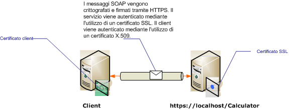

# <a name="transport-security-with-certificate-authentication"></a>Sicurezza del trasporto con autenticazione del certificato
In questo argomento viene illustrato l'utilizzo dei certificati X.509 per l'autenticazione del server e del client con la sicurezza del trasporto. Per altre informazioni sui certificati X.509, vedere [Certificati di chiave pubblica X.509](https://msdn.microsoft.com/library/bb540819\(VS.85\).aspx). I certificati devono essere emesso da un'autorità di certificazione, che spesso è un'emittente di certificati di terze parti. Nei domini Windows Server è possibile utilizzare Servizi certificati Active Directory per rilasciare certificati ai computer client del dominio. Per altre informazioni, vedere [Servizi certificati di Windows 2008 R2](https://go.microsoft.com/fwlink/?LinkID=209949&clcid=0x409). In questo scenario, il servizio è ospitato in Internet Information Services (IIS) configurato con Secure Sockets Layer (SSL). Il servizio è configurato con un certificato SSL (X.509) per consentire ai client di verificare l'identità del server. Anche il client è configurato con un certificato X.509 per consentire al servizio di verificare l'identità del client. Il certificato del server deve essere ritenuto attendibile dal client e il certificato del client deve essere ritenuto attendibile dal server. Il meccanismo per cui effettivamente il servizio e il client verificano le reciproche identità non rientra nell'ambito di questo argomento. Per altre informazioni, vedere [firma digitale in Wikipedia](https://go.microsoft.com/fwlink/?LinkId=253157).  
  
 Questo scenario implementa un modello di messaggio di richiesta/risposta come illustrato nel diagramma seguente.  
  
   
  
 Per altre informazioni sull'uso di un certificato con un servizio, vedere [Working with Certificates](../../../../docs/framework/wcf/feature-details/working-with-certificates.md) e [procedura: configurare una porta con un certificato SSL](../../../../docs/framework/wcf/feature-details/how-to-configure-a-port-with-an-ssl-certificate.md). Nella tabella riportata di seguito vengono descritte le diverse caratteristiche dello scenario.  
  
|Caratteristica|Descrizione|  
|--------------------|-----------------|  
|Modalità di sicurezza|Trasporto|  
|Interoperabilità|Con servizi e client di servizi Web esistenti.|  
|Autenticazione (server)<br /><br /> Autenticazione (client)|Sì (utilizzando un certificato SSL)<br /><br /> sì (utilizzando un certificato X.509)|  
|Integrità dei dati|Yes|  
|Riservatezza dei dati|Yes|  
|Trasporto|HTTPS|  
|Binding|<xref:System.ServiceModel.WSHttpBinding>|  
  
## <a name="configure-the-service"></a>Configurazione del servizio  
 Poiché il servizio in questo scenario è ospitato in IIS, viene configurato con un file web.config. Nel seguente web.config viene illustrato come configurare <xref:System.ServiceModel.WSHttpBinding> per utilizzare la sicurezza del trasporto e le credenziali client X.509.  
  
```xml  
<configuration>  
  <system.serviceModel>  
    <protocolMapping>  
      <add scheme="https" binding="wsHttpBinding" />  
    </protocolMapping>  
    <bindings>  
      <wsHttpBinding>  
        <!-- configure wsHttp binding with Transport security mode and clientCredentialType as Certificate -->  
        <binding>  
          <security mode="Transport">  
            <transport clientCredentialType="Certificate"/>              
          </security>  
        </binding>  
      </wsHttpBinding>  
    </bindings>  
    <!--For debugging purposes set the includeExceptionDetailInFaults attribute to true-->  
    <behaviors>  
      <serviceBehaviors>  
        <behavior>            
           <serviceDebug includeExceptionDetailInFaults="True" />  
        </behavior>  
      </serviceBehaviors>  
    </behaviors>  
  </system.serviceModel>  
</configuration>  
```  
  
## <a name="configure-the-client"></a>Configurazione del client  
 È possibile configurare il client nel codice o in un file app.config. Nell'esempio riportato di seguito viene illustrato come si configura il client nel codice.  
  
```vb  
// Create the binding.  
WSHttpBinding myBinding = new WSHttpBinding();  
myBinding.Security.Mode = SecurityMode.Transport;  
myBinding.Security.Transport.ClientCredentialType =  
   HttpClientCredentialType.Certificate;  
  
// Create the endpoint address. Note that the machine name   
// must match the subject or DNS field of the X.509 certificate  
// used to authenticate the service.   
EndpointAddress ea = new  
   EndpointAddress("https://localhost/CalculatorService/service.svc");  
  
// Create the client. The code for the calculator   
// client is not shown here. See the sample applications  
// for examples of the calculator code.  
CalculatorClient cc =  
   new CalculatorClient(myBinding, ea);  
  
// The client must specify a certificate trusted by the server.  
cc.ClientCredentials.ClientCertificate.SetCertificate(  
    StoreLocation.CurrentUser,  
    StoreName.My,  
    X509FindType.FindBySubjectName,  
    "contoso.com");  
  
// Begin using the client.  
Console.WriteLine(cc.Add(100, 1111));  
//...  
cc.Close();  
```  
  
 In alternativa è possibile configurare il client in un file App.config, come mostrato nell'esempio seguente:  
  
```xml  
<configuration>  
  <system.serviceModel>  
    <client>  
      <!-- this endpoint has an https: address -->  
      <endpoint address=" https://localhost/CalculatorService/service.svc "   
                behaviorConfiguration="endpointCredentialBehavior"  
                binding="wsHttpBinding"   
                bindingConfiguration="Binding1"   
                contract="Microsoft.Samples.TransportSecurity.ICalculator"/>  
    </client>  
    <behaviors>  
      <endpointBehaviors>  
        <behavior name="endpointCredentialBehavior">  
          <clientCredentials>  
            <clientCertificate findValue="contoso.com"  
                               storeLocation="CurrentUser"  
                               storeName="My"  
                               x509FindType="FindBySubjectName" />  
          </clientCredentials>  
        </behavior>  
      </endpointBehaviors>  
    </behaviors>  
    <bindings>  
      <wsHttpBinding>  
        <!-- configure wsHttpbinding with Transport security mode  
                   and clientCredentialType as Certificate -->  
        <binding name="Binding1">  
          <security mode="Transport">  
            <transport clientCredentialType="Certificate"/>  
          </security>  
        </binding>  
      </wsHttpBinding>  
    </bindings>  
  </system.serviceModel>  
  
<startup><supportedRuntime version="v4.0" sku=".NETFramework,Version=v4.0"/></startup></configuration>  
```  
  
## <a name="see-also"></a>Vedere anche  
 [Panoramica della sicurezza](../../../../docs/framework/wcf/feature-details/security-overview.md)  
 [Modello di sicurezza per Windows Server AppFabric](https://go.microsoft.com/fwlink/?LinkID=201279&clcid=0x409)
