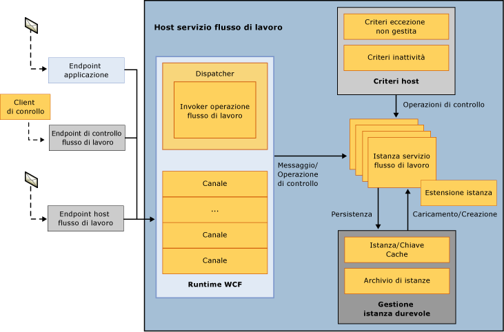
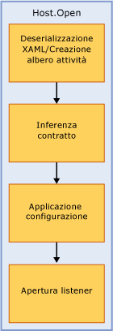

# Elementi interni dell&#39;host del servizio di flusso di lavoro
<xref:System.ServiceModel.WorkflowServiceHost> fornisce un host per i servizi del flusso di lavoro.Consente di ascoltare i messaggi in arrivo e di indirizzarli all'istanza del servizio di flusso di lavoro appropriata, nonché di controllare lo scaricamento e il salvataggio permanente di flussi di lavoro inattivi e così via.In questo argomento viene descritta l'elaborazione dei messaggi in arrivo da parte di WorkflowServiceHost.  
  
## Panoramica di WorkflowServiceHost  
 La classe <xref:System.ServiceModel.WorkflowServiceHost> è utilizzata per ospitare i servizi del flusso di lavoro.Consente di ascoltare i messaggi in arrivo e di indirizzarli all'istanza del servizio appropriata, creando nuove istanze o caricando quelle esistenti da un archivio permanente in base alle necessità.Nel diagramma seguente viene illustrato dettagliatamente il funzionamento di <xref:System.ServiceModel.WorkflowServiceHost>.  
  
   
  
 In questo diagramma viene mostrato che l'oggetto <xref:System.ServiceModel.WorkflowServiceHost> consente di caricare le definizioni del servizio di flusso di lavoro dai file con estensione xamlx e le informazioni di configurazione da un file di configurazione.Permette inoltre di caricare la configurazione di rilevamento dal profilo di rilevamento.L'oggetto <xref:System.ServiceModel.WorkflowServiceHost> espone un endpoint di controllo del flusso di lavoro che consente di inviare operazioni di controllo alle istanze del flusso di lavoro.Per ulteriori informazioni, vedere [Endpoint di controllo del flusso di lavoro](../../../../docs/framework/wcf/feature-details/workflow-control-endpoint.md) e [Esempio di endpoint di gestione del flusso di lavoro](../../../../docs/framework/windows-workflow-foundation/samples/workflow-management-endpoint-sample.md).  
  
 Tramite l'oggetto <xref:System.ServiceModel.WorkflowServiceHost> vengono anche esposti endpoint applicazione che consentono di ascoltare i messaggi in arrivo dell'applicazione.Una volta arrivato, un messaggio viene inviato all'istanza del servizio di flusso di lavoro appropriata, se attualmente caricata.Se necessario, viene creata una nuova istanza del flusso di lavoro.Oppure, se un'istanza esistente è stata salvata in modo permanente, viene caricata dall'archivio salvataggi permanenti.  
  
## Dettagli relativi a WorkflowServiceHost  
 Il diagramma seguente mostra come <xref:System.ServiceModel.WorkflowServiceHost> gestisce i messaggi più dettagliatamente.  
  
   
  
 In questo diagramma vengono mostrati tre endpoint diversi, ovvero un endpoint applicazione, un endpoint di controllo del flusso di lavoro e un endpoint in cui viene ospitato il flusso di lavoro.I messaggi associati per un'istanza specifica del flusso di lavoro vengono ricevuti dall'endpoint applicazione.Le operazioni di controllo vengono ascoltate dall'endpoint di controllo del flusso di lavoro.I messaggi che causano il caricamento e l'esecuzione di flussi di lavoro non del servizio da parte di <xref:System.ServiceModel.WorkflowServiceHost> vengono ascoltati dall'endpoint in cui è ospitato il flusso di lavoro.Come mostrato nel diagramma, tutti i messaggi vengono elaborati tramite il runtime WCF.La limitazione delle istanze del servizio del flusso di lavoro viene applicata tramite la proprietà <xref:System.ServiceModel.Description.ServiceThrottlingBehavior.MaxConcurrentInstances%2A>.Questa proprietà limiterà il numero di istanze simultanee del servizio del flusso di lavoro.Quando questo limite viene superato, qualsiasi richiesta aggiuntiva di nuove istanze del servizio del flusso di lavoro o qualsiasi richiesta di attivazione di istanze persistenti del flusso di lavoro sarà messa in coda.Le richieste in coda vengono elaborate nell'ordine FIFO indipendentemente dal fatto che siano richieste per nuove istanze o per istanze persistenti in esecuzione.Vengono caricate informazioni sui criteri host tramite cui vengono determinati il trattamento delle eccezioni non gestite, nonché lo scaricamento e il salvataggio permanente dei servizi di flusso di lavoro inattivi.[!INCLUDE[crabout](../../../../includes/crabout-md.md)] questi argomenti, vedere [Procedura: configurare il comportamento di eccezione non gestita del flusso di lavoro con WorkflowServiceHost](../../../../docs/framework/wcf/feature-details/config-workflow-unhandled-exception-workflowservicehost.md) e [Procedura: configurare il comportamento inattivo con WorkflowServiceHost](../../../../docs/framework/wcf/feature-details/how-to-configure-idle-behavior-with-workflowservicehost.md).Le istanze del flusso di lavoro vengono salvate in modo permanente in base ai criteri host e, se necessario, vengono ricaricate.Per ulteriori informazioni sul salvataggio permanente del flusso di lavoro, vedere [Procedura: configurare la persistenza con WorkflowServiceHost](../../../../docs/framework/wcf/feature-details/how-to-configure-persistence-with-workflowservicehost.md), [Creazione di un servizio flusso di lavoro a esecuzione prolungata](../../../../docs/framework/wcf/feature-details/creating-a-long-running-workflow-service.md) e [Persistenza del flusso di lavoro](../../../../docs/framework/windows-workflow-foundation//workflow-persistence.md).  
  
 Nell'immagine seguente viene mostrata la denominazione di WorkflowServiceHost.Open.  
  
   
  
 Il flusso di lavoro viene caricato da XAML e viene creata la struttura ad albero delle attività.L'oggetto <xref:System.ServiceModel.WorkflowServiceHost> consente di analizzare l'albero delle attività e di creare la descrizione del servizio.La configurazione viene applicata all'host.Infine, i messaggi in arrivo iniziano a essere ascoltati dall'host.  
  
 Nell'immagine seguente vengono mostrate le operazioni effettuate da <xref:System.ServiceModel.WorkflowServiceHost> quando viene ricevuto un messaggio associato per un'attività Receive la cui proprietà CanCreateInstance è impostata su `true`.  
  
   
  
 Un volta arrivato, il messaggio viene elaborato dallo stack di canali WCF.Vengono controllate le limitazioni ed eseguite le query di correlazione.Se associato per un'istanza esistente, il messaggio viene recapitato.Se è necessario creare una nuova istanza, viene controllata la proprietà CanCreateInstance dell'attività Receive.Se viene impostata su true, viene creata una nuova istanza e il messaggio viene recapitato.  
  
 Nell'immagine seguente vengono mostrate le operazioni effettuate da <xref:System.ServiceModel.WorkflowServiceHost> quando viene ricevuto un messaggio associato per un'attività Receive la cui proprietà CanCreateInstance è impostata su false.  
  
   
  
 Un volta arrivato, il messaggio viene elaborato dallo stack di canali WCF.Vengono controllate le limitazioni ed eseguite le query di correlazione.Il messaggio viene associato per un'istanza esistente \(poiché la proprietà CanCreateInstance è false\), pertanto l'istanza viene caricata dall'archivio salvataggi permanenti, il segnalibro viene ripreso e il flusso di lavoro viene eseguito.  
  
> [!WARNING]
>  Non sarà possibile aprire l'host dei servizi di flusso di lavoro se SQL Server è configurato per rimanere in ascolto solo sul protocollo NamedPipe.  
  
## Vedere anche  
 [Servizi flusso di lavoro](../../../../docs/framework/wcf/feature-details/workflow-services.md)   
 [Hosting di servizi flusso di lavoro](../../../../docs/framework/wcf/feature-details/hosting-workflow-services.md)   
 [Endpoint di controllo del flusso di lavoro](../../../../docs/framework/wcf/feature-details/workflow-control-endpoint.md)   
 [Esempio di endpoint di gestione del flusso di lavoro](../../../../docs/framework/windows-workflow-foundation/samples/workflow-management-endpoint-sample.md)   
 [Procedura: configurare il comportamento di eccezione non gestita del flusso di lavoro con WorkflowServiceHost](../../../../docs/framework/wcf/feature-details/config-workflow-unhandled-exception-workflowservicehost.md)   
 [Creazione di un servizio flusso di lavoro a esecuzione prolungata](../../../../docs/framework/wcf/feature-details/creating-a-long-running-workflow-service.md)   
 [Persistenza del flusso di lavoro](../../../../docs/framework/windows-workflow-foundation//workflow-persistence.md)