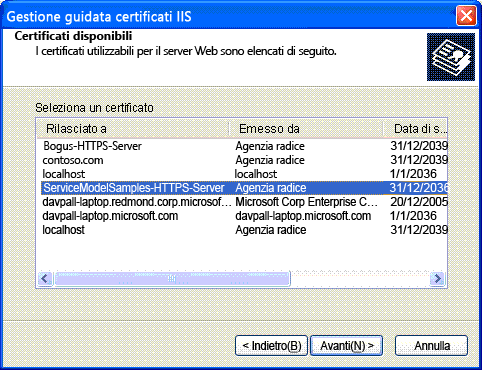

# <a name="internet-information-services-iis-server-certificate-installation-instructions"></a>Istruzioni di installazione certificato server IIS (Internet Information Services)
Per eseguire gli esempi che comunicano in modo sicuro con IIS (Internet Information Services) è necessario creare e installare un certificato server.  
  
## <a name="step-1-creating-certificates"></a>Passaggio 1. Creazione di certificati  
 Per creare un certificato per il computer, aprire un prompt dei comandi di Visual Studio con privilegi di amministratore ed eseguire Setup.bat incluso in ciascuno degli esempi che utilizza comunicazione sicure con IIS. Assicurarsi che il percorso includa la cartella contenente Makecert.exe prima di eseguire questo file batch. Il comando seguente viene utilizzato per creare il certificato nel file Setup.bat.  
  
```  
makecert -sr LocalMachine -ss My -n CN=ServiceModelSamples-HTTPS-Server -sky exchange -sk ServiceModelSamples-HTTPS-Key  
```  
  
## <a name="step-2-installing-certificates"></a>Passaggio 2. Installazione dei certificati  
 I passaggi necessari per installare i certificati appena creati dipendono dalla versione di IIS che si sta utilizzando.  
  
#### <a name="to-install-iis-on-iis-51-windows-xp-and-iis-60-windows-server-2003"></a>Installazione di IIS su IIS 5.1 (Windows XP) e IIS 6.0 (Windows Server 2003)  
  
1.  Aprire lo snap-in MMC della Gestione Internet Information Services (IIS).  
  
2.  Il sito Web predefinito e scegliere **proprietà**.  
  
3.  Selezionare il **protezione Directory** scheda.  
  
4.  Fare clic su di **certificato Server** pulsante. Verrà avviata la Procedura guidata certificati server Web.  
  
5.  Completare la procedura guidata. Selezionare l'opzione per assegnare un certificato. Selezionare il certificato server HTTPS ServiceModelSamples nell'elenco di certificati visualizzati.  
  
       
  
6.  Testare l'accesso al servizio in un browser utilizzando l'indirizzo HTTPS https://localhost/servicemodelsamples/service.svc.  
  
#### <a name="if-ssl-was-previously-configured-by-using-httpcfgexe"></a>Se SSL è stato precedentemente configurato utilizzando Httpcfg.exe  
  
1.  Utilizzare Makecert.exe (o eseguire Setup.bat) per creare il certificato server.  
  
2.  Eseguire la gestione IIS e installare il certificato secondo i passaggi precedenti.  
  
3.  Aggiungere le righe di codice seguenti al programma client.  
  
> [!IMPORTANT]
>  Questo codice è necessario solo per certificati di prova come ad esempio quelli creati da Makecert.exe. Non è una pratica consigliabile per il codice di produzione.  
  
```  
PermissiveCertificatePolicy.Enact("CN=ServiceModelSamples-HTTPS-Server");  
```  
  
#### <a name="to-install-iis-on-iis-70-windows-vista-and-windows-server-2008"></a>Per installare IIS su IIS 7.0 (Windows Vista e Windows Server 2008)  
  
1.  Dal **avviare** menu, fare clic su **eseguire**, quindi digitare **inetmgr** per aprire lo snap-in MMC di Internet Information Services (IIS).  
  
2.  Fare doppio clic sui **sito Web predefinito** e selezionare **Modifica associazioni...**  
  
3.  Fare clic sul **Aggiungi** pulsante il **binding sito** la finestra di dialogo.  
  
4.  Selezionare **HTTPS** dal **tipo** elenco a discesa.  
  
5.  Selezionare il **ServiceModelSamples-HTTPS-Server** dal **certificato SSL** elenco a discesa e fare clic su **OK**.  
  
6.  Testare l'accesso al servizio in un browser utilizzando l'indirizzo HTTPS https://localhost/servicemodelsamples/service.svc.  
  
> [!NOTE]
>  Dato che il certificato di prova appena installato non è un certificato attendibile, possono essere visualizzati avvisi di sicurezza di Internet Explorer aggiuntivi quando si visitano indirizzi Web locali protetti da questo certificato.  
  
## <a name="removing-certificates"></a>Rimozione dei certificati  
  
-   Utilizzare Gestione Internet Information Services come illustrato in precedenza, ma rimuovere il certificato o l'associazione anziché aggiungerlo.  
  
-   Rimuovere il certificato del computer utilizzando il comando seguente.  
  
    ```  
    httpcfg delete ssl -i 0.0.0.0:443  
    ```
