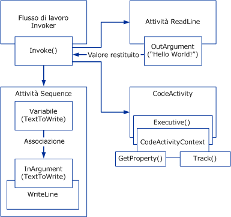

# Panoramica sul flusso di lavoro di Windows
Un flusso di lavoro è un set di unità elementari chiamate *attività* che vengono archiviati come un modello che descrive un processo reale. I flussi di lavoro forniscono un metodo per descrivere l'ordine di esecuzione e le relazioni dipendenti tra porzioni di lavoro di breve o lunga durata. Questo lavoro passa attraverso il modello dall'inizio alla fine e le attività possono essere eseguite da persone o da funzioni del sistema.  
  
## Motore di runtime del flusso di lavoro  
 Ogni istanza del flusso di lavoro in esecuzione viene creata e gestita da un motore di runtime in-process con il quale il processo host interagisce tramite uno degli elementi seguenti:  
  
-   Un oggetto <xref:System.Activities.WorkflowInvoker>, che richiama il flusso di lavoro come metodo.  
  
-   Un oggetto <xref:System.Activities.WorkflowApplication> per il controllo esplicito sull'esecuzione di una singola istanza del flusso di lavoro.  
  
-   Un oggetto <xref:System.ServiceModel.WorkflowServiceHost> per le interazioni basate su messaggi in scenari con più istanze.  
  
 Ognuna di queste classi esegue il wrapping del runtime di attività principale rappresentato come oggetto <xref:System.Activities.ActivityInstance> responsabile dell'esecuzione di attività. In un dominio dell'applicazione possono essere in esecuzione contemporaneamente diversi oggetti <xref:System.Activities.ActivityInstance>.  
  
 Ognuno dei tre precedenti oggetti di interazione host viene creato da un albero delle attività definito programma di flusso di lavoro. Usando questi tipi o un host personalizzato che esegue il wrapping <xref:System.Activities.ActivityInstance>, i flussi di lavoro può essere eseguite in qualsiasi processo Windows, incluse applicazioni console, applicazioni basate su form, servizi di Windows, [!INCLUDE[vstecasp](../../../includes/vstecasp-md.md)] Web, siti e (Windows Communication Foundation Servizi WCF).  
  
   
Componenti del flusso di lavoro nel processo host  
  
## Interazione tra componenti del flusso di lavoro  
 Nel diagramma seguente viene illustrata la modalità di interazione tra i componenti del flusso di lavoro.  
  
   
  
 Nel diagramma precedente, il metodo <xref:System.Activities.WorkflowInvoker.Invoke%2A> della classe <xref:System.Activities.WorkflowInvoker> viene usato per richiamare più istanze del flusso di lavoro. <xref:System.Activities.WorkflowInvoker> viene usata per flussi di lavoro semplici che non richiedono la gestione da parte dell'host. Tali flussi di lavoro (ad esempio la ripresa di <xref:System.Activities.Bookmark>) devono essere eseguiti usando invece il metodo <xref:System.Activities.WorkflowApplication.Run%2A>. Non è necessario attendere il completamento di un'istanza del flusso di lavoro prima di richiamare un altro; il motore di runtime supporta l'esecuzione simultanea di più istanze del flusso di lavoro.  Di seguito sono riportati i flussi di lavoro richiamati:  
  
-   Attività <xref:System.Activities.Statements.Sequence> contenente un'attività <xref:System.Activities.Statements.WriteLine> figlio. L'oggetto <xref:System.Activities.Variable> dell'attività padre viene associato a un oggetto <xref:System.Activities.InArgument> dell'attività figlio. Per altre informazioni sulle variabili, argomenti e associazione, vedere [variabili e argomenti](../../../docs/framework/windows-workflow-foundation/variables-and-arguments.md).  
  
-   Attività personalizzata denominata `ReadLine`. Un oggetto <xref:System.Activities.OutArgument> dell'attività `ReadLine` viene restituito al metodo <xref:System.Activities.WorkflowInvoker.Invoke%2A> chiamante.  
  
-   Attività personalizzata che deriva dalla classe astratta <xref:System.Activities.CodeActivity>. L'oggetto <xref:System.Activities.CodeActivity> può accedere a funzionalità in fase di esecuzione (ad esempio rilevamento e proprietà) tramite l'oggetto <xref:System.Activities.CodeActivityContext> disponibile come parametro del metodo <xref:System.Activities.CodeActivity.Execute%2A>. Per altre informazioni su queste funzionalità in fase di esecuzione, vedere [flusso di lavoro di rilevamento e traccia](../../../docs/framework/windows-workflow-foundation/workflow-tracking-and-tracing.md) e [delle proprietà di esecuzione del flusso di lavoro](../../../docs/framework/windows-workflow-foundation/workflow-execution-properties.md).  
  
## Vedere anche  
 [BizTalk Server 2006 o WF? Scelta del corretto flusso di lavoro per il progetto](https://go.microsoft.com/fwlink/?LinkId=154901)
