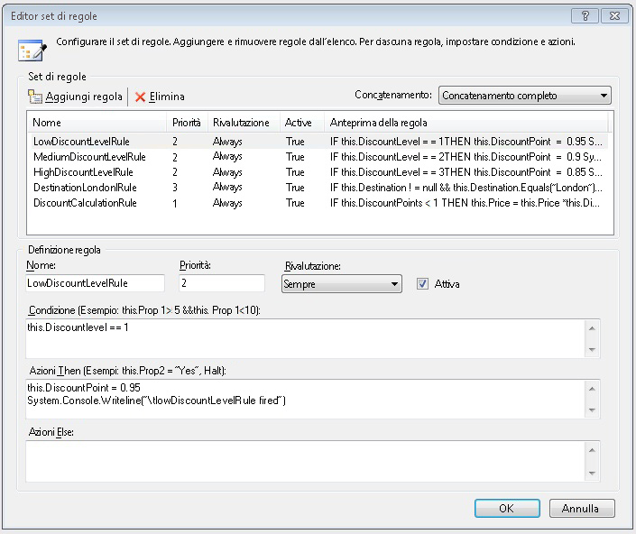
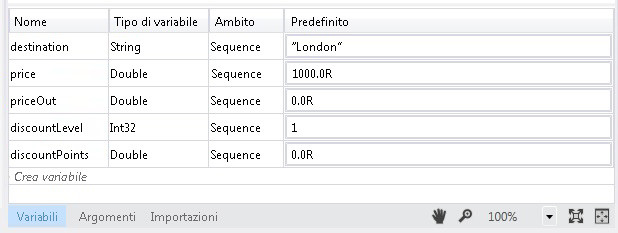

# <a name="interop-with-35-rule-set"></a>Interoperabilità con il set di regole 3.5
Questo esempio viene illustrato l'utilizzo del <xref:System.Activities.Statements.Interop> attività per l'integrazione con un'attività personalizzata in [!INCLUDE[netfx35_short](../../../../includes/netfx35-short-md.md)] utilizzando <!--zz <xref:System.Workflow.Activities.Policy> --> `System.Workflow.Activities.Policy` e regole. Passa i dati all'attività personalizzata associando le variabili di [!INCLUDE[netfx_current_long](../../../../includes/netfx-current-long-md.md)] alle proprietà di dipendenza esposte dall'attività personalizzata.  
  
## <a name="requirements"></a>Requisiti  
  
1.  [!INCLUDE[vs_current_long](../../../../includes/vs-current-long-md.md)]  
  
2.  [!INCLUDE[netfx_current_long](../../../../includes/netfx-current-long-md.md)]  
  
3.  [!INCLUDE[netfx35_long](../../../../includes/netfx35-long-md.md)]  
  
## <a name="demonstrates"></a>Dimostrazione  
 <xref:System.Activities.Statements.Interop>attività, <!--zz <xref:System.Workflow.Activities.Policy> --> `System.Workflow.Activities.Policy` attività [!INCLUDE[netfx35_short](../../../../includes/netfx35-short-md.md)] con le proprietà di dipendenza  
  
## <a name="discussion"></a>Discussione  
 Nell'esempio viene illustrato uno degli scenari di integrazione con un'attività [!INCLUDE[netfx35_short](../../../../includes/netfx35-short-md.md)]. In questo esempio include una [!INCLUDE[netfx35_short](../../../../includes/netfx35-short-md.md)] attività personalizzata che richiama un <!--zz <xref:System.Workflow.Activities.Policy> --> `System.Workflow.Activities.Policy` attività.  
  
## <a name="travelrulelibrary"></a>TravelRuleLibrary  
 L'apertura di TravelRuleSet.cs nella finestra di progettazione mostra un'attività sequenziale personalizzata contenente un'attività Policy come riportato di seguito  
  
   
  
 Fare doppio clic su di **DiscountPolicy** attività per esaminare le regole dei criteri. che possono essere visualizzate nel relativo editor.  
  
   
  
 Fare doppio clic su di **DiscountPolicy** attività e selezionare il **Visualizza codice** possibilità di esaminare il tipo code-beside codice c# che passa all'attività corrente. Osservare l'impostazione della proprietà di dipendenza per l'oggetto `DiscountLevel`. È uguale a un oggetto <xref:System.Activities.Argument> in [!INCLUDE[netfx_current_short](../../../../includes/netfx-current-short-md.md)].  
  
```  
public static DependencyProperty DiscountLevelProperty = DependencyProperty.Register("DiscountLevel", typeof(int), typeof(TravelRuleSet));  
  
[DescriptionAttribute("DiscountLevel")]  
[CategoryAttribute("DiscountLevel Category")]  
[BrowsableAttribute(true)]  
[DesignerSerializationVisibilityAttribute(DesignerSerializationVisibility.Visible)]  
public int DiscountLevel  
{  
   get  
   {  
return ((int)base.GetValue(TravelRuleSet.DiscountLevelProperty)));  
   }  
   set  
   {  
base.SetValue(TravelRuleSet.DiscountLevelProperty, value);  
   }  
}  
```  
  
## <a name="interopwith35ruleset"></a>InteropWith35RuleSet  
 Si tratta di un flusso di lavoro sequenziale di [!INCLUDE[netfx_current_short](../../../../includes/netfx-current-short-md.md)] che usa l'attività <xref:System.Activities.Statements.Interop> per eseguire l'integrazione con l'oggetto RuleSet personalizzato creato nel progetto TravelRuleLibrary. Le variabili vengono create nell'oggetto <xref:System.Activities.Statements.Sequence> di primo livello come riportato di seguito.  
  
   
  
   
  
 Infine, l'attività <xref:System.Activities.Statements.Interop> viene usata per eseguire l'integrazione con TravelRuleSet. Le variabili dichiarate precedentemente nell'oggetto <xref:System.Activities.Statements.Sequence> vengono usate per eseguire l'associazione alle proprietà di dipendenza.  
  
   
  
   
  
   
  
> [!IMPORTANT]
>  È possibile che gli esempi siano già installati nel computer. Verificare la directory seguente (impostazione predefinita) prima di continuare.  
>   
>  `<InstallDrive>:\WF_WCF_Samples`  
>   
>  Se questa directory non esiste, andare alla sezione relativa agli [esempi di Windows Communication Foundation (WCF) e Windows Workflow Foundation (WF) per .NET Framework 4](http://go.microsoft.com/fwlink/?LinkId=150780) per scaricare tutti gli esempi di [!INCLUDE[indigo1](../../../../includes/indigo1-md.md)] e [!INCLUDE[wf1](../../../../includes/wf1-md.md)] . Questo esempio si trova nella directory seguente.  
>   
>  `<InstallDrive>:\WF_WCF_Samples\WF\Basic\Built-InActivities\InteropWith35RuleSet`
