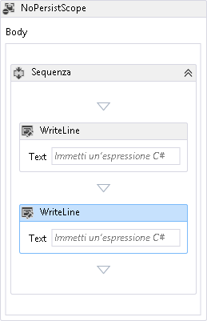
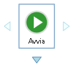
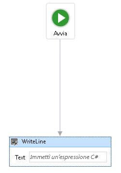
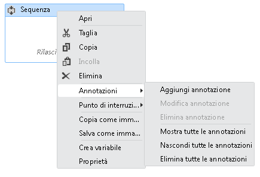

# Supporto per nuovo funzionalità di Workflow Foundation 4.5 nella finestra di progettazione del flusso di lavoro ospitata nuovamente
Windows Workflow Foundation (WF) in [!INCLUDE[net_v45](../../../includes/net-v45-md.md)] introdotte molte nuove funzionalità, inclusi numerosi miglioramenti all'esperienza di progettazione del flusso di lavoro. In questo argomento vengono descritte quali funzionalità sono supportate nella finestra di progettazione ospitata nuovamente e quali non sono attualmente supportate.  
  
> [!NOTE]
>  Per un elenco di tutte le nuove funzionalità di Windows Workflow Foundation (WF) introdotto in [!INCLUDE[net_v45](../../../includes/net-v45-md.md)], inclusi quelli che non sono correlati a riallocazione della finestra di progettazione, vedere [novità in Windows Workflow Foundation in .NET 4.5](../../../docs/framework/windows-workflow-foundation/whats-new-in-wf-in-dotnet.md).  
  
## Attività  
 La libreria di attività predefinita contiene nuove attività e funzionalità per le attività esistenti. Tutte queste nuove attività sono supportate nella finestra di progettazione ospitata nuovamente. Per ulteriori informazioni su queste nuove attività, vedere il [attività](../../../docs/framework/windows-workflow-foundation/whats-new-in-wf-in-dotnet.md#BKMK_NewActivities) sezione [novità di Windows Workflow Foundation in .NET 4.5](../../../docs/framework/windows-workflow-foundation/whats-new-in-wf-in-dotnet.md).  
  
## Espressioni C#  
 In precedenza a [!INCLUDE[net_v45](../../../includes/net-v45-md.md)], tutte le espressioni nei flussi di lavoro potevano essere scritte solo in Visual Basic. In [!INCLUDE[net_v45](../../../includes/net-v45-md.md)] le espressioni di Visual Basic vengono usate solo per i progetti creati tramite questo linguaggio. Nei progetti Visual C# viene ora usato C# per le espressioni. Quando si creano flussi di lavoro in [!INCLUDE[vs_current_long](../../../includes/vs-current-long-md.md)], è ora disponibile un editor espressioni C# completamente funzionale con funzionalità quali l'evidenziazione della grammatica e Intellisense. I progetti di flussi di lavoro C# creati in versioni precedenti che utilizzavano espressioni di Visual Basic continueranno a funzionare.  
  
> [!WARNING]
>  Le espressioni C# non sono supportate nella finestra di progettazione ospitata nuovamente.  
  
## Nuove funzionalità di progettazione  
  
### Ricerca nella finestra di progettazione  
 Il [ricerca veloce](../../../docs/framework/windows-workflow-foundation/whats-new-in-wf-in-dotnet.md#BKMK_QuickFind) e [Cerca nei file](../../../docs/framework/windows-workflow-foundation/whats-new-in-wf-in-dotnet.md#BKMK_FindInFiles) funzionalità introdotte con [!INCLUDE[net_v45](../../../includes/net-v45-md.md)] non sono supportati nella finestra di progettazione ospitata nuovamente. La ricerca di `Toolbox` è supportata nella finestra di progettazione ospitata nuovamente. Per ulteriori informazioni su queste funzionalità, vedere [ricerca progettazione](../../../docs/framework/windows-workflow-foundation/whats-new-in-wf-in-dotnet.md#BKMK_DesignerSearch).  
  
> [!WARNING]
>  [Ricerca veloce](../../../docs/framework/windows-workflow-foundation/whats-new-in-wf-in-dotnet.md#BKMK_QuickFind) e [Cerca nei file](../../../docs/framework/windows-workflow-foundation/whats-new-in-wf-in-dotnet.md#BKMK_FindInFiles) non sono supportate nella finestra di progettazione ospitata nuovamente.  
  
### Eliminare l'elemento del menu di scelta rapida nella finestra di progettazione delle variabili e degli argomenti  
 In [!INCLUDE[netfx40_short](../../../includes/netfx40-short-md.md)] le variabili e gli argomenti potevano essere eliminati solo nella finestra di progettazione mediante la tastiera. A partire da [!INCLUDE[net_v45](../../../includes/net-v45-md.md)] le variabili e gli argomenti possono essere eliminati usando il menu di scelta rapida. Questa funzionalità è supportata nella finestra di progettazione ospitata nuovamente.  
  
 Nella schermata seguente è illustrato il menu di scelta rapida della finestra di progettazione delle variabili e degli argomenti.  
  
   
  
### Racchiudere automaticamente con l'attività Sequence  
 Poiché un flusso di lavoro o determinate attività contenitore (ad esempio <xref:System.Activities.Statements.NoPersistScope>) potevano contenere solo un'unica attività Body, l'aggiunta di una seconda attività richiedeva allo sviluppatore di eliminare la prima attività, di aggiungere un'attività <xref:System.Activities.Statements.Sequence> e, successivamente, di aggiungere entrambe le attività all'attività Sequence. A partire da [!INCLUDE[net_v45](../../../includes/net-v45-md.md)], quando si aggiunge una seconda attività all'area di progettazione, verrà creata automaticamente un'attività `Sequence` per eseguire il wrapping di entrambe le attività. Questa funzionalità è supportata nella finestra di progettazione ospitata nuovamente.  
  
 La schermata riportata di seguito mostra un'attività di `WriteLine` in `Body` di `NoPersistScope`.  
  
   
  
 La schermata riportata di seguito mostra l'attività automaticamente creata di `Sequence` in `Body` quando un secondo `WriteLine` viene rilasciato sotto il primo.  
  
   
  
### Modalità dettaglio  
 Per spostarsi più facilmente in un flusso di lavoro di grandi dimensioni nella finestra di progettazione è possibile abilitare la modalità dettaglio, consentendo allo sviluppatore di selezionare e trascinare la parte visibile del flusso di lavoro, anziché dover usare le barre di scorrimento. Il pulsante per attivare la modalità dettaglio si trova nell'angolo inferiore destro della finestra di progettazione. Questa funzionalità è supportata nella finestra di progettazione ospitata nuovamente.  
  
 Nella schermata seguente viene illustrato il pulsante della modalità dettaglio posizionato nell'angolo inferiore destro della finestra di progettazione del flusso di lavoro.  
  
   
  
 Per ottenere il dettaglio della finestra di progettazione del flusso di lavoro è anche possibile usare il pulsante centrale del mouse o la barra spaziatrice.  
  
### Selezione multipla  
 È possibile selezionare più attività alla volta trascinando un rettangolo attorno a esse (quando la modalità dettaglio non è abilitata) o tenendo premuto CTRL e facendo clic sulle attività desiderate una alla volta. Questa funzionalità è supportata nella finestra di progettazione ospitata nuovamente.  
  
 Le selezioni di più attività possono anche essere trascinate e rilasciate all'interno della finestra di progettazione, nonché usate con il menu di scelta rapida.  
  
### Visualizzazione Struttura degli elementi del flusso di lavoro  
 Per consentire uno spostamento più semplice nei flussi di lavoro gerarchici, i componenti di un flusso di lavoro vengono visualizzati in una visualizzazione ad albero. La visualizzazione struttura è mostrata nel **struttura documento** visualizzazione. Per aprire questa visualizzazione in Visual Studio, nel menu principale, selezionare **vista**, **altre finestre**, **struttura documento**, oppure premere Ctrl W, U. Facendo clic su un nodo nella visualizzazione Struttura verrà visualizzata l'attività corrispondente nella finestra di progettazione del flusso di lavoro e la visualizzazione Struttura verrà aggiornata in modo da mostrare le attività selezionate nella finestra di progettazione. Questa funzionalità è supportata nella finestra di progettazione ospitata nuovamente.  
  
 Nella schermata del flusso di lavoro completata dal seguente il [esercitazione introduttiva](../../../docs/framework/windows-workflow-foundation/getting-started-tutorial.md) Mostra la visualizzazione della struttura con un flusso di lavoro sequenza.  
  
   
  
### Maggiore controllo della visibilità degli elementi della barra della shell e dell'intestazione  
 In una finestra di progettazione ospitata nuovamente, alcuni dei controlli dell'interfaccia utente standard possono non essere appropriati per un determinato flusso di lavoro e, pertanto, è possibile disattivarli. In [!INCLUDE[netfx40_short](../../../includes/netfx40-short-md.md)] questa personalizzazione è supportata solo dalla barra della shell nella parte inferiore della finestra di progettazione. In [!INCLUDE[net_v45](../../../includes/net-v45-md.md)] la visibilità degli elementi dell'intestazione della shell nella parte superiore della finestra di progettazione può essere regolata impostando la proprietà <xref:System.Activities.Presentation.View.DesignerView.WorkflowShellHeaderItemsVisibility%2A> con il valore <xref:System.Activities.Presentation.View.ShellHeaderItemsVisibility> appropriato.  
  
### Connessione e inserimento automatici nei flussi di lavoro del diagramma di flusso e della macchina a stati  
 In [!INCLUDE[netfx40_short](../../../includes/netfx40-short-md.md)] le connessioni tra i nodi di un flusso di lavoro del diagramma di flusso devono essere aggiunte manualmente. In [!INCLUDE[net_v45](../../../includes/net-v45-md.md)] i nodi del diagramma di flusso e della macchina a stati dispongono di punti di connessione automatica che diventano visibili quando un'attività viene trascinata dalla casella degli strumenti nell'area di progettazione. Rilasciando un'attività in uno di questi punti, viene automaticamente aggiunta insieme alla connessione necessaria.  
  
 Nella schermata seguente vengono illustrati i punti di associazione che diventano visibili quando un'attività viene trascinata dalla casella degli strumenti.  
  
   
  
 Le attività possono anche essere trascinate nelle connessioni tra i nodi e gli stati del diagramma di flusso per inserire automaticamente un nodo tra altri due. Nella schermata seguente viene illustrata la linea di connessione evidenziata in cui è possibile trascinare e rilasciare le attività dalla casella degli strumenti.  
  
   
  
 Connessione e inserimento automatici sono supportati nella finestra di progettazione ospitata nuovamente.  
  
### Annotazioni della finestra di progettazione  
 Per semplificare lo sviluppo di flussi di lavoro di grandi dimensioni, la finestra di progettazione supporta ora l'aggiunta di annotazioni per consentire di tenere traccia del processo di progettazione. Le annotazioni possono essere aggiunte ad attività, stati, nodi del diagramma di flusso, variabili e argomenti. Nella schermata seguente è illustrato il menu di scelta rapida usato per aggiungere annotazioni alla finestra di progettazione.  
  
   
  
 Le annotazioni della finestra di progettazione non sono supportate nella finestra di progettazione ospitata nuovamente.  
  
### Definire e usare gli oggetti ActivityDelegate nella finestra di progettazione  
 Le attività in [!INCLUDE[netfx40_short](../../../includes/netfx40-short-md.md)] utilizzavano gli oggetti <xref:System.Activities.ActivityDelegate> per esporre i punti di esecuzione dove altre parti del flusso di lavoro potevano interagire con l'esecuzione di un flusso di lavoro, tuttavia l'uso dei punti di esecuzione richiedeva, generalmente, una grande quantità di codice. In questa versione gli sviluppatori possono definire e usare delegati di attività tramite la finestra di progettazione del flusso di lavoro. Per ulteriori informazioni, vedere [procedura: definire e utilizzare delegati di attività nella finestra di progettazione del flusso di lavoro](/visualstudio/workflow-designer/how-to-define-and-consume-activity-delegates-in-the-workflow-designer).  
  
 I delegati di attività non sono supportati nella finestra di progettazione ospitata nuovamente.  
  
### Convalida in fase di compilazione  
 In [!INCLUDE[netfx40_short](../../../includes/netfx40-short-md.md)] gli errori di convalida del flusso di lavoro non venivano contati come errori di compilazione durante l'esecuzione di questa operazione per un progetto di flusso di lavoro. In questo modo, la compilazione di un progetto di flusso di lavoro poteva essere completata correttamente anche in presenza di errori di convalida del flusso di lavoro. In [!INCLUDE[net_v45](../../../includes/net-v45-md.md)] gli errori di convalida del flusso di lavoro comportano il mancato completamento della compilazione.  
  
> [!WARNING]
>  La convalida in fase di compilazione non è supportata nella finestra di progettazione ospitata nuovamente.  
  
### Convalida in background in fase di progettazione  
 In [!INCLUDE[netfx40_short](../../../includes/netfx40-short-md.md)] i flussi di lavoro venivano convalidati come processo in primo piano. Questa condizione poteva potenzialmente bloccare l'interfaccia utente durante processi di convalida complessi o lunghi. La convalida del flusso di lavoro viene ora effettuata in un thread in background, pertanto l'interfaccia utente non viene bloccata.  
  
 La convalida in background in fase di progettazione non è supportata nella finestra di progettazione ospitata nuovamente.  
  
### Stato di visualizzazione presente in un percorso separato nei file XAML  
 In [!INCLUDE[netfx40_short](../../../includes/netfx40-short-md.md)] le informazioni sullo stato di visualizzazione per un flusso di lavoro sono archiviate nel file XAML in molti percorsi diversi. Questa condizione è poco pratica per gli sviluppatori che desiderano leggere direttamente i file XAML o scrivere codice per rimuovere le informazioni sullo stato di visualizzazione. In [!INCLUDE[net_v45](../../../includes/net-v45-md.md)], le informazioni sullo stato di visualizzazione nel file XAML viene serializzate come elemento separato nel file XAML.  Gli sviluppatori possono facilmente individuare e modificare le informazioni sullo stato di visualizzazione di un'attività o rimuovere completamente lo stato di visualizzazione.  
  
 Questa funzionalità è supportata nella finestra di progettazione del flusso di lavoro ospitata nuovamente.  
  
### Consenso esplicito per le funzionalità di .NET 4.5 in una finestra di progettazione ospitata nuovamente  
 Per mantenere la compatibilità con le versioni precedenti, alcune nuove funzionalità incluse in [!INCLUDE[net_v45](../../../includes/net-v45-md.md)] non vengono abilitate per impostazione predefinita nella finestra di progettazione ospitata nuovamente. In questo modo si garantisce che le applicazioni esistenti in cui viene usata la finestra di progettazione ospitata nuovamente non vengano interrotte in caso di aggiornamento alla versione più recente. Per abilitare le nuove funzionalità nella finestra di progettazione ospitata nuovamente, impostare la proprietà <xref:System.Activities.Presentation.DesignerConfigurationService.TargetFrameworkName%2A> su ".NET Framework 4.5" oppure impostare singoli membri dell'oggetto <xref:System.Activities.Presentation.DesignerConfigurationService> per abilitare singole funzionalità.  
  
## Nuovi modelli di sviluppo dei flussi di lavoro  
 Oltre ai modelli di sviluppo dei flussi di lavoro del diagramma di flusso e sequenziale, in questa versione sono inclusi i flussi di lavoro macchina a stati e i servizi dei flussi di lavoro con priorità al contratto ("contract-first").  
  
### Flussi di lavoro macchina a stati  
 Flussi di lavoro macchina a stati sono stati introdotti come parte di .NET Framework 4.0.1 nel [Microsoft .NET Framework 4 Platform Update 1](http://go.microsoft.com/fwlink/?LinkID=215092). In questo aggiornamento sono incluse numerose nuove classi e attività che hanno consentito agli sviluppatori di creare i flussi di lavoro macchina a stati. Queste classi e attività sono state aggiornate per [!INCLUDE[net_v45](../../../includes/net-v45-md.md)]. Gli aggiornamenti includono:  
  
1.  Possibilità di impostare punti di interruzione negli stati  
  
2.  Possibilità di copiare e incollare transizioni nella finestra di progettazione del flusso di lavoro  
  
3.  Supporto della finestra di progettazione per la creazione di transizioni con trigger condivisi  
  
4.  Attività usate per creare i flussi di lavoro macchina a stati, incluse <xref:System.Activities.Statements.StateMachine>, <xref:System.Activities.Statements.State> e <xref:System.Activities.Statements.Transition>  
  
 La schermata seguente mostra il flusso di lavoro macchina sullo stato completato dal [esercitazione introduttiva](../../../docs/framework/windows-workflow-foundation/getting-started-tutorial.md) passaggio [procedura: creare un flusso di lavoro macchina](../../../docs/framework/windows-workflow-foundation/how-to-create-a-state-machine-workflow.md).  
  
   
  
 Per ulteriori informazioni sulla creazione di flussi di lavoro macchina stato, vedere [flussi di lavoro macchina stato](../../../docs/framework/windows-workflow-foundation/state-machine-workflows.md). I flussi di lavoro macchina a stati sono supportati nella finestra di progettazione ospitata nuovamente.  
  
### Sviluppo di flussi di lavoro con priorità al contratto ("contract-first")  
 Lo strumento di sviluppo di flussi di lavoro contratto consente allo sviluppatore di progettare un contratto nel codice prima di tutto, quindi, con pochi clic in Visual Studio, generare automaticamente un modello di attività nella casella degli strumenti che rappresenta ogni operazione. Queste attività vengono quindi usate per creare un flusso di lavoro che implementa le operazioni definite dal contratto. La finestra di progettazione del flusso di lavoro convaliderà il servizio di quest'ultimo per garantire che queste operazioni vengano implementate e che la firma del flusso di lavoro corrisponda a quella del contratto. Lo sviluppatore può inoltre associare un servizio del flusso di lavoro a una raccolta di contratti implementati. Per ulteriori informazioni sullo sviluppo di flussi di lavoro contratto di servizio, vedere [procedura: creare un servizio flusso di lavoro che utilizza un contratto di servizio esistente](../../../docs/framework/windows-workflow-foundation/how-to-create-a-workflow-service-that-consumes-an-existing-service-contract.md).  
  
> [!WARNING]
>  Lo sviluppo di flussi di lavoro con priorità al contratto ("contract-first") non è supportato nella finestra di progettazione flussi di lavoro.
