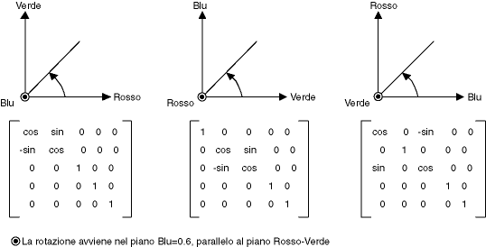

# Procedura: ruotare i colori
Rotazione in uno spazio colore quadridimensionale è difficile da visualizzare. È possibile rendere più semplice per visualizzare la rotazione, supponendo di mantenere uno dei componenti di colore predefiniti. Si supponga di mantenere il componente alfa pari a 1 (completamente opaco). È quindi possibile visualizzare uno spazio tridimensionale colore degli assi del rosso, verde e blu come illustrato nella figura seguente.  
  
   
  
 Un colore può essere considerato come un punto nello spazio 3D. Ad esempio, il punto in uno spazio (1, 0, 0) rappresenta il colore rosso e il punto in uno spazio (0, 1, 0) rappresenta il colore verde.  
  
 Nell'illustrazione seguente significato ruotare il colore (1, 0, 0) di un angolo di 60 gradi nel piano verde a rosso. Rotazione in un piano parallelo al piano verde a rosso può essere considerata come la rotazione intorno all'asse blu.  
  
   
  
 Nella figura seguente viene illustrato come inizializzare una matrice di colori per eseguire rotazioni su ciascuno dei tre assi delle coordinate (rosso, verde e blu).  
  
   
  
## Esempio  
 Nell'esempio seguente accetta un'immagine è monocromatica (1, 0, 0,6) e applica una rotazione di 60 gradi sull'asse del blu. Angolo di rotazione viene effettuata su un piano parallelo al piano verde a rosso.  
  
 Nella figura seguente mostra l'immagine originale sulla sinistra e l'immagine ruotata colore a destra.  
  
   
  
 Nella figura seguente mostra una visualizzazione della rotazione colore eseguita nel codice seguente.  
  
   
  
 [!code-csharp[System.Drawing.RotateColors#1](../../../../samples/snippets/csharp/VS_Snippets_Winforms/System.Drawing.RotateColors/CS/Form1.cs#1)]
 [!code-vb[System.Drawing.RotateColors#1](../../../../samples/snippets/visualbasic/VS_Snippets_Winforms/System.Drawing.RotateColors/VB/Form1.vb#1)]  
  
## Compilazione del codice  
 L'esempio precedente è progettato per l'uso con Windows Form e richiede <xref:System.Windows.Forms.PaintEventArgs> `e`, ovvero un parametro del <xref:System.Windows.Forms.Control.Paint> gestore dell'evento. Sostituire `RotationInput.bmp` con un nome di file di immagine e un percorso valido per il sistema.  
  
## Vedere anche  
 <xref:System.Drawing.Imaging.ColorMatrix>  
 <xref:System.Drawing.Imaging.ImageAttributes>  
 [Grafica e disegno in Windows Form](../../../../docs/framework/winforms/advanced/graphics-and-drawing-in-windows-forms.md)  
 [Ricolorazione di immagini](../../../../docs/framework/winforms/advanced/recoloring-images.md)
