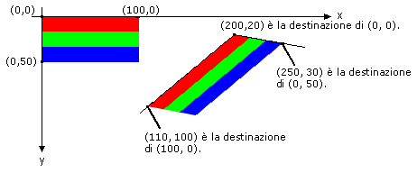

# Procedura: ruotare, riflettere e inclinare immagini
È possibile ruotare, riflettere e inclinare un'immagine, specificando i punti di destinazione per gli angoli superiore sinistro, superiore destro e inferiore sinistro dell'immagine originale. I punti di tre destinazione determinano una trasformazione affine che esegue il mapping dell'immagine rettangolare originale in un parallelogramma.  
  
## Esempio  
 Ad esempio, si supponga che l'immagine originale è un rettangolo con angoli superiore sinistro (0, 0), nell'angolo superiore destro in (100, 0) e nell'angolo inferiore sinistro a (0, 50). Ora si supponga che si esegue il mapping di quelli di tre punti ai punti di destinazione come indicato di seguito.  
  
|Punto originale|Punto di destinazione|  
|--------------------|-----------------------|  
|Alto-sinistra (0, 0)|(200, 20)|  
|Alto-destra (100, 0)|(110, 100)|  
|Basso-sinistra (0, 50)|(250, 30)|  
  
 Nella figura seguente mostra l'immagine originale e l'immagine associata al parallelogramma. L'immagine originale è stata inclinata, riflessa, ruotata e convertito. L'asse x lungo il bordo superiore dell'immagine originale viene eseguito il mapping alla riga in cui viene eseguito tramite (200, 20) e (110, 100). L'asse y lungo il bordo sinistro dell'immagine originale viene eseguito il mapping alla riga in cui viene eseguito tramite (200, 20) e (250, 30).  
  
   
  
 Nella figura seguente mostra una trasformazione analoga applicata a un'immagine fotografica.  
  
   
  
 Nella figura seguente mostra una trasformazione analoga applicata a un metafile.  
  
   
  
 Nell'esempio seguente genera le immagini mostrate nella prima figura.  
  
 [!code-csharp[System.Drawing.WorkingWithImages#61](../../../../samples/snippets/csharp/VS_Snippets_Winforms/System.Drawing.WorkingWithImages/CS/Class1.cs#61)]
 [!code-vb[System.Drawing.WorkingWithImages#61](../../../../samples/snippets/visualbasic/VS_Snippets_Winforms/System.Drawing.WorkingWithImages/VB/Class1.vb#61)]  
  
## Compilazione del codice  
 L'esempio precedente è progettato per l'uso con Windows Form e richiede <xref:System.Windows.Forms.PaintEventArgs> `e`, ovvero un parametro del <xref:System.Windows.Forms.Control.Paint> gestore dell'evento. Assicurarsi di sostituire `Stripes.bmp` con il percorso di un'immagine che è valido per il sistema.  
  
## Vedere anche  
 [Utilizzo di immagini, bitmap, icone e metafile](../../../../docs/framework/winforms/advanced/working-with-images-bitmaps-icons-and-metafiles.md)
