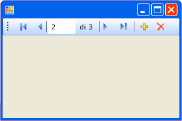

# Cenni preliminari sul controllo BindingNavigator (Windows Form)
È possibile usare il controllo <xref:System.Windows.Forms.BindingNavigator> per fornire agli utenti un metodo standard per la ricerca e la modifica dei dati in un Windows Form. <xref:System.Windows.Forms.BindingNavigator> viene spesso usato con il componente <xref:System.Windows.Forms.BindingSource> per consentire agli utenti di spostarsi tra i vari record di dati in un form e apportare modifiche ai record.  
  
## Funzionamento di BindingNavigator  
 Il controllo <xref:System.Windows.Forms.BindingNavigator> è composto da un <xref:System.Windows.Forms.ToolStrip> con una serie di oggetti <xref:System.Windows.Forms.ToolStripItem> per la maggior parte delle azioni correlate ai dati: aggiunta, eliminazione ed esplorazione. Per impostazione predefinita, il controllo <xref:System.Windows.Forms.BindingNavigator> contiene questi pulsanti standard. Nell'immagine riportata di seguito è illustrato il controllo <xref:System.Windows.Forms.BindingNavigator> in un form.  
  
   
  
 La tabella seguente elenca i vari controlli con le relative funzioni.  
  
|Controllo|Funzione|  
|-------------|--------------|  
|Pulsante <xref:System.Windows.Forms.BindingNavigator.AddNewItem%2A>|Inserisce una nuova riga nell'origine dati sottostante.|  
|Pulsante <xref:System.Windows.Forms.BindingNavigator.DeleteItem%2A>|Elimina la riga corrente dall'origine dati sottostante.|  
|Pulsante <xref:System.Windows.Forms.BindingNavigator.MoveFirstItem%2A>|Passa al primo elemento nell'origine dati sottostante.|  
|Pulsante <xref:System.Windows.Forms.BindingNavigator.MoveLastItem%2A>|Passa all'ultimo elemento nell'origine dati sottostante.|  
|Pulsante <xref:System.Windows.Forms.BindingNavigator.MoveNextItem%2A>|Passa all'elemento successivo nell'origine dati sottostante.|  
|Pulsante <xref:System.Windows.Forms.BindingNavigator.MovePreviousItem%2A>|Passa all'elemento precedente nell'origine dati sottostante.|  
|Casella di testo <xref:System.Windows.Forms.BindingNavigator.PositionItem%2A>|Restituisce la posizione corrente nell'origine dati sottostante.|  
|Casella di testo <xref:System.Windows.Forms.BindingNavigator.CountItem%2A>|Restituisce il numero totale di elementi nell'origine dati sottostante.|  
  
 A ogni controllo contenuto nell'insieme corrisponde un membro del componente <xref:System.Windows.Forms.BindingSource> che fornisce la stessa funzionalità a livello di codice. Il pulsante <xref:System.Windows.Forms.BindingNavigator.MoveFirstItem%2A>, ad esempio, corrisponde al metodo <xref:System.Windows.Forms.BindingSource.MoveFirst%2A> del componente <xref:System.Windows.Forms.BindingSource>, il pulsante <xref:System.Windows.Forms.BindingNavigator.DeleteItem%2A> corrisponde al metodo <xref:System.Windows.Forms.BindingSource.RemoveCurrent%2A> e così via.  
  
 Se i pulsanti predefiniti non sono adatti per l'applicazione in fase di sviluppo oppure se sono necessari altri pulsanti per supportare altri tipi di funzionalità, è possibile fornire pulsanti <xref:System.Windows.Forms.ToolStrip> personalizzati. Vedere anche [Procedura: Aggiungere i pulsanti Carica, Salva e Annulla al controllo BindingNavigator Windows Forms](../../../../docs/framework/winforms/controls/load-save-and-cancel-bindingnavigator.md).  
  
## Vedere anche  
 <xref:System.Windows.Forms.BindingNavigator>  
 <xref:System.Windows.Forms.BindingSource>  
 [Controllo BindingNavigator](../../../../docs/framework/winforms/controls/bindingnavigator-control-windows-forms.md)
