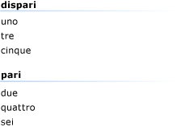

# Procedura: raggruppare elementi in un controllo ListView Windows Form utilizzando la finestra di progettazione
La funzionalità di raggruppamento del controllo <xref:System.Windows.Forms.ListView> consente di visualizzare insiemi correlati di elementi in gruppi.  Questi gruppi sono separati sullo schermo da intestazioni di gruppo orizzontali che includono il titolo dei gruppi.  È possibile utilizzare i gruppi <xref:System.Windows.Forms.ListView> per semplificare lo spostamento in elenchi contenenti numerose voci raggruppando gli elementi in ordine alfabetico, per data o in base a qualsiasi altro raggruppamento logico.  Nell'immagine riportata di seguito sono illustrati alcuni elementi raggruppati.  
  
   
  
 Nella seguente procedura è richiesto un progetto **Applicazione Windows** con un form contenente un controllo <xref:System.Windows.Forms.ListView>.  Per informazioni sull'impostazione di tali progetti, vedere [How to: Create a Windows Application Project](http://msdn.microsoft.com/it-it/b2f93fed-c635-4705-8d0e-cf079a264efa) e [Procedura: aggiungere controlli a un Windows Form](../../../../docs/framework/winforms/controls/how-to-add-controls-to-windows-forms.md).  
  
 Per attivare il raggruppamento occorre dapprima creare uno o più oggetti <xref:System.Windows.Forms.ListViewGroup> nella finestra di progettazione oppure a livello di codice.  Una volta definito, al gruppo possono essere assegnati gli elementi.  
  
> [!NOTE]
>  I gruppi <xref:System.Windows.Forms.ListView> sono disponibili solo in [!INCLUDE[WinXpFamily](../../../../includes/winxpfamily-md.md)] quando il metodo <xref:System.Windows.Forms.Application.EnableVisualStyles%2A?displayProperty=fullName> viene chiamato dall'applicazione.  Nei sistemi operativi di versioni precedenti, qualsiasi codice relativo ai gruppi non ha alcun effetto e non verranno visualizzati gruppi.  Per ulteriori informazioni, vedere <xref:System.Windows.Forms.ListView.Groups%2A?displayProperty=fullName>.  
>   
>  È possibile che le finestre di dialogo e i comandi di menu visualizzati siano diversi da quelli descritti nella Guida a seconda delle impostazioni attive o dell'edizione del programma.  Per modificare le impostazioni, scegliere **Importa\/esporta impostazioni** dal menu **Strumenti**.  Per ulteriori informazioni, vedere [Customizing Development Settings in Visual Studio](http://msdn.microsoft.com/it-it/22c4debb-4e31-47a8-8f19-16f328d7dcd3).  
  
### Per aggiungere o rimuovere gruppi nella finestra di progettazione  
  
1.  Nella finestra **Proprietà**, fare clic sul pulsante con i **puntini di sospensione** \(\) accanto alla proprietà <xref:System.Windows.Forms.ListView.Groups%2A>.  
  
     Verrà visualizzato l'**Editor della raccolta ListViewGroup**.  
  
2.  Per aggiungere un gruppo, fare clic sul pulsante **Aggiungi**.  È possibile impostare quindi le proprietà del nuovo gruppo, ad esempio le proprietà <xref:System.Windows.Forms.ListViewGroup.Header%2A> e <xref:System.Windows.Forms.ListViewGroup.HeaderAlignment%2A>.  Per rimuovere un gruppo, selezionarlo e fare clic sul pulsante **Rimuovi**.  
  
### Per assegnare elementi ai gruppi nella finestra di progettazione  
  
1.  Nella finestra **Proprietà**, fare clic sul pulsante con i **puntini di sospensione** \(\) accanto alla proprietà <xref:System.Windows.Forms.ListView.Items%2A>.  
  
     Viene visualizzato l'**Editor della raccolta ListViewItem**.  
  
2.  Per aggiungere un nuovo elemento, fare clic sul pulsante **Aggiungi**.  È possibile impostare quindi le proprietà del nuovo elemento, ad esempio le proprietà <xref:System.Windows.Forms.ListViewItem.Text%2A> e <xref:System.Windows.Forms.ListViewItem.ImageIndex%2A>.  
  
3.  Selezionare la proprietà <xref:System.Windows.Forms.ListViewItem.Group%2A> e scegliere un gruppo dall'elenco a discesa.  
  
## Vedere anche  
 <xref:System.Windows.Forms.ListView>   
 <xref:System.Windows.Forms.ListView.Groups%2A>   
 <xref:System.Windows.Forms.ListViewGroup>   
 [Controllo ListView](../../../../docs/framework/winforms/controls/listview-control-windows-forms.md)   
 [Cenni preliminari sul controllo ListView](../../../../docs/framework/winforms/controls/listview-control-overview-windows-forms.md)   
 [Windows XP Features and Windows Forms Controls](http://msdn.microsoft.com/it-it/bc7fab94-fce9-4bf1-a8ad-a5837c91c3c0)   
 [Procedura: aggiungere e rimuovere elementi tramite il controllo ListView di Windows Form](../../../../docs/framework/winforms/controls/how-to-add-and-remove-items-with-the-windows-forms-listview-control.md)