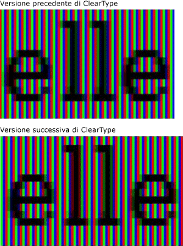

# Cenni preliminari su ClearType
Questo argomento offre una panoramica della tecnologia [!INCLUDE[TLA#tla_ct](../../../../includes/tlasharptla-ct-md.md)] presente disponibile in [!INCLUDE[TLA#tla_winclient](../../../../includes/tlasharptla-winclient-md.md)].  
  
  
   
## Informazioni generali sulla tecnologia  
 [!INCLUDE[TLA2#tla_ct](../../../../includes/tla2sharptla-ct-md.md)] è una tecnologia software sviluppata da [!INCLUDE[TLA#tla_ms](../../../../includes/tlasharptla-ms-md.md)] che consente di migliorare la leggibilità del testo sui display LCD (Liquid Crystal Display), ad esempio gli schermi di computer portatili, Pocket PC e i monitor a schermo piatto.  Il funzionamento della tecnologia [!INCLUDE[TLA2#tla_ct](../../../../includes/tla2sharptla-ct-md.md)] si basa sull'accesso a singoli elementi striscia di colore verticali in ogni pixel di uno schermo LCD. Prima di [!INCLUDE[TLA2#tla_ct](../../../../includes/tla2sharptla-ct-md.md)] il livello di dettaglio minimo che un computer era in grado di visualizzare era pari a un solo pixel. Usando [!INCLUDE[TLA2#tla_ct](../../../../includes/tla2sharptla-ct-md.md)] in un monitor LCD, invece, ora è possibile visualizzare parti del testo di misura pari a una frazione di pixel di larghezza. La risoluzione aggiuntiva aumenta la nitidezza dei piccoli dettagli nella visualizzazione del testo, rendendone più facile la lettura per periodi prolungati.  
  
 La versione di [!INCLUDE[TLA2#tla_ct](../../../../includes/tla2sharptla-ct-md.md)] disponibile in [!INCLUDE[TLA#tla_winclient](../../../../includes/tlasharptla-winclient-md.md)] è l'ultima generazione di [!INCLUDE[TLA2#tla_ct](../../../../includes/tla2sharptla-ct-md.md)] e presenta diversi miglioramenti rispetto alla versione presente in [!INCLUDE[TLA#tla_gdi](../../../../includes/tlasharptla-gdi-md.md)].  
  
   
## Posizionamento dei subpixel  
 Un miglioramento significativo rispetto alla versione precedente di [!INCLUDE[TLA2#tla_ct](../../../../includes/tla2sharptla-ct-md.md)] è l'uso del posizionamento dei subpixel. A differenza dell'implementazione di [!INCLUDE[TLA2#tla_ct](../../../../includes/tla2sharptla-ct-md.md)] presente in [!INCLUDE[TLA2#tla_gdi](../../../../includes/tla2sharptla-gdi-md.md)], la versione di [!INCLUDE[TLA2#tla_ct](../../../../includes/tla2sharptla-ct-md.md)] disponibile in [!INCLUDE[TLA#tla_winclient](../../../../includes/tlasharptla-winclient-md.md)] consente di inserire i glifi all'interno del pixel e non solo nel limite iniziale del pixel. Grazie a questa risoluzione aggiuntiva nel posizionamento dei glifi, la spaziatura e le proporzioni dei glifi risultano più precise e coerenti.  
  
 Nei due esempi seguenti viene mostrato come è possibile inserire i glifi su qualsiasi limite del subpixel se si usa il posizionamento dei subpixel. Per il rendering dell'esempio a sinistra viene usata la versione precedente del renderer [!INCLUDE[TLA2#tla_ct](../../../../includes/tla2sharptla-ct-md.md)] che non impiega il posizionamento dei subpixel. Per il rendering dell'esempio a destra viene usata la nuova versione del renderer [!INCLUDE[TLA2#tla_ct](../../../../includes/tla2sharptla-ct-md.md)], che impiega il posizionamento dei subpixel. Notare che il rendering dei caratteri **e** e **l** nell'immagine a destra è leggermente diverso in quanto ognuno inizia in corrispondenza di un subpixel diverso. Quando il testo viene visualizzato sullo schermo con le dimensioni normali, questa differenza non è ben visibile a causa dell'elevato contrasto dell'immagine del glifo e può essere notata solo grazie al sofisticato filtro colore incorporato in [!INCLUDE[TLA2#tla_ct](../../../../includes/tla2sharptla-ct-md.md)].  
  
   
Testo visualizzato con la versione precedente e quella successiva di ClearType  
  
 Nei due esempi seguenti viene confrontato l'output del renderer [!INCLUDE[TLA2#tla_ct](../../../../includes/tla2sharptla-ct-md.md)] precedente con la versione nuova del renderer [!INCLUDE[TLA2#tla_ct](../../../../includes/tla2sharptla-ct-md.md)]. Il posizionamento dei subpixel, mostrato a destra, consente di migliorare notevolmente la spaziatura dei tipi sullo schermo, specialmente alle dimensioni più piccole, in cui la differenza tra un subpixel e un pixel intero rappresenta una parte significativa della larghezza del glifo. Notare che la spaziatura tra le lettere è più uniforme nella seconda immagine. Il vantaggio complessivo derivante dal posizionamento dei subpixel sull'aspetto globale di una schermata di testo aumenta in modo notevole e rappresenta un'evoluzione significativa nella tecnologia [!INCLUDE[TLA2#tla_ct](../../../../includes/tla2sharptla-ct-md.md)].  
  
   
Confronto tra il testo visualizzato con la versione precedente di ClearType e quello visualizzato con la versione successiva  
  
   
## Anti-aliasing della direzione Y  
 Un altro miglioramento di [!INCLUDE[TLA2#tla_ct](../../../../includes/tla2sharptla-ct-md.md)] in [!INCLUDE[TLA#tla_winclient](../../../../includes/tlasharptla-winclient-md.md)] è relativo all'anti-aliasing della direzione y. [!INCLUDE[TLA2#tla_ct](../../../../includes/tla2sharptla-ct-md.md)] in [!INCLUDE[TLA2#tla_gdi](../../../../includes/tla2sharptla-gdi-md.md)] senza anti-aliasing della direzione y fornisce una risoluzione ottimale sull'asse x, ma non sull'asse y. Nelle parti superiori e inferiori delle curve poco pronunciate, i bordi frastagliati riducono la leggibilità.  
  
 L'esempio seguente mostra l'effetto dell'assenza di anti-aliasing della direzione y. In questo caso, i bordi frastagliati nella parte superiore e inferiore della lettera sono chiaramente visibili.  
  
   
Testo con bordi frastagliati su curve poco pronunciate  
  
 [!INCLUDE[TLA2#tla_ct](../../../../includes/tla2sharptla-ct-md.md)]in [!INCLUDE[TLA#tla_winclient](../../../../includes/tlasharptla-winclient-md.md)] fornisce l'anti-aliasing del livello della direzione y per smussare tutti i bordi frastagliati. Tale funzionalità è particolarmente importante per migliorare la leggibilità delle lingue asiatiche, nelle quali gli ideogrammi presentano un quantità quasi uguale di curve poco pronunciate orizzontali e verticali.  
  
 L'esempio seguente illustra gli effetti dell'anti-aliasing della direzione Y. In questo caso, la parte superiore e quella inferiore della lettera mostrano una curva uniforme.  
  
   
Testo con anti-aliasing della direzione y ClearType  
  
   
## Accelerazione hardware  
 [!INCLUDE[TLA2#tla_ct](../../../../includes/tla2sharptla-ct-md.md)]in [!INCLUDE[TLA#tla_winclient](../../../../includes/tlasharptla-winclient-md.md)] può sfruttare l'accelerazione hardware per ottenere prestazioni migliori e ridurre il carico della CPU e i requisiti della memoria di sistema. Usando i pixel shader e la memoria video di una scheda grafica, [!INCLUDE[TLA2#tla_ct](../../../../includes/tla2sharptla-ct-md.md)] consente un rendering più veloce del testo, in particolare quando si usa l'animazione.  
  
 [!INCLUDE[TLA2#tla_ct](../../../../includes/tla2sharptla-ct-md.md)]in [!INCLUDE[TLA#tla_winclient](../../../../includes/tlasharptla-winclient-md.md)] non modifica le impostazioni di [!INCLUDE[TLA2#tla_ct](../../../../includes/tla2sharptla-ct-md.md)] a livello di sistema. Se si disabilita [!INCLUDE[TLA2#tla_ct](../../../../includes/tla2sharptla-ct-md.md)] in [!INCLUDE[TLA#tla_mswin](../../../../includes/tlasharptla-mswin-md.md)] l'anti-aliasing di [!INCLUDE[TLA#tla_winclient](../../../../includes/tlasharptla-winclient-md.md)] viene impostato sulla modalità scala di grigi. Inoltre, [!INCLUDE[TLA2#tla_ct](../../../../includes/tla2sharptla-ct-md.md)] in [!INCLUDE[TLA#tla_winclient](../../../../includes/tlasharptla-winclient-md.md)] non modifica le impostazioni di [ClearType Tuner PowerToy](http://www.microsoft.com/typography/ClearTypePowerToy.mspx).  
  
 Una delle decisioni relative alla progettazione dell'architettura di [!INCLUDE[TLA#tla_winclient](../../../../includes/tlasharptla-winclient-md.md)] consiste nel disporre di monitor DPI a risoluzione più elevata con supporto migliorato del layout indipendente dalla risoluzione, di diffusione sempre maggiore. Come conseguenza di tale scelta, [!INCLUDE[TLA#tla_winclient](../../../../includes/tlasharptla-winclient-md.md)] non supporta il rendering del testo con anti-aliasing o le bitmap in alcuni tipi di carattere asiatici in quanto entrambi sono dipendenti dalla risoluzione.  
  
   
## Ulteriori informazioni  
 [Informazioni su ClearType](http://www.microsoft.com/typography/ClearTypeInfo.mspx)  
  
 [ClearType Tuner PowerToy](http://www.microsoft.com/typography/ClearTypePowerToy.mspx)  
  
## Vedere anche  
 [Impostazioni del Registro di sistema ClearType](../../../../docs/framework/wpf/advanced/cleartype-registry-settings.md)
