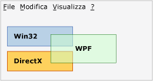
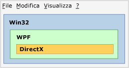

# Cenni preliminari sulle aree di tecnologia
Se in un'applicazione si usano più tecnologie di presentazione, ad esempio WPF, Win32 o DirectX, queste devono condividere le aree di rendering all'interno di una finestra comune di primo livello. Questo argomento descrive i problemi che potrebbero influire sulla presentazione e l'input per l'applicazione di interoperatività WPF.  
  
## Aree  
 È possibile partire dal concetto che, all'interno di una finestra di primo livello, ogni HWND che include una delle tecnologie di un'applicazione di interoperatività ha una propria area, anche detta "spazio aereo". Ogni pixel all'interno della finestra appartiene esattamente a un HWND e ne costituisce l'area. Per essere precisi, se esistono più HWND [!INCLUDE[TLA2#tla_winclient](../../../../includes/tla2sharptla-winclient-md.md)], esisteranno più aree di [!INCLUDE[TLA2#tla_winclient](../../../../includes/tla2sharptla-winclient-md.md)], ma ai fini di questa spiegazione si può presupporre che ne esista uno solo. Il concetto di area implica che tutti i livelli o le altre finestre che provano a eseguire il rendering sopra tale pixel nel corso della durata dell'applicazione devono essere parte della stessa tecnologia a livello di rendering. Il tentativo di eseguire il rendering dei pixel [!INCLUDE[TLA2#tla_winclient](../../../../includes/tla2sharptla-winclient-md.md)] su [!INCLUDE[TLA2#tla_win32](../../../../includes/tla2sharptla-win32-md.md)] causa risultati indesiderati e viene impedito per quanto possibile tramite le [!INCLUDE[TLA2#tla_api#plural](../../../../includes/tla2sharptla-apisharpplural-md.md)] di interoperatività.  
  
### Esempi di area  
 La figura seguente illustra un'applicazione in cui sono combinati [!INCLUDE[TLA2#tla_win32](../../../../includes/tla2sharptla-win32-md.md)], [!INCLUDE[TLA2#tla_dx](../../../../includes/tla2sharptla-dx-md.md)] e [!INCLUDE[TLA2#tla_winclient](../../../../includes/tla2sharptla-winclient-md.md)]. Ogni tecnologia usa un set di pixel specifico distinto, non sovrapposto, per cui non esistono problemi di area.  
  
   
  
 Si supponga che questa applicazione usi la posizione del puntatore del mouse per creare un'animazione che prova a eseguire il rendering su una qualsiasi di queste tre aree. Indipendentemente dalla tecnologia responsabile dell'animazione stessa, quella tecnologia violerebbe l'area delle altre due. La figura seguente illustra il tentativo di rendering di un cerchio WPF in un'area di Win32.  
  
   
  
 Un'altra violazione si verifica quando si prova a usare la trasparenza o la fusione alfa tra tecnologie diverse.  Nella figura seguente la finestra di [!INCLUDE[TLA2#tla_winclient](../../../../includes/tla2sharptla-winclient-md.md)] viola le aree di [!INCLUDE[TLA2#tla_win32](../../../../includes/tla2sharptla-win32-md.md)] e [!INCLUDE[TLA2#tla_dx](../../../../includes/tla2sharptla-dx-md.md)]. Poiché i pixel della finestra [!INCLUDE[TLA2#tla_winclient](../../../../includes/tla2sharptla-winclient-md.md)] sono semitrasparenti, dovrebbero essere di proprietà congiunta di [!INCLUDE[TLA2#tla_dx](../../../../includes/tla2sharptla-dx-md.md)] e [!INCLUDE[TLA2#tla_winclient](../../../../includes/tla2sharptla-winclient-md.md)], la qual cosa è impossibile.  Pertanto, si tratta di un'altra violazione che rende la compilazione impossibile.  
  
   
  
 Nei tre esempi precedenti vengono usate aree rettangolari, ma si possono usare altre forme.  Ad esempio, un'area può presentare un foro. La figura seguente illustra un'area di [!INCLUDE[TLA2#tla_win32](../../../../includes/tla2sharptla-win32-md.md)] con un foro rettangolare della stessa dimensione delle aree di [!INCLUDE[TLA2#tla_winclient](../../../../includes/tla2sharptla-winclient-md.md)] e [!INCLUDE[TLA2#tla_dx](../../../../includes/tla2sharptla-dx-md.md)].  
  
   
  
 Le aree possono essere anche non rettangolari o di qualsiasi forma che possa essere descritta da un tipo HRGN [!INCLUDE[TLA2#tla_win32](../../../../includes/tla2sharptla-win32-md.md)] (area).  
  
   
  
## Trasparenza e finestre di primo livello  
 La funzionalità Gestione finestre di Windows in realtà elabora solo HWND [!INCLUDE[TLA2#tla_win32](../../../../includes/tla2sharptla-win32-md.md)]. Pertanto, ogni [!INCLUDE[TLA2#tla_winclient](../../../../includes/tla2sharptla-winclient-md.md)] <xref:System.Windows.Window> è un elemento HWND. Il <xref:System.Windows.Window> HWND deve rispettare le regole generali per tutti gli elementi HWND. All'interno dell'elemento HWND specifico, il codice [!INCLUDE[TLA2#tla_winclient](../../../../includes/tla2sharptla-winclient-md.md)] può eseguire tutte le operazioni supportate dalle [!INCLUDE[TLA2#tla_api#plural](../../../../includes/tla2sharptla-apisharpplural-md.md)] [!INCLUDE[TLA2#tla_winclient](../../../../includes/tla2sharptla-winclient-md.md)]. Per le interazioni con altri HWND sul desktop, [!INCLUDE[TLA2#tla_winclient](../../../../includes/tla2sharptla-winclient-md.md)] deve attenersi alle regole di elaborazione e di rendering di [!INCLUDE[TLA2#tla_win32](../../../../includes/tla2sharptla-win32-md.md)].  [!INCLUDE[TLA2#tla_winclient](../../../../includes/tla2sharptla-winclient-md.md)] supporta finestre non rettangolari grazie alle [!INCLUDE[TLA2#tla_api#plural](../../../../includes/tla2sharptla-apisharpplural-md.md)] [!INCLUDE[TLA2#tla_win32](../../../../includes/tla2sharptla-win32-md.md)], ovvero oggetti HRGN per finestre non rettangolari e finestre sovrapposte per un valore alfa per pixel.  
  
 La costante alfa e le chiavi di colore non sono supportate.  Le funzionalità delle finestre sovrapposte [!INCLUDE[TLA2#tla_win32](../../../../includes/tla2sharptla-win32-md.md)] variano in base alla piattaforma.  
  
 Le finestre sovrapposte possono rendere semitrasparente l'intera finestra specificando un valore alfa da applicare a tutti i pixel della finestra.  [!INCLUDE[TLA2#tla_win32](../../../../includes/tla2sharptla-win32-md.md)] supporta in effetti il valore alfa per pixel, che è però molto difficile da usare nella pratica in quanto in questa modalità è necessario disegnare manualmente ogni HWND figlio, inclusi finestre di dialogo ed elenchi a discesa.  
  
 [!INCLUDE[TLA2#tla_winclient](../../../../includes/tla2sharptla-winclient-md.md)] supporta gli HRGN, ma non esistono [!INCLUDE[TLA2#tla_api#plural](../../../../includes/tla2sharptla-apisharpplural-md.md)] gestite per questa funzionalità. È possibile usare platform invoke e <xref:System.Windows.Interop.HwndSource> per chiamare le appropriate [!INCLUDE[TLA2#tla_win32](../../../../includes/tla2sharptla-win32-md.md)] [!INCLUDE[TLA2#tla_api#plural](../../../../includes/tla2sharptla-apisharpplural-md.md)]. Per altre informazioni, vedere [Chiamata di funzioni native da codice gestito](/cpp/dotnet/calling-native-functions-from-managed-code).  
  
 Le finestre sovrapposte di [!INCLUDE[TLA2#tla_winclient](../../../../includes/tla2sharptla-winclient-md.md)] hanno funzionalità diverse in sistemi operativi diversi. Il motivo è che [!INCLUDE[TLA2#tla_winclient](../../../../includes/tla2sharptla-winclient-md.md)] usa [!INCLUDE[TLA2#tla_dx](../../../../includes/tla2sharptla-dx-md.md)] per il rendering e le finestre sovrapposte sono state progettate principalmente per il rendering [!INCLUDE[TLA2#tla_gdi](../../../../includes/tla2sharptla-gdi-md.md)], non per il rendering [!INCLUDE[TLA2#tla_dx](../../../../includes/tla2sharptla-dx-md.md)].  
  
-   [!INCLUDE[TLA2#tla_winclient](../../../../includes/tla2sharptla-winclient-md.md)] supporta le finestre sovrapposte con accelerazione hardware in [!INCLUDE[TLA#tla_longhorn](../../../../includes/tlasharptla-longhorn-md.md)] e versioni successive. Le finestre sovrapposte con accelerazione hardware di [!INCLUDE[TLA2#tla_winxp](../../../../includes/tla2sharptla-winxp-md.md)] richiedono il supporto da parte di [!INCLUDE[TLA#tla_dx](../../../../includes/tlasharptla-dx-md.md)], quindi le funzionalità dipenderanno dalla versione di [!INCLUDE[TLA#tla_dx](../../../../includes/tlasharptla-dx-md.md)] di quel computer.  
  
-   [!INCLUDE[TLA2#tla_winclient](../../../../includes/tla2sharptla-winclient-md.md)] non supporta chiavi di colore trasparenza in quanto [!INCLUDE[TLA2#tla_winclient](../../../../includes/tla2sharptla-winclient-md.md)] non può garantire di eseguire il rendering del colore esatto richiesto, in particolare quando il rendering usa l'accelerazione hardware.  
  
-   Se l'applicazione viene eseguita in [!INCLUDE[TLA2#tla_winxp](../../../../includes/tla2sharptla-winxp-md.md)], le finestre sovrapposte alle superfici [!INCLUDE[TLA2#tla_dx](../../../../includes/tla2sharptla-dx-md.md)] sono soggette a sfarfallio quando l'applicazione [!INCLUDE[TLA2#tla_dx](../../../../includes/tla2sharptla-dx-md.md)] esegue il rendering.  Durante la sequenza di rendering effettiva, [!INCLUDE[TLA#tla_gdi](../../../../includes/tlasharptla-gdi-md.md)] nasconde la finestra sovrapposta, quindi [!INCLUDE[TLA2#tla_dx](../../../../includes/tla2sharptla-dx-md.md)] esegue il disegno e infine [!INCLUDE[TLA#tla_gdi](../../../../includes/tlasharptla-gdi-md.md)] mostra nuovamente la finestra sovrapposta.  Anche le finestre sovrapposte non [!INCLUDE[TLA2#tla_winclient](../../../../includes/tla2sharptla-winclient-md.md)] sono soggette a questa limitazione.  
  
## Vedere anche  
 [Interoperatività di WPF e Win32](../../../../docs/framework/wpf/advanced/wpf-and-win32-interoperation.md)  
 [Procedura dettagliata: Hosting di un oggetto Clock WPF in Win32](../../../../docs/framework/wpf/advanced/walkthrough-hosting-a-wpf-clock-in-win32.md)  
 [Hosting di contenuto Win32 in WPF](../../../../docs/framework/wpf/advanced/hosting-win32-content-in-wpf.md)
