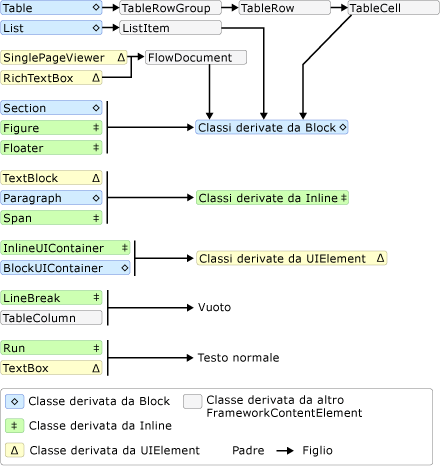

# Cenni preliminari sul modello di contenuto TextElement
In questi cenni preliminari sul modello di contenuto viene descritto il contenuto supportato per un oggetto <xref:System.Windows.Documents.TextElement>.  La classe <xref:System.Windows.Documents.Paragraph> è un tipo di <xref:System.Windows.Documents.TextElement>.  Un modello di contenuto consente di descrivere gli oggetti o gli elementi che possono essere contenuti in altri oggetti o elementi.  In questi cenni preliminari viene riepilogato il modello di contenuto utilizzato per gli oggetti derivati da <xref:System.Windows.Documents.TextElement>.  Per ulteriori informazioni, vedere [Cenni preliminari sui documenti dinamici](../../../../docs/framework/wpf/advanced/flow-document-overview.md).  
  
   
  
   
## Diagramma del modello di contenuto  
 Nel diagramma riportato di seguito viene riepilogato il modello di contenuto per le classi derivate da <xref:System.Windows.Documents.TextElement>, nonché il modo per far rientrare altre classi non `TextElement` in tale modello.  
  
   
  
 Come è possibile osservare dal diagramma precedente, gli elementi figlio consentiti per un elemento non vengono necessariamente determinati in base alla derivazione di una classe dalla classe <xref:System.Windows.Documents.Block> o da una classe <xref:System.Windows.Documents.Inline>.  Ad esempio, una classe <xref:System.Windows.Documents.Span> \(derivata da <xref:System.Windows.Documents.Inline>\) può includere solo elementi figlio <xref:System.Windows.Documents.Inline>, mentre una classe <xref:System.Windows.Documents.Figure> \(derivata sempre da <xref:System.Windows.Documents.Inline>\) può includere solo elementi figlio <xref:System.Windows.Documents.Block>.  Pertanto, un diagramma è utile a determinare rapidamente quale elemento può essere contenuto in un altro elemento.  Ad esempio, è possibile utilizzare il diagramma per determinare la modalità di costruzione del contenuto di flusso di un oggetto <xref:System.Windows.Controls.RichTextBox>.  
  
1.  Un oggetto <xref:System.Windows.Controls.RichTextBox> deve contenere un oggetto <xref:System.Windows.Documents.FlowDocument> che a sua volta deve includere un oggetto derivato da <xref:System.Windows.Documents.Block>.  Di seguito viene riportato il corrispondente segmento del diagramma precedente.  
  
       
  
     Pertanto, l'aspetto del markup potrebbe essere quello visualizzato di seguito.  
  
     [!code-xml[FlowOvwSnippets_snip#SchemaWalkThrough1](../../../../samples/snippets/csharp/VS_Snippets_Wpf/FlowOvwSnippets_snip/CS/MiscSnippets.xaml#schemawalkthrough1)]  
  
2.  In base al diagramma, è possibile scegliere tra diversi elementi <xref:System.Windows.Documents.Block>, inclusi <xref:System.Windows.Documents.Paragraph>, <xref:System.Windows.Documents.Section>, <xref:System.Windows.Documents.Table>, <xref:System.Windows.Documents.List> e <xref:System.Windows.Documents.BlockUIContainer> \(vedere le classi derivate da Block nel diagramma precedente\).  Si supponga ad esempio di cercare un oggetto <xref:System.Windows.Documents.Table>.  In base al diagramma precedente, un oggetto <xref:System.Windows.Documents.Table> contiene un oggetto <xref:System.Windows.Documents.TableRowGroup> che include a sua volta elementi <xref:System.Windows.Documents.TableRow>, che contengono elementi <xref:System.Windows.Documents.TableCell> che includono infine un oggetto derivato da <xref:System.Windows.Documents.Block>.  Di seguito viene riportato il segmento corrispondente relativo a <xref:System.Windows.Documents.Table>, tratto dal diagramma precedente.  
  
       
  
     Ecco il markup corrispondente.  
  
     [!code-xml[FlowOvwSnippets_snip#SchemaWalkThrough2](../../../../samples/snippets/csharp/VS_Snippets_Wpf/FlowOvwSnippets_snip/CS/MiscSnippets.xaml#schemawalkthrough2)]  
  
3.  Anche in questo caso, uno o più elementi <xref:System.Windows.Documents.Block> devono essere presenti in un oggetto <xref:System.Windows.Documents.TableCell>.  Per rendere più evidente l'esempio, viene inserito del testo nella cella.  A tal fine, si utilizza un oggetto <xref:System.Windows.Documents.Paragraph> con un elemento <xref:System.Windows.Documents.Run>.  Di seguito vengono riportati i segmenti corrispondenti del diagramma, che indicano che un oggetto <xref:System.Windows.Documents.Paragraph> può accettare un elemento <xref:System.Windows.Documents.Inline> e che un oggetto <xref:System.Windows.Documents.Run> \(un elemento <xref:System.Windows.Documents.Inline>\) può accettare solo il testo normale.  
  
       
  
       
  
 Di seguito viene mostrato l'intero esempio a livello di markup.  
  
 [!code-xml[FlowOvwSnippets_snip#SchemaExampleWholePage](../../../../samples/snippets/csharp/VS_Snippets_Wpf/FlowOvwSnippets_snip/CS/SchemaExample.xaml#schemaexamplewholepage)]  
  
   
## Utilizzo del contenuto TextElement a livello di codice  
 Dal momento che il contenuto di un oggetto <xref:System.Windows.Documents.TextElement> è costituito da raccolte, la modifica a livello di codice del contenuto dell'oggetto <xref:System.Windows.Documents.TextElement> viene eseguita utilizzando tali raccolte.  Esistono tre diverse raccolte utilizzate dalle classi derivate da <xref:System.Windows.Documents.TextElement>:  
  
-   <xref:System.Windows.Documents.InlineCollection>: rappresenta una raccolta di elementi <xref:System.Windows.Documents.Inline>.  <xref:System.Windows.Documents.InlineCollection> definisce il contenuto figlio consentito degli elementi <xref:System.Windows.Documents.Paragraph>, <xref:System.Windows.Documents.Span> e <xref:System.Windows.Controls.TextBlock>.  
  
-   <xref:System.Windows.Documents.BlockCollection>: rappresenta una raccolta di elementi <xref:System.Windows.Documents.Block>.  <xref:System.Windows.Documents.BlockCollection> definisce il contenuto figlio consentito degli elementi <xref:System.Windows.Documents.FlowDocument>, <xref:System.Windows.Documents.Section>, <xref:System.Windows.Documents.ListItem>, <xref:System.Windows.Documents.TableCell>, <xref:System.Windows.Documents.Floater> e <xref:System.Windows.Documents.Figure>.  
  
-   <xref:System.Windows.Documents.ListItemCollection>: elemento di contenuto del flusso che rappresenta un particolare elemento di contenuto in un oggetto <xref:System.Windows.Documents.List> ordinato o non ordinato.  
  
 È possibile modificare ovvero aggiungere o rimuovere elementi da queste raccolte utilizzando le rispettive proprietà di **Inlines**, **Blocks** e **ListItems**.  Negli esempi seguenti viene illustrata la modifica del contenuto di un oggetto Span tramite la proprietà **Inlines**.  
  
> [!NOTE]
>  Per modificare i contenuti di una tabella vengono utilizzate diverse raccolte, che tuttavia non vengono illustrate in questa sezione.  Per ulteriori informazioni, vedere [Cenni preliminari sull'elemento Table](../../../../docs/framework/wpf/advanced/table-overview.md).  
  
 Nell'esempio seguente viene creato un nuovo oggetto <xref:System.Windows.Documents.Span> e viene quindi utilizzato il metodo `Add` per aggiungere due sequenze di testo come elementi di contenuto figlio di <xref:System.Windows.Documents.Span>.  
  
 [!code-csharp[SpanSnippets#_SpanInlinesAdd](../../../../samples/snippets/csharp/VS_Snippets_Wpf/SpanSnippets/CSharp/Window1.xaml.cs#_spaninlinesadd)]
 [!code-vb[SpanSnippets#_SpanInlinesAdd](../../../../samples/snippets/visualbasic/VS_Snippets_Wpf/SpanSnippets/visualbasic/window1.xaml.vb#_spaninlinesadd)]  
  
 Nell'esempio seguente viene creato un nuovo elemento <xref:System.Windows.Documents.Run> che viene inserito all'inizio dell'oggetto <xref:System.Windows.Documents.Span>.  
  
 [!code-csharp[SpanSnippets#_SpanInlinesInsert](../../../../samples/snippets/csharp/VS_Snippets_Wpf/SpanSnippets/CSharp/Window1.xaml.cs#_spaninlinesinsert)]
 [!code-vb[SpanSnippets#_SpanInlinesInsert](../../../../samples/snippets/visualbasic/VS_Snippets_Wpf/SpanSnippets/visualbasic/window1.xaml.vb#_spaninlinesinsert)]  
  
 Nell'esempio riportato di seguito viene eliminato l'ultimo elemento <xref:System.Windows.Documents.Inline> di <xref:System.Windows.Documents.Span>.  
  
 [!code-csharp[SpanSnippets#_SpanInlinesRemoveLast](../../../../samples/snippets/csharp/VS_Snippets_Wpf/SpanSnippets/CSharp/Window1.xaml.cs#_spaninlinesremovelast)]
 [!code-vb[SpanSnippets#_SpanInlinesRemoveLast](../../../../samples/snippets/visualbasic/VS_Snippets_Wpf/SpanSnippets/visualbasic/window1.xaml.vb#_spaninlinesremovelast)]  
  
 Nell'esempio riportato di seguito viene cancellato tutto il contenuto \(gli elementi <xref:System.Windows.Documents.Inline>\) dall'oggetto <xref:System.Windows.Documents.Span>.  
  
 [!code-csharp[SpanSnippets#_SpanInlinesClear](../../../../samples/snippets/csharp/VS_Snippets_Wpf/SpanSnippets/CSharp/Window1.xaml.cs#_spaninlinesclear)]
 [!code-vb[SpanSnippets#_SpanInlinesClear](../../../../samples/snippets/visualbasic/VS_Snippets_Wpf/SpanSnippets/visualbasic/window1.xaml.vb#_spaninlinesclear)]  
  
   
## Tipi che condividono questo modello di contenuto  
 I seguenti tipi ereditano dalla classe <xref:System.Windows.Documents.TextElement> e possono essere utilizzati per visualizzare il contenuto descritto in questi cenni preliminari.  
  
 <xref:System.Windows.Documents.Bold>, <xref:System.Windows.Documents.Figure>, <xref:System.Windows.Documents.Floater>, <xref:System.Windows.Documents.Hyperlink>, <xref:System.Windows.Documents.InlineUIContainer>, <xref:System.Windows.Documents.Italic>, <xref:System.Windows.Documents.LineBreak>, <xref:System.Windows.Documents.List>, <xref:System.Windows.Documents.ListItem>, <xref:System.Windows.Documents.Paragraph>, <xref:System.Windows.Documents.Run>, <xref:System.Windows.Documents.Section>, <xref:System.Windows.Documents.Span>, <xref:System.Windows.Documents.Table>, <xref:System.Windows.Documents.Underline>.  
  
 Notare che in questo elenco sono inclusi solo i tipi non astratti distribuiti con [!INCLUDE[TLA2#tla_winfxsdk](../../../../includes/tla2sharptla-winfxsdk-md.md)].  È possibile utilizzare altri tipi che ereditano da <xref:System.Windows.Documents.TextElement>.  
  
   
## Tipi in grado di contenere oggetti TextElement  
 Vedere [Modello di contenuto WPF](../../../../docs/framework/wpf/controls/wpf-content-model.md).  
  
## Vedere anche  
 [Modificare un oggetto FlowDocument tramite la proprietà Blocks](../../../../docs/framework/wpf/advanced/how-to-manipulate-a-flowdocument-through-the-blocks-property.md)   
 [Modificare elementi di contenuto del flusso tramite la proprietà Blocks](../../../../docs/framework/wpf/advanced/how-to-manipulate-flow-content-elements-through-the-blocks-property.md)   
 [Modificare un oggetto FlowDocument tramite la proprietà Blocks](../../../../docs/framework/wpf/advanced/how-to-manipulate-a-flowdocument-through-the-blocks-property.md)   
 [Modificare le colonne di una tabella tramite la proprietà Columns](../../../../docs/framework/wpf/advanced/how-to-manipulate-table-columns-through-the-columns-property.md)   
 [Modificare i gruppi di righe di una tabella tramite la proprietà RowGroups](../../../../docs/framework/wpf/advanced/how-to-manipulate-table-row-groups-through-the-rowgroups-property.md)