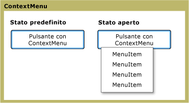

# ContextMenu
Il <xref:System.Windows.Controls.ContextMenu> consente a un controllo visualizzare un <xref:System.Windows.Controls.Menu> che è specifico per il contesto del controllo. In genere, il <xref:System.Windows.Controls.ContextMenu> è esposto nel [!INCLUDE[TLA#tla_ui](../../../../includes/tlasharptla-ui-md.md)] tramite il pulsante destro del mouse o tramite il pulsante di menu della tastiera.  
  
 Nella figura seguente viene illustrato un <xref:System.Windows.Controls.ContextMenu> in due stati diversi: lo stato predefinito e lo stato aperto. Nello stato predefinito, il controllo viene compresso. Premendo il pulsante destro del mouse sull'elemento padre del menu di scelta, il controllo si espande e visualizza le voci di menu.  
  
   
Menu di scelta rapida in stati diversi  
  
## Contenuto della sezione  
 [Panoramica sull'oggetto ContextMenu](../../../../docs/framework/wpf/controls/contextmenu-overview.md)  
  
## Riferimento  
 <xref:System.Windows.Controls.ContextMenu>  
  
## Sezioni correlate
