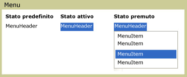

# Menu
Oggetto <xref:System.Windows.Controls.Menu> è un controllo che consente l'organizzazione gerarchica degli elementi associati a comandi e gestori eventi. Ogni <xref:System.Windows.Controls.Menu> può contenere più <xref:System.Windows.Controls.MenuItem> controlli. Ogni <xref:System.Windows.Controls.MenuItem> può richiamare un comando o richiamare un `Click` gestore dell'evento. Oggetto <xref:System.Windows.Controls.MenuItem> può anche avere più <xref:System.Windows.Controls.MenuItem> gli elementi figlio, creando un sottomenu.  
  
 Nella figura seguente mostra i tre diversi stati di un controllo menu. Il valore predefinito è quando nessun dispositivo, ad esempio il puntatore del mouse si sofferma sul <xref:System.Windows.Controls.Menu>. Lo stato attivo si verifica quando il puntatore del mouse viene posizionato sul <xref:System.Windows.Controls.Menu> e premuto si verifica quando si fa clic sul pulsante del mouse su di <xref:System.Windows.Controls.Menu>.  
  
   
Menu in stati diversi  
  
## In questa sezione  
 [Panoramica sulla classe Menu](../../../../docs/framework/wpf/controls/menu-overview.md)  
  
## Riferimenti  
 <xref:System.Windows.Controls.Menu>  
  <xref:System.Windows.Controls.MenuItem>  
  <xref:System.Windows.Controls.Primitives.MenuBase>  
  <xref:System.Windows.Controls.ContextMenu>  
  
## Sezioni correlate
