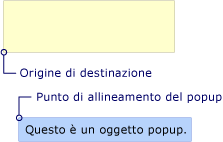
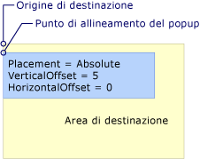
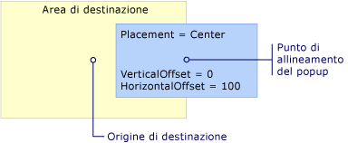
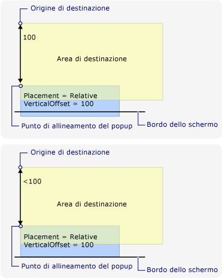
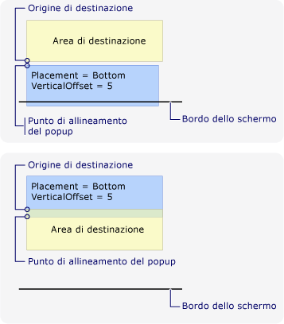
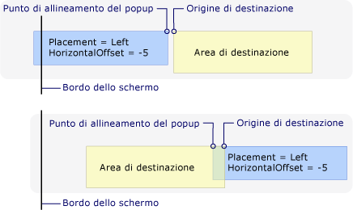
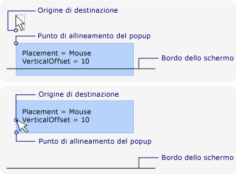

# Comportamento del controllo Popup in relazione al posizionamento
Oggetto <xref:System.Windows.Controls.Primitives.Popup> controllo Visualizza il contenuto in una finestra separata che può essere spostata in un'applicazione. È possibile specificare la posizione di un <xref:System.Windows.Controls.Primitives.Popup> relativo a un controllo, il mouse o la schermata usando la <xref:System.Windows.Controls.Primitives.Popup.PlacementTarget%2A>, <xref:System.Windows.Controls.Primitives.Popup.Placement%2A>, <xref:System.Windows.Controls.Primitives.Popup.PlacementRectangle%2A>, <xref:System.Windows.Controls.Primitives.Popup.HorizontalOffset%2A>, e <xref:System.Windows.Controls.Primitives.Popup.VerticalOffset%2A> proprietà.  Queste proprietà interagiscono per maggiore flessibilità nel specificano la posizione del <xref:System.Windows.Controls.Primitives.Popup>.  
  
> [!NOTE]
>  Il <xref:System.Windows.Controls.ToolTip> e <xref:System.Windows.Controls.ContextMenu> classi anche definire queste cinque proprietà e si comportano in modo analogo.  
  

  
   
## Posizionamento del controllo Popup  
 La posizione di un <xref:System.Windows.Controls.Primitives.Popup> può essere relativo a un <xref:System.Windows.UIElement> o allo schermo intero.  L'esempio seguente crea quattro <xref:System.Windows.Controls.Primitives.Popup> controlli relativo a un <xref:System.Windows.UIElement>: in questo caso, un'immagine. Tutti i <xref:System.Windows.Controls.Primitives.Popup> controlli hanno il <xref:System.Windows.Controls.Primitives.Popup.PlacementTarget%2A> proprietà impostata su `image1`, ma ogni <xref:System.Windows.Controls.Primitives.Popup> ha un valore diverso per la proprietà di posizionamento.  
  
 [!code-xaml[PopupPositionSnippet#3](../../../../samples/snippets/csharp/VS_Snippets_Wpf/PopupPositionSnippet/CS/Window1.xaml#3)]  
  
 La figura seguente mostra l'immagine e <xref:System.Windows.Controls.Primitives.Popup> controlli  
  
   
Immagine con quattro controlli Popup  
  
 Questo semplice esempio viene illustrato come impostare il <xref:System.Windows.Controls.Primitives.Popup.PlacementTarget%2A> e <xref:System.Windows.Controls.Primitives.Popup.Placement%2A> proprietà, ma tramite il <xref:System.Windows.Controls.Primitives.Popup.PlacementRectangle%2A>, <xref:System.Windows.Controls.Primitives.Popup.HorizontalOffset%2A>, e <xref:System.Windows.Controls.Primitives.Popup.VerticalOffset%2A> proprietà, si dispone di un maggiore controllo sul posizionamento il <xref:System.Windows.Controls.Primitives.Popup> è posizionato.  
  
   
## Definizioni dei termini - Analisi di un controllo Popup  
 I seguenti termini sono comprendere come <xref:System.Windows.Controls.Primitives.Popup.PlacementTarget%2A>, <xref:System.Windows.Controls.Primitives.Popup.Placement%2A>, <xref:System.Windows.Controls.Primitives.Popup.PlacementRectangle%2A>, <xref:System.Windows.Controls.Primitives.Popup.HorizontalOffset%2A>, e <xref:System.Windows.Controls.Primitives.Popup.VerticalOffset%2A> proprietà interagiscono tra di loro e <xref:System.Windows.Controls.Primitives.Popup>:  
  
-   Oggetto destinazione  
  
-   Area di destinazione  
  
-   Origine di destinazione  
  
-   Punto di allineamento del controllo Popup  
  
 Questi termini offrono un modo pratico per fare riferimento a vari aspetti del <xref:System.Windows.Controls.Primitives.Popup> e il controllo è associato.  
  
### Oggetto di destinazione  
 Il *oggetto di destinazione* è l'elemento che la <xref:System.Windows.Controls.Primitives.Popup> è associato. Se il <xref:System.Windows.Controls.Primitives.Popup.PlacementTarget%2A> è impostata, specifica l'oggetto di destinazione.  Se <xref:System.Windows.Controls.Primitives.Popup.PlacementTarget%2A> non è impostata e <xref:System.Windows.Controls.Primitives.Popup> ha un padre, l'elemento padre è l'oggetto di destinazione.  Se è presente alcun <xref:System.Windows.Controls.Primitives.Popup.PlacementTarget%2A> valore e alcun elemento padre, è presente alcun oggetto di destinazione e <xref:System.Windows.Controls.Primitives.Popup> è posizionato rispetto allo schermo.  
  
 Nell'esempio seguente viene creato un <xref:System.Windows.Controls.Primitives.Popup> figlio di un <xref:System.Windows.Controls.Canvas>.  Nell'esempio viene impostata la <xref:System.Windows.Controls.Primitives.Popup.PlacementTarget%2A> proprietà il <xref:System.Windows.Controls.Primitives.Popup>. Il valore predefinito per <xref:System.Windows.Controls.Primitives.Popup.Placement%2A> è <xref:System.Windows.Controls.Primitives.PlacementMode.Bottom?displayProperty=nameWithType>, pertanto il <xref:System.Windows.Controls.Primitives.Popup> viene visualizzato sotto il <xref:System.Windows.Controls.Canvas>.  
  
 [!code-xaml[PopupPositionSnippet#1](../../../../samples/snippets/csharp/VS_Snippets_Wpf/PopupPositionSnippet/CS/Window1.xaml#1)]  
  
 La figura seguente mostra che il <xref:System.Windows.Controls.Primitives.Popup> è posizionato in relazione al <xref:System.Windows.Controls.Canvas>.  
  
   
Controllo Popup senza proprietà PlacementTarget  
  
 Nell'esempio seguente viene creato un <xref:System.Windows.Controls.Primitives.Popup> figlio di un <xref:System.Windows.Controls.Canvas>, ma questa volta il <xref:System.Windows.Controls.Primitives.Popup.PlacementTarget%2A> è impostato su `ellipse1`, pertanto il popup viene visualizzato sotto il <xref:System.Windows.Shapes.Ellipse>.  
  
 [!code-xaml[PopupPositionSnippet#2](../../../../samples/snippets/csharp/VS_Snippets_Wpf/PopupPositionSnippet/CS/Window1.xaml#2)]  
  
 La figura seguente mostra che il <xref:System.Windows.Controls.Primitives.Popup> è posizionato in relazione al <xref:System.Windows.Shapes.Ellipse>.  
  
   
Controllo Popup con proprietà PlacementTarget  
  
> [!NOTE]
>  Per <xref:System.Windows.Controls.ToolTip>, il valore predefinito di <xref:System.Windows.Controls.Primitives.Popup.Placement%2A> è <xref:System.Windows.Controls.Primitives.PlacementMode.Mouse>.  Per <xref:System.Windows.Controls.ContextMenu>, il valore predefinito di <xref:System.Windows.Controls.Primitives.Popup.Placement%2A> è <xref:System.Windows.Controls.Primitives.PlacementMode.MousePoint>. Questi valori vengono descritti più avanti nella sezione "Modalità di interazione delle proprietà".  
  
### Area di destinazione  
 Il *area di destinazione* è l'area dello schermo che il <xref:System.Windows.Controls.Primitives.Popup> relativo alla. Negli esempi precedenti, il <xref:System.Windows.Controls.Primitives.Popup> è allineato con i limiti dell'oggetto di destinazione, ma in alcuni casi, il <xref:System.Windows.Controls.Primitives.Popup> è allineato al altri limiti, anche se il <xref:System.Windows.Controls.Primitives.Popup> dispone di un oggetto di destinazione.  Se il <xref:System.Windows.Controls.Primitives.Popup.PlacementRectangle%2A> proprietà è impostata, l'area di destinazione è diversa rispetto ai limiti dell'oggetto di destinazione.  
  
 L'esempio seguente crea due <xref:System.Windows.Controls.Canvas> oggetti, ciascuno dei quali contiene un <xref:System.Windows.Shapes.Rectangle> e <xref:System.Windows.Controls.Primitives.Popup>.  In entrambi i casi, l'oggetto di destinazione per il <xref:System.Windows.Controls.Primitives.Popup> è il <xref:System.Windows.Controls.Canvas>. Il <xref:System.Windows.Controls.Primitives.Popup> nel primo <xref:System.Windows.Controls.Canvas> ha il <xref:System.Windows.Controls.Primitives.Popup.PlacementRectangle%2A> impostato, con il relativo <xref:System.Windows.Rect.X%2A>, <xref:System.Windows.Rect.Y%2A>, <xref:System.Windows.Rect.Width%2A>, e <xref:System.Windows.Rect.Height%2A> impostate rispettivamente su 50, 50, 50 e 100,. Il <xref:System.Windows.Controls.Primitives.Popup> nella seconda <xref:System.Windows.Controls.Canvas> non dispone di <xref:System.Windows.Controls.Primitives.Popup.PlacementRectangle%2A> impostato.  Di conseguenza, il primo <xref:System.Windows.Controls.Primitives.Popup> si trova sotto il <xref:System.Windows.Controls.Primitives.Popup.PlacementRectangle%2A> e il secondo <xref:System.Windows.Controls.Primitives.Popup> si trova sotto il <xref:System.Windows.Controls.Canvas>. Ogni <xref:System.Windows.Controls.Canvas> contiene inoltre un <xref:System.Windows.Shapes.Rectangle> che ha gli stessi limiti del <xref:System.Windows.Controls.Primitives.Popup.PlacementRectangle%2A> per la prima <xref:System.Windows.Controls.Primitives.Popup>.  Si noti che il <xref:System.Windows.Controls.Primitives.Popup.PlacementRectangle%2A> non crea un elemento visibile nell'applicazione; nell'esempio viene creato un <xref:System.Windows.Shapes.Rectangle> per rappresentare il <xref:System.Windows.Controls.Primitives.Popup.PlacementRectangle%2A>.  
  
 [!code-xaml[PopupPositionSnippet#4](../../../../samples/snippets/csharp/VS_Snippets_Wpf/PopupPositionSnippet/CS/Window1.xaml#4)]  
  
 La figura seguente illustra il risultato dell'esempio precedente.  
  
   
Popup con e senza PlacementRectangle  
  
### Origine di destinazione e punto di allineamento del controllo Popup  
 L'*origine di destinazione* e il *punto di allineamento del controllo Popup* sono punti di riferimento, rispettivamente sull'area di destinazione e sul popup, usati per il posizionamento. È possibile utilizzare il <xref:System.Windows.Controls.Primitives.Popup.HorizontalOffset%2A> e <xref:System.Windows.Controls.Primitives.Popup.VerticalOffset%2A> proprietà per eseguire l'offset del popup dall'area di destinazione.  Il <xref:System.Windows.Controls.Primitives.Popup.HorizontalOffset%2A> e <xref:System.Windows.Controls.Primitives.Popup.VerticalOffset%2A> riguardano l'origine di destinazione e il punto di allineamento popup. Il valore di <xref:System.Windows.Controls.Primitives.Popup.Placement%2A> proprietà determina dove si trovano il punto di allineamento popup e di origine di destinazione.  
  
 Nell'esempio seguente viene creato un <xref:System.Windows.Controls.Primitives.Popup> e imposta il <xref:System.Windows.Controls.Primitives.Popup.HorizontalOffset%2A> e <xref:System.Windows.Controls.Primitives.Popup.VerticalOffset%2A> proprietà a 20.  Il <xref:System.Windows.Controls.Primitives.Popup.Placement%2A> è impostata su <xref:System.Windows.Controls.Primitives.PlacementMode.Bottom> (impostazione predefinita), pertanto l'origine di destinazione è l'angolo inferiore sinistro dell'area di destinazione e il punto di allineamento popup è l'angolo superiore sinistro del <xref:System.Windows.Controls.Primitives.Popup>.  
  
 [!code-xaml[PopupPositionSnippet#5](../../../../samples/snippets/csharp/VS_Snippets_Wpf/PopupPositionSnippet/CS/Window1.xaml#5)]  
  
 La figura seguente illustra il risultato dell'esempio precedente.  
  
   
Popup con HorizontalOffset e VerticalOffset  
  
   
## Modalità di interazione delle proprietà  
 I valori di <xref:System.Windows.Controls.Primitives.Popup.PlacementTarget%2A>, <xref:System.Windows.Controls.Primitives.Popup.PlacementRectangle%2A>, e <xref:System.Windows.Controls.Primitives.Popup.Placement%2A> da prendere in considerazione insieme per determinare l'area di destinazione, origine di destinazione e il punto di allineamento popup.  Ad esempio, se il valore di <xref:System.Windows.Controls.Primitives.Popup.Placement%2A> è <xref:System.Windows.Controls.Primitives.PlacementMode.Mouse>, è presente alcun oggetto di destinazione, il <xref:System.Windows.Controls.Primitives.Popup.PlacementRectangle%2A> viene ignorato e l'area di destinazione è costituita dai limiti del puntatore del mouse. D'altra parte, se <xref:System.Windows.Controls.Primitives.Popup.Placement%2A> è <xref:System.Windows.Controls.Primitives.PlacementMode.Bottom>, <xref:System.Windows.Controls.Primitives.Popup.PlacementTarget%2A> o padre determina l'oggetto di destinazione e <xref:System.Windows.Controls.Primitives.Popup.PlacementRectangle%2A> determina l'area di destinazione.  
  
 Nella tabella seguente descrive l'oggetto di destinazione, l'area di destinazione, origine di destinazione e il punto di allineamento popup e indica se <xref:System.Windows.Controls.Primitives.Popup.PlacementTarget%2A> e <xref:System.Windows.Controls.Primitives.Popup.PlacementRectangle%2A> vengono utilizzati per ogni <xref:System.Windows.Controls.Primitives.PlacementMode> valore di enumerazione.  
  
|PlacementMode|Oggetto destinazione|Area di destinazione|Origine di destinazione|Punto di allineamento del controllo Popup|  
|-------------------|-------------------|-----------------|-------------------|---------------------------|  
|<xref:System.Windows.Controls.Primitives.PlacementMode.Absolute>|Non applicabile. <xref:System.Windows.Controls.Primitives.Popup.PlacementTarget%2A>viene ignorato.|La schermata o <xref:System.Windows.Controls.Primitives.Popup.PlacementRectangle%2A> se è impostato.  Il <xref:System.Windows.Controls.Primitives.Popup.PlacementRectangle%2A> è rispetto allo schermo.|Angolo superiore sinistro dell'area di destinazione.|Nell'angolo superiore sinistro del <xref:System.Windows.Controls.Primitives.Popup>.|  
|<xref:System.Windows.Controls.Primitives.PlacementMode.AbsolutePoint>|Non applicabile. <xref:System.Windows.Controls.Primitives.Popup.PlacementTarget%2A>viene ignorato.|La schermata o <xref:System.Windows.Controls.Primitives.Popup.PlacementRectangle%2A> se è impostato.  Il <xref:System.Windows.Controls.Primitives.Popup.PlacementRectangle%2A> è rispetto allo schermo.|Angolo superiore sinistro dell'area di destinazione.|Nell'angolo superiore sinistro del <xref:System.Windows.Controls.Primitives.Popup>.|  
|<xref:System.Windows.Controls.Primitives.PlacementMode.Bottom>|<xref:System.Windows.Controls.Primitives.Popup.PlacementTarget%2A>o padre.|L'oggetto di destinazione o <xref:System.Windows.Controls.Primitives.Popup.PlacementRectangle%2A> se è impostato.  Il <xref:System.Windows.Controls.Primitives.Popup.PlacementRectangle%2A> è relativo all'oggetto di destinazione.|Angolo inferiore sinistro dell'area di destinazione.|Nell'angolo superiore sinistro del <xref:System.Windows.Controls.Primitives.Popup>.|  
|<xref:System.Windows.Controls.Primitives.PlacementMode.Center>|<xref:System.Windows.Controls.Primitives.Popup.PlacementTarget%2A>o padre.|L'oggetto di destinazione o <xref:System.Windows.Controls.Primitives.Popup.PlacementRectangle%2A> se è impostato.  Il <xref:System.Windows.Controls.Primitives.Popup.PlacementRectangle%2A> è relativo all'oggetto di destinazione.|Centro dell'area di destinazione.|Al centro del <xref:System.Windows.Controls.Primitives.Popup>.|  
|<xref:System.Windows.Controls.Primitives.PlacementMode.Custom>|<xref:System.Windows.Controls.Primitives.Popup.PlacementTarget%2A>o padre.|L'oggetto di destinazione o <xref:System.Windows.Controls.Primitives.Popup.PlacementRectangle%2A> se è impostato.  Il <xref:System.Windows.Controls.Primitives.Popup.PlacementRectangle%2A> è relativo all'oggetto di destinazione.|Definito dal <xref:System.Windows.Controls.Primitives.CustomPopupPlacementCallback>.|Definito dal <xref:System.Windows.Controls.Primitives.CustomPopupPlacementCallback>.|  
|<xref:System.Windows.Controls.Primitives.PlacementMode.Left>|<xref:System.Windows.Controls.Primitives.Popup.PlacementTarget%2A>o padre.|L'oggetto di destinazione o <xref:System.Windows.Controls.Primitives.Popup.PlacementRectangle%2A> se è impostato.  Il <xref:System.Windows.Controls.Primitives.Popup.PlacementRectangle%2A> è relativo all'oggetto di destinazione.|Angolo superiore sinistro dell'area di destinazione.|Nell'angolo superiore destro del <xref:System.Windows.Controls.Primitives.Popup>.|  
|<xref:System.Windows.Controls.Primitives.PlacementMode.Mouse>|Non applicabile. <xref:System.Windows.Controls.Primitives.Popup.PlacementTarget%2A>viene ignorato.|Limiti del puntatore del mouse. <xref:System.Windows.Controls.Primitives.Popup.PlacementRectangle%2A>viene ignorato.|Angolo inferiore sinistro dell'area di destinazione.|Nell'angolo superiore sinistro del <xref:System.Windows.Controls.Primitives.Popup>.|  
|<xref:System.Windows.Controls.Primitives.PlacementMode.MousePoint>|Non applicabile. <xref:System.Windows.Controls.Primitives.Popup.PlacementTarget%2A>viene ignorato.|Limiti del puntatore del mouse. <xref:System.Windows.Controls.Primitives.Popup.PlacementRectangle%2A>viene ignorato.|Angolo superiore sinistro dell'area di destinazione.|Nell'angolo superiore sinistro del <xref:System.Windows.Controls.Primitives.Popup>.|  
|<xref:System.Windows.Controls.Primitives.PlacementMode.Relative>|<xref:System.Windows.Controls.Primitives.Popup.PlacementTarget%2A>o padre.|L'oggetto di destinazione o <xref:System.Windows.Controls.Primitives.Popup.PlacementRectangle%2A> se è impostato.  Il <xref:System.Windows.Controls.Primitives.Popup.PlacementRectangle%2A> è relativo all'oggetto di destinazione.|Angolo superiore sinistro dell'area di destinazione.|Nell'angolo superiore sinistro del <xref:System.Windows.Controls.Primitives.Popup>.|  
|<xref:System.Windows.Controls.Primitives.PlacementMode.RelativePoint>|<xref:System.Windows.Controls.Primitives.Popup.PlacementTarget%2A>o padre.|L'oggetto di destinazione o <xref:System.Windows.Controls.Primitives.Popup.PlacementRectangle%2A> se è impostato.  Il <xref:System.Windows.Controls.Primitives.Popup.PlacementRectangle%2A> è relativo all'oggetto di destinazione.|Angolo superiore sinistro dell'area di destinazione.|Nell'angolo superiore sinistro del <xref:System.Windows.Controls.Primitives.Popup>.|  
|<xref:System.Windows.Controls.Primitives.PlacementMode.Right>|<xref:System.Windows.Controls.Primitives.Popup.PlacementTarget%2A>o padre.|L'oggetto di destinazione o <xref:System.Windows.Controls.Primitives.Popup.PlacementRectangle%2A> se è impostato.  Il <xref:System.Windows.Controls.Primitives.Popup.PlacementRectangle%2A> è relativo all'oggetto di destinazione.|Angolo superiore destro dell'area di destinazione.|Nell'angolo superiore sinistro del <xref:System.Windows.Controls.Primitives.Popup>.|  
|<xref:System.Windows.Controls.Primitives.PlacementMode.Top>|<xref:System.Windows.Controls.Primitives.Popup.PlacementTarget%2A>o padre.|L'oggetto di destinazione o <xref:System.Windows.Controls.Primitives.Popup.PlacementRectangle%2A> se è impostato.  Il <xref:System.Windows.Controls.Primitives.Popup.PlacementRectangle%2A> è relativo all'oggetto di destinazione.|Angolo superiore sinistro dell'area di destinazione.|Nell'angolo inferiore sinistro del <xref:System.Windows.Controls.Primitives.Popup>.|  
  
 Nell'illustrazione seguente vengono mostrati il <xref:System.Windows.Controls.Primitives.Popup>, area di destinazione, l'origine di destinazione e dell'allineamento popup punto per ogni <xref:System.Windows.Controls.Primitives.PlacementMode> valore. In ogni figura l'area di destinazione è giallo e <xref:System.Windows.Controls.Primitives.Popup> è blu.  
  
   
Il posizionamento è Absolute o AbsolutePoint  
  
   
Il posizionamento è Bottom  
  
   
Il posizionamento è Center  
  
   
Il posizionamento è Left  
  
   
Il posizionamento è Mouse  
  
   
Il posizionamento è MousePoint  
  
   
Il posizionamento è Relative o RelativePoint  
  
   
Il posizionamento è Right  
  
   
Il posizionamento è Top  
  
   
## Rilevamento dei bordi dello schermo da parte del controllo Popup  
 Per motivi di sicurezza, un <xref:System.Windows.Controls.Primitives.Popup> non possono essere nascosti in base al bordo di una schermata. Si verifica una delle tre situazioni seguenti quando il <xref:System.Windows.Controls.Primitives.Popup> rileva un bordo dello schermo:  
  
-   La finestra popup viene riposizionato lungo il bordo dello schermo che nasconde il <xref:System.Windows.Controls.Primitives.Popup>.  
  
-   Il popup usa un punto di allineamento diverso.  
  
-   Il popup usa un'origine di destinazione e un punto di allineamento diversi.  
  
 Tali opzioni vengono descritte più avanti in questa sezione.  
  
 Il comportamento del <xref:System.Windows.Controls.Primitives.Popup> quando viene rilevato un bordo dello schermo dipende dal valore del <xref:System.Windows.Controls.Primitives.Popup.Placement%2A> proprietà e schermata bordo rilevato. Nella tabella seguente viene riepilogato il comportamento quando il <xref:System.Windows.Controls.Primitives.Popup> rileva un bordo dello schermo per ogni <xref:System.Windows.Controls.Primitives.PlacementMode> valore.  
  
|PlacementMode|Bordo superiore|Bordo inferiore|Bordo sinistro|Bordo destro|  
|-------------------|--------------|-----------------|---------------|----------------|  
|<xref:System.Windows.Controls.Primitives.PlacementMode.Absolute>|Allineamento al bordo superiore.|Allineamento al bordo inferiore.|Allineamento al bordo sinistro.|Allineamento al bordo destro.|  
|<xref:System.Windows.Controls.Primitives.PlacementMode.AbsolutePoint>|Allineamento al bordo superiore.|Il punto di allineamento popup viene modificato nell'angolo inferiore sinistro del <xref:System.Windows.Controls.Primitives.Popup>.|Allineamento al bordo sinistro.|Il punto di allineamento popup viene modificato nell'angolo superiore destro del <xref:System.Windows.Controls.Primitives.Popup>.|  
|<xref:System.Windows.Controls.Primitives.PlacementMode.Bottom>|Allineamento al bordo superiore.|L'origine di destinazione viene modificato nell'angolo superiore sinistro dell'area di destinazione e il punto di allineamento popup viene modificato nell'angolo inferiore sinistro del <xref:System.Windows.Controls.Primitives.Popup>.|Allineamento al bordo sinistro.|Allineamento al bordo destro.|  
|<xref:System.Windows.Controls.Primitives.PlacementMode.Center>|Allineamento al bordo superiore.|Allineamento al bordo inferiore.|Allineamento al bordo sinistro.|Allineamento al bordo destro.|  
|<xref:System.Windows.Controls.Primitives.PlacementMode.Left>|Allineamento al bordo superiore.|Allineamento al bordo inferiore.|L'origine di destinazione viene modificato nell'angolo superiore destro dell'area di destinazione e il punto di allineamento popup viene modificato nell'angolo superiore sinistro del <xref:System.Windows.Controls.Primitives.Popup>.|Allineamento al bordo destro.|  
|<xref:System.Windows.Controls.Primitives.PlacementMode.Mouse>|Allineamento al bordo superiore.|L'origine di destinazione viene modificato nell'angolo superiore sinistro dell'area di destinazione (i limiti del puntatore del mouse) e il punto di allineamento popup viene modificato nell'angolo inferiore sinistro del <xref:System.Windows.Controls.Primitives.Popup>.|Allineamento al bordo sinistro.|Allineamento al bordo destro.|  
|<xref:System.Windows.Controls.Primitives.PlacementMode.MousePoint>|Allineamento al bordo superiore.|Il punto di allineamento popup viene modificato nell'angolo inferiore sinistro del <xref:System.Windows.Controls.Primitives.Popup>.|Allineamento al bordo sinistro.|Il punto di allineamento viene modificato nell'angolo superiore destro del controllo Popup.|  
|<xref:System.Windows.Controls.Primitives.PlacementMode.Relative>|Allineamento al bordo superiore.|Allineamento al bordo inferiore.|Allineamento al bordo sinistro.|Allineamento al bordo destro.|  
|<xref:System.Windows.Controls.Primitives.PlacementMode.RelativePoint>|Allineamento al bordo superiore.|Il punto di allineamento popup viene modificato nell'angolo inferiore sinistro del <xref:System.Windows.Controls.Primitives.Popup>.|Allineamento al bordo sinistro.|Il punto di allineamento viene modificato nell'angolo superiore destro del controllo Popup.|  
|<xref:System.Windows.Controls.Primitives.PlacementMode.Right>|Allineamento al bordo superiore.|Allineamento al bordo inferiore.|Allineamento al bordo sinistro.|L'origine di destinazione viene modificato nell'angolo superiore sinistro dell'area di destinazione e il punto di allineamento popup viene modificato nell'angolo superiore destro del <xref:System.Windows.Controls.Primitives.Popup>.|  
|<xref:System.Windows.Controls.Primitives.PlacementMode.Top>|L'origine di destinazione viene modificato nell'angolo inferiore sinistro dell'area di destinazione e il punto di allineamento popup viene modificato nell'angolo superiore sinistro del <xref:System.Windows.Controls.Primitives.Popup>. In effetti, questa è la stessa di quando <xref:System.Windows.Controls.Primitives.Popup.Placement%2A> è <xref:System.Windows.Controls.Primitives.PlacementMode.Bottom>.|Allineamento al bordo inferiore.|Allineamento al bordo sinistro.|Allineamento al bordo destro.|  
  
### Allineamento al bordo dello schermo  
 Oggetto <xref:System.Windows.Controls.Primitives.Popup> può essere allineato al bordo dello schermo riposizionando stesso così l'intero <xref:System.Windows.Controls.Primitives.Popup> è visibile sullo schermo.  In questo caso, la distanza tra il punto di allineamento popup e di origine di destinazione potrebbero essere diversi dai valori di <xref:System.Windows.Controls.Primitives.Popup.HorizontalOffset%2A> e <xref:System.Windows.Controls.Primitives.Popup.VerticalOffset%2A>. Quando <xref:System.Windows.Controls.Primitives.Popup.Placement%2A> è <xref:System.Windows.Controls.Primitives.PlacementMode.Absolute>, <xref:System.Windows.Controls.Primitives.PlacementMode.Center>, o <xref:System.Windows.Controls.Primitives.PlacementMode.Relative>, <xref:System.Windows.Controls.Primitives.Popup> viene allineato a ogni bordo dello schermo.  Ad esempio, si supponga che un <xref:System.Windows.Controls.Primitives.Popup> è <xref:System.Windows.Controls.Primitives.Popup.Placement%2A> impostato su <xref:System.Windows.Controls.Primitives.PlacementMode.Relative> e <xref:System.Windows.Controls.Primitives.Popup.VerticalOffset%2A> impostato su 100.  Se il bordo inferiore dello schermo nasconde tutto o parte di <xref:System.Windows.Controls.Primitives.Popup>, <xref:System.Windows.Controls.Primitives.Popup> riposizionato lungo il bordo inferiore dello schermo e la distanza verticale tra l'origine di destinazione e popup punto di allineamento è inferiore a 100. La figura seguente illustra questa situazione.  
  
   
Popup allineato al bordo dello schermo  
  
### Modifica del punto di allineamento del controllo Popup  
 Se <xref:System.Windows.Controls.Primitives.Popup.Placement%2A> è <xref:System.Windows.Controls.Primitives.PlacementMode.AbsolutePoint>, <xref:System.Windows.Controls.Primitives.PlacementMode.RelativePoint>, o <xref:System.Windows.Controls.Primitives.PlacementMode.MousePoint>, il punto di allineamento popup viene modificato quando il popup rileva il bordo inferiore o destro dello schermo.  
  
 Nella figura seguente viene dimostrato che quando il bordo inferiore dello schermo nasconde tutto o parte di <xref:System.Windows.Controls.Primitives.Popup>, il punto di allineamento popup è l'angolo inferiore sinistro del <xref:System.Windows.Controls.Primitives.Popup>.  
  
   
Il controllo Popup rileva il bordo inferiore dello schermo e viene modificato il punto di allineamento  
  
 Nella figura seguente viene illustrato che quando il <xref:System.Windows.Controls.Primitives.Popup> è nascosto per il bordo destro dello schermo, il punto di allineamento popup è l'angolo superiore destro del <xref:System.Windows.Controls.Primitives.Popup>.  
  
   
Il controllo Popup rileva il bordo destro dello schermo e viene modificato il punto di allineamento  
  
 Se il <xref:System.Windows.Controls.Primitives.Popup> rileva i bordi inferiore e destro dello schermo, il punto di allineamento popup è l'angolo inferiore destro del <xref:System.Windows.Controls.Primitives.Popup>.  
  
### Modifica dell'origine di destinazione e del punto di allineamento del controllo Popup  
 Quando <xref:System.Windows.Controls.Primitives.Popup.Placement%2A> è <xref:System.Windows.Controls.Primitives.PlacementMode.Bottom>, <xref:System.Windows.Controls.Primitives.PlacementMode.Left>, <xref:System.Windows.Controls.Primitives.PlacementMode.Mouse>, <xref:System.Windows.Controls.Primitives.PlacementMode.Right>, o <xref:System.Windows.Controls.Primitives.PlacementMode.Top>, l'allineamento di origine e la finestra popup di destinazione se il punto viene rilevato un determinato bordo dello schermo.  Dipende dal bordo dello schermo che determina la posizione modificare il <xref:System.Windows.Controls.Primitives.PlacementMode> valore.  
  
 Nella figura seguente viene illustrato che quando <xref:System.Windows.Controls.Primitives.Popup.Placement%2A> è <xref:System.Windows.Controls.Primitives.PlacementMode.Bottom> e <xref:System.Windows.Controls.Primitives.Popup> incontra il bordo inferiore dello schermo, l'origine di destinazione è l'angolo superiore sinistro dell'area di destinazione e il punto di allineamento popup è l'angolo inferiore sinistro del <xref:System.Windows.Controls.Primitives.Popup>.  
  
   
Il posizionamento è Bottom e il controllo Popup rileva il bordo inferiore dello schermo  
  
 Nella figura seguente viene illustrato che quando <xref:System.Windows.Controls.Primitives.Popup.Placement%2A> è <xref:System.Windows.Controls.Primitives.PlacementMode.Left> e <xref:System.Windows.Controls.Primitives.Popup> rileva il bordo sinistro dello schermo, l'origine di destinazione è l'angolo superiore destro dell'area di destinazione e il punto di allineamento popup è l'angolo superiore sinistro del <xref:System.Windows.Controls.Primitives.Popup>.  
  
   
Il posizionamento è Left e il controllo Popup rileva il bordo sinistro dello schermo  
  
 Nella figura seguente viene illustrato che quando <xref:System.Windows.Controls.Primitives.Popup.Placement%2A> è <xref:System.Windows.Controls.Primitives.PlacementMode.Right> e <xref:System.Windows.Controls.Primitives.Popup> rileva il bordo destro dello schermo, l'origine di destinazione è l'angolo superiore sinistro dell'area di destinazione e il punto di allineamento popup è l'angolo superiore destro del <xref:System.Windows.Controls.Primitives.Popup>.  
  
   
Il posizionamento è Right e il controllo Popup rileva il bordo destro dello schermo  
  
 Nella figura seguente viene illustrato che quando <xref:System.Windows.Controls.Primitives.Popup.Placement%2A> è <xref:System.Windows.Controls.Primitives.PlacementMode.Top> e <xref:System.Windows.Controls.Primitives.Popup> rileva il bordo superiore dello schermo, l'origine di destinazione è l'angolo inferiore sinistro dell'area di destinazione e il punto di allineamento popup è l'angolo superiore sinistro del <xref:System.Windows.Controls.Primitives.Popup>.  
  
   
Il posizionamento è Top e il controllo Popup rileva il bordo superiore dello schermo  
  
 Nella figura seguente viene illustrato che quando <xref:System.Windows.Controls.Primitives.Popup.Placement%2A> è <xref:System.Windows.Controls.Primitives.PlacementMode.Mouse> e <xref:System.Windows.Controls.Primitives.Popup> incontra il bordo inferiore dello schermo, l'origine di destinazione è l'angolo superiore sinistro dell'area di destinazione (i limiti del puntatore del mouse) e l'allineamento popup è l'angolo inferiore sinistro del <xref:System.Windows.Controls.Primitives.Popup>.  
  
   
Il posizionamento è Mouse e il controllo Popup rileva il bordo inferiore dello schermo  
  
### Personalizzazione del posizionamento di un controllo Popup  
 È possibile personalizzare il punto di allineamento popup e di origine di destinazione impostando il <xref:System.Windows.Controls.Primitives.Popup.Placement%2A> proprietà <xref:System.Windows.Controls.Primitives.PlacementMode.Custom>. Quindi definire un <xref:System.Windows.Controls.Primitives.CustomPopupPlacementCallback> delegato che restituisce un set di possibili punti di posizionamento e assi primari (in ordine di preferenza) per il <xref:System.Windows.Controls.Primitives.Popup>. Il punto che visualizza la maggior parte del <xref:System.Windows.Controls.Primitives.Popup> è selezionata.  La posizione del <xref:System.Windows.Controls.Primitives.Popup> viene regolata automaticamente se il <xref:System.Windows.Controls.Primitives.Popup> è nascosto per il bordo dello schermo. Per un esempio, vedere [Procedura: Specificare una posizione personalizzata per un controllo Popup](../../../../docs/framework/wpf/controls/how-to-specify-a-custom-popup-position.md).  
  
## Vedere anche  
 [Popup Placement Sample](http://go.microsoft.com/fwlink/?LinkID=160032) (Esempio di posizionamento di un controllo Popup)
