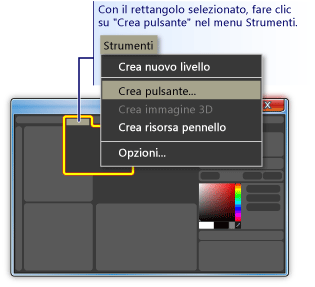
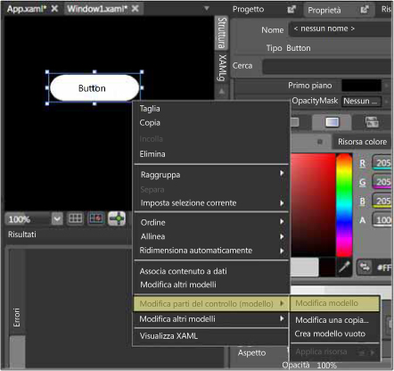
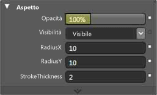
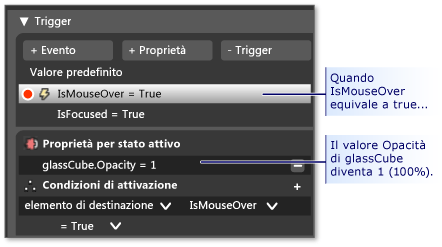
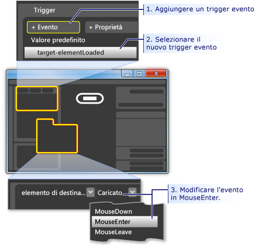
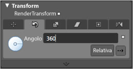
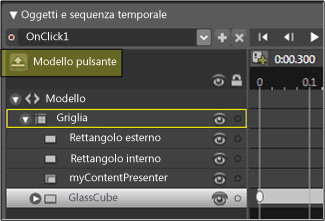

# Procedura dettagliata: creazione di un pulsante tramite Microsoft Expression Blend
In questa procedura dettagliata vengono illustrate le varie fasi del processo di creazione di un pulsante personalizzato di [!INCLUDE[TLA2#tla_wpf](../../../../includes/tla2sharptla-wpf-md.md)] tramite Microsoft Expression Blend.  
  
> [!IMPORTANT]
>  Microsoft Expression Blend funziona mediante la generazione di [!INCLUDE[TLA#tla_xaml](../../../../includes/tlasharptla-xaml-md.md)], compilato in modo da rendere eseguibile il programma.  Se si preferisce utilizzare direttamente [!INCLUDE[TLA#tla_xaml](../../../../includes/tlasharptla-xaml-md.md)], esiste un'altra procedura dettagliata che consente di creare la stessa applicazione utilizzando [!INCLUDE[TLA#tla_xaml](../../../../includes/tlasharptla-xaml-md.md)] con [!INCLUDE[vs_current_short](../../../../includes/vs-current-short-md.md)] anziché con Blend.  Per ulteriori informazioni, vedere [Creare un pulsante tramite XAML](../../../../docs/framework/wpf/controls/walkthrough-create-a-button-by-using-xaml.md).  
  
 Nella figura seguente viene illustrato il pulsante personalizzato che sarà creato.  
  
   
  
## Convertire una forma in un pulsante  
 Nella prima parte di questa procedura verrà creato l'aspetto del pulsante personalizzato.  A tale scopo, è necessario innanzitutto convertire un rettangolo in un pulsante.  Aggiungere quindi altre forme al modello, creando un pulsante dall'aspetto più complesso.  All'inizio, è più opportuno cominciare con la personalizzazione di un pulsante standard.  Dal momento che un pulsante è dotato di funzionalità incorporate non necessarie, per i pulsanti personalizzati, è più semplice iniziare con un rettangolo.  
  
#### Per creare un nuovo progetto con Expression Blend  
  
1.  Avviare Expression Blend.  Fare clic sul pulsante **Start**, scegliere **Tutti i programmi**, **Microsoft Expression**, quindi fare clic su **Microsoft Expression Blend**.  
  
2.  Se necessario, ingrandire l'applicazione.  
  
3.  Scegliere **Nuovo progetto** dal menu **File**.  
  
4.  Selezionare **Applicazione standard \(.exe\)**.  
  
5.  Assegnare al progetto il nome `Pulsante personalizzato`, quindi fare clic su **OK**.  
  
 A questo punto è disponibile un progetto [!INCLUDE[TLA2#tla_wpf](../../../../includes/tla2sharptla-wpf-md.md)] vuoto.  È possibile premere F5 per eseguire l'applicazione.  Come previsto, l'applicazione è costituita solo da una finestra vuota.  Successivamente, creare un rettangolo arrotondato e convertirlo in un pulsante.  
  
#### Convertire un rettangolo in un pulsante  
  
1.  **Impostare la proprietà Sfondo della finestra su nero:** Selezionare la finestra, fare clic su **Scheda proprietà** e impostare la proprietà <xref:System.Windows.Controls.Control.Background%2A> su `Black`.  
  
       
  
2.  **Disegnare un rettangolo delle dimensioni di un pulsante della finestra:** selezionare lo strumento rettangolo dal pannello degli strumenti di sinistra e trascinarlo nella finestra.  
  
       
  
3.  **Arrotondare gli angoli del rettangolo:** trascinare i punti di controllo del rettangolo o impostare direttamente le proprietà <xref:System.Windows.Shapes.Rectangle.RadiusX%2A> e <xref:System.Windows.Shapes.Rectangle.RadiusY%2A>.  Impostare i valori di <xref:System.Windows.Shapes.Rectangle.RadiusX%2A> e <xref:System.Windows.Shapes.Rectangle.RadiusY%2A> su 20.  
  
       
  
4.  **Trasformare il rettangolo in un pulsante:** selezionare il rettangolo.  Scegliere **Crea pulsante** dal menu **Strumenti**.  
  
       
  
5.  **Specificare l'ambito dello stile\/modello:** verrà visualizzata una finestra di dialogo.  
  
       
  
     Selezionare **Applica a tutti** per **Nome di risorsa \(chiave\)**.  In questo modo verranno applicati il modello e lo stile risultanti a tutti gli oggetti pulsante.  Scegliere **Applicazione** per **Definisci in**.  In questo modo il modello e lo stile risultanti saranno relativi all'intera applicazione.  Quando si impostano i valori in queste due caselle, il modello e lo stile del pulsante vengono applicati a tutti i pulsanti nell'intera applicazione e qualsiasi pulsante creato nell'applicazione utilizzerà questo modello per impostazione predefinita.  
  
## Modificare il modello del pulsante  
 A questo punto si dispone di un rettangolo modificato in un pulsante.  In questa sezione è possibile modificare il modello del pulsante e personalizzarne ulteriormente l'aspetto.  
  
#### Per modificare il modello del pulsante al fine di cambiarne l'aspetto.  
  
1.  **Accedere alla visualizzazione di modifica del modello:** per personalizzare ulteriormente l'aspetto del pulsante, è necessario modificarne il modello.  Questo modello è stato creato al momento della conversione del rettangolo in pulsante.  Per modificare il modello del pulsante, fare clic con il pulsante destro del mouse e selezionare **Modifica parti di controllo \(modello\)**, quindi **Modifica modello**.  
  
       
  
     A questo punto, nell'editor modelli il pulsante è suddiviso in <xref:System.Windows.Shapes.Rectangle> e <xref:System.Windows.Controls.ContentPresenter>.  L'oggetto <xref:System.Windows.Controls.ContentPresenter> viene utilizzato per presentare il contenuto all'interno del pulsante \(ad esempio, la stringa "Pulsante"\).  Il rettangolo e l'oggetto <xref:System.Windows.Controls.ContentPresenter> vengono entrambi disposti all'interno di un oggetto <xref:System.Windows.Controls.Grid>.  
  
       
  
2.  **Modificare i nomi dei componenti del modello:** fare clic con il pulsante destro del mouse sul rettangolo nell'inventario dei modelli, modificare il nome <xref:System.Windows.Shapes.Rectangle> da "\[Rettangolo\]" a "Rettangolo esterno" e da "\[ContentPresenter\]" a "myContentPresenter".  
  
       
  
3.  **Modificare il rettangolo in modo che sia vuoto all'interno:** selezionare **Rettangolo esterno** e impostare <xref:System.Windows.Shapes.Shape.Fill%2A> su "Trasparente" e <xref:System.Windows.Shapes.Shape.StrokeThickness%2A> su 5.  
  
       
  
     Impostare <xref:System.Windows.Shapes.Shape.Stroke%2A> su un colore qualsiasi per il modello.  A tale scopo, fare clic sulla casella bianca accanto a **Stroke**, selezionare **Espressione personalizzata** e digitare "{TemplateBinding Background}" nella finestra di dialogo.  
  
       
  
4.  **Creare un rettangolo interno:** a questo punto, creare un altro rettangolo \(denominarlo "Rettangolo interno"\) e posizionarlo simmetricamente all'interno di **Rettangolo esterno**.  Per questo tipo di operazione, è preferibile ingrandire il pulsante nell'area di modifica.  
  
    > [!NOTE]
    >  Il rettangolo potrebbe apparire diverso da quello nella figura \(ad esempio, potrebbe avere gli angoli arrotondati\).  
  
       
  
5.  **Spostare ContentPresenter all'inizio:** a questo punto è possibile che il testo "Pulsante" non risulterà più visibile  perché **Rettangolo interno** si trova sopra **myContentPresenter**.  Per risolvere il problema, trascinare **myContentPresenter** sotto **Rettangolo interno**.  Riposizionare i rettangoli e **myContentPresenter** per renderli simili a quelli riportati di seguito.  
  
    > [!NOTE]
    >  In alternativa, è inoltre possibile posizionare **myContentPresenter** in alto facendo clic con il pulsante destro del mouse su di esso e premendo **Avvia inoltro**.  
  
       
  
6.  **Modificare l'aspetto di Rettangolo interno:** impostare i valori <xref:System.Windows.Shapes.Rectangle.RadiusX%2A>, <xref:System.Windows.Shapes.Rectangle.RadiusY%2A> e <xref:System.Windows.Shapes.Shape.StrokeThickness%2A> su 20.  In aggiunta, impostare <xref:System.Windows.Shapes.Shape.Fill%2A> sullo sfondo del modello mediante l'espressione personalizzata "{TemplateBinding Background}", quindi <xref:System.Windows.Shapes.Shape.Stroke%2A> su "trasparente".  Le impostazioni per gli oggetti <xref:System.Windows.Shapes.Shape.Fill%2A> e <xref:System.Windows.Shapes.Shape.Stroke%2A> di**Rettangolo interno** sono l'opposto di quelle per **Rettangolo esterno**.  
  
       
  
7.  **Sovrapporre un livello effetto cristallo:** l'ultima parte della personalizzazione dell'aspetto del pulsante consiste nell'aggiungere un effetto cristallo.  Questo effetto è costituito da un terzo rettangolo.  Poiché l'effetto cristallo ricopre l'intero pulsante, quest'ultimo rettangolo ha dimensioni simili a quelle di **Rettangolo esterno**.  Pertanto, è possibile creare un rettangolo mediante una semplice copia di **Rettangolo esterno**.  Evidenziare **Rettangolo esterno** e utilizzare CTRL\+C e CTRL\+V per eseguire una copia.  Denominare questo nuovo rettangolo "glassCube".  
  
8.  **Se necessario, riposizionare glassCube:**se **glassCube** non è già posizionato in modo da coprire l'intero pulsante, trascinarlo in posizione.  
  
9. **Conferire a glassCube una forma leggermente diversa rispetto a Rettangolo esterno:** modificare le proprietà di **glassCube**.  Iniziare impostando le proprietà <xref:System.Windows.Shapes.Rectangle.RadiusX%2A> e <xref:System.Windows.Shapes.Rectangle.RadiusY%2A> su 10 e l'oggetto <xref:System.Windows.Shapes.Shape.StrokeThickness%2A> su 2.  
  
       
  
10. **Conferire a glassCube l'effetto cristallo:** impostare <xref:System.Windows.Shapes.Shape.Fill%2A> su un aspetto simile al vetro mediante una sfumatura lineare che sia opaca al 75% e che alterni i colori bianco e trasparente disposti in sei intervalli regolari.  Impostare i cursori sfumatura su:  
  
    -   Cursore sfumatura 1: bianco, con un valore alfa pari al 75%  
  
    -   Cursore sfumatura 2: trasparente  
  
    -   Cursore sfumatura 3: bianco, con un valore alfa pari al 75%  
  
    -   Cursore sfumatura 4: trasparente  
  
    -   Cursore sfumatura 5: bianco, con un valore alfa pari al 75%  
  
    -   Cursore sfumatura 6: trasparente  
  
     In questo modo viene creato un effetto cristallo "ondulato".  
  
       
  
11. **Nascondere lo strato di cristallo:** ora che è visibile l'aspetto dello strato di cristallo, accedere al **Riquadro aspetto** del **Pannello proprietà** e impostare l'Opacità allo 0% per nasconderlo.  Nelle sezioni successive verranno utilizzati trigger di proprietà e di eventi per visualizzare e modificare l'effetto cristallo.  
  
       
  
## Personalizzare il comportamento del pulsante  
 A questo punto, è stata personalizzata la presentazione del pulsante modificandone il modello, ma ancora non è in grado di rispondere alle azioni dell'utente come un comune pulsante \(ad esempio, cambiando aspetto quando il mouse vi si trova sopra, quando riceve lo stato attivo o vi si fa clic\). Le due procedure che seguono descrivono come compilare comportamenti come questi nel pulsante personalizzato.  È opportuno iniziare con i trigger di proprietà semplici e aggiungere poi trigger di evento e animazioni.  
  
#### Per impostare i trigger di proprietà  
  
1.  **Creare un trigger di proprietà nuovo:** con l'elemento **glassCube** selezionato, fare clic su **\+ Proprietà** nel pannello **Trigger**  \(vedere la figura che segue il passaggio successivo\).  In questo modo viene creato un trigger di proprietà predefinito.  
  
2.  **Fare in modo che il trigger utilizzi la proprietà IsMouseOver:** modificare la proprietà in <xref:System.Windows.UIElement.IsMouseOver%2A>.  In questo modo è possibile attivare il trigger di proprietà quando la proprietà <xref:System.Windows.UIElement.IsMouseOver%2A> è `true` \(quando l'utente punta al pulsante con il mouse\).  
  
       
  
3.  **IsMouseOver consente di attivare un'opacità del 100% per glassCube:** verrà visualizzato **Registrazione trigger attivata** \(vedere la figura precedente\).  Di conseguenza qualsiasi modifica apportata ai valori di proprietà di **glassCube** durante la registrazione diventa un'azione eseguita quando <xref:System.Windows.UIElement.IsMouseOver%2A> è `true`.  Durante la registrazione, modificare l'oggetto <xref:System.Windows.UIElement.Opacity%2A> di **glassCube** in 100%.  
  
       
  
     È stato creato il primo trigger di proprietà.  Il **Pannello triggers**  dell'editor ha registrato che l'oggetto <xref:System.Windows.UIElement.Opacity%2A> è stato cambiato in 100%.  
  
       
  
     Premere F5 per eseguire l'applicazione e allontanare o avvicinare il puntatore del mouse al pulsante.  È possibile vedere l'effetto cristallo comparire quando il mouse viene spostato sul pulsante e scomparire quando il puntatore se ne allontana.  
  
4.  **IsMouseOver consente di modificare il valore del tratto:** provare ora ad associare altre azioni al trigger <xref:System.Windows.UIElement.IsMouseOver%2A>.  Mentre la registrazione continua, spostare la selezione da **glassCube** a **Rettangolo esterno**.  Impostare l'oggetto <xref:System.Windows.Shapes.Shape.Stroke%2A> di **Rettangolo esterno** sull'espressione personalizzata di "{DynamicResource {x:Static SystemColors.HighlightBrushKey}}".  In questo modo viene impostato <xref:System.Windows.Shapes.Shape.Stroke%2A> sul colore di evidenziazione standard utilizzato dai pulsanti.  Premere F5 per visualizzare l'effetto quando si posiziona il puntatore del mouse sul pulsante.  
  
       
  
5.  **IsMouseOver consente di attivare il testo sfuocato:** provare ora ad associare un'altra azione al trigger di proprietà <xref:System.Windows.UIElement.IsMouseOver%2A>.  Rendere il contenuto del pulsante leggermente sfuocato quando vi viene sovrapposto l'effetto cristallo.  A tale scopo, è possibile applicare una sfocatura <xref:System.Windows.Media.Effects.BitmapEffect> a <xref:System.Windows.Controls.ContentPresenter> \(**myContentPresenter**\).  
  
       
  
    > [!NOTE]
    >  Per ripristinare lo stato del **Pannello proprietà** a quello precedente l'operazione di ricerca dell'oggetto <xref:System.Windows.Media.Effects.BitmapEffect>, eliminare il testo dalla **Casella di ricerca**.  
  
     A questo punto, è stato utilizzato un trigger di proprietà con diverse azioni associate per creare un comportamento di evidenziazione in corrispondenza dell'entrata o uscita del puntatore del mouse dall'area del pulsante.  Un ulteriore comportamento tipico di un pulsante è quello di evidenziarsi quando dispone dello stato attivo \(ad esempio, dopo il clic\).  È possibile aggiungere questo comportamento mediante un altro trigger di proprietà della proprietà <xref:System.Windows.UIElement.IsFocused%2A>.  
  
6.  **Creare un trigger di proprietà per IsFocused:** utilizzando la stessa procedura di <xref:System.Windows.UIElement.IsMouseOver%2A> \(vedere il primo passaggio di questa sezione\), creare un altro trigger di proprietà per la proprietà <xref:System.Windows.UIElement.IsFocused%2A>.  Mentre **Registrazione trigger attivata**, aggiungere le seguenti azioni al trigger:  
  
    -   **glassCube** ottiene un <xref:System.Windows.UIElement.Opacity%2A> del 100%.  
  
    -   **Rettangolo esterno** ottiene un valore dell'espressione personalizzata <xref:System.Windows.Shapes.Shape.Stroke%2A> di "{DynamicResource {x:Static SystemColors.HighlightBrushKey}}".  
  
 L'aggiunta di animazioni al pulsante costituisce l'ultimo passaggio di questa procedura dettagliata.  Queste animazioni verranno attivate da eventi, in particolare dagli eventi <xref:System.Windows.UIElement.MouseEnter> e <xref:System.Windows.Controls.Primitives.ButtonBase.Click>.  
  
#### Per utilizzare trigger di eventi e animazioni al fine di aggiungere l'interattività  
  
1.  **Creare un trigger di evento MouseEnter:** aggiungere un nuovo trigger di evento e selezionare <xref:System.Windows.UIElement.MouseEnter> come evento da utilizzare nel trigger.  
  
       
  
2.  **Creare una sequenza temporale dell'animazione:** successivamente, associare una sequenza temporale dell'animazione all'evento <xref:System.Windows.UIElement.MouseEnter>.  
  
       
  
     Una volta premuto **OK** per creare una nuova sequenza temporale, verrà visualizzato un **Pannello sequenza temporale** e "Registrazione sequenza temporale attiva" sarà visibile nel pannello di progettazione.  In tal modo è possibile avviare la registrazione delle modifiche alla proprietà nella sequenza temporale \(modifiche alla proprietà animata\).  
  
    > [!NOTE]
    >  Per visualizzare l'effetto, potrebbe essere necessario ridimensionare la finestra e\/o i pannelli.  
  
       
  
3.  **Creare un fotogramma chiave:** per creare un'animazione, selezionare l'oggetto che si desidera animare, creare due o più fotogrammi chiave nella sequenza temporale e per ciascuno di essi impostare i valori di proprietà tra i quali si desidera interpolare l'animazione.  La figura seguente facilita la creazione di un fotogramma chiave.  
  
       
  
4.  **Ridurre glassCube a questo fotogramma chiave:** con il secondo fotogramma selezionato, ridurre le dimensioni di **glassCube** al 90% delle dimensioni originali mediante **Trasformazione della dimensione** .  
  
       
  
     ‎Premere F5 per eseguire l'applicazione.  Spostare il puntatore del mouse sul pulsante.  Si noti che l'effetto cristallo si riduce alla parte superiore del pulsante.  
  
5.  **Creare un altro trigger di evento associandovi un'animazione diversa:** provare ora ad aggiungere un'altra animazione.  Utilizzare una procedura simile a quella usata per creare l'animazione del trigger di evento precedente:  
  
    1.  Creare un nuovo trigger di evento mediante l'evento <xref:System.Windows.Controls.Primitives.ButtonBase.Click>.  
  
    2.  Associare una nuova sequenza temporale con l'evento <xref:System.Windows.Controls.Primitives.ButtonBase.Click>.  
  
       
  
    1.  Per questa sequenza temporale creare due fotogrammi chiave, il primo a 0,0 secondi, il secondo a 0,3.  
  
    2.  Con il fotogramma chiave a 0,3 secondi evidenziato, impostare **Ruota l'angolo di trasformazione** su 360 gradi.  
  
       
  
    1.  ‎Premere F5 per eseguire l'applicazione.  Fare clic sul pulsante.  Si noti che l'effetto cristallo ruota.  
  
## Conclusione  
 La creazione di un pulsante personalizzato è stata completata.  Questo è stato possibile utilizzando un modello di pulsante applicato a tutti i pulsanti dell'applicazione.  Se si esce dalla modalità di modifica modelli \(vedere la figura seguente\) e si creano più pulsanti, si noterà che l'aspetto e il comportamento saranno simili a quelli del pulsante personalizzato, piuttosto che di quello predefinito.  
  
   
  
   
  
 ‎Premere F5 per eseguire l'applicazione.  Fare clic sui pulsanti e osservare come si comportino tutti allo stesso modo.  
  
 Tenere presente che durante la personalizzazione del modello la proprietà <xref:System.Windows.Shapes.Shape.Fill%2A> di **Rettangolo interno** e quella <xref:System.Windows.Shapes.Shape.Stroke%2A> di **Rettangolo esterno** erano state impostate sullo sfondo del modello \({TemplateBinding Background}\).  Per questo motivo, quando si imposta il colore di sfondo dei singolo pulsanti, lo sfondo impostato verrà utilizzato per le rispettive proprietà.  Provare ora a sostituire gli sfondi.  Nelle figure seguenti, sono state utilizzate diverse sfumature.  Pertanto, sebbene un modello sia utile per la personalizzazione generale di controlli quali i pulsanti, è possibile modificare sia i controlli che i modelli al fine di renderli diversi gli uni dagli altri.  
  
   
  
 In conclusione, nel processo di personalizzazione di un modello di pulsante è stato descritto come effettuare le operazioni seguenti in Microsoft Expression Blend:  
  
-   Personalizzare l'aspetto di un controllo.  
  
-   Impostare i trigger di proprietà.  I trigger di proprietà sono utili poiché è possibile utilizzarli su molti oggetti, non solo sui controlli.  
  
-   Impostare i trigger di evento.  I trigger di evento sono utili poiché è possibile utilizzarli su molti oggetti, non solo sui controlli.  
  
-   Creare animazioni.  
  
-   Varie: creare sfumature, aggiungere BitmapEffects, utilizzare trasformazioni e impostare le proprietà di base degli oggetti.  
  
## Vedere anche  
 [Creare un pulsante tramite XAML](../../../../docs/framework/wpf/controls/walkthrough-create-a-button-by-using-xaml.md)   
 [Applicazione di stili e modelli](../../../../docs/framework/wpf/controls/styling-and-templating.md)   
 [Cenni preliminari sull'animazione](../../../../docs/framework/wpf/graphics-multimedia/animation-overview.md)   
 [Cenni sul disegno con colori a tinta unita e sfumature](../../../../docs/framework/wpf/graphics-multimedia/painting-with-solid-colors-and-gradients-overview.md)   
 [Cenni preliminari sugli effetti bitmap](../../../../docs/framework/wpf/graphics-multimedia/bitmap-effects-overview.md)