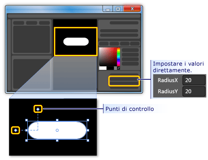
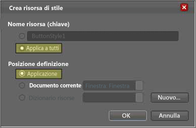
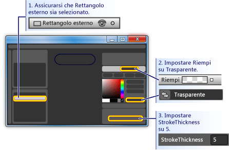
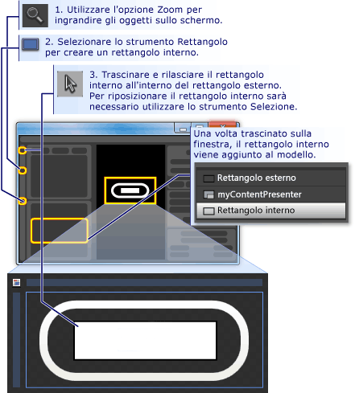
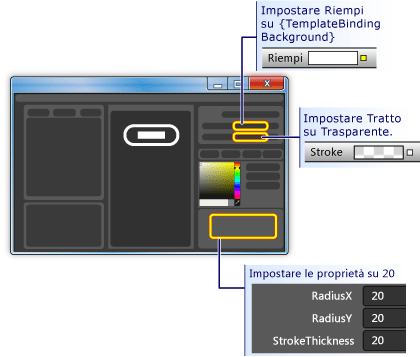
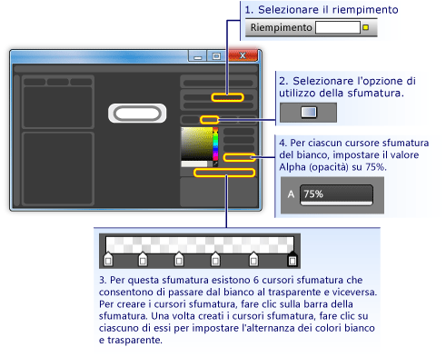
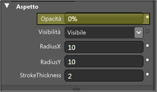
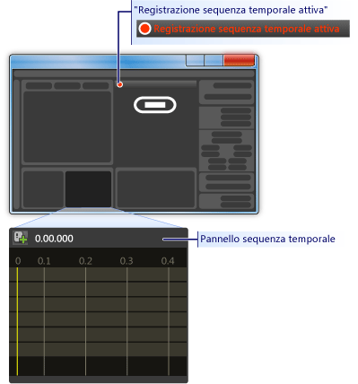
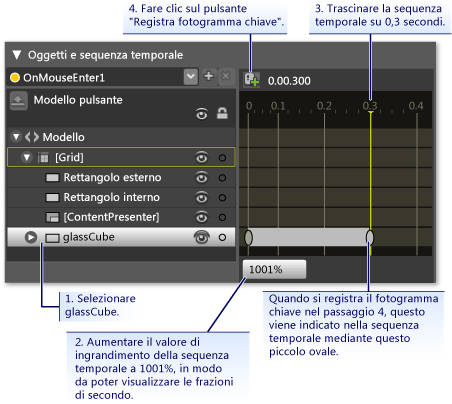
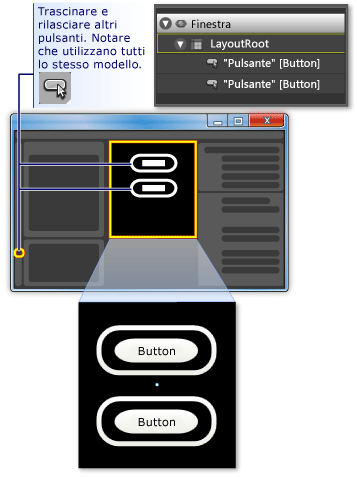

# Procedura dettagliata: creazione di un pulsante tramite Microsoft Expression Blend
In questa procedura dettagliata è illustrato il processo di creazione di un [!INCLUDE[TLA2#tla_wpf](../../../../includes/tla2sharptla-wpf-md.md)] pulsante personalizzato mediante Microsoft Expression Blend.  
  
> [!IMPORTANT]
>  Microsoft Expression Blend funziona generando [!INCLUDE[TLA#tla_xaml](../../../../includes/tlasharptla-xaml-md.md)] che viene quindi compilata per rendere il programma eseguibile. Se si preferisce utilizzare con [!INCLUDE[TLA#tla_xaml](../../../../includes/tlasharptla-xaml-md.md)] direttamente, è disponibile un'altra procedura dettagliata che consente di creare utilizzando la stessa applicazione [!INCLUDE[TLA#tla_xaml](../../../../includes/tlasharptla-xaml-md.md)] con Visual Studio anziché Blend. Vedere [creare un pulsante utilizzando il codice XAML](../../../../docs/framework/wpf/controls/walkthrough-create-a-button-by-using-xaml.md) per ulteriori informazioni.  
  
 Nella figura seguente mostra il pulsante personalizzato che verrà creato.  
  
   
  
## Convertire una forma in un pulsante  
 Nella prima parte di questa procedura dettagliata creare l'aspetto del pulsante personalizzato. A tale scopo, innanzitutto è necessario convertire un rettangolo a un pulsante. Aggiungere quindi altre forme per il modello del pulsante di creazione di un pulsante esaminando più complesso. Perché non dispone di un pulsante normale e personalizzare il report? Poiché un pulsante è una funzionalità integrata che non è necessaria; per i pulsanti personalizzati, è facile iniziare con un rettangolo.  
  
#### Per creare un nuovo progetto in Expression Blend  
  
1.  Avviare Expression Blend. (Fare clic su **avviare**, scegliere **tutti i programmi**, scegliere **Microsoft Expression**, quindi fare clic su **Microsoft Expression Blend**.)  
  
2.  Ottimizzare l'applicazione.  
  
3.  Scegliere **Nuovo progetto** dal menu **File**.  
  
4.  Selezionare **applicazione Standard (.exe)**.  
  
5.  Denominare il progetto `CustomButton` e premere **OK**.  
  
 A questo punto si dispone di uno spazio vuoto [!INCLUDE[TLA2#tla_wpf](../../../../includes/tla2sharptla-wpf-md.md)] progetto. È possibile premere F5 per eseguire l'applicazione. Come prevedibile, l'applicazione è costituita solo da una finestra vuota. Successivamente, creare un rettangolo arrotondato e convertirlo in un pulsante.  
  
#### Per convertire un rettangolo a un pulsante  
  
1.  **Impostare la proprietà di sfondo della finestra su nero:** selezionare la finestra, fare clic sui **scheda delle proprietà**e impostare il <xref:System.Windows.Controls.Control.Background%2A> proprietà `Black`.  
  
       
  
2.  **Disegna un rettangolo approssimativamente alle dimensioni di un pulsante della finestra:** selezionare lo strumento rettangolo nel riquadro sinistro dello strumento e trascinare il rettangolo nella finestra.  
  
       
  
3.  **Arrotondare gli angoli del rettangolo:** trascinare i punti di controllo del rettangolo oppure impostare direttamente il <xref:System.Windows.Shapes.Rectangle.RadiusX%2A> e <xref:System.Windows.Shapes.Rectangle.RadiusY%2A> proprietà. Impostare i valori di <xref:System.Windows.Shapes.Rectangle.RadiusX%2A> e <xref:System.Windows.Shapes.Rectangle.RadiusY%2A> a 20.  
  
       
  
4.  **Modificare il rettangolo in un pulsante:** selezionare il rettangolo. Nel **strumenti** menu, fare clic su **Crea pulsante**.  
  
       
  
5.  **Specificare l'ambito dello stile/modello:** verrà visualizzata una finestra di dialogo.  
  
       
  
     Per **nome (chiave)** selezionare **applica a tutte**.  In questo modo il modello si applicano a tutti gli oggetti che sono disponibili pulsanti e lo stile risulta. Per **definire in**selezionare **applicazione**. In questo modo il modello all'intera applicazione e lo stile risultanti. Quando si impostano i valori in queste due caselle, il modello e stile del pulsante si applicano a tutti i pulsanti all'interno dell'intera applicazione e qualsiasi pulsante creato nell'applicazione, per impostazione predefinita, questo modello verrà utilizzato.  
  
## Modificare il modello di pulsante  
 È ora un rettangolo che è stato modificato in un pulsante. In questa sezione sarà di modificare il modello del pulsante e di personalizzare l'aspetto.  
  
#### Per modificare il modello di pulsante per modificare l'aspetto del pulsante  
  
1.  **Passare alla visualizzazione modello di modifica:** per personalizzare ulteriormente l'aspetto del pulsante, è necessario modificare il modello di pulsante. Questo modello è stato creato al momento della conversione del rettangolo in un pulsante. Per modificare il modello di pulsante, fare doppio clic sul pulsante e selezionare **Modifica parti del controllo (modello)** e quindi **modifica modello**.  
  
       
  
     Nella finestra dell'editor dei modelli, si noti che il pulsante è ora suddiviso in un <xref:System.Windows.Shapes.Rectangle> e <xref:System.Windows.Controls.ContentPresenter>. Il <xref:System.Windows.Controls.ContentPresenter> viene utilizzato per presentare il contenuto all'interno del pulsante (ad esempio, la stringa "Pulsante"). Sia il rettangolo e <xref:System.Windows.Controls.ContentPresenter> sono posizionati all'interno di un <xref:System.Windows.Controls.Grid>.  
  
       
  
2.  **Modificare i nomi dei componenti del modello:** destro del mouse sul rettangolo nell'inventario dei modelli, modifica il <xref:System.Windows.Shapes.Rectangle> nome dal "[rettangolo]" per "Rettangolo esterno" e "[ContentPresenter]" in "myContentPresenter".  
  
       
  
3.  **Modificare il rettangolo in modo che risulti vuoto all'interno di ():** selezionate **rettangolo esterno** e impostare <xref:System.Windows.Shapes.Shape.Fill%2A> su "Transparent" e <xref:System.Windows.Shapes.Shape.StrokeThickness%2A> a 5.  
  
       
  
     Impostare quindi la <xref:System.Windows.Shapes.Shape.Stroke%2A> il colore di qualsiasi il modello sarà. A tale scopo, fare clic sulla casella bianca accanto a **tratto**selezionare **espressione personalizzata**, digitare "{TemplateBinding Background}" nella finestra di dialogo.  
  
       
  
4.  **Creare un rettangolo interno:** a questo punto, creare un altro rettangolo (denominarla "rettangolo interno") e posizionarlo in modo simmetrico all'interno del **rettangolo esterno** . Per questo tipo di lavoro, si desidererà probabilmente eseguire lo zoom per ingrandire il pulsante nell'area di modifica.  
  
    > [!NOTE]
    >  Il rettangolo potrebbe apparire diverso rispetto a quello nella figura (ad esempio, potrebbe avere gli angoli arrotondati).  
  
       
  
5.  **Spostare ContentPresenter nella parte superiore:** a questo punto, è possibile che il "Pulsante" testo non sarà più visibile. Se si tratta di questa operazione, infatti, **rettangolo interno** si trova sopra il **myContentPresenter**. Per risolvere questo problema, è possibile trascinare **myContentPresenter** sotto **rettangolo interno**. Riposizionare i rettangoli e **myContentPresenter** per un aspetto simile al seguente.  
  
    > [!NOTE]
    >  In alternativa, è anche possibile posizionare **myContentPresenter** in primo piano facendo clic destro e premendo **inviare rollforward**.  
  
       
  
6.  **Modificare l'aspetto del rettangolo interno:** impostare il <xref:System.Windows.Shapes.Rectangle.RadiusX%2A>, <xref:System.Windows.Shapes.Rectangle.RadiusY%2A>, e <xref:System.Windows.Shapes.Shape.StrokeThickness%2A> valori a 20. Inoltre, impostare il <xref:System.Windows.Shapes.Shape.Fill%2A> allo sfondo del modello utilizzando l'espressione personalizzata "{TemplateBinding Background}") e impostare <xref:System.Windows.Shapes.Shape.Stroke%2A> su "transparent". Si noti che le impostazioni per il <xref:System.Windows.Shapes.Shape.Fill%2A> e <xref:System.Windows.Shapes.Shape.Stroke%2A> di **rettangolo interno** sono l'opposto di quelli per **rettangolo esterno**.  
  
       
  
7.  **Aggiungere un livello di ingrandimento nella parte superiore:** nella parte finale della personalizzazione dell'aspetto del pulsante consiste nell'aggiungere un effetto cristallo in primo piano. Questo effetto cristallo è costituito da un rettangolo di terzo. Poiché l'effetto cristallo ricopre l'intero pulsante, il rettangolo con effetto cristallo è dimensioni simile al **rettangolo esterno**. Pertanto, creare un rettangolo da una semplice copia del **rettangolo esterno**. Evidenziare **rettangolo esterno** e utilizzare CTRL + C e CTRL + V per creare una copia. Denominare il nuovo rettangolo "glassCube".  
  
8.  **Se necessario, riposizionare glassCube:** se **glassCube** è non è già posizionato in modo che copre l'intero pulsante, trascinarlo nella posizione.  
  
9. **Assegnare una forma leggermente diversa rispetto a rettangolo esterno glassCube:** modificare le proprietà di **glassCube**. Iniziare impostando il <xref:System.Windows.Shapes.Rectangle.RadiusX%2A> e <xref:System.Windows.Shapes.Rectangle.RadiusY%2A> proprietà a 10 e <xref:System.Windows.Shapes.Shape.StrokeThickness%2A> a 2.  
  
       
  
10. **Rendere glassCube simile bicchiere:** impostare il <xref:System.Windows.Shapes.Shape.Fill%2A> su un aspetto utilizzando una sfumatura lineare che è opaca al 75% e alterna tra il colore bianco e trasparente oltre 6 approssimativamente in modo uniforme tra la spaziatura tra gli intervalli. Questo è il valore da impostare lo sfumatura:  
  
    -   Cursore sfumatura 1: Bianco con un valore alfa pari al 75%  
  
    -   Sfumatura 2: trasparente  
  
    -   Cursore sfumatura 3: Bianco con un valore alfa pari al 75%  
  
    -   Sfumatura 4: trasparente  
  
    -   Cursore sfumatura 5: Bianco con un valore alfa pari al 75%  
  
    -   Sfumatura 6: trasparente  
  
     Crea un effetto cristallo "ondulata".  
  
       
  
11. **Nascondere l'effetto cristallo:** dopo che viene visualizzato il livello cristallo l'aspetto, il **riquadro aspetto** del **Pannello proprietà** e impostare l'opacità allo 0% per nasconderlo. Nelle sezioni successive, utilizzeremo i trigger di proprietà ed eventi per visualizzare e modificare l'effetto cristallo.  
  
       
  
## Personalizzare il comportamento del pulsante  
 A questo punto, sono state personalizzate la presentazione del pulsante modificandone il modello, ma il pulsante non rispondere alle azioni dell'utente come pulsanti tipico (ad esempio, modifica dell'aspetto al passaggio del puntatore del mouse, riceve lo stato attivo e facendo clic su.) Le due procedure che seguono viene illustrato come compilare comportamenti come questi nel pulsante personalizzato. Si sarà iniziano con i trigger di proprietà semplice e quindi aggiungere trigger di evento e le animazioni.  
  
#### Per impostare i trigger di proprietà  
  
1.  **Creare un nuovo trigger di proprietà:** con **glassCube** selezionato, fare clic su **+ proprietà** nel **trigger** pannello (vedere la figura che segue il passaggio successivo). Verrà creato un trigger di proprietà con un trigger di proprietà predefinito.  
  
2.  **Impostare la proprietà utilizzata dal trigger come IsMouseOver:** modificare la proprietà in <xref:System.Windows.UIElement.IsMouseOver%2A>. In questo modo, si attiva quando il trigger di proprietà di <xref:System.Windows.UIElement.IsMouseOver%2A> proprietà `true` (quando l'utente deve scegliere il pulsante con il mouse).  
  
       
  
3.  **IsMouseOver consente di opacità del 100% per glassCube:** si noti che il **Trigger registrazione** (vedere la figura precedente). Ciò significa che le modifiche apportate ai valori della proprietà di **glassCube** mentre registrazione diventerà un'azione che ha luogo quando <xref:System.Windows.UIElement.IsMouseOver%2A> è `true`. Durante la registrazione, modificare il <xref:System.Windows.UIElement.Opacity%2A> di **glassCube** al 100%.  
  
       
  
     Il primo trigger di proprietà è stata creata. Si noti che il **pannello trigger** dell'editor ha registrato il <xref:System.Windows.UIElement.Opacity%2A> per essere modificato in 100%.  
  
       
  
     Premere F5 per eseguire l'applicazione e spostare il puntatore del mouse su e disattivare il pulsante. Si dovrebbe essere visualizzato quando l'effetto cristallo del puntatore del mouse sul pulsante e quando il puntatore esce.  
  
4.  **I trigger IsMouseOver tracciare modifica del valore:** opportuno associare altre azioni con il <xref:System.Windows.UIElement.IsMouseOver%2A> trigger. Durante la registrazione continua, spostare la selezione da **glassCube** a **rettangolo esterno**. Impostare quindi la <xref:System.Windows.Shapes.Shape.Stroke%2A> di **rettangolo esterno** per l'espressione personalizzata di "{DynamicResource {X:Static SystemColors. HighlightBrushKey}}". Consente di impostare il <xref:System.Windows.Shapes.Shape.Stroke%2A> di evidenziazione standard utilizzato dai pulsanti di colore. Premere F5 per visualizzare l'effetto quando si passa il mouse su di esso.  
  
       
  
5.  **Testo sfocato IsMouseOver consente di:** possibile associare un'altra azione per il <xref:System.Windows.UIElement.IsMouseOver%2A> trigger di proprietà. Visualizzare il contenuto del pulsante leggermente sfocata quando viene visualizzato l'effetto cristallo su di esso. A tale scopo, è possibile applicare una sfocatura <xref:System.Windows.Media.Effects.BitmapEffect> per il <xref:System.Windows.Controls.ContentPresenter> (**myContentPresenter**).  
  
       
  
    > [!NOTE]
    >  Per restituire il **Pannello proprietà** su quello che era prima l'operazione di ricerca per <xref:System.Windows.Media.Effects.BitmapEffect>, cancellare il testo dal **casella di ricerca**.  
  
     A questo punto, è stato utilizzato un trigger di proprietà con diverse azioni associate per creare il comportamento di evidenziazione per quando il puntatore del mouse entra ed esce dall'area del pulsante. È un altro comportamento tipico per un pulsante per evidenziare con lo stato attivo (come dopo il clic). È possibile aggiungere questo comportamento aggiungendo un altro trigger di proprietà per il <xref:System.Windows.UIElement.IsFocused%2A> proprietà.  
  
6.  **Creare trigger di proprietà per IsFocused:** utilizzando la stessa procedura utilizzata per <xref:System.Windows.UIElement.IsMouseOver%2A> (vedere il primo passaggio di questa sezione), creare un altro trigger di proprietà per il <xref:System.Windows.UIElement.IsFocused%2A> proprietà. Mentre **registrazione Trigger**, aggiungere le seguenti azioni al trigger:  
  
    -   **glassCube** Ottiene un <xref:System.Windows.UIElement.Opacity%2A> del 100%.  
  
    -   **Rettangolo esterno** Ottiene un <xref:System.Windows.Shapes.Shape.Stroke%2A> valore dell'espressione personalizzata di "{DynamicResource {X:Static SystemColors. HighlightBrushKey}}".  
  
 Come passaggio finale in questa procedura dettagliata, si aggiungerà le animazioni al pulsante. Le animazioni verranno attivate da eventi, in particolare, il <xref:System.Windows.UIElement.MouseEnter> e <xref:System.Windows.Controls.Primitives.ButtonBase.Click> eventi.  
  
#### Utilizzare i trigger di evento e le animazioni per aggiungere interattività  
  
1.  **Creare un Trigger di evento MouseEnter:** aggiungere un nuovo trigger di evento e selezionare <xref:System.Windows.UIElement.MouseEnter> dell'evento da utilizzare nel trigger.  
  
       
  
2.  **Creare una sequenza temporale di animazione:** successivamente, associare una sequenza temporale di animazione per il <xref:System.Windows.UIElement.MouseEnter> evento.  
  
       
  
     Dopo aver premuto **OK** per creare una nuova sequenza temporale, un **pannello della sequenza temporale** viene visualizzata e "Registrazione della sequenza temporale" è visibile nel Pannello di progettazione. Ciò significa che è possibile avviare la registrazione delle modifiche di proprietà nella sequenza temporale (proprietà animare modifiche).  
  
    > [!NOTE]
    >  Potrebbe essere necessario ridimensionare la finestra e/o i pannelli per visualizzare la visualizzazione.  
  
       
  
3.  **Creare un fotogramma chiave:** per creare un'animazione, selezionare l'oggetto che si desidera aggiungere un'animazione, creare due o più fotogrammi chiave sulla sequenza temporale e per i fotogrammi chiave, impostare i valori di proprietà desiderati interpolare tra l'animazione. Nella figura seguente illustra la creazione di un fotogramma chiave.  
  
       
  
4.  **Compattare glassCube questo fotogramma chiave:** con il secondo fotogramma chiave selezionato, specificare una dimensione il **glassCube** al 90% del schermo intero con il **dimensioni trasformare**.  
  
       
  
     Premere F5 per eseguire l'applicazione. Spostare il puntatore del mouse su di esso. Si noti che riduce l'effetto cristallo sopra il pulsante.  
  
5.  **Creare un altro Trigger di evento e associarvi un'animazione diversa:** aggiungere un'altra animazione. Utilizzare una procedura simile a quella usata per creare l'animazione di trigger di evento precedente:  
  
    1.  Creare un nuovo evento trigger utilizzando il <xref:System.Windows.Controls.Primitives.ButtonBase.Click> evento.  
  
    2.  Associare una nuova sequenza temporale con il <xref:System.Windows.Controls.Primitives.ButtonBase.Click> evento.  
  
       
  
    1.  Per questa sequenza temporale, creare due fotogrammi chiave, in secondi compreso tra 0,0 e la seconda 0,3 secondi.  
  
    2.  Con il fotogramma chiave 0,3 secondi evidenziato, impostare il **ruotare l'angolo di trasformazione** a 360 gradi.  
  
       
  
    1.  Premere F5 per eseguire l'applicazione. Fare clic sul pulsante. Si noti che l'effetto cristallo ruota.  
  
## Conclusione  
 È stato completato un pulsante personalizzato. È stato fatto, questa operazione utilizzando un modello di pulsante che è stato applicato a tutti i pulsanti nell'applicazione. Se si esce dalla modalità di modifica modelli (vedere la figura seguente) e creare più pulsanti, si noterà che l'aspetto e comportamento del pulsante personalizzato anziché come pulsante predefinito.  
  
   
  
   
  
 Premere F5 per eseguire l'applicazione. Fare clic sui pulsanti e notare come tutti lo stesso comportamento.  
  
 Tenere presente che anche se sono stati personalizzazione del modello è impostata la <xref:System.Windows.Shapes.Shape.Fill%2A> proprietà di **rettangolo interno** e <xref:System.Windows.Shapes.Shape.Stroke%2A> proprietà **rettangolo esterno** sullo sfondo del modello ({ TemplateBinding Background}). Per questo motivo, quando si imposta il colore di sfondo dei singoli pulsanti, lo sfondo impostato verrà utilizzato per le rispettive proprietà. Provare a modificare ora gli sfondi. Nella figura seguente, vengono utilizzate diverse sfumature. Pertanto, anche se è utile per la personalizzazione generale dei controlli pulsante di un modello, controlli con modelli di possono essere modificati per esaminare diversi tra loro.  
  
   
  
 In conclusione, nel processo di personalizzazione di un modello di pulsante è stato descritto come eseguire le operazioni seguenti in Microsoft Expression Blend:  
  
-   Personalizzare l'aspetto di un controllo.  
  
-   Impostare i trigger di proprietà. I trigger di proprietà sono molto utili perché possono essere utilizzati nella maggior parte degli oggetti, non solo i controlli.  
  
-   Impostare i trigger di evento. I trigger di evento sono molto utili perché possono essere utilizzati nella maggior parte degli oggetti, non solo i controlli.  
  
-   Creare animazioni.  
  
-   Creare varie: sfumature, aggiungere BitmapEffects, utilizzare le trasformazioni e impostare le proprietà di base di oggetti.  
  
## Vedere anche  
 [Creare un pulsante usando XAML](../../../../docs/framework/wpf/controls/walkthrough-create-a-button-by-using-xaml.md)  
 [Applicazione di stili e modelli](../../../../docs/framework/wpf/controls/styling-and-templating.md)  
 [Cenni preliminari sull'animazione](../../../../docs/framework/wpf/graphics-multimedia/animation-overview.md)  
 [Cenni sul disegno con colori a tinta unita e sfumature](../../../../docs/framework/wpf/graphics-multimedia/painting-with-solid-colors-and-gradients-overview.md)  
 [Panoramica sugli effetti bitmap](../../../../docs/framework/wpf/graphics-multimedia/bitmap-effects-overview.md)
