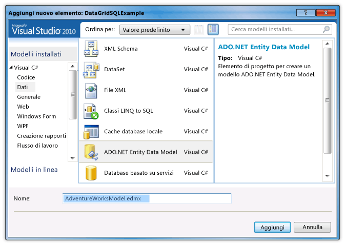
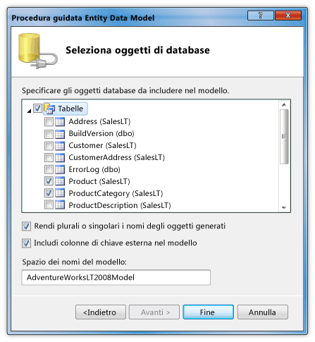
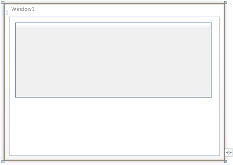

# Procedura dettagliata: aggiunta di dati di un database di SQL Server in un controllo DataGrid
In questa procedura dettagliata, si recuperano dati da un database di SQL Server e visualizzarli in un <xref:System.Windows.Controls.DataGrid> controllo. Utilizzare ADO.NET Entity Framework per creare le classi di entità che rappresentano i dati e utilizzano LINQ per scrivere una query che recupera i dati specificati da una classe di entità.  
  
## Prerequisiti  
 Per completare la procedura dettagliata, è necessario disporre dei componenti seguenti:  
  
-   [!INCLUDE[vs_dev11_long](../../../../includes/vs-dev11-long-md.md)].  
  
-   Accesso a un'istanza di SQL Server o SQL Server Express con il database di esempio AdventureWorks associato in esecuzione. È possibile scaricare il database AdventureWorks dal [GitHub](https://github.com/Microsoft/sql-server-samples/releases).  
  
### Per creare classi di entità  
  
1.  Creare un nuovo progetto applicazione WPF in Visual Basic o c# e denominarlo `DataGridSQLExample`.  
  
2.  In Esplora soluzioni, fare clic sul progetto, scegliere **Aggiungi**, quindi selezionare **nuovo elemento**.  
  
     Verrà visualizzata la finestra di dialogo Aggiungi nuovo elemento.  
  
3.  Nel riquadro dei modelli installati, selezionare **dati** e nell'elenco dei modelli, selezionare **ADO.NET Entity Data Model**l.  
  
       
  
4.  Nome del file `AdventureWorksModel.edmx` e quindi fare clic su **Aggiungi**.  
  
     Verrà visualizzata la procedura guidata Entity Data Model.  
  
5.  Nella schermata, Scegli contenuto Model selezionare **genera da database** e quindi fare clic su **Avanti**.  
  
       
  
6.  Nella schermata di connessione dati, specificare la connessione al database AdventureWorksLT2008. Per ulteriori informazioni, vedere [dialogo scegliere la connessione dati](http://go.microsoft.com/fwlink/?LinkId=160190).  
  
       
  
7.  Assicurarsi che il nome sia `AdventureWorksLT2008Entities` e che il **Salva entità di impostazioni di connessione in App. config come** casella di controllo è selezionata e quindi fare clic su **Avanti**.  
  
8.  Nella schermata Seleziona oggetti di Database, espandere il nodo tabelle e selezionare il **prodotto** e **ProductCategory** tabelle.  
  
     È possibile generare le classi di entità per tutte le tabelle. Tuttavia, in questo esempio è solo recuperare dati da queste due tabelle.  
  
       
  
9. Scegliere **Fine**.  
  
     Le entità Product e ProductCategory vengono visualizzate in Entity Designer.  
  
       
  
### Per recuperare e presentare i dati  
  
1.  Aprire il file MainWindow. Xaml.  
  
2.  Impostare il <xref:System.Windows.FrameworkElement.Width%2A> proprietà il <xref:System.Windows.Window> a 450.  
  
3.  Nell'editor XAML, aggiungere le seguenti <xref:System.Windows.Controls.DataGrid> tag tra il `<Grid>` e `</Grid>` tag per aggiungere un <xref:System.Windows.Controls.DataGrid> denominato `dataGrid1`.  
  
     [!code-xaml[DataGrid_SQL_EF_Walkthrough#3](../../../../samples/snippets/csharp/VS_Snippets_Wpf/DataGrid_SQL_EF_Walkthrough/CS/MainWindow.xaml#3)]  
  
       
  
4.  Selezionare <xref:System.Windows.Window>.  
  
5.  Utilizzando la finestra proprietà o un editor XAML, creare un gestore eventi per il <xref:System.Windows.Window> denominato `Window_Loaded` per il <xref:System.Windows.FrameworkElement.Loaded> evento. Per ulteriori informazioni, vedere [procedura: creare un semplice gestore](http://msdn.microsoft.com/library/b1456e07-9dec-4354-99cf-18666b64f480).  
  
     Di seguito viene illustrato il codice XAML per MainWindow. Xaml.  
  
    > [!NOTE]
    >  Se si utilizza Visual Basic, nella prima riga di MainWindow. XAML, sostituire `x:Class="DataGridSQLExample.MainWindow"` con `x:Class="MainWindow"`.  
  
     [!code-xaml[DataGrid_SQL_EF_Walkthrough#1](../../../../samples/snippets/csharp/VS_Snippets_Wpf/DataGrid_SQL_EF_Walkthrough/CS/MainWindow.xaml#1)]  
  
6.  Aprire il file code-behind (VB o MainWindow.xaml.cs) per il <xref:System.Windows.Window>.  
  
7.  Aggiungere il codice seguente per recuperare solo i valori specifici da tabelle unite in join e impostare il <xref:System.Windows.Controls.ItemsControl.ItemsSource%2A> proprietà del <xref:System.Windows.Controls.DataGrid> ai risultati della query.  
  
     [!code-csharp[DataGrid_SQL_EF_Walkthrough#2](../../../../samples/snippets/csharp/VS_Snippets_Wpf/DataGrid_SQL_EF_Walkthrough/CS/MainWindow.xaml.cs#2)]
     [!code-vb[DataGrid_SQL_EF_Walkthrough#2](../../../../samples/snippets/visualbasic/VS_Snippets_Wpf/DataGrid_SQL_EF_Walkthrough/VB/MainWindow.xaml.vb#2)]  
  
8.  Eseguire l'esempio.  
  
     Verrà visualizzato un <xref:System.Windows.Controls.DataGrid> che visualizza i dati.  
  
       
  
## Passaggi successivi  
  
## Vedere anche  
 <xref:System.Windows.Controls.DataGrid>  
 [Come iniziare a ricerca per categorie: con Entity Framework nelle applicazioni WPF?](http://go.microsoft.com/fwlink/?LinkId=159868)
