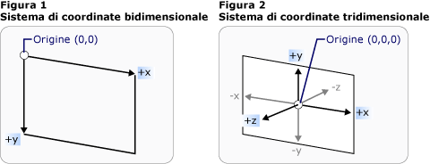
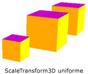
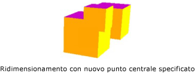
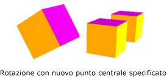

# Cenni preliminari sulle trasformazioni tridimensionali
Questo argomento descrive come applicare trasformazioni a modelli tridimensionali nel sistema grafico di [!INCLUDE[TLA#tla_winclient](../../../../includes/tlasharptla-winclient-md.md)]. Le trasformazioni consentono allo sviluppatore di riposizionare, ridimensionare e orientare nuovamente i modelli senza modificare i valori di base che li definiscono.  
  

  
## Spazio delle coordinate tridimensionali  
 Grafica 3D del contenuto in [!INCLUDE[TLA#tla_winclient](../../../../includes/tlasharptla-winclient-md.md)] è incapsulato in un elemento, <xref:System.Windows.Controls.Viewport3D>, che può far parte della struttura dell'elemento bidimensionale. Il sistema grafico considera Viewport3D come un oggetto visivo bidimensionale in modo analogo a molti altri in [!INCLUDE[TLA#tla_winclient](../../../../includes/tlasharptla-winclient-md.md)]. Viewport3D funziona come una finestra, ovvero un riquadro di visualizzazione, in una scena tridimensionale. Più precisamente, si tratta di una superficie sulla quale viene proiettata una scena tridimensionale.  Anche se è possibile usare l'oggetto Viewport3D con altri oggetti disegno bidimensionali nello stesso grafico della scena, non è possibile inserire oggetti bidimensionali e tridimensionali in un oggetto Viewport3D. Nella discussione seguente lo spazio delle coordinate descritto è contenuto nell'elemento Viewport3D.  
  
 Il sistema di coordinate [!INCLUDE[TLA#tla_winclient](../../../../includes/tlasharptla-winclient-md.md)] per la grafica bidimensionale individua l'origine nella parte superiore sinistra della superficie di rendering, in genere lo schermo. Nel sistema bidimensionale i valori positivi dell'asse x procedono verso destra, mentre i valori positivi dell'asse y procedono in direzione discendente. Nel sistema di coordinate tridimensionale l'origine viene individuata invece al centro dello schermo, con i valori positivi dell'asse x che procedono verso destra, i valori positivi dell'asse y che procedono verso l'alto e i valori positivi dell'asse z che procedono verso l'esterno dell'origine, in direzione del visualizzatore.  
  
   
Confronto tra sistemi di coordinate  
  
 Lo spazio definito da tali assi è il fotogramma di riferimento fisso per oggetti tridimensionali in [!INCLUDE[TLA#tla_winclient](../../../../includes/tlasharptla-winclient-md.md)]. Quando si compilano modelli in questo spazio e si creano luci e fotocamere per visualizzarli, è consigliabile distinguere il fotogramma di riferimento fisso, o "spazio globale", da quello di riferimento locale creato per ogni modello quando si applicano trasformazioni. Si ricordi anche che gli oggetti dello spazio globale possono avere un aspetto completamente diverso o non essere completamente visibili, a seconda delle impostazioni di luce e fotocamera e che la posizione della fotocamera tuttavia non modifica la posizione degli oggetti nello spazio globale.  
  
## Trasformazione di modelli  
 Quando vengono creati, i modelli hanno una determinata posizione nella scena. Per spostare i modelli nella scena, ruotarli o modificarne la dimensione, non è pratico modificare i vertici che li definiscono, ma è opportuno invece applicare trasformazioni ai modelli, come nel sistema bidimensionale.  
  
 Ogni oggetto modello dispone di un <xref:System.Windows.Media.Media3D.Model3D.Transform%2A> proprietà con cui è possibile spostare, orientare nuovamente o ridimensionare il modello. Quando si applica una trasformazione, si esegue in effetti l'offset di tutti i punti del modello in base a qualsiasi vettore o valore specificato dalla trasformazione. In altre parole, viene trasformato lo spazio delle coordinate in cui il modello è definito ("spazio modello"), ma non vengono modificati i valori che costituiscono la geometria del modello nel sistema di coordinate dell'intera scena ("spazio globale").  
  
## Trasformazioni di traslazione  
 Le trasformazioni 3D ereditano dalla classe base astratta <xref:System.Windows.Media.Media3D.Transform3D>; tra le classi di trasformazione affine <xref:System.Windows.Media.Media3D.TranslateTransform3D>, <xref:System.Windows.Media.Media3D.ScaleTransform3D>, e <xref:System.Windows.Media.Media3D.RotateTransform3D>. Il [!INCLUDE[TLA#tla_winclient](../../../../includes/tlasharptla-winclient-md.md)] 3D sistema fornisce inoltre un <xref:System.Windows.Media.Media3D.MatrixTransform3D> classe che consente di specificare le stesse trasformazioni in più concise operazioni della matrice.  
  
 <xref:System.Windows.Media.Media3D.TranslateTransform3D>Sposta tutti i punti in Model3D nella direzione del vettore offset è specificato con il <xref:System.Windows.Media.Media3D.TranslateTransform3D.OffsetX%2A>, <xref:System.Windows.Media.Media3D.TranslateTransform3D.OffsetY%2A>, e <xref:System.Windows.Media.Media3D.TranslateTransform3D.OffsetZ%2A> proprietà. Dato un vertice di un cubo a (2,2,2), ad esempio, un vettore offset di (0,1.6,1) sposta tale vertice da (2,2,2) a (2,3.6,3). Il vertice del cubo è ancora (2,2,2) nello spazio modello ma, dal momento che è stata modificata la relazione tra tale spazio e lo spazio globale, risulta che (2,2,2) nello spazio modello diventa (2,3.6,3) nello spazio globale.  
  
   
Traslazione con offset  
  
 Gli esempi di codice seguente illustrano come applicare una traslazione.  
  
 [!code-xaml[animation3dgallery_snip#Translation3DAnimationExampleWholePage](../../../../samples/snippets/csharp/VS_Snippets_Wpf/Animation3DGallery_snip/CS/Translation3DAnimationExample.xaml#translation3danimationexamplewholepage)]  
  
## Trasformazioni di scala  
 <xref:System.Windows.Media.Media3D.ScaleTransform3D>modifica la scala del modello in un vettore di scala specificato riferimento a un punto centrale. Specificare una scala uniforme, che adatti il modello in base allo stesso valore sugli assi X, Y e Z, in modo da modificare la dimensione del modello proporzionalmente. Ad esempio, l'impostazione della trasformazione <xref:System.Windows.Media.ScaleTransform.ScaleX%2A>, <xref:System.Windows.Media.ScaleTransform.ScaleY%2A>, e <xref:System.Windows.Media.Media3D.ScaleTransform3D.ScaleZ%2A> su 0,5 dimezzato le dimensioni del modello; impostando le stesse proprietà 2 raddoppia la scala in tutti e tre gli assi.  
  
   
Esempio di ScaleVector  
  
 Se si specifica una trasformazione di scala non uniforme, ovvero una trasformazione in cui i valori X, Y e Z non sono tutti uguali, è possibile generare un modello da estendere o comprimere in una o due dimensioni senza influire sulle altre. Ad esempio, l'impostazione <xref:System.Windows.Media.ScaleTransform.ScaleX%2A> su 1, <xref:System.Windows.Media.ScaleTransform.ScaleY%2A> a 2, e <xref:System.Windows.Media.Media3D.ScaleTransform3D.ScaleZ%2A> su 1, viene generato il modello trasformato l'altezza raddoppiata ma invariato lungo gli assi X e Z.  
  
 Per impostazione predefinita, ScaleTransform3D determina l'espansione o la contrazione di vertici intorno all'origine (0,0,0). Se il modello da trasformare non è stato creato dall'origine, tuttavia, il ridimensionamento del modello dall'origine non si adatterà al modello sul posto. Quando i vertici del modello vengono moltiplicati per il vettore di ridimensionamento, l'operazione di ridimensionamento ha invece l'effetto di traslare il modello e di ridimensionarlo.  
  
   
Esempio di centro di ridimensionamento  
  
 Per ridimensionare un modello "sul posto", specificare il centro del modello impostando il ScaleTransform3D <xref:System.Windows.Media.ScaleTransform.CenterX%2A>, <xref:System.Windows.Media.ScaleTransform.CenterY%2A>, e <xref:System.Windows.Media.Media3D.ScaleTransform3D.CenterZ%2A> proprietà. Ciò garantisce che il sistema grafico ridimensiona lo spazio di modello e lo converte quindi al centro sui specificato <xref:System.Windows.Media.Media3D.Point3D>. Se invece il modello è stato creato intorno all'origine e si specifica un punto centrale diverso, il modello viene traslato lontano dall'origine.  
  
## Trasformazioni di rotazione  
 È possibile ruotare un modello 3D in diversi modi. Una trasformazione di rotazione tipica specifica un asse e un angolo di rotazione intorno a tale asse. Il <xref:System.Windows.Media.Media3D.RotateTransform3D> classe consente di definire un <xref:System.Windows.Media.Media3D.Rotation3D> con il relativo <xref:System.Windows.Media.Media3D.RotateTransform3D.Rotation%2A> proprietà. Specificare quindi <xref:System.Windows.Media.Media3D.AxisAngleRotation3D.Axis%2A> e <xref:System.Windows.Media.Media3D.AxisAngleRotation3D.Angle%2A> proprietà il Rotation3D, in questo caso un <xref:System.Windows.Media.Media3D.AxisAngleRotation3D>, per definire la trasformazione. Gli esempi seguenti ruotano un modello di 60 gradi intorno all'asse Y.  
  
 [!code-xaml[animation3dgallery_snip#Rotate3DUsingAxisAngleRotation3DExampleWholePage](../../../../samples/snippets/csharp/VS_Snippets_Wpf/Animation3DGallery_snip/CS/Rotat3DUsingAxisAngleRotation3DExample.xaml#rotate3dusingaxisanglerotation3dexamplewholepage)]  
  
 Nota: [!INCLUDE[TLA#tla_winclient](../../../../includes/tlasharptla-winclient-md.md)] 3-D è un sistema destrorso, che implica che un valore positivo per una rotazione genera una rotazione in senso antiorario rispetto all'asse.  
  
 Le rotazioni asse-angolo presumono una rotazione intorno all'origine se non è stato specificato un valore per il <xref:System.Windows.Media.Media3D.RotateTransform3D.CenterX%2A>, <xref:System.Windows.Media.Media3D.RotateTransform3D.CenterY%2A>, e <xref:System.Windows.Media.Media3D.RotateTransform3D.CenterZ%2A> proprietà RotateTransform3D. Come per il ridimensionamento, è opportuno ricordare che la rotazione trasforma l'intero spazio delle coordinate del modello. Se il modello è stato creato intorno all'origine oppure è stato traslato in precedenza, la rotazione potrebbe girare rispetto all'origine invece di ruotare sul posto.  
  
   
Rotazione con nuovo centro specificato  
  
 Per ruotare il modello sul posto, specificare il centro effettivo del modello come centro di rotazione. Poiché la geometria si basa in genere sull'origine, molto spesso è possibile ottenere il risultato previsto di un set di trasformazioni adattando il modello (ridimensionandolo), quindi impostando l'orientamento (ruotandolo) e infine spostandolo nella posizione desiderata (traslandolo).  
  
   
Esempio di rotazione  
  
 Le rotazioni asse-angolo sono particolarmente utili per le trasformazioni statiche e per alcune animazioni. È consigliabile tuttavia ruotare il modello di un cubo di 60 gradi rispetto all'asse X, quindi di 45 gradi rispetto all'asse Z. È possibile descrivere questa trasformazione come due distinte trasformazioni analoghe o come una matrice. Potrebbe risultare difficile, tuttavia, animare correttamente una rotazione definita in questo modo. Sebbene le posizioni iniziale e finale del modello calcolate da uno dei due approcci siano le stesse, le posizioni intermedie assunte dal modello non sono definite dal punto di vista del calcolo. I quaternioni costituiscono un modo alternativo di calcolare l'interpolazione tra l'inizio e la fine di una rotazione.  
  
 Un quaternione rappresenta un asse nello spazio tridimensionale e una rotazione intorno a tale asse. Un quaternione può rappresentare ad esempio un asse (1,1,2) e una rotazione di 50 gradi. La capacità dei quaternioni di definire le rotazioni deriva dalle due operazioni che è possibile eseguire su di essi, ovvero composizione e interpolazione. La composizione di due quaternioni applicata alla geometria significa "ruotare la geometria intorno all'asse 2 con la rotazione 2, quindi ruotarla intorno all'asse 1 con la rotazione 1". Grazie alla composizione, è possibile combinare le due rotazioni relative alla geometria per ottenere un singolo quaternione che costituisce il risultato. Poiché l'interpolazione dei quaternioni consente di calcolare un tracciato corretto e adeguato da un asse e da un orientamento all'altro, è possibile eseguire l'interpolazione dal quaternione originale a quello composto per ottenere una transizione corretta dall'uno all'altro, con la possibilità di animare la trasformazione. Per i modelli che si desidera aggiungere un'animazione, è possibile specificare una destinazione <xref:System.Windows.Media.Media3D.Quaternion> per la rotazione utilizzando un <xref:System.Windows.Media.Media3D.QuaternionRotation3D> per il <xref:System.Windows.Media.Media3D.RotateTransform3D.Rotation%2A> proprietà.  
  
## Uso di raccolte di trasformazione  
 Quando si crea una scena, è normale applicare più di una trasformazione a un modello. Aggiungere trasformazioni per il <xref:System.Windows.Media.Media3D.Transform3DGroup.Children%2A> insieme il <xref:System.Windows.Media.Media3D.Transform3DGroup> opportunamente classe per raggruppare le trasformazioni da applicare a vari modelli nella scena. È spesso consigliabile usare nuovamente una trasformazione in vari gruppi differenti, in modo molto simile a quanto avviene per il nuovo uso di un modello applicando un set diverso di trasformazioni a ogni istanza. Si noti che l'ordine in cui le trasformazioni vengono aggiunte alle raccolte è significativo. Le trasformazioni nella raccolta vengono infatti applicate dalla prima all'ultima.  
  
## Animazione delle trasformazioni  
 L'implementazione tridimensionale di [!INCLUDE[TLA#tla_winclient](../../../../includes/tlasharptla-winclient-md.md)] fa parte dello stesso sistema di temporizzazione e animazione della grafica bidimensionale. In altre parole, per animare una scena tridimensionale, è necessario animare le proprietà dei relativi modelli. Anche se è possibile animare direttamente proprietà di primitive, in genere è più semplice animare trasformazioni che modificano la posizione o l'aspetto di modelli. Poiché le trasformazioni possono essere applicate a <xref:System.Windows.Media.Media3D.Model3DGroup> oggetti nonché singoli modelli, è possibile applicare un insieme di animazioni per gli elementi figlio di un Model3Dgroup e un altro set di animazioni a un gruppo di oggetti.  Per informazioni di base sul sistema di temporizzazione e di animazione [!INCLUDE[TLA#tla_winclient](../../../../includes/tlasharptla-winclient-md.md)], vedere [Cenni preliminari sulle animazioni](../../../../docs/framework/wpf/graphics-multimedia/animation-overview.md) e [Cenni preliminari sugli storyboard](../../../../docs/framework/wpf/graphics-multimedia/storyboards-overview.md).  
  
 Per animare un oggetto in [!INCLUDE[TLA#tla_winclient](../../../../includes/tlasharptla-winclient-md.md)], creare una sequenza temporale, definire un'animazione (che rappresenti una effettiva modifica del valore di alcune proprietà nel tempo) e specificare la proprietà alla quale applicare l'animazione, che deve essere una proprietà di un oggetto FrameworkElement. Poiché tutti gli oggetti in una scena tridimensionale sono elementi figlio di Viewport3D, le proprietà interessate da qualsiasi animazione da applicare alla scena sono proprietà delle proprietà di Viewport3D. È importante elaborare con attenzione il tracciato di proprietà per l'animazione, in quanto la sintassi può risultare ridondante.  
  
 Si supponga di voler ruotare un oggetto sul posto, ma anche di applicare un movimento oscillante per esporre un'area maggiore dell'oggetto da visualizzare. È possibile scegliere di applicare un oggetto RotateTransform3D e animare l'asse di rotazione da un vettore a un altro. Esempio di codice seguente viene illustrata l'applicazione un <xref:System.Windows.Media.Animation.Vector3DAnimation> alla proprietà dell'asse di Rotation3D della trasformazione, presupponendo che RotateTransform3D sia una delle numerose trasformazioni applicate al modello con un <xref:System.Windows.Media.TransformGroup>.  
  
 [!code-csharp[3doverview#3DOverview3DN1](../../../../samples/snippets/csharp/VS_Snippets_Wpf/3DOverview/CSharp/Window1.xaml.cs#3doverview3dn1)]
 [!code-vb[3doverview#3DOverview3DN1](../../../../samples/snippets/visualbasic/VS_Snippets_Wpf/3DOverview/visualbasic/window1.xaml.vb#3doverview3dn1)]  
  
 [!code-csharp[3doverview#3DOverview3DN3](../../../../samples/snippets/csharp/VS_Snippets_Wpf/3DOverview/CSharp/Window1.xaml.cs#3doverview3dn3)]
 [!code-vb[3doverview#3DOverview3DN3](../../../../samples/snippets/visualbasic/VS_Snippets_Wpf/3DOverview/visualbasic/window1.xaml.vb#3doverview3dn3)]  
  
 Usare una sintassi analoga per gestire altre proprietà di trasformazione in modo da spostare o ridimensionare l'oggetto.  Ad esempio, è possibile applicare un <xref:System.Windows.Media.Animation.Point3DAnimation> alla proprietà ScaleCenter su una trasformazione di scala per generare un modello in modo uniforme per la forma.  
  
 Sebbene negli esempi precedenti trasforma le proprietà di <xref:System.Windows.Media.Media3D.GeometryModel3D>, è inoltre possibile trasformare le proprietà di altri modelli nella scena.  Se si animano le traslazioni applicate agli oggetti luce, è possibile ad esempio creare luci mobili ed effetti di ombreggiatura che possono cambiare sensibilmente l'aspetto grafico dei modelli.  
  
 Poiché anche le fotocamere sono modelli, è possibile trasformare anche le proprietà delle fotocamere.  Sebbene sia possibile modificare l'aspetto grafico della scena trasformando la posizione della fotocamera o le distanze del piano, trasformando di fatto l'intera proiezione della scena, si noti che molti effetti raggiungibili in questo modo non hanno molto senso visivo per il visualizzatore rispetto alle trasformazioni applicate al percorso o alla posizione dei modelli nella scena.  
  
## Vedere anche  
 [Panoramica sulla grafica tridimensionale](../../../../docs/framework/wpf/graphics-multimedia/3-d-graphics-overview.md)  
 [Cenni preliminari sulle trasformazioni](../../../../docs/framework/wpf/graphics-multimedia/transforms-overview.md)  
 [2-D Transforms Sample (Esempio di trasformazioni 2D)](http://go.microsoft.com/fwlink/?LinkID=158252)
