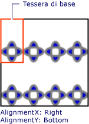

# Procedura: impostare l'allineamento orizzontale e verticale di un TileBrush
Questo esempio spiega come controllare l'allineamento orizzontale e verticale del contenuto in una tessera. Per controllare l'allineamento orizzontale e verticale di un <xref:System.Windows.Media.TileBrush>, utilizzare il relativo <xref:System.Windows.Media.TileBrush.AlignmentX%2A> e <xref:System.Windows.Media.TileBrush.AlignmentY%2A> proprietà.  
  
 Il <xref:System.Windows.Media.TileBrush.AlignmentX%2A> e <xref:System.Windows.Media.TileBrush.AlignmentY%2A> le proprietà di un <xref:System.Windows.Media.TileBrush> vengono utilizzati quando viene soddisfatta una delle condizioni seguenti:  
  
-   Il <xref:System.Windows.Media.TileBrush.Stretch%2A> proprietà <xref:System.Windows.Media.Stretch.Uniform> o <xref:System.Windows.Media.Stretch.UniformToFill> e <xref:System.Windows.Media.TileBrush.Viewbox%2A> e <xref:System.Windows.Media.TileBrush.Viewport%2A> presentano proporzioni diverse.  
  
-   Il <xref:System.Windows.Media.TileBrush.Stretch%2A> proprietà <xref:System.Windows.Media.Stretch.None> e <xref:System.Windows.Media.TileBrush.Viewbox%2A> e <xref:System.Windows.Media.TileBrush.Viewport%2A> sono di dimensioni diverse.  
  
## Esempio  
 Nell'esempio seguente viene allineato il contenuto di un <xref:System.Windows.Media.DrawingBrush>, che è un tipo di <xref:System.Windows.Media.TileBrush>, nell'angolo superiore sinistro del relativo elemento. Per allineare il contenuto, nell'esempio viene impostata la <xref:System.Windows.Media.TileBrush.AlignmentX%2A> proprietà del <xref:System.Windows.Media.DrawingBrush> a <xref:System.Windows.Media.AlignmentX.Left> e <xref:System.Windows.Media.TileBrush.AlignmentY%2A> proprietà <xref:System.Windows.Media.AlignmentY.Top>. Questo esempio produce il seguente output:  
  
   
TileBrush con contenuto allineato all'angolo superiore sinistro  
  
 [!code-csharp[brushoverviewexamples_snip#TileBrushTopLeftAlignmentInline](../../../../samples/snippets/csharp/VS_Snippets_Wpf/BrushOverviewExamples_snip/CSharp/TileBrushAlignmentExample.cs#tilebrushtopleftalignmentinline)]
 [!code-vb[brushoverviewexamples_snip#TileBrushTopLeftAlignmentInline](../../../../samples/snippets/visualbasic/VS_Snippets_Wpf/BrushOverviewExamples_snip/visualbasic/tilebrushalignmentexample.vb#tilebrushtopleftalignmentinline)]
 [!code-xaml[brushoverviewexamples_snip#TileBrushTopLeftAlignmentInline](../../../../samples/snippets/xaml/VS_Snippets_Wpf/BrushOverviewExamples_snip/XAML/TileBrushAlignmentExample.xaml#tilebrushtopleftalignmentinline)]  
  
## Esempio  
 Nell'esempio successivo viene allineato il contenuto di un <xref:System.Windows.Media.DrawingBrush> nell'angolo in basso a destra del relativo elemento impostando la <xref:System.Windows.Media.TileBrush.AlignmentX%2A> proprietà <xref:System.Windows.Media.AlignmentX.Right> e <xref:System.Windows.Media.TileBrush.AlignmentY%2A> proprietà <xref:System.Windows.Media.AlignmentY.Bottom>. Questo esempio produce l'output seguente.  
  
   
TileBrush con contenuto allineato all'angolo in basso a destra  
  
 [!code-csharp[brushoverviewexamples_snip#TileBrushBottomRightAlignmentInline](../../../../samples/snippets/csharp/VS_Snippets_Wpf/BrushOverviewExamples_snip/CSharp/TileBrushAlignmentExample.cs#tilebrushbottomrightalignmentinline)]
 [!code-vb[brushoverviewexamples_snip#TileBrushBottomRightAlignmentInline](../../../../samples/snippets/visualbasic/VS_Snippets_Wpf/BrushOverviewExamples_snip/visualbasic/tilebrushalignmentexample.vb#tilebrushbottomrightalignmentinline)]
 [!code-xaml[brushoverviewexamples_snip#TileBrushBottomRightAlignmentInline](../../../../samples/snippets/xaml/VS_Snippets_Wpf/BrushOverviewExamples_snip/XAML/TileBrushAlignmentExample.xaml#tilebrushbottomrightalignmentinline)]  
  
## Esempio  
 Nell'esempio successivo viene allineato il contenuto di un <xref:System.Windows.Media.DrawingBrush> nell'angolo superiore sinistro del relativo elemento impostando la <xref:System.Windows.Media.TileBrush.AlignmentX%2A> proprietà <xref:System.Windows.Media.AlignmentX.Left> e <xref:System.Windows.Media.TileBrush.AlignmentY%2A> proprietà <xref:System.Windows.Media.AlignmentY.Top>. Imposta inoltre il <xref:System.Windows.Media.TileBrush.Viewport%2A> e <xref:System.Windows.Media.TileBrush.TileMode%2A> del <xref:System.Windows.Media.DrawingBrush> per produrre un modello di riquadro. Questo esempio produce l'output seguente.  
  
   
Modello di tessera con contenuto allineato all'angolo superiore sinistro nella tessera di base  
  
 L'illustrazione evidenzia una tessera di base, in modo da mostrarne il modo in cui è allineato il contenuto. Si noti che il <xref:System.Windows.Media.TileBrush.AlignmentX%2A> impostazione non ha effetto poiché il contenuto del <xref:System.Windows.Media.DrawingBrush> riempie completamente la tessera di base in orizzontale.  
  
 [!code-csharp[brushoverviewexamples_snip#TileBrushTopLeftAlignmentTiledInline](../../../../samples/snippets/csharp/VS_Snippets_Wpf/BrushOverviewExamples_snip/CSharp/TileBrushAlignmentExample.cs#tilebrushtopleftalignmenttiledinline)]
 [!code-vb[brushoverviewexamples_snip#TileBrushTopLeftAlignmentTiledInline](../../../../samples/snippets/visualbasic/VS_Snippets_Wpf/BrushOverviewExamples_snip/visualbasic/tilebrushalignmentexample.vb#tilebrushtopleftalignmenttiledinline)]
 [!code-xaml[brushoverviewexamples_snip#TileBrushTopLeftAlignmentTiledInline](../../../../samples/snippets/xaml/VS_Snippets_Wpf/BrushOverviewExamples_snip/XAML/TileBrushAlignmentExample.xaml#tilebrushtopleftalignmenttiledinline)]  
  
## Esempio  
 Nell'esempio finale viene allineato il contenuto di una classe <xref:System.Windows.Media.DrawingBrush> in basso a destra della tessera di base tramite l'impostazione di <xref:System.Windows.Media.TileBrush.AlignmentX%2A> proprietà <xref:System.Windows.Media.AlignmentX.Right> e <xref:System.Windows.Media.TileBrush.AlignmentY%2A> proprietà <xref:System.Windows.Media.AlignmentY.Bottom>. Questo esempio produce l'output seguente.  
  
   
Modello di tessera con contenuto allineato all'angolo inferiore destro nella tessera di base  
  
 Nuovamente, il <xref:System.Windows.Media.TileBrush.AlignmentX%2A> impostazione non ha effetto poiché il contenuto del <xref:System.Windows.Media.DrawingBrush> riempie completamente la tessera di base in orizzontale.  
  
 [!code-csharp[brushoverviewexamples_snip#TileBrushBottomRightAlignmentInline](../../../../samples/snippets/csharp/VS_Snippets_Wpf/BrushOverviewExamples_snip/CSharp/TileBrushAlignmentExample.cs#tilebrushbottomrightalignmentinline)]
 [!code-vb[brushoverviewexamples_snip#TileBrushBottomRightAlignmentInline](../../../../samples/snippets/visualbasic/VS_Snippets_Wpf/BrushOverviewExamples_snip/visualbasic/tilebrushalignmentexample.vb#tilebrushbottomrightalignmentinline)]
 [!code-xaml[brushoverviewexamples_snip#TileBrushBottomRightAlignmentInline](../../../../samples/snippets/xaml/VS_Snippets_Wpf/BrushOverviewExamples_snip/XAML/TileBrushAlignmentExample.xaml#tilebrushbottomrightalignmentinline)]  
  
 Gli esempi usano <xref:System.Windows.Media.DrawingBrush> oggetti per illustrare come <xref:System.Windows.Media.TileBrush.AlignmentX%2A> e <xref:System.Windows.Media.TileBrush.AlignmentY%2A> proprietà vengono utilizzate. Queste proprietà si comportano in modo identico per tutti i pennelli tessera: <xref:System.Windows.Media.DrawingBrush>, <xref:System.Windows.Media.ImageBrush>, e <xref:System.Windows.Media.VisualBrush>. Per altre informazioni sui pennelli tessera, vedere [Disegnare con oggetti Image, Drawing e Visual](../../../../docs/framework/wpf/graphics-multimedia/painting-with-images-drawings-and-visuals.md).  
  
## Vedere anche  
 <xref:System.Windows.Media.DrawingBrush>  
 <xref:System.Windows.Media.ImageBrush>  
 <xref:System.Windows.Media.VisualBrush>  
 [Disegnare con oggetti Image, Drawing e Visual](../../../../docs/framework/wpf/graphics-multimedia/painting-with-images-drawings-and-visuals.md)
