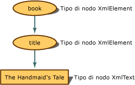

# <a name="mapping-the-object-hierarchy-to-xml-data"></a>Mapping della gerarchia di oggetti in dati XML
Quando un documento XML è in memoria, la rappresentazione concettuale è un albero. Nella programmazione, è possibile accedere ai nodi dell'albero mediante una gerarchia di oggetti. Nell'esempio seguente viene illustrato come il contenuto XML viene convertito in nodi.  
  
 Mentre il codice XML viene letto nel DOM (Document Object Model) XML, i dati sono convertiti in nodi in cui vengono conservati metadati aggiuntivi, quali il tipo di nodo e i relativi valori. Il tipo di nodo corrisponde al relativo oggetto e determina le operazioni che possono essere eseguite e le proprietà che possono essere impostate o recuperate.  
  
 Si consideri ad esempio il seguente codice XML:  
  
 **Input**  
  
```xml  
<book>  
    <title>The Handmaid's Tale</title>  
</book>  
```  
  
 L'input è rappresentato in memoria come il seguente albero di nodi con la proprietà del tipo di nodo associata:  
  
   
Rappresentazione dell'albero dei nodi Book e Title  
  
 L'elemento `book` viene convertito in un oggetto **XmlElement**, l'elemento successivo `title` viene convertito anch'esso in **XmlElement**, mentre il contenuto degli elementi viene convertito in un oggetto **XmlText**. Osservando i metodi e le proprietà **XmlElement**, si può notare che questi sono diversi dai metodi e dalle proprietà disponibili in un oggetto **XmlText**. È quindi fondamentale sapere quale tipo di nodo diventerà il markup XML, perché in base a questo vengono determinate le operazioni che possono essere eseguite.  
  
 Nell'esempio seguente vengono letti i dati XML e viene scritto un testo diverso a seconda del tipo di nodo, usando come input il file di dati XML **items.xml**:  
  
 **Input**  
  
```xml  
<?xml version="1.0"?>  
<!-- This is a sample XML document -->  
<!DOCTYPE Items [<!ENTITY number "123">]>  
<Items>  
  <Item>Test with an entity: &number;</Item>  
  <Item>test with a child element <more/> stuff</Item>  
  <Item>test with a CDATA section <![CDATA[<456>]]> def</Item>  
  <Item>Test with a char entity: A</Item>  
  <!-- Fourteen chars in this element.-->  
  <Item>1234567890ABCD</Item>  
</Items>  
```  
  
 L'esempio di codice seguente legge il file **items.xml** e visualizza le informazioni per ogni tipo di nodo.  
  
```vb  
Imports System  
Imports System.IO  
Imports System.Xml  
  
Public Class Sample  
    Private Const filename As String = "items.xml"  
  
    Public Shared Sub Main()  
  
        Dim reader As XmlTextReader = Nothing  
  
        Try  
            ' Load the reader with the data file and   
            'ignore all white space nodes.   
            reader = New XmlTextReader(filename)  
            reader.WhitespaceHandling = WhitespaceHandling.None  
  
            ' Parse the file and display each of the nodes.  
            While reader.Read()  
                Select Case reader.NodeType  
                    Case XmlNodeType.Element  
                        Console.Write("<{0}>", reader.Name)  
                    Case XmlNodeType.Text  
                        Console.Write(reader.Value)  
                    Case XmlNodeType.CDATA  
                        Console.Write("<![CDATA[{0}]]>", reader.Value)  
                    Case XmlNodeType.ProcessingInstruction  
                        Console.Write("<?{0} {1}?>", reader.Name, reader.Value)  
                    Case XmlNodeType.Comment  
                        Console.Write("<!--{0}-->", reader.Value)  
                    Case XmlNodeType.XmlDeclaration  
                        Console.Write("<?xml version='1.0'?>")  
                    Case XmlNodeType.Document  
                    Case XmlNodeType.DocumentType  
                        Console.Write("<!DOCTYPE {0} [{1}]", reader.Name, reader.Value)  
                    Case XmlNodeType.EntityReference  
                        Console.Write(reader.Name)  
                    Case XmlNodeType.EndElement  
                        Console.Write("</{0}>", reader.Name)  
                End Select  
            End While  
  
        Finally  
            If Not (reader Is Nothing) Then  
                reader.Close()  
            End If  
        End Try  
    End Sub 'Main ' End class  
End Class 'Sample  
```  
  
```csharp  
using System;  
using System.IO;  
using System.Xml;  
  
public class Sample  
{  
    private const String filename = "items.xml";  
  
    public static void Main()  
    {  
        XmlTextReader reader = null;  
  
        try  
        {  
            // Load the reader with the data file and ignore   
            // all white space nodes.  
            reader = new XmlTextReader(filename);  
            reader.WhitespaceHandling = WhitespaceHandling.None;  
  
            // Parse the file and display each of the nodes.  
            while (reader.Read())  
            {  
                switch (reader.NodeType)  
                {  
                    case XmlNodeType.Element:  
                        Console.Write("<{0}>", reader.Name);  
                        break;  
                    case XmlNodeType.Text:  
                        Console.Write(reader.Value);  
                        break;  
                    case XmlNodeType.CDATA:  
                        Console.Write("<![CDATA[{0}]]>", reader.Value);  
                        break;  
                    case XmlNodeType.ProcessingInstruction:  
                        Console.Write("<?{0} {1}?>", reader.Name, reader.Value);  
                        break;  
                    case XmlNodeType.Comment:  
                        Console.Write("<!--{0}-->", reader.Value);  
                        break;  
                    case XmlNodeType.XmlDeclaration:  
                        Console.Write("<?xml version='1.0'?>");  
                        break;  
                    case XmlNodeType.Document:  
                        break;  
                    case XmlNodeType.DocumentType:  
                        Console.Write("<!DOCTYPE {0} [{1}]", reader.Name, reader.Value);  
                        break;  
                    case XmlNodeType.EntityReference:  
                        Console.Write(reader.Name);  
                        break;  
                    case XmlNodeType.EndElement:  
                        Console.Write("</{0}>", reader.Name);  
                        break;  
                }  
            }  
        }  
  
        finally  
        {  
            if (reader != null)  
                reader.Close();  
        }  
    }  
} // End class  
```  
  
 L'output dell'esempio consente di visualizzare il mapping dei dati nei tipi di nodo.  
  
 **Output**  
  
```xml  
<?xml version='1.0'?><!--This is a sample XML document --><!DOCTYPE Items [<!ENTITY number "123">]<Items><Item>Test with an entity: 123</Item><Item>test with a child element <more> stuff</Item><Item>test with a CDATA section <![CDATA[<456>]]> def</Item><Item>Test with a char entity: A</Item><--Fourteen chars in this element.--><Item>1234567890ABCD</Item></Items>  
```  
  
 Esaminando l'input riga per riga e usando l'output generato dal codice, è possibile usare la tabella seguente per analizzare quale verifica del nodo ha generato determinate righe di output e capire quindi quali dati XML sono stati convertiti in un determinato tipo di nodo.  
  
|Input|Output|Verifica del tipo di nodo|  
|-----------|------------|--------------------|  
|\<?xml version="1.0"?>|\<?xml version='1.0'?>|XmlNodeType.XmlDeclaration|  
|\<!-- This is a sample XML document -->|\<!--This is a sample XML document -->|XmlNodeType.Comment|  
|\<!DOCTYPE Items [\<!ENTITY number "123">]>|\<!DOCTYPE Items [\<!ENTITY number "123">]|XmlNodeType.DocumentType|  
|\<Items>|\<Items>|XmlNodeType.Element|  
|\<Item>|\<Item>|XmlNodeType.Element|  
|Test with an entity: &number;|Test with an entity: 123|XmlNodeType.Text|  
|\</Item>|\</Item>|XmlNodeType.EndElement|  
|\<Item>|\<Item>|XmNodeType.Element|  
|test with a child element|test with a child element|XmlNodeType.Text|  
|\<more>|\<more>|XmlNodeType.Element|  
|stuff|stuff|XmlNodeType.Text|  
|\</Item>|\</Item>|XmlNodeType.EndElement|  
|\<Item>|\<Item>|XmlNodeType.Element|  
|test with a CDATA section|test with a CDATA section|XmlTest.Text|  
|<![CDATA[\<456>]]\>|<![CDATA[\<456>]]\>|XmlTest.CDATA|  
|def|def|XmlNodeType.Text|  
|\</Item>|\</Item>|XmlNodeType.EndElement|  
|\<Item>|\<Item>|XmlNodeType.Element|  
|Test with a char entity: &\#65;|Test with a char entity: A|XmlNodeType.Text|  
|\</Item>|\</Item>|XmlNodeType.EndElement|  
|\<!-- Fourteen chars in this element.-->|\<--Fourteen chars in this element.-->|XmlNodeType.Comment|  
|\<Item>|\<Item>|XmlNodeType.Element|  
|1234567890ABCD|1234567890ABCD|XmlNodeType.Text|  
|\</Item>|\</Item>|XmlNodeType.EndElement|  
|\</Items>|\</Items>|XmlNodeType.EndElement|  
  
 È necessario sapere quale tipo di nodo viene assegnato, poiché in base al tipo di nodo vengono determinate le operazioni valide e il tipo di proprietà che è possibile impostare e recuperare.  
  
 La creazione di nodi per spazi vuoti viene controllata quando i dati sono caricati nel DOM dal flag **PreserveWhitespace**. Per altre informazioni, vedere [Gestione degli spazi vuoti e degli spazi vuoti significativi durante il caricamento del DOM](../../../../docs/standard/data/xml/white-space-and-significant-white-space-handling-when-loading-the-dom.md).  
  
 Per aggiungere nuovi nodi al DOM, vedere [Inserimento di nodi in un documento XML](../../../../docs/standard/data/xml/inserting-nodes-into-an-xml-document.md). Per rimuovere nodi dal DOM, vedere [Rimozione di nodi, contenuto e valori da un documento XML](../../../../docs/standard/data/xml/removing-nodes-content-and-values-from-an-xml-document.md). Per modificare il contenuto dei nodi nel DOM, vedere [Modifica di nodi, contenuto e valori in un documento XML](../../../../docs/standard/data/xml/modifying-nodes-content-and-values-in-an-xml-document.md).  
  
## <a name="see-also"></a>Vedere anche

- [Modello DOM (Document Object Mode) XML](../../../../docs/standard/data/xml/xml-document-object-model-dom.md)
