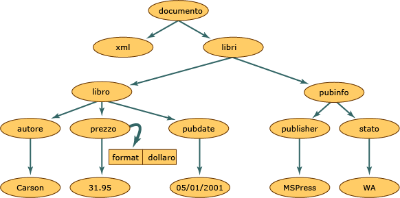

# <a name="xml-document-object-model-dom"></a>XML DOM (Document Object Model)
La classe DOM (Document Object Model) XML è una rappresentazione in memoria di un documento XML. Il modello DOM consente di leggere e modificare un documento XML a livello di codice. Il **XmlReader** classe legge anche XML; tuttavia, fornisce l'accesso non in cache, forward-only di sola lettura. Ciò significa che non sono disponibili funzionalità per modificare i valori di un attributo o il contenuto di un elemento o la possibilità di inserire e rimuovere nodi con il **XmlReader**. La modifica è la funzione primaria del DOM. È il modo comune e strutturato in cui i dati XML vengono rappresentati nella memoria, sebbene i dati XML effettivi siano archiviati in modo lineare all'interno di un file o quando provengono da un altro oggetto. Di seguito sono riportati i dati XML.  
  
## <a name="input"></a>Input  
  
```xml  
<?xml version="1.0"?>  
  <books>  
    <book>  
        <author>Carson</author>  
        <price format="dollar">31.95</price>  
        <pubdate>05/01/2001</pubdate>  
    </book>  
    <pubinfo>  
        <publisher>MSPress</publisher>  
        <state>WA</state>  
    </pubinfo>  
  </books>   
```  
  
 Nella figura seguente viene illustrato come è strutturata la memoria quando questi dati XML vengono letti nella struttura del DOM.  
  
   
Struttura del documento XML  
  
 All'interno della struttura del documento XML, ogni cerchio di questa figura rappresenta un nodo, che viene chiamato un **XmlNode** oggetto. Il **XmlNode** oggetto è l'oggetto di base nell'albero DOM. Il **XmlDocument** (classe), che estende **XmlNode**, supporta i metodi per l'esecuzione di operazioni sul documento nel suo complesso (ad esempio, il caricamento in memoria o salvataggio del documento XML in un file. Inoltre, **XmlDocument** consente di visualizzare e modificare i nodi nell'intero documento XML. Entrambi **XmlNode** e **XmlDocument** dispongono di miglioramenti delle prestazioni e usabilità e dispongono di metodi e proprietà per:  
  
-   Accedere e apportare modifiche ai nodi specifici del DOM, ad esempio ai nodi degli elementi, ai nodi di riferimento all'entità e così via.  
  
-   Recuperare interi nodi, oltre alle informazioni contenute nel nodo, quali il testo in un nodo di elemento.  
  
    > [!NOTE]
    >  Se un'applicazione non richiede la struttura o le funzionalità di DOM, modifica il **XmlReader** e **XmlWriter** classi forniscono accesso tramite flusso non memorizzati nella cache e forward-only di XML. Per altre informazioni, vedere <xref:System.Xml.XmlReader> e <xref:System.Xml.XmlWriter>.  
  
 **Nodo** oggetti dispongono di un set di metodi e proprietà, nonché le caratteristiche di base ben definite. Di seguito sono riportate alcune di queste caratteristiche.  
  
-   I nodi presentano un singolo nodo padre, ovvero quello al livello immediatamente superiore. Gli unici nodi che non presentano nodi padre sono al livello radice del documento, in quanto si tratta dei nodi di primo livello contenenti il documento stesso e i frammenti di documento.  
  
-   La maggior parte dei nodi può presentare più nodi figlio, ovvero quelli al livello immediatamente inferiore. Di seguito viene riportato un elenco di tipi di nodi che possono contenere nodi figlio.  
  
    -   **Documento**  
  
    -   **DocumentFragment**  
  
    -   **EntityReference**  
  
    -   **Elemento**  
  
    -   **Attributo**  
  
     Il **XmlDeclaration**, **notazione**, **entità**, **CDATASection**, **testo**,  **Commento**, **ProcessingInstruction**, e **DocumentType** nodi non dispongono di nodi figlio.  
  
-   Allo stesso livello, rappresentato nel diagramma dai nodi di **book** e **pubinfo** nodi, sono di pari livello.  
  
 Una caratteristica del DOM è rappresentata dalla gestione degli attributi. Gli attributi non sono nodi che fanno parte delle relazioni tra nodi padre, nodi figlio o nodi di pari livello, ma sono considerati una proprietà del nodo dell'elemento e sono costituiti da una coppia composta da nome e valore. Se, ad esempio, si dispone di dati XML costituiti da `format="dollar`" associato all'elemento `price`, il termine `format` è il nome, mentre il valore dell'attributo `format` è `dollar`. Per recuperare il `format="dollar"` attributo del **prezzo** nodo, si chiama il **GetAttribute** metodo quando il cursore si trova nel `price` nodo elemento. Per ulteriori informazioni, vedere [accesso agli attributi nel DOM](../../../../docs/standard/data/xml/accessing-attributes-in-the-dom.md).  
  
 Man mano che l'XML viene letto in memoria, vengono creati dei nodi. Non tutti i nodi, tuttavia, sono dello stesso tipo. Le regole e la sintassi di un elemento dell'XML sono diverse da quelle di un'istruzione di elaborazione. Pertanto, mentre avviene la lettura di vari dati, viene assegnato un tipo di nodo a ogni nodo. In base al tipo di nodo, vengono determinate le caratteristiche e la funzionalità del nodo.  
  
 Per ulteriori informazioni sui tipi di nodi generati in memoria, vedere [tipi di nodi XML](../../../../docs/standard/data/xml/types-of-xml-nodes.md). Per ulteriori informazioni sugli oggetti creati nell'albero dei nodi, vedere [Mapping della gerarchia di oggetti in dati XML](../../../../docs/standard/data/xml/mapping-the-object-hierarchy-to-xml-data.md).  
  
 Le API disponibili nelle raccomandazioni W3C DOM Level 1 e Level 2 sono state estese per facilitare l'uso dei documenti XML. Le classi, i metodi e le proprietà aggiuntive, oltre a supportare completamente gli standard W3C, aggiungono ulteriori funzionalità rispetto a quelle presenti nel modello DOM XML di W3C. Grazie alle nuove classi è possibile accedere ai dati relazionali e usufruire di metodi per la sincronizzazione con i dati ADO.NET, esponendo simultaneamente i dati come XML. Per ulteriori informazioni, vedere [la sincronizzazione di un set di dati con un XmlDataDocument](../../../../docs/framework/data/adonet/dataset-datatable-dataview/dataset-and-xmldatadocument-synchronization.md).  
  
 Il DOM è particolarmente utile per la lettura dei dati XML in memoria per modificarne la struttura, per aggiungere o rimuovere nodi o per modificare i dati appartenenti a un nodo come nel testo contenuto da un elemento. Tuttavia, sono disponibili altre classi che sono più rapide del DOM in altri scenari. Per l'accesso di flusso veloce, non in cache, di tipo forward-only di XML, utilizzare il **XmlReader** e **XmlWriter**. Se è necessario un accesso casuale con un modello di cursore e **XPath**, utilizzare il **XPathNavigator** classe.  
  
## <a name="see-also"></a>Vedere anche  
 [Tipi di nodi XML](../../../../docs/standard/data/xml/types-of-xml-nodes.md)  
 [Mapping della gerarchia di oggetti in dati XML](../../../../docs/standard/data/xml/mapping-the-object-hierarchy-to-xml-data.md)
