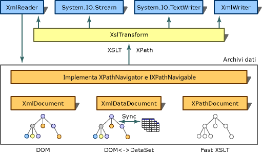

# <a name="xslt-transformations-with-the-xsltransform-class"></a>Trasformazioni XSLT con la classe XslTransform

> [!NOTE]
> La classe <xref:System.Xml.Xsl.XslTransform> è obsoleta in [!INCLUDE[dnprdnext](../../../../includes/dnprdnext-md.md)]. È possibile eseguire le trasformazioni XSLT (Extensible Stylesheet Language for Transformations) usando la classe <xref:System.Xml.Xsl.XslCompiledTransform>. Per altre informazioni, vedere [Utilizzo della classe XslCompiledTransform](using-the-xslcompiledtransform-class.md) e [Migrazione dalla classe XslTransform](migrating-from-the-xsltransform-class.md).

Lo scopo dell'XSLT (Extensible Stylesheet Language Transformation) è quello di trasformare il contenuto di un documento XML di origine in un altro documento di formato o struttura diversa, ad esempio, per trasformare il codice XML in HTML per l'uso su un sito Web o per trasformarlo in un documento che contenga solo i campi richiesti da un'applicazione. Questo processo di trasformazione è specificato dalla raccomandazione [XSLT versione 1.0](https://www.w3.org/TR/1999/REC-xslt-19991116) di World Wide Web Consortium (W3C). In [!INCLUDE[dnprdnshort](../../../../includes/dnprdnshort-md.md)], la classe <xref:System.Xml.Xsl.XslTransform>, disponibile nello spazio dei nomi <xref:System.Xml.Xsl>, è il processore XSLT che implementa la funzionalità di questa specifica. Alcune funzionalità non sono state implementate dalla raccomandazione W3C XSL Transformations (XSLT) versione 1.0 e sono elencate in [Output da un XslTransform](outputs-from-an-xsltransform.md). Nella figura seguente è illustrata l'architettura di trasformazione di [!INCLUDE[dnprdnshort](../../../../includes/dnprdnshort-md.md)].

## <a name="overview"></a>Panoramica

  
Architettura di trasformazione

Per la selezione di parti di un documento XML, nella raccomandazione XSLT viene usato XPath (XML Path Language), ovvero un linguaggio di query usato per navigare nei nodi dell'albero di un documento. Come illustrato nel diagramma, l'implementazione di XPath in [!INCLUDE[dnprdnshort](../../../../includes/dnprdnshort-md.md)] viene usata per la selezione di parti di XML archiviate in varie classi, come un <xref:System.Xml.XmlDocument>, un <xref:System.Xml.XmlDataDocument> e un <xref:System.Xml.XPath.XPathDocument>. <xref:System.Xml.XPath.XPathDocument> è un archivio dati XSLT ottimizzato che, se usato con <xref:System.Xml.Xsl.XslTransform>, fornisce trasformazioni XSLT con elevate prestazioni.

Nella tabella seguente sono elencate le classi più usate con <xref:System.Xml.Xsl.XslTransform>, XPath e le relative funzioni.

|Classe o interfaccia|Funzione|
|------------------------|--------------|
|<xref:System.Xml.XPath.XPathNavigator>|Si tratta di un'API che fornisce un modello di tipo cursore per la navigazione in un archivio nonché il supporto delle query XPath. Non viene fornita la funzionalità di modifica dell'archivio sottostante. Per la modifica, usare la classe <xref:System.Xml.XmlDocument>.|
|<xref:System.Xml.XPath.IXPathNavigable>|Si tratta di un'interfaccia che fornisce un metodo `CreateNavigator` a un <xref:System.Xml.XPath.XPathNavigator> per l'archivio.|
|<xref:System.Xml.XmlDocument>|Consente la modifica di questo documento. Implementa <xref:System.Xml.XPath.IXPathNavigable>, consentendo scenari per la modifica di documenti in cui vengono successivamente richieste trasformazioni XSLT. Per altre informazioni, vedere [Input di XmlDocument in XslTransform](xmldocument-input-to-xsltransform.md).|
|<xref:System.Xml.XmlDataDocument>|Derivato da <xref:System.Xml.XmlDocument>. Supera i limiti dei modelli basati sui dati XML e relazionali usando un <xref:System.Data.DataSet> per ottimizzare l'archiviazione dei dati strutturati all'interno del documento XML, in base ai mapping specificati nel <xref:System.Data.DataSet>. Implementa <xref:System.Xml.XPath.IXPathNavigable>, consentendo scenari in cui è possibile eseguire trasformazioni XSLT sui dati relazionali recuperati da un database. Per altre informazioni, vedere [Integrazione di XML con dati relazionali e ADO.NET](xml-integration-with-relational-data-and-adonet.md).|
|<xref:System.Xml.XPath.XPathDocument>|Questa classe è ottimizzata per l'elaborazione con <xref:System.Xml.Xsl.XslTransform> e per le query XPath. Fornisce una cache di sola lettura a elevate prestazioni. Implementa <xref:System.Xml.XPath.IXPathNavigable> ed è l'archivio migliore da usare per le trasformazioni XSLT.|
|<xref:System.Xml.XPath.XPathNodeIterator>|Consente di navigare nei set di nodi XPath. Tutti i metodi di selezione XPath di <xref:System.Xml.XPath.XPathNavigator> restituiscono un <xref:System.Xml.XPath.XPathNodeIterator>. È possibile creare più oggetti <xref:System.Xml.XPath.XPathNodeIterator> nello stesso archivio, ognuno dei quali rappresenta un set di nodi selezionato.|

## <a name="msxml-xslt-extensions"></a>Estensioni XSLT di MSXML

Le funzioni `msxsl:script` e `msxsl:node-set` sono le uniche estensioni XSLT di MSXML (Microsoft XML Core Services) supportate dalla classe <xref:System.Xml.Xsl.XslTransform>.

## <a name="example"></a>Esempio

Nell'esempio di codice seguente viene caricato un foglio di stile XSLT, il file mydata.xml viene letto in un <xref:System.Xml.XPath.XPathDocument> e viene eseguita una trasformazione sui dati basata sul file fittizio myStyleSheet.xsl. L'output formattato viene quindi inviato alla console.

```vb
Imports System
Imports System.IO
Imports System.Xml
Imports System.Xml.XPath
Imports System.Xml.Xsl

Public Class Sample
    Private filename As [String] = "mydata.xml"
    Private stylesheet As [String] = "myStyleSheet.xsl"

    Public Shared Sub Main()
        Dim xslt As New XslTransform()
        xslt.Load(stylesheet)
        Dim xpathdocument As New XPathDocument(filename)
        Dim writer As New XmlTextWriter(Console.Out)
        writer.Formatting = Formatting.Indented

        xslt.Transform(xpathdocument, Nothing, writer, Nothing)
    End Sub 'Main
End Class 'Sample
```

```csharp
using System;
using System.IO;
using System.Xml;
using System.Xml.XPath;
using System.Xml.Xsl;

public class Sample 
{
    private const String filename = "mydata.xml";
    private const String stylesheet = "myStyleSheet.xsl";

    public static void Main()
    {
        XslTransform xslt = new XslTransform();
        xslt.Load(stylesheet);
        XPathDocument xpathdocument = new XPathDocument(filename);
        XmlTextWriter writer = new XmlTextWriter(Console.Out);
        writer.Formatting = Formatting.Indented;

        xslt.Transform(xpathdocument, null, writer, null);
    }
}
```

## <a name="see-also"></a>Vedere anche

- <xref:System.Xml.Xsl.XslTransform>  
- [Implementazione del processore XSLT da parte della classe XslTransform](xsltransform-class-implements-the-xslt-processor.md)  
- [Implementazione di comportamenti discretionary nella classe XslTransform](implementation-of-discretionary-behaviors-in-the-xsltransform-class.md)  
- [XPathNavigator nelle trasformazioni](xpathnavigator-in-transformations.md)  
- [XPathNodeIterator nelle trasformazioni](xpathnodeiterator-in-transformations.md)  
- [Input di XPathDocument in XslTransform](xpathdocument-input-to-xsltransform.md)  
- [Input di XmlDataDocument in XslTransform](xmldatadocument-input-to-xsltransform.md)  
- [Input di XmlDocument in XslTransform](xmldocument-input-to-xsltransform.md)  
