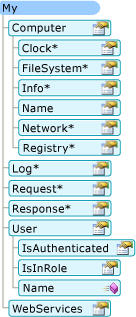

# How My Depends on Project Type (Visual Basic)
[!INCLUDE[vs2017banner](../../../visual-basic/developing-apps/includes/vs2017banner.md)]

`My` espone solo gli oggetti richiesti da un particolare tipo di progetto.  Ad esempio, l'oggetto `My.Forms` è disponibile in un'applicazione Windows Form ma non è disponibile in un'applicazione console.  In questo argomento vengono descritti gli oggetti `My` disponibili nei differenti tipi di progetto.  
  
## My nelle applicazioni Windows e nei siti Web  
 `My` espone solo gli oggetti utili nel tipo di progetto corrente ed elimina gli oggetti non applicabili.  Ad esempio, nella seguente immagine è illustrato il modello a oggetti `My` in un progetto Windows Form.  
  
   
  
 In un progetto di un sito Web, `My` espone gli oggetti rilevanti per uno sviluppatore Web \(ad esempio gli oggetti `My.Request` e `My.Response`\), eliminando gli oggetti irrilevanti \(ad esempio, l'oggetto `My.Forms`\).  Nell'immagine riportata di seguito è illustrato il modello a oggetti `My` in un progetto di un sito Web:  
  
   
  
## Dettagli di progetto  
 Nella tabella riportata di seguito sono elencati gli oggetti `My` attivati per impostazione predefinita per otto tipi di progetti: applicazione Windows, Libreria di classi, applicazione console, libreria di controlli Windows, libreria di controlli Web, servizio Windows, vuoto e sito Web.  
  
 Sono presenti tre versioni dell'oggetto `My.Application`, due versioni dell'oggetto `My.Computer` e due versioni dell'oggetto `My.User`. Nelle note in calce alla tabella sono fornite informazioni dettagliate sulle versioni.  
  
||||||||||  
|-|-|-|-|-|-|-|-|-|  
|Oggetto My|Applicazione Windows|Libreria di classi|Applicazione console|Libreria di controlli Windows|Libreria di controlli Web|Servizio Windows|Vuoto|Sito Web|  
|`My.Application`|**Sì** 1|**Sì** 2|**Sì** 3|**Sì** 2|No|**Sì** 3|No|No|  
|`My.Computer`|**Sì** 4|**Sì** 4|**Sì** 4|**Sì** 4|**Sì** 5|**Sì** 4|No|**Sì** 5|  
|`My.Forms`|**Sì**|No|No|**Sì**|No|No|No|No|  
|`My.Log`|No|No|No|No|No|No|No|**Sì**|  
|`My.Request`|No|No|No|No|No|No|No|**Sì**|  
|`My.Resources`|**Sì**|**Sì**|**Sì**|**Sì**|**Sì**|**Sì**|No|No|  
|`My.Response`|No|No|No|No|No|No|No|**Sì**|  
|`My.Settings`|**Sì**|**Sì**|**Sì**|**Sì**|**Sì**|**Sì**|No|No|  
|`My.User`|**Sì** 6|**Sì** 6|**Sì** 6|**Sì** 6|**Sì** 7|**Sì** 6|No|**Sì** 7|  
|`My.WebServices`|**Sì**|**Sì**|**Sì**|**Sì**|**Sì**|**Sì**|No|No|  
  
 1 Versione Windows Form di `My.Application`.  Deriva dalla versione console \(vedere Nota 3\). Aggiunge supporto per l'interazione con le finestre dell'applicazione e fornisce il modello applicativo di [!INCLUDE[vbprvb](../../../csharp/programming-guide/concepts/linq/includes/vbprvb-md.md)].  
  
 2 Versione libreria di `My.Application`.  Fornisce la funzionalità di base richiesta da un'applicazione: fornisce membri per la scrittura nel registro applicazioni e l'accesso alle informazioni sull'applicazione.  
  
 3 Versione console di `My.Application`.  Deriva dalla versione libreria \(vedere Nota 2\). Aggiunge ulteriori membri per l'accesso agli argomenti della riga di comando dell'applicazione e alle informazioni di distribuzione di ClickOnce.  
  
 4 Versione Windows di `My.Computer`.  Deriva dalla versione server \(vedere Nota 5\). Fornisce l'accesso a oggetti utili su un computer client, ad esempio la tastiera, lo schermo e il mouse.  
  
 5 Versione server di `My.Computer`.  Fornisce informazioni di base sul computer, ad esempio il nome, l'accesso all'orologio e così via.  
  
 6 Versione Windows di `My.User`.  Questo oggetto è associato all'identità corrente del thread.  
  
 7 Versione Web di `My.User`.  Questo oggetto è associato all'identità dell'utente della richiesta HTTP corrente dell'applicazione.  
  
## Vedere anche  
 <xref:Microsoft.VisualBasic.ApplicationServices.ApplicationBase>   
 <xref:Microsoft.VisualBasic.Devices.Computer>   
 <xref:Microsoft.VisualBasic.Logging.Log>   
 <xref:Microsoft.VisualBasic.ApplicationServices.User>   
 [Customizing Which Objects are Available in My](../../../visual-basic/developing-apps/customizing-extending-my/customizing-which-objects-are-available-in-my.md)   
 [Conditional Compilation](../../../visual-basic/programming-guide/program-structure/conditional-compilation.md)   
 [\/define](../../../visual-basic/reference/command-line-compiler/define.md)   
 [My.Forms Object](../../../visual-basic/language-reference/objects/my-forms-object.md)   
 [My.Request Object](../../../visual-basic/language-reference/objects/my-request-object.md)   
 [My.Response Object](../../../visual-basic/language-reference/objects/my-response-object.md)   
 [My.WebServices Object](../../../visual-basic/language-reference/objects/my-webservices-object.md)