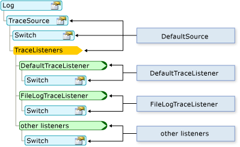

# <a name="working-with-application-logs-in-visual-basic"></a>Utilizzo dei log applicazione in Visual Basic
Gli oggetti `My.Applicaton.Log` e `My.Log` consentono di scrivere facilmente nei log le informazioni di registrazione e di traccia.  
  
## <a name="how-messages-are-logged"></a>Modalità di registrazione dei messaggi  
 Viene verificata innanzitutto la gravità del messaggio con la proprietà <xref:System.Diagnostics.TraceSource.Switch%2A> della proprietà <xref:Microsoft.VisualBasic.Logging.Log.TraceSource%2A> del log. Per impostazione predefinita, solo i messaggi con il livello di gravità "Informazione" o un livello superiore vengono inviati ai listener di traccia, specificati nella raccolta `TraceListener` del log. Ogni listener confronta quindi la gravità del messaggio con la proprietà <xref:System.Diagnostics.TraceSource.Switch%2A> del listener. Se la gravità del messaggio è abbastanza elevata, il listener scrive il messaggio.  
  
 Il diagramma seguente mostra il modo in cui un messaggio scritto nel metodo `WriteEntry` viene inviato ai metodi `WriteLine` dei listener di traccia del log:  
  
   
  
 È possibile modificare il comportamento del log e dei listener di traccia modificando il file di configurazione dell'applicazione. Il diagramma seguente mostra la corrispondenza tra le parti del log e il file di configurazione.  
  
   
  
## <a name="where-messages-are-logged"></a>Posizione di registrazione dei messaggi  
 Se l'assembly non contiene un file di configurazione, gli oggetti `My.Application.Log` e `My.Log` scrivono nell'output di debug dell'applicazione, tramite la classe <xref:System.Diagnostics.DefaultTraceListener> . Inoltre, l'oggetto `My.Application.Log` scrive nel file di log dell'assembly, tramite la classe <xref:Microsoft.VisualBasic.Logging.FileLogTraceListener>, mentre l'oggetto `My.Log` scrive nell'output della pagina Web ASP.NET, tramite la classe <xref:System.Web.WebPageTraceListener>.  
  
 L'output di debug può essere visualizzato nella finestra **Output** di Visual Studio quando si esegue l'applicazione in modalità di debug. Per aprire la finestra **Output** , scegliere **Finestre** dal menu **Debug**, quindi fare clic su **Output**. Nella finestra **Output** selezionare **Debug** dall'elenco **Mostra output di** .  
  
 Per impostazione predefinita, `My.Application.Log` scrive il file di log nel percorso dei dati applicazione dell'utente. È possibile ottenere il percorso dalla proprietà <xref:Microsoft.VisualBasic.Logging.FileLogTraceListener.FullLogFileName%2A> dell'oggetto <xref:Microsoft.VisualBasic.Logging.Log.DefaultFileLogWriter%2A> . Il formato del percorso è il seguente:  
  
 `BasePath`\\`CompanyName`\\`ProductName`\\`ProductVersion`  
  
 Di seguito è riportato un tipico valore per `BasePath` .  
  
 C:\Documents and Settings\\\`username`\Dati applicazioni  
  
 I valori di `CompanyName`, `ProductName`e `ProductVersion` provengono dalle informazioni sull'assembly dell'applicazione. Il formato del nome del file di log è *NomeAssembly*.log, dove *NomeAssembly* è il nome file dell'assembly senza estensione. Se sono necessari più file di log, ad esempio se il log originale non è disponibile quando l'applicazione prova a scrivere nel log, il formato del nome del file di log sarà *NomeAssembly*-*iteration*.log, dove `iteration` è un `Integer`.  
  
 È possibile eseguire l'override del comportamento predefinito aggiungendo o modificando i file di configurazione del computer e dell'applicazione. Per altre informazioni, vedere [Walkthrough: Changing Where My.Application.Log Writes Information](../../../../visual-basic/developing-apps/programming/log-info/walkthrough-changing-where-my-application-log-writes-information.md).  
  
## <a name="configuring-log-settings"></a>Configurazione delle impostazioni del log  
 L'oggetto `Log` contiene un'implementazione predefinita che funziona senza il file di configurazione dell'applicazione, ovvero app.config. Per modificare le impostazioni predefinite, è necessario aggiungere un file di configurazione con le nuove impostazioni. Per altre informazioni, vedere [Walkthrough: Filtering My.Application.Log Output](../../../../visual-basic/developing-apps/programming/log-info/walkthrough-filtering-my-application-log-output.md).  
  
 Le sezioni della configurazione del log si trovano nel nodo `<system.diagnostics>` all'interno del nodo principale `<configuration>` del file app.config. Le informazioni del log vengono definite in diversi nodi:  
  
-   I listener per l'oggetto `Log` vengono definiti nel nodo `<sources>` denominato DefaultSource.  
  
-   Il filtro della gravità per l'oggetto `Log` viene definito nel nodo `<switches>` denominato DefaultSwitch.  
  
-   I listener di log vengono definiti nel nodo `<sharedListeners>` .  
  
 Esempi dei nodi `<sources>`, `<switches>`e `<sharedListeners>` sono illustrati nel codice seguente:  
  
```xml  
<configuration>  
  <system.diagnostics>  
    <sources>  
      <source name="DefaultSource" switchName="DefaultSwitch">  
        <listeners>  
          <add name="FileLog"/>  
        </listeners>  
      </source>  
    </sources>  
    <switches>  
      <add name="DefaultSwitch" value="Information" />  
    </switches>  
    <sharedListeners>  
      <add name="FileLog"  
        type="Microsoft.VisualBasic.Logging.FileLogTraceListener,  
          Microsoft.VisualBasic, Version=8.0.0.0, Culture=neutral,   
          PublicKeyToken=b03f5f7f11d50a3a, processorArchitecture=MSIL"  
        initializeData="FileLogWriter"  
      />  
    </sharedListeners>  
  </system.diagnostics>  
</configuration>  
```  
  
## <a name="changing-log-settings-after-deployment"></a>Modifica delle impostazioni del log dopo la distribuzione  
 Quando si sviluppa un'applicazione, le relative impostazioni di configurazione vengono archiviate nel file app.config, come illustrato negli esempi precedenti. Dopo aver distribuito l'applicazione, è ancora possibile configurare il log modificando il file di configurazione. In un'applicazione basata su Windows, il nome di questo file è *NomeApplicazione*.exe.config e il file deve risiedere nella stessa cartella del file eseguibile. In caso di applicazioni Web si tratta del file Web.config associato al progetto.  
  
 Quando l'applicazione esegue il codice che crea un'istanza di una classe per la prima volta, viene verificata la presenza di informazioni sull'oggetto nel file di configurazione. Per l'oggetto `Log` , questa operazione viene eseguita la prima volta che si accede all'oggetto `Log` . Il file di configurazione viene esaminato dal sistema solo una volta per ogni oggetto, ovvero la prima volta che l'oggetto viene creato dall'applicazione. Per rendere effettive le modifiche è necessario quindi riavviare l'applicazione.  
  
 In un'applicazione distribuita, il codice di traccia viene abilitato riconfigurando gli oggetti opzione prima che l'applicazione venga avviata. In genere, questo implica l'attivazione e la disattivazione degli oggetti opzione o la modifica dei livelli di traccia, quindi il riavvio dell'applicazione.  
  
## <a name="security-considerations"></a>Considerazioni sulla sicurezza  
 Durante la scrittura di dati nel log tenere presente quanto segue:  
  
-   **Assicurarsi che siano fornite tutte le informazioni utente.** Assicurarsi che nel log dell'applicazione vengano scritte solo informazioni approvate. Ad esempio, il log dell'applicazione può contenere i nomi degli utenti ma non le password.  
  
-   **Proteggere le posizioni del log.** Tutti i log contenenti informazioni potenzialmente riservate devono essere archiviati in una posizione sicura.  
  
-   **Evitare informazioni fuorvianti.** In generale, l'applicazione deve convalidare tutti i dati immessi da un utente prima di poterli usare. Questo vale anche per la scrittura dei dati nel log dell'applicazione.  
  
-   **Evitare Denial of Service.** Se nel log dell'applicazione viene scritta una quantità eccessiva di informazioni, il log potrebbe riempirsi o potrebbe essere difficile trovare le informazioni importanti.  
  
## <a name="see-also"></a>Vedere anche  
 <xref:Microsoft.VisualBasic.Logging.Log?displayProperty=nameWithType>  
 [Registrazione di informazioni relative all'applicazione](../../../../visual-basic/developing-apps/programming/log-info/index.md)
