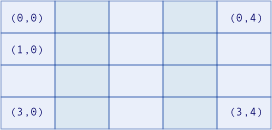

# Array Dimensions in Visual Basic
[!INCLUDE[vs2017banner](../../../../csharp/includes/vs2017banner.md)]

Il termine *dimensione* indica una direzione in cui è possibile variare la specifica degli elementi di una matrice.  Una matrice contenente il totale delle vendite di ogni giorno del mese ha una sola dimensione, ovvero il giorno del mese.  Una matrice contenente il totale delle vendite di ciascun reparto per ogni giorno del mese ha due dimensioni, ovvero il numero del reparto e il giorno del mese.  Per ogni matrice viene definito un *numero di dimensioni* specifico.  
  
> [!NOTE]
>  È possibile utilizzare la proprietà <xref:System.Array.Rank%2A> per determinare il numero di dimensioni di una matrice.  
  
## Utilizzo delle dimensioni  
 È possibile specificare un elemento di una matrice fornendo un *indice* per ciascuna delle dimensioni.  Gli elementi sono contigui lungo ciascuna dimensione dall'indice 0 fino all'indice più alto della dimensione stessa.  
  
 Nelle figure riportate di seguito è illustrata la struttura concettuale di matrici con un numero di dimensioni differente.  Vengono riportati i valori di indice per l'accesso a ciascun elemento.  Ad esempio, è possibile accedere al primo elemento della seconda riga della matrice bidimensionale specificando gli indici `(1, 0)`.  
  
   
Matrice unidimensionale  
  
   
Matrice bidimensionale  
  
   
Matrice tridimensionale  
  
### Una dimensione  
 Molte matrici hanno una sola dimensione, ad esempio il numero di persone di ciascuna età.  L'unico requisito necessario per la specifica di un elemento è l'età conteggiata dall'elemento stesso.  Una matrice di questo tipo utilizza pertanto un solo indice.  Nell'esempio riportato di seguito viene dichiarata una variabile che deve contenere una *matrice unidimensionale* per i valori di età compresi tra 0 e 120.  
  
```  
Dim ageCounts(120) As UInteger  
```  
  
### Due dimensioni  
 Alcune matrici hanno due dimensioni, ad esempio il numero di uffici presenti su ciascun piano di ogni edificio di una determinata area.  Per la specifica di un elemento è necessario indicare sia il numero dell'edificio che il piano. Ciascun elemento contiene il valore della combinazione edificio\-piano.  Una matrice di questo tipo utilizza pertanto due indici.  Nell'esempio riportato di seguito viene dichiarata una variabile che deve contenere una *matrice bidimensionale* per il numero di uffici presenti negli edifici compresi tra 0 e 40 e ai piani compresi tra 0 e 5.  
  
```  
Dim officeCounts(40, 5) As Byte  
```  
  
 Una matrice bidimensionale è denominata anche *matrice rettangolare*.  
  
### Tre dimensioni  
 Alcune matrici hanno tre dimensioni, corrispondenti ad esempio ai valori di uno spazio tridimensionale.  Una matrice di questo tipo utilizza tre indici, che in questo caso rappresentano le coordinate x, y e z di uno spazio fisico.  Nell'esempio riportato di seguito viene dichiarata una variabile che deve contenere una *matrice tridimensionale* con le temperature dell'aria in diversi punti di un volume a tre dimensioni.  
  
```  
Dim airTemperatures(99, 99, 24) As Single  
```  
  
### Più di tre dimensioni  
 Anche se una matrice può avere un numero massimo di 32 dimensioni, è raro che ne abbia più di tre.  
  
> [!NOTE]
>  Quando si aggiungono dimensioni a una matrice, lo spazio di memorizzazione totale necessario aumenta notevolmente. Si consiglia pertanto di utilizzare le matrici multidimensionali con estrema cautela.  
  
## Utilizzo di dimensioni diverse  
 Si supponga di voler registrare gli importi delle vendite per ciascun giorno del mese corrente.  È possibile dichiarare una matrice unidimensionale con 31 elementi, uno per ciascun giorno del mese, come illustrato nel seguente esempio.  
  
```  
Dim salesAmounts(30) As Double  
```  
  
 Si supponga quindi di voler registrare le stesse informazioni non soltanto per ciascun giorno del mese, ma anche per ogni mese dell'anno.  È possibile dichiarare una matrice bidimensionale con 12 righe \(per i mesi\) e 31 colonne \(per i giorni\), come illustrato nel seguente esempio.  
  
```  
Dim salesAmounts(11, 30) As Double  
```  
  
 Si supponga infine che la matrice debba contenere informazioni relative a più anni.  Se si desidera registrare gli importi delle vendite per cinque anni, è possibile dichiarare una matrice tridimensionale con 5 livelli, 12 righe e 31 colonne, come illustrato nel seguente esempio.  
  
```  
Dim salesAmounts(4, 11, 30) As Double  
```  
  
 Poiché ciascun indice varia da zero al valore massimo definito, ogni dimensione della matrice `salesAmounts` viene dichiarata con un valore in meno rispetto alla lunghezza necessaria.  Tenere inoltre presente che le dimensioni della matrice aumentano parallelamente all'aggiunta di ogni nuova dimensione.  Le tre dimensioni degli esempi precedenti comprendono rispettivamente 31, 372 e 1860 elementi.  
  
> [!NOTE]
>  È possibile creare una matrice senza utilizzare l'istruzione `Dim` o la clausola `New`.  È possibile, ad esempio, chiamare il metodo <xref:System.Array.CreateInstance%2A>, oppure un altro componente può passare al codice una matrice creata in questo modo.  Una matrice di questo tipo può avere un limite inferiore diverso da zero.  È sempre possibile verificare il limite inferiore di una dimensione utilizzando il metodo <xref:System.Array.GetLowerBound%2A> o la funzione `LBound`.  
  
## Vedere anche  
 [Matrici](../../../../visual-basic/programming-guide/language-features/arrays/index.md)   
 [Troubleshooting Arrays](../../../../visual-basic/programming-guide/language-features/arrays/troubleshooting-arrays.md)