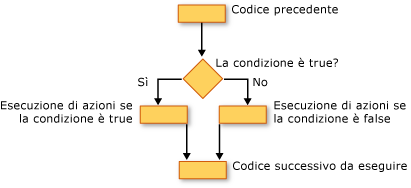

# Strutture decisionali (Visual Basic)
Visual Basic consente di condizioni di test ed eseguire diverse operazioni dipende dai risultati di tale test. È possibile testare una condizione è true o false per diversi valori di un'espressione o per diverse eccezioni generate quando si esegue una serie di istruzioni.  
  
 Nella figura seguente mostra una struttura decisionale che verifica una condizione è true e azioni diverse a seconda se è true o false.  
  
   
Operazioni diverse quando una condizione è true e false  
  
## Se... Quindi... Costruzione else  
 `If...Then...Else` consentono di verificare la presenza di una o più condizioni ed eseguire una o più istruzioni in base a ogni condizione. È possibile verificare le condizioni e intraprendere azioni nei modi seguenti:  
  
-   Eseguire una o più istruzioni se una condizione `True`  
  
-   Eseguire una o più istruzioni se una condizione `False`  
  
-   Eseguire alcune istruzioni se una condizione è `True` e ad altri se è `False`  
  
-   Verificare una condizione aggiuntiva se una condizione preliminare è `False`  
  
 È la struttura di controllo che offre tutte queste possibilità di [se... Quindi... Istruzione else](../../../../visual-basic/language-reference/statements/if-then-else-statement.md). Se si dispone di un'unica verifica e un'istruzione per l'esecuzione, è possibile utilizzare una versione a riga singola. Se si dispone di un set di condizioni e azioni più complesso, è possibile utilizzare la versione di più righe.  
  
## Seleziona... Costruzione di case  
 Il `Select...Case` costruzione consente di valutare un'espressione una sola volta e di eseguire diversi set di istruzioni in base a diversi valori possibili. Per ulteriori informazioni, vedere [Seleziona... Istruzione case](../../../../visual-basic/language-reference/statements/select-case-statement.md).  
  
## Try... Catch... Infine costruzione  
 `Try...Catch...Finally` consentono di eseguire un set di istruzioni in un ambiente che mantiene il controllo se una qualsiasi delle istruzioni genera un'eccezione. È possibile eseguire diverse azioni per le eccezioni diverse. È possibile specificare facoltativamente un blocco di codice che viene eseguito prima di terminare l'intera `Try...Catch...Finally` costruzione, indipendentemente da ciò che si verifica. Per altre informazioni, vedere [Istruzione Try...Catch...Finally](../../../../visual-basic/language-reference/statements/try-catch-finally-statement.md).  
  
> [!NOTE]
>  Per molte strutture di controllo quando si fa clic su una parola chiave, vengono evidenziate tutte le parole chiave nella struttura. Ad esempio, quando fa clic su `If` in un `If...Then...Else` costruzione, tutte le istanze di `If`, `Then`, `ElseIf`, `Else`, e `End If` nella costruzione vengono evidenziati. Per spostarsi alla parola chiave evidenziata successiva o precedente, premere CTRL + MAIUSC + freccia giù o CTRL + MAIUSC + freccia su.  
  
## Vedere anche  
 [Flusso di controllo](../../../../visual-basic/programming-guide/language-features/control-flow/index.md)  
 [Strutture di ciclo](../../../../visual-basic/programming-guide/language-features/control-flow/loop-structures.md)  
 [Altre strutture di controllo](../../../../visual-basic/programming-guide/language-features/control-flow/other-control-structures.md)  
 [Strutture di controllo annidate](../../../../visual-basic/programming-guide/language-features/control-flow/nested-control-structures.md)  
 [Operatore If](../../../../visual-basic/language-reference/operators/if-operator.md)
